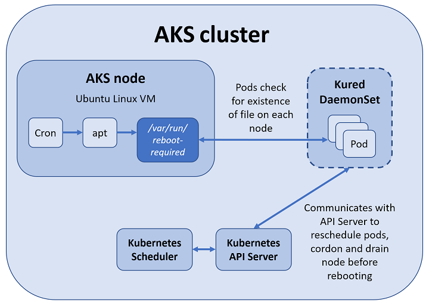

# Apply security and kernel updates to Linux nodes in Azure Kubernetes Service (AKS)

To protect your clusters, security updates are automatically applied to Linux nodes in AKS. These updates include OS security fixes or kernel updates. Some of these updates require a node reboot to complete the process. AKS doesn't automatically reboot these Linux nodes to complete the update process.

The process to keep Windows Server nodes up to date is a little different. Windows Server nodes don't receive daily updates. Instead, you perform an AKS upgrade that deploys new nodes with the latest base Window Server image and patches. For AKS clusters that use Windows Server nodes, see [Upgrade a node pool in AKS][nodepool-upgrade].

This article shows you how to use the open-source [kured (KUbernetes REboot Daemon)][kured] to watch for Linux nodes that require a reboot, then automatically handle the rescheduling of running pods and node reboot process.

> [!NOTE]
> `Kured` is an open-source project by Weaveworks. Support for this project in AKS is provided on a best-effort basis. Additional support can be found in the #weave-community Slack channel.

## Before you begin

This article assumes that you have an existing AKS cluster. If you need an AKS cluster, see the AKS quickstart [using the Azure CLI][aks-quickstart-cli] or [using the Azure portal][aks-quickstart-portal].

You also need the Azure CLI version 2.0.59 or later installed and configured. Run `az --version` to find the version. If you need to install or upgrade, see [Install Azure CLI][install-azure-cli].

## Understand the AKS node update experience

In an AKS cluster, your Kubernetes nodes run as Azure virtual machines (VMs). These Linux-based VMs use an Ubuntu image, with the OS configured to automatically check for updates every night. If security or kernel updates are available, they are automatically downloaded and installed.



Some security updates, such as kernel updates, require a node reboot to finalize the process. A Linux node that requires a reboot creates a file named */var/run/reboot-required*. This reboot process doesn't happen automatically.

You can use your own workflows and processes to handle node reboots, or use `kured` to orchestrate the process. With `kured`, a [DaemonSet][DaemonSet] is deployed that runs a pod on each Linux node in the cluster. These pods in the DaemonSet watch for existence of the */var/run/reboot-required* file, and then initiate a process to reboot the nodes.

### Node upgrades

There is an additional process in AKS that lets you *upgrade* a cluster. An upgrade is typically to move to a newer version of Kubernetes, not just apply node security updates. An AKS upgrade performs the following actions:

* A new node is deployed with the latest security updates and Kubernetes version applied.
* An old node is cordoned and drained.
* Pods are scheduled on the new node.
* The old node is deleted.

You can't remain on the same Kubernetes version during an upgrade event. You must specify a newer version of Kubernetes. To upgrade to the latest version of Kubernetes, you can [upgrade your AKS cluster][aks-upgrade].

## Deploy kured in an AKS cluster

To deploy the `kured` DaemonSet, install the following official Kured Helm chart. This creates a role and cluster role, bindings, and a service account, then deploys the DaemonSet using `kured`.

```console
# Add the stable Helm repository
helm repo add stable https://kubernetes-charts.storage.googleapis.com/

# Update your local Helm chart repository cache
helm repo update

# Create a dedicated namespace where you would like to deploy kured into
kubectl create namespace kured

# Install kured in that namespace with Helm 3 (only on Linux nodes, kured is not working on Windows nodes)
helm install kured stable/kured --namespace kured --set nodeSelector."beta\.kubernetes\.io/os"=linux
```

You can also configure additional parameters for `kured`, such as integration with Prometheus or Slack. For more information about additional configuration parameters, see the [kured Helm chart][kured-install].

## Update cluster nodes

By default, Linux nodes in AKS check for updates every evening. If you don't want to wait, you can manually perform an update to check that `kured` runs correctly. First, follow the steps to [SSH to one of your AKS nodes][aks-ssh]. Once you have an SSH connection to the Linux node, check for updates and apply them as follows:

```console
sudo apt-get update && sudo apt-get upgrade -y
```

If updates were applied that require a node reboot, a file is written to */var/run/reboot-required*. `Kured` checks for nodes that require a reboot every 60 minutes by default.

## Monitor and review reboot process

When one of the replicas in the DaemonSet has detected that a node reboot is required, a lock is placed on the node through the Kubernetes API. This lock prevents additional pods being scheduled on the node. The lock also indicates that only one node should be rebooted at a time. With the node cordoned off, running pods are drained from the node, and the node is rebooted.

You can monitor the status of the nodes using the [kubectl get nodes][kubectl-get-nodes] command. The following example output shows a node with a status of *SchedulingDisabled* as the node prepares for the reboot process:

```
NAME                       STATUS                     ROLES     AGE       VERSION
aks-nodepool1-28993262-0   Ready,SchedulingDisabled   agent     1h        v1.11.7
```

Once the update process is complete, you can view the status of the nodes using the [kubectl get nodes][kubectl-get-nodes] command with the `--output wide` parameter. This additional output lets you see a difference in *KERNEL-VERSION* of the underlying nodes, as shown in the following example output. The *aks-nodepool1-28993262-0* was updated in a previous step and shows kernel version *4.15.0-1039-azure*. The node *aks-nodepool1-28993262-1* that hasn't been updated shows kernel version *4.15.0-1037-azure*.

```
NAME                       STATUS    ROLES     AGE       VERSION   INTERNAL-IP   EXTERNAL-IP   OS-IMAGE             KERNEL-VERSION      CONTAINER-RUNTIME
aks-nodepool1-28993262-0   Ready     agent     1h        v1.11.7   10.240.0.4    <none>        Ubuntu 16.04.6 LTS   4.15.0-1039-azure   docker://3.0.4
aks-nodepool1-28993262-1   Ready     agent     1h        v1.11.7   10.240.0.5    <none>        Ubuntu 16.04.6 LTS   4.15.0-1037-azure   docker://3.0.4
```

## Next steps

This article detailed how to use `kured` to reboot Linux nodes automatically as part of the security update process. To upgrade to the latest version of Kubernetes, you can [upgrade your AKS cluster][aks-upgrade].

For AKS clusters that use Windows Server nodes, see [Upgrade a node pool in AKS][nodepool-upgrade].

<!-- LINKS - external -->
[kured]: https://github.com/weaveworks/kured
[kured-install]: https://hub.helm.sh/charts/stable/kured
[kubectl-get-nodes]: https://kubernetes.io/docs/reference/generated/kubectl/kubectl-commands#get

<!-- LINKS - internal -->
[aks-quickstart-cli]: kubernetes-walkthrough.md
[aks-quickstart-portal]: kubernetes-walkthrough-portal.md
[install-azure-cli]: /cli/azure/install-azure-cli
[DaemonSet]: concepts-clusters-workloads.md#statefulsets-and-daemonsets
[aks-ssh]: ssh.md
[aks-upgrade]: upgrade-cluster.md
[nodepool-upgrade]: use-multiple-node-pools.md#upgrade-a-node-pool
