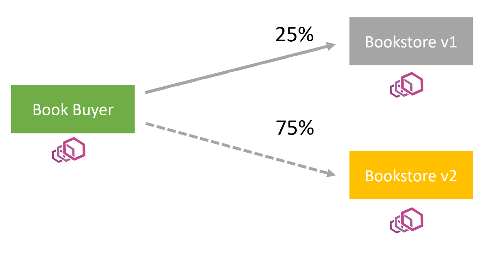
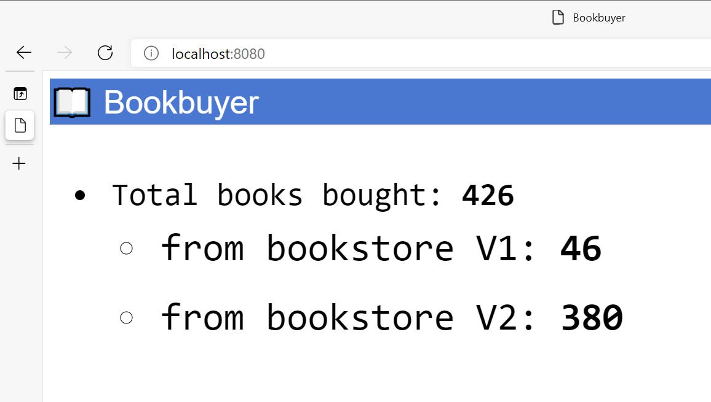

# Manage a new application with the Open Service Mesh (OSM) Azure Kubernetes Service (AKS) add-on

## Before you begin

The steps detailed in this walkthrough assume that you've created an AKS cluster (Kubernetes `1.19+` and above, with Kubernetes RBAC enabled), have established a `kubectl` connection with the cluster (If you need help with any of these items, then see the [AKS quickstart](./kubernetes-walkthrough.md), and have installed the AKS OSM add-on.

You must have the following resources installed:

- The Azure CLI, version 2.20.0 or later
- OSM version v0.11.1 or later
- JSON processor "jq" version 1.6+

## Create namespaces for the application

In this walkthrough, we will be using the OSM bookstore application that has the following Kubernetes services:

- `bookbuyer`
- `bookthief`
- `bookstore`
- `bookwarehouse`

Create namespaces for each of these application components.

```azurecli-interactive
for i in bookstore bookbuyer bookthief bookwarehouse; do kubectl create ns $i; done
```

You should see the following output:

```Output
namespace/bookstore created
namespace/bookbuyer created
namespace/bookthief created
namespace/bookwarehouse created
```

## Onboard the namespaces to be managed by OSM

When you add the namespaces to the OSM mesh, this action will allow the OSM controller to automatically inject the Envoy sidecar proxy containers with your application. Run the following command to onboard the OSM bookstore application namespaces.

```azurecli-interactive
osm namespace add bookstore bookbuyer bookthief bookwarehouse
```

You should see the following output:

```Output
Namespace [bookstore] successfully added to mesh [osm]
Namespace [bookbuyer] successfully added to mesh [osm]
Namespace [bookthief] successfully added to mesh [osm]
Namespace [bookwarehouse] successfully added to mesh [osm]
```

## Deploy the Bookstore application to the AKS cluster

```azurecli-interactive
kubectl apply -f https://raw.githubusercontent.com/openservicemesh/osm/release-v0.11/docs/example/manifests/apps/bookbuyer.yaml
```

```azurecli-interactive
kubectl apply -f https://raw.githubusercontent.com/openservicemesh/osm/release-v0.11/docs/example/manifests/apps/bookthief.yaml
```

```azurecli-interactive
kubectl apply -f https://raw.githubusercontent.com/openservicemesh/osm/release-v0.11/docs/example/manifests/apps/bookstore.yaml
```

```azurecli-interactive
kubectl apply -f https://raw.githubusercontent.com/openservicemesh/osm/release-v0.11/docs/example/manifests/apps/bookwarehouse.yaml
```

All of the deployment outputs are summarized below.

```Output
serviceaccount/bookbuyer created
service/bookbuyer created
deployment.apps/bookbuyer created

serviceaccount/bookthief created
service/bookthief created
deployment.apps/bookthief created

service/bookstore created
serviceaccount/bookstore created
deployment.apps/bookstore created

serviceaccount/bookwarehouse created
service/bookwarehouse created
deployment.apps/bookwarehouse created
```

## Checkpoint: What got installed?

The Bookstore application is an example multi-tiered application that works well for testing service mesh functionality. The application consists of four services, being the `bookbuyer`, `bookthief`, `bookstore`, and `bookwarehouse`. Both the `bookbuyer` and `bookthief` service communicate to the `bookstore` service to retrieve books from the `bookstore` service. The `bookstore` service retrieves books out of the `bookwarehouse` service to supply the `bookbuyer` and `bookthief`. This is a simple multi-tiered application that works well in showing how a service mesh can be used to protect and authorize communications between the applications services. As we continue through the walkthrough, we will be enabling and disabling Service Mesh Interface (SMI) policies to both allow and disallow the services to communicate via OSM. Below is an architecture diagram of what got installed for the bookstore application.


## Verify the Bookstore application running inside the AKS cluster

As of now we have deployed the `bookstore` mulit-container application, but it is only accessible from within the AKS cluster. Later tutorials will assist you in exposing the application outside the cluster via an ingress controller. For now we will be utilizing port forwarding to access the `bookbuyer` application inside the AKS cluster to verify it is buying books from the `bookstore` service.

To verify that the application is running inside the cluster, we will use a port forward to view both the `bookbuyer` and `bookthief` components UI.

First let's get the `bookbuyer` pod's name

```azurecli-interactive
kubectl get pod -n bookbuyer
```

You should see output similar to the following. Your `bookbuyer` pod will have a unique name appended.

```Output
NAME                         READY   STATUS    RESTARTS   AGE
bookbuyer-7676c7fcfb-mtnrz   2/2     Running   0          7m8s
```

Once we have the pod's name, we can now use the port-forward command to set up a tunnel from our local system to the application inside the AKS cluster. Run the following command to set up the port forward for the local system port 8080. Again use your specified bookbuyer pod name.

> [!NOTE]
> For all port forwarding commands it is best to use an additional terminal so that you can continue to work through this walkthrough and not disconnect the tunnel. It is also best that you establish the port forward tunnel outside of the Azure Cloud Shell.

```Bash
kubectl port-forward bookbuyer-7676c7fcfb-mtnrz -n bookbuyer 8080:14001
```

You should see output similar to the following:

```Output
Forwarding from 127.0.0.1:8080 -> 14001
Forwarding from [::1]:8080 -> 14001
```

While the port forwarding session is in place, navigate to the following url from a browser `http://localhost:8080`. You should now be able to see the `bookbuyer` application UI in the browser similar to the image below.


You will also notice that the total books bought number continues to increment to the `bookstore` v1 service. The `bookstore` v2 service has not been deployed yet. We will deploy the `bookstore` v2 service when we demonstrate the SMI traffic split policies.

You can also check the same for the `bookthief` service.

```azurecli-interactive
kubectl get pod -n bookthief
```

You should see output similar to the following. Your `bookthief` pod will have a unique name appended.

```Output
NAME                         READY   STATUS    RESTARTS   AGE
bookthief-59549fb69c-cr8vl   2/2     Running   0          15m54s
```

Port forward to `bookthief` pod.

```Bash
kubectl port-forward bookthief-59549fb69c-cr8vl -n bookthief 8080:14001
```

Navigate to the following url from a browser `http://localhost:8080`. You should see the `bookthief` is currently stealing books from the `bookstore` service! Later on we will implement a traffic policy to stop the `bookthief`.


## Disable OSM Permissive Traffic Mode for the mesh

We will now disable the permissive traffic mode policy and OSM will need explicit [SMI](https://smi-spec.io/) policies deployed to the cluster to allow communications in the mesh from each service. To disable permissive traffic mode, run the following command to update the OSM MeshConfig resource property changing the value from `true` to `false`.

```azurecli-interactive
kubectl patch meshconfig osm-mesh-config -n kube-system -p '{"spec":{"traffic":{"enablePermissiveTrafficPolicyMode":false}}}' --type=merge
```

You should see output similar to the following.

```Output
meshconfig.config.openservicemesh.io/osm-mesh-config patched
```

To verify permissive traffic mode has been disabled, port forward back into either the `bookbuyer` or `bookthief` pod to view their UI in the browser and see if the books bought or books stolen is no longer incrementing. Ensure to refresh the browser. If the incrementing has stopped, the policy was applied correctly. You have successfully stopped the `bookthief` from stealing books, but neither the `bookbuyer` can purchase from the `bookstore` nor the `bookstore` can retrieve books from the `bookwarehouse`. Next we will implement [SMI](https://smi-spec.io/) policies to allow only the services in the mesh you'd like to communicate to do so. For more detailed information about permissive traffic mode, please visit and read the [Permissive Traffic Policy Mode](https://docs.openservicemesh.io/docs/guides/traffic_management/permissive_mode/) article.

## Apply Service Mesh Interface (SMI) traffic access policies

Now that we have disabled all communications in the mesh, let's allow our `bookbuyer` service to communicate to our `bookstore` service for purchasing books, and allow our `bookstore` service to communicate to our `bookwarehouse` service to retrieving books to sell.

Deploy the following [SMI](https://smi-spec.io/) policies.

```azurecli-interactive
kubectl apply -f - <<EOF
---
apiVersion: access.smi-spec.io/v1alpha3
kind: TrafficTarget
metadata:
  name: bookbuyer-access-bookstore
  namespace: bookstore
spec:
  destination:
    kind: ServiceAccount
    name: bookstore
    namespace: bookstore
  rules:
  - kind: HTTPRouteGroup
    name: bookstore-service-routes
    matches:
    - buy-a-book
    - books-bought
  sources:
  - kind: ServiceAccount
    name: bookbuyer
    namespace: bookbuyer
---
apiVersion: specs.smi-spec.io/v1alpha4
kind: HTTPRouteGroup
metadata:
  name: bookstore-service-routes
  namespace: bookstore
spec:
  matches:
  - name: books-bought
    pathRegex: /books-bought
    methods:
    - GET
    headers:
    - "user-agent": ".*-http-client/*.*"
    - "client-app": "bookbuyer"
  - name: buy-a-book
    pathRegex: ".*a-book.*new"
    methods:
    - GET
  - name: update-books-bought
    pathRegex: /update-books-bought
    methods:
    - POST
---
kind: TrafficTarget
apiVersion: access.smi-spec.io/v1alpha3
metadata:
  name: bookstore-access-bookwarehouse
  namespace: bookwarehouse
spec:
  destination:
    kind: ServiceAccount
    name: bookwarehouse
    namespace: bookwarehouse
  rules:
  - kind: HTTPRouteGroup
    name: bookwarehouse-service-routes
    matches:
    - restock-books
  sources:
  - kind: ServiceAccount
    name: bookstore
    namespace: bookstore
  - kind: ServiceAccount
    name: bookstore-v2
    namespace: bookstore
---
apiVersion: specs.smi-spec.io/v1alpha4
kind: HTTPRouteGroup
metadata:
  name: bookwarehouse-service-routes
  namespace: bookwarehouse
spec:
  matches:
    - name: restock-books
      methods:
      - POST
      headers:
      - host: bookwarehouse.bookwarehouse
EOF
```

You should see output similar to the following.

```Output
traffictarget.access.smi-spec.io/bookbuyer-access-bookstore-v1 created
httproutegroup.specs.smi-spec.io/bookstore-service-routes created
traffictarget.access.smi-spec.io/bookstore-access-bookwarehouse created
httproutegroup.specs.smi-spec.io/bookwarehouse-service-routes created
```

You can now set up a port forwarding session on either the `bookbuyer` or `bookstore` pods and see that both the books bought and books sold metrics are back incrementing. You can also do the same for the `bookthief` pod to verify it is still no longer able to steal books.

## Apply Service Mesh Interface (SMI) traffic split policies

For our final demonstration, we will create an [SMI](https://smi-spec.io/) traffic split policy to configure the weight of communications from one service to multiple services as a backend. The traffic split functionality allows you to progressively move connections to one service over to another by weighting the traffic on a scale of 0 to 100.

The below graphic is a diagram of the [SMI](https://smi-spec.io/) Traffic Split policy to be deployed. We will deploy another `Bookstore` application as version 2 and then split the incoming traffic from the `bookbuyer`, weighting 25% of the traffic to the `bookstore` v1 service and 75% to the `bookstore` v2 service.



Deploy the `bookstore` v2 service.

```azurecli-interactive
kubectl apply -f - <<EOF
---
apiVersion: v1
kind: Service
metadata:
  name: bookstore-v2
  namespace: bookstore
  labels:
    app: bookstore-v2
spec:
  ports:
  - port: 14001
    name: bookstore-port
  selector:
    app: bookstore-v2
---
# Deploy bookstore-v2 Service Account
apiVersion: v1
kind: ServiceAccount
metadata:
  name: bookstore-v2
  namespace: bookstore
---
# Deploy bookstore-v2 Deployment
apiVersion: apps/v1
kind: Deployment
metadata:
  name: bookstore-v2
  namespace: bookstore
spec:
  replicas: 1
  selector:
    matchLabels:
      app: bookstore-v2
  template:
    metadata:
      labels:
        app: bookstore-v2
    spec:
      serviceAccountName: bookstore-v2
      containers:
        - name: bookstore
          image: openservicemesh/bookstore:v0.8.0
          imagePullPolicy: Always
          ports:
            - containerPort: 14001
              name: web
          command: ["/bookstore"]
          args: ["--path", "./", "--port", "14001"]
          env:
            - name: BOOKWAREHOUSE_NAMESPACE
              value: bookwarehouse
            - name: IDENTITY
              value: bookstore-v2
---
kind: TrafficTarget
apiVersion: access.smi-spec.io/v1alpha3
metadata:
  name: bookbuyer-access-bookstore-v2
  namespace: bookstore
spec:
  destination:
    kind: ServiceAccount
    name: bookstore-v2
    namespace: bookstore
  rules:
  - kind: HTTPRouteGroup
    name: bookstore-service-routes
    matches:
    - buy-a-book
    - books-bought
  sources:
  - kind: ServiceAccount
    name: bookbuyer
    namespace: bookbuyer
EOF
```

You should see the following output.

```Output
service/bookstore-v2 configured
serviceaccount/bookstore-v2 created
deployment.apps/bookstore-v2 created
traffictarget.access.smi-spec.io/bookstore-v2 created
```

Now deploy the traffic split policy to split the `bookbuyer` traffic between the two `bookstore` v1 and v2 service.

```azurecli-interactive
kubectl apply -f - <<EOF
apiVersion: split.smi-spec.io/v1alpha2
kind: TrafficSplit
metadata:
  name: bookstore-split
  namespace: bookstore
spec:
  service: bookstore.bookstore
  backends:
  - service: bookstore
    weight: 25
  - service: bookstore-v2
    weight: 75
EOF
```

You should see the following output.

```Output
trafficsplit.split.smi-spec.io/bookstore-split created
```

Set up a port forward tunnel to the `bookbuyer` pod and you should now see books being purchased from the `bookstore` v2 service. If you continue to watch the increment of purchases, you should notice a faster increment of purchases happening through the `bookstore` v2 service.


