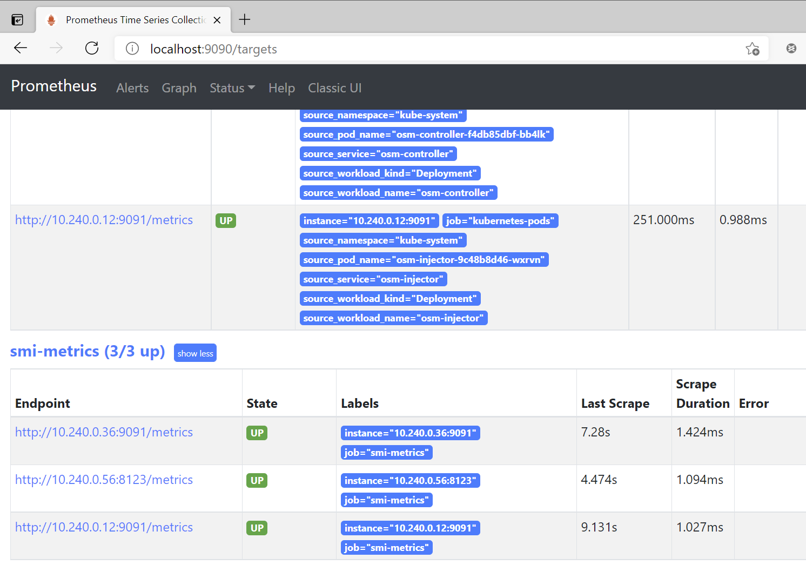
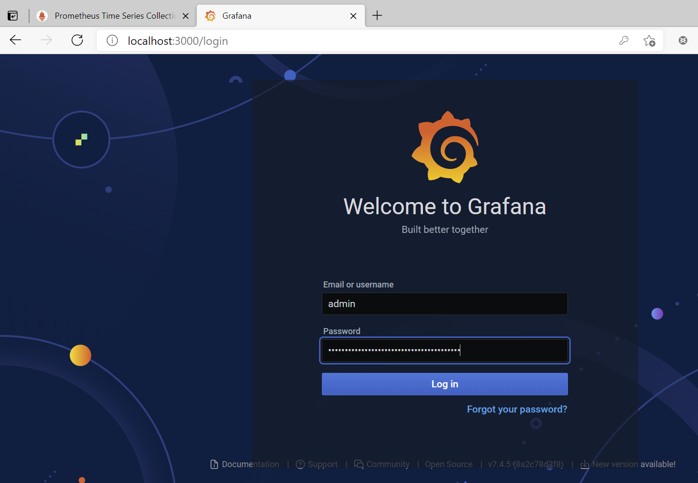
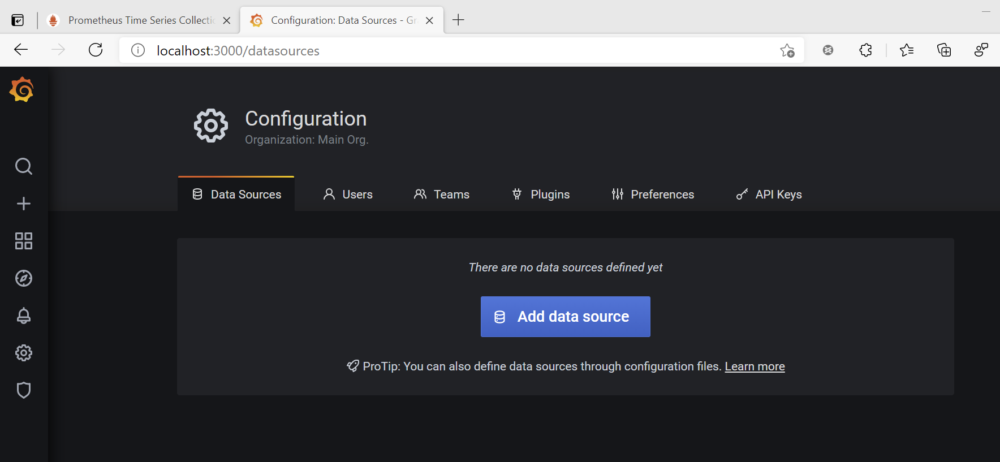
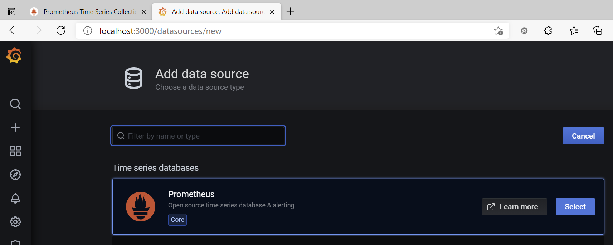
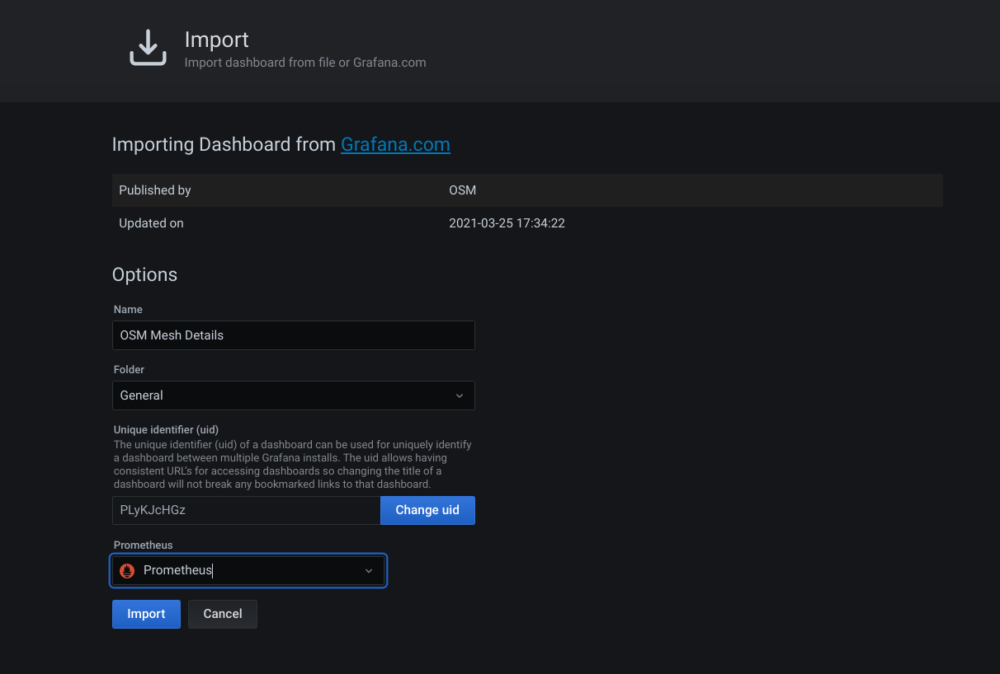
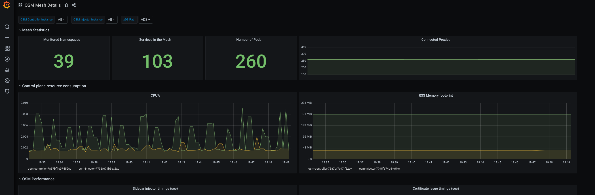
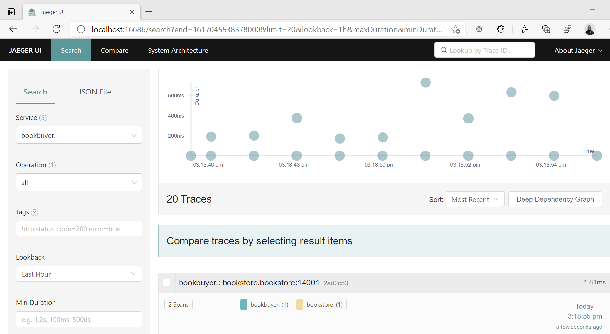
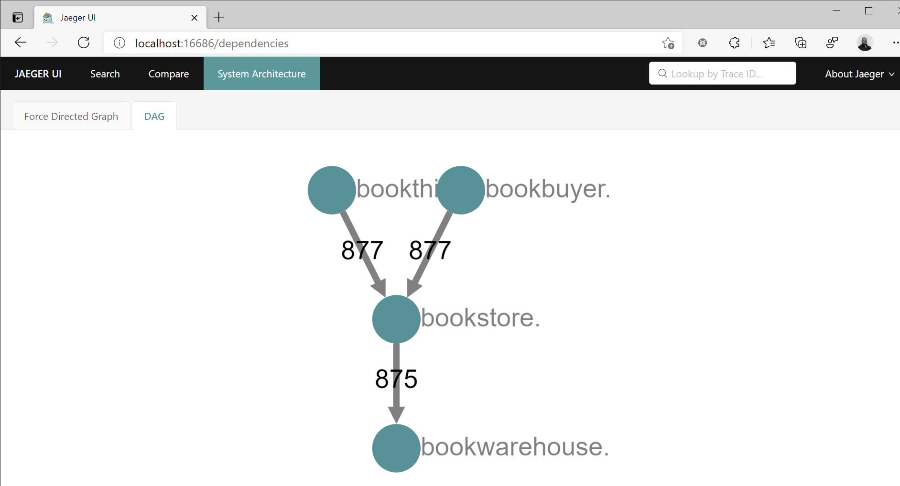

# Manually deploy Prometheus, Grafana, and Jaeger to view Open Service Mesh (OSM) metrics for observability

> [!WARNING]
> The installation of Prometheus, Grafana and Jaeger are provided as general guidance to show how these tools can be utilized to view OSM metric data. The installation guidance is not to be utilized for a production setup. Please refer to each tool's documentation on how best to suit thier installations to your needs. Most notable will be the lack of persistent storage, meaning that all data is lost once a Prometheus Grafana, and/or Jaeger pod(s) are terminated.

Open Service Mesh (OSM) generates detailed metrics related to all traffic within the mesh. These metrics provide insights into the behavior of applications in the mesh helping users to troubleshoot, maintain, and analyze their applications.

As of today OSM collects metrics directly from the sidecar proxies (Envoy). OSM provides rich metrics for incoming and outgoing traffic for all services in the mesh. With these metrics, the user can get information about the overall volume of traffic, errors within traffic and the response time for requests.

OSM uses Prometheus to gather and store consistent traffic metrics and statistics for all applications running in the mesh. Prometheus is an open-source monitoring and alerting toolkit, which is commonly used on (but not limited to) Kubernetes and Service Mesh environments.

Each application that is part of the mesh runs in a Pod that contains an Envoy sidecar that exposes metrics (proxy metrics) in the Prometheus format. Furthermore, every Pod that is a part of the mesh has Prometheus annotations, which makes it possible for the Prometheus server to scrape the application dynamically. This mechanism automatically enables scraping of metrics whenever a new namespace/pod/service is added to the mesh.

OSM metrics can be viewed with Grafana, which is an open-source visualization and analytics software. It allows you to query, visualize, alert on, and explore your metrics.

In this tutorial, you will:

> [!div class="checklist"]
>
> - Create and deploy a Prometheus instance
> - Update the Prometheus `Configmap`
> - Create and deploy a Grafana instance
> - Configure Grafana with the Prometheus datasource
> - Enable Prometheus metrics for a user namespace
> - Import OSM dashboard for Grafana
> - Create and deploy a Jaeger instance
> - Configure Jaeger tracing for OSM

## Before you begin

You must have the following resources installed:

- The Azure CLI, version 2.20.0 or later
- OSM version v0.11.1 or later
- JSON processor "jq" version 1.6+

## Deploy and configure a Prometheus instance for OSM

We will use Helm to deploy the Prometheus instance. Run the following commands to install Prometheus via Helm:

```azurecli-interactive
helm repo add prometheus-community https://prometheus-community.github.io/helm-charts
helm repo update
helm install stable prometheus-community/prometheus
```

You should see similar output below if the installation was successful. Make note of the Prometheus server port and cluster DNS name. This information will be used later for to configure Prometheus as a data source for Grafana.

```Output
NAME: stable
LAST DEPLOYED: Fri Mar 26 13:34:51 2021
NAMESPACE: default
STATUS: deployed
REVISION: 1
TEST SUITE: None
NOTES:
The Prometheus server can be accessed via port 80 on the following DNS name from within your cluster:
stable-prometheus-server.default.svc.cluster.local


Get the Prometheus server URL by running these commands in the same shell:
  export POD_NAME=$(kubectl get pods --namespace default -l "app=prometheus,component=server" -o jsonpath="{.items[0].metadata.name}")
  kubectl --namespace default port-forward $POD_NAME 9090


The Prometheus alertmanager can be accessed via port 80 on the following DNS name from within your cluster:
stable-prometheus-alertmanager.default.svc.cluster.local


Get the Alertmanager URL by running these commands in the same shell:
  export POD_NAME=$(kubectl get pods --namespace default -l "app=prometheus,component=alertmanager" -o jsonpath="{.items[0].metadata.name}")
  kubectl --namespace default port-forward $POD_NAME 9093
#################################################################################
######   WARNING: Pod Security Policy has been moved to a global property.  #####
######            use .Values.podSecurityPolicy.enabled with pod-based      #####
######            annotations                                               #####
######            (e.g. .Values.nodeExporter.podSecurityPolicy.annotations) #####
#################################################################################


The Prometheus PushGateway can be accessed via port 9091 on the following DNS name from within your cluster:
stable-prometheus-pushgateway.default.svc.cluster.local


Get the PushGateway URL by running these commands in the same shell:
  export POD_NAME=$(kubectl get pods --namespace default -l "app=prometheus,component=pushgateway" -o jsonpath="{.items[0].metadata.name}")
  kubectl --namespace default port-forward $POD_NAME 9091

For more information on running Prometheus, visit:
https://prometheus.io/
```

### Update the Prometheus Configmap

By default, Prometheus is set to scrape the OSM components. The default installation of Prometheus will contain two Kubernetes `configmaps`. You can view the list of Prometheus `configmaps` with the following command.

```azurecli-interactive
kubectl get configmap | grep prometheus
```

```Output
stable-prometheus-alertmanager   1      4h34m
stable-prometheus-server         5      4h34m
```

We will need to replace the prometheus.yml configuration located in the **stable-prometheus-server** `configmap` with the following OSM configuration. There are several file editing techniques to accomplish this task. A simple and safe way is to export the `configmap`, create a copy of it for backup, then edit it with an editor such as Visual Studio code.

> [!NOTE]
> If you do not have Visual Studio Code installed you can go download and install it [here](https://code.visualstudio.com/Download).

Let's first export out the **stable-prometheus-server** configmap and then make a copy for backup.

```azurecli-interactive
kubectl get configmap stable-prometheus-server -o yaml > cm-stable-prometheus-server.yml
cp cm-stable-prometheus-server.yml cm-stable-prometheus-server.yml.copy
```

Next let's open the file using Visual Studio Code to edit.

```azurecli-interactive
code cm-stable-prometheus-server.yml
```

Once you have the `configmap` opened in the Visual Studio Code editor, replace the prometheus.yml file with the OSM configuration below and save the file.

> [!WARNING]
> It is extremely important that you ensure you keep the indention structure of the yaml file. Any changes to the yaml file structure could result in the configmap not being able to be re-applied.

```OSM Prometheus Configmap Configuration
prometheus.yml: |
    global:
      scrape_interval: 10s
      scrape_timeout: 10s
      evaluation_interval: 1m

    scrape_configs:
      - job_name: 'kubernetes-apiservers'
        kubernetes_sd_configs:
        - role: endpoints
        scheme: https
        tls_config:
          ca_file: /var/run/secrets/kubernetes.io/serviceaccount/ca.crt
          # TODO need to remove this when the CA and SAN match
          insecure_skip_verify: true
        bearer_token_file: /var/run/secrets/kubernetes.io/serviceaccount/token
        metric_relabel_configs:
        - source_labels: [__name__]
          regex: '(apiserver_watch_events_total|apiserver_admission_webhook_rejection_count)'
          action: keep
        relabel_configs:
        - source_labels: [__meta_kubernetes_namespace, __meta_kubernetes_service_name, __meta_kubernetes_endpoint_port_name]
          action: keep
          regex: default;kubernetes;https

      - job_name: 'kubernetes-nodes'
        scheme: https
        tls_config:
          ca_file: /var/run/secrets/kubernetes.io/serviceaccount/ca.crt
        bearer_token_file: /var/run/secrets/kubernetes.io/serviceaccount/token
        kubernetes_sd_configs:
        - role: node
        relabel_configs:
        - action: labelmap
          regex: __meta_kubernetes_node_label_(.+)
        - target_label: __address__
          replacement: kubernetes.default.svc:443
        - source_labels: [__meta_kubernetes_node_name]
          regex: (.+)
          target_label: __metrics_path__
          replacement: /api/v1/nodes/${1}/proxy/metrics

      - job_name: 'kubernetes-pods'
        kubernetes_sd_configs:
        - role: pod
        metric_relabel_configs:
        - source_labels: [__name__]
          regex: '(envoy_server_live|envoy_cluster_upstream_rq_xx|envoy_cluster_upstream_cx_active|envoy_cluster_upstream_cx_tx_bytes_total|envoy_cluster_upstream_cx_rx_bytes_total|envoy_cluster_upstream_cx_destroy_remote_with_active_rq|envoy_cluster_upstream_cx_connect_timeout|envoy_cluster_upstream_cx_destroy_local_with_active_rq|envoy_cluster_upstream_rq_pending_failure_eject|envoy_cluster_upstream_rq_pending_overflow|envoy_cluster_upstream_rq_timeout|envoy_cluster_upstream_rq_rx_reset|^osm.*)'
          action: keep
        relabel_configs:
        - source_labels: [__meta_kubernetes_pod_annotation_prometheus_io_scrape]
          action: keep
          regex: true
        - source_labels: [__meta_kubernetes_pod_annotation_prometheus_io_path]
          action: replace
          target_label: __metrics_path__
          regex: (.+)
        - source_labels: [__address__, __meta_kubernetes_pod_annotation_prometheus_io_port]
          action: replace
          regex: ([^:]+)(?::\d+)?;(\d+)
          replacement: $1:$2
          target_label: __address__
        - source_labels: [__meta_kubernetes_namespace]
          action: replace
          target_label: source_namespace
        - source_labels: [__meta_kubernetes_pod_name]
          action: replace
          target_label: source_pod_name
        - regex: '(__meta_kubernetes_pod_label_app)'
          action: labelmap
          replacement: source_service
        - regex: '(__meta_kubernetes_pod_label_osm_envoy_uid|__meta_kubernetes_pod_label_pod_template_hash|__meta_kubernetes_pod_label_version)'
          action: drop
        # for non-ReplicaSets (DaemonSet, StatefulSet)
        # __meta_kubernetes_pod_controller_kind=DaemonSet
        # __meta_kubernetes_pod_controller_name=foo
        # =>
        # workload_kind=DaemonSet
        # workload_name=foo
        - source_labels: [__meta_kubernetes_pod_controller_kind]
          action: replace
          target_label: source_workload_kind
        - source_labels: [__meta_kubernetes_pod_controller_name]
          action: replace
          target_label: source_workload_name
        # for ReplicaSets
        # __meta_kubernetes_pod_controller_kind=ReplicaSet
        # __meta_kubernetes_pod_controller_name=foo-bar-123
        # =>
        # workload_kind=Deployment
        # workload_name=foo-bar
        # deplyment=foo
        - source_labels: [__meta_kubernetes_pod_controller_kind]
          action: replace
          regex: ^ReplicaSet$
          target_label: source_workload_kind
          replacement: Deployment
        - source_labels:
          - __meta_kubernetes_pod_controller_kind
          - __meta_kubernetes_pod_controller_name
          action: replace
          regex: ^ReplicaSet;(.*)-[^-]+$
          target_label: source_workload_name

      - job_name: 'smi-metrics'
        kubernetes_sd_configs:
        - role: pod
        relabel_configs:
        - source_labels: [__meta_kubernetes_pod_annotation_prometheus_io_scrape]
          action: keep
          regex: true
        - source_labels: [__meta_kubernetes_pod_annotation_prometheus_io_path]
          action: replace
          target_label: __metrics_path__
          regex: (.+)
        - source_labels: [__address__, __meta_kubernetes_pod_annotation_prometheus_io_port]
          action: replace
          regex: ([^:]+)(?::\d+)?;(\d+)
          replacement: $1:$2
          target_label: __address__
        metric_relabel_configs:
        - source_labels: [__name__]
          regex: 'envoy_.*osm_request_(total|duration_ms_(bucket|count|sum))'
          action: keep
        - source_labels: [__name__]
          action: replace
          regex: envoy_response_code_(\d{3})_source_namespace_.*_source_kind_.*_source_name_.*_source_pod_.*_destination_namespace_.*_destination_kind_.*_destination_name_.*_destination_pod_.*_osm_request_total
          target_label: response_code
        - source_labels: [__name__]
          action: replace
          regex: envoy_response_code_\d{3}_source_namespace_(.*)_source_kind_.*_source_name_.*_source_pod_.*_destination_namespace_.*_destination_kind_.*_destination_name_.*_destination_pod_.*_osm_request_total
          target_label: source_namespace
        - source_labels: [__name__]
          action: replace
          regex: envoy_response_code_\d{3}_source_namespace_.*_source_kind_(.*)_source_name_.*_source_pod_.*_destination_namespace_.*_destination_kind_.*_destination_name_.*_destination_pod_.*_osm_request_total
          target_label: source_kind
        - source_labels: [__name__]
          action: replace
          regex: envoy_response_code_\d{3}_source_namespace_.*_source_kind_.*_source_name_(.*)_source_pod_.*_destination_namespace_.*_destination_kind_.*_destination_name_.*_destination_pod_.*_osm_request_total
          target_label: source_name
        - source_labels: [__name__]
          action: replace
          regex: envoy_response_code_\d{3}_source_namespace_.*_source_kind_.*_source_name_.*_source_pod_(.*)_destination_namespace_.*_destination_kind_.*_destination_name_.*_destination_pod_.*_osm_request_total
          target_label: source_pod
        - source_labels: [__name__]
          action: replace
          regex: envoy_response_code_\d{3}_source_namespace_.*_source_kind_.*_source_name_.*_source_pod_.*_destination_namespace_(.*)_destination_kind_.*_destination_name_.*_destination_pod_.*_osm_request_total
          target_label: destination_namespace
        - source_labels: [__name__]
          action: replace
          regex: envoy_response_code_\d{3}_source_namespace_.*_source_kind_.*_source_name_.*_source_pod_.*_destination_namespace_.*_destination_kind_(.*)_destination_name_.*_destination_pod_.*_osm_request_total
          target_label: destination_kind
        - source_labels: [__name__]
          action: replace
          regex: envoy_response_code_\d{3}_source_namespace_.*_source_kind_.*_source_name_.*_source_pod_.*_destination_namespace_.*_destination_kind_.*_destination_name_(.*)_destination_pod_.*_osm_request_total
          target_label: destination_name
        - source_labels: [__name__]
          action: replace
          regex: envoy_response_code_\d{3}_source_namespace_.*_source_kind_.*_source_name_.*_source_pod_.*_destination_namespace_.*_destination_kind_.*_destination_name_.*_destination_pod_(.*)_osm_request_total
          target_label: destination_pod
        - source_labels: [__name__]
          action: replace
          regex: .*(osm_request_total)
          target_label: __name__

        - source_labels: [__name__]
          action: replace
          regex: envoy_source_namespace_(.*)_source_kind_.*_source_name_.*_source_pod_.*_destination_namespace_.*_destination_kind_.*_destination_name_.*_destination_pod_.*_osm_request_duration_ms_(bucket|sum|count)
          target_label: source_namespace
        - source_labels: [__name__]
          action: replace
          regex: envoy_source_namespace_.*_source_kind_(.*)_source_name_.*_source_pod_.*_destination_namespace_.*_destination_kind_.*_destination_name_.*_destination_pod_.*_osm_request_duration_ms_(bucket|sum|count)
          target_label: source_kind
        - source_labels: [__name__]
          action: replace
          regex: envoy_source_namespace_.*_source_kind_.*_source_name_(.*)_source_pod_.*_destination_namespace_.*_destination_kind_.*_destination_name_.*_destination_pod_.*_osm_request_duration_ms_(bucket|sum|count)
          target_label: source_name
        - source_labels: [__name__]
          action: replace
          regex: envoy_source_namespace_.*_source_kind_.*_source_name_.*_source_pod_(.*)_destination_namespace_.*_destination_kind_.*_destination_name_.*_destination_pod_.*_osm_request_duration_ms_(bucket|sum|count)
          target_label: source_pod
        - source_labels: [__name__]
          action: replace
          regex: envoy_source_namespace_.*_source_kind_.*_source_name_.*_source_pod_.*_destination_namespace_(.*)_destination_kind_.*_destination_name_.*_destination_pod_.*_osm_request_duration_ms_(bucket|sum|count)
          target_label: destination_namespace
        - source_labels: [__name__]
          action: replace
          regex: envoy_source_namespace_.*_source_kind_.*_source_name_.*_source_pod_.*_destination_namespace_.*_destination_kind_(.*)_destination_name_.*_destination_pod_.*_osm_request_duration_ms_(bucket|sum|count)
          target_label: destination_kind
        - source_labels: [__name__]
          action: replace
          regex: envoy_source_namespace_.*_source_kind_.*_source_name_.*_source_pod_.*_destination_namespace_.*_destination_kind_.*_destination_name_(.*)_destination_pod_.*_osm_request_duration_ms_(bucket|sum|count)
          target_label: destination_name
        - source_labels: [__name__]
          action: replace
          regex: envoy_source_namespace_.*_source_kind_.*_source_name_.*_source_pod_.*_destination_namespace_.*_destination_kind_.*_destination_name_.*_destination_pod_(.*)_osm_request_duration_ms_(bucket|sum|count)
          target_label: destination_pod
        - source_labels: [__name__]
          action: replace
          regex: .*(osm_request_duration_ms_(bucket|sum|count))
          target_label: __name__

      - job_name: 'kubernetes-cadvisor'
        scheme: https
        tls_config:
          ca_file: /var/run/secrets/kubernetes.io/serviceaccount/ca.crt
        bearer_token_file: /var/run/secrets/kubernetes.io/serviceaccount/token
        kubernetes_sd_configs:
        - role: node
        metric_relabel_configs:
        - source_labels: [__name__]
          regex: '(container_cpu_usage_seconds_total|container_memory_rss)'
          action: keep
        relabel_configs:
        - action: labelmap
          regex: __meta_kubernetes_node_label_(.+)
        - target_label: __address__
          replacement: kubernetes.default.svc:443
        - source_labels: [__meta_kubernetes_node_name]
          regex: (.+)
          target_label: __metrics_path__
          replacement: /api/v1/nodes/${1}/proxy/metrics/cadvisor
```

Apply the updated `configmap` yaml file with the following command.

```azurecli-interactive
kubectl apply -f cm-stable-prometheus-server.yml
```

```Output
configmap/stable-prometheus-server configured
```

> [!NOTE]
> You may receive a message about a missing kubernetes annotation needed. This can be ignored for now.

### Verify Prometheus is configured to scrape the OSM mesh and API endpoints

To verify that Prometheus is correctly configured to scrape the OSM mesh and API endpoints, we will port forward to the Prometheus pod and view the target configuration. Run the following commands.

```azurecli-interactive
PROM_POD_NAME=$(kubectl get pods -l "app=prometheus,component=server" -o jsonpath="{.items[0].metadata.name}")
kubectl --namespace <promNamespace> port-forward $PROM_POD_NAME 9090
```

Open a browser up to `http://localhost:9090/targets`

If you scroll down you should see all the SMI metric endpoints state being **UP** as well as other OSM metrics defined as pictured below.



## Deploy and configure a Grafana Instance for OSM

We will use Helm to deploy the Grafana instance. Run the following commands to install Grafana via Helm:

```
helm repo add grafana https://grafana.github.io/helm-charts
helm repo update
helm install osm-grafana grafana/grafana
```

Next we'll retrieve the default Grafana password to log into the Grafana site.

```azurecli-interactive
kubectl get secret --namespace default osm-grafana -o jsonpath="{.data.admin-password}" | base64 --decode ; echo
```

Make note of the Grafana password.

Next we will retrieve the Grafana pod to port forward to the Grafana dashboard to login.

```azurecli-interactive
GRAF_POD_NAME=$(kubectl get pods -l "app.kubernetes.io/name=grafana" -o jsonpath="{.items[0].metadata.name}")
kubectl port-forward $GRAF_POD_NAME 3000
```

Open a browser up to `http://localhost:3000`

At the login screen pictured below, enter **admin** as the username and use the Grafana password captured earlier.



### Configure the Grafana Prometheus data source

Once you have successfully logged into Grafana, the next step is to add Prometheus as data sources for Grafana. To do so, navigate on the configuration icon on the left menu and select Data Sources as shown below.



Click the **Add data source** button and select Prometheus under time series databases.



On the **Configure your Prometheus data source below** page, enter the Kubernetes cluster FQDN for the Prometheus service for the HTTP URL setting. The default FQDN should be `stable-prometheus-server.default.svc.cluster.local`. Once you have entered that Prometheus service endpoint, scroll to the bottom of the page and select **Save & Test**. You should receive a green checkbox indicating the data source is working.

### Enable Prometheus metrics for a user namespace
In order to configure Prometheus to scrape metrics from an application namespace, run the following command.
```azurecli-interactive
osm metrics enable --namespace <app-namespace>
```

### Importing OSM Dashboards

OSM Dashboards are available both through:

- [Our repository](https://github.com/openservicemesh/osm/tree/release-v0.11/charts/osm/grafana/dashboards), and are importable as json blobs through the web admin portal
- or [online at Grafana.com](https://grafana.com/grafana/dashboards/14145)

To import a dashboard, look for the `+` sign on the left menu and select `import`.
You can directly import dashboard by their ID on `Grafana.com`. For example, our `OSM Mesh Details` dashboard uses ID `14145`, you can use the ID directly on the form and select `import`:



As soon as you select import, it will bring you automatically to your imported dashboard.



## Deploy and configure a Jaeger Operator on Kubernetes for OSM

[Jaeger](https://www.jaegertracing.io/) is an open-source tracing system used for monitoring and troubleshooting distributed systems. It can be deployed with OSM as a new instance or you may bring your own instance. The following instructions deploy a new instance of Jaeger to the `jaeger` namespace on the AKS cluster.

### Deploy Jaeger to the AKS cluster

First, create a jaeger namespace:

```azurecli-interactive
kubectl create namespace jaeger
```

Apply the following manifest to install Jaeger:

```azurecli-interactive
kubectl apply -f - <<EOF
---
apiVersion: apps/v1
kind: Deployment
metadata:
  name: jaeger
  namespace: jaeger
  labels:
    app: jaeger
spec:
  replicas: 1
  selector:
    matchLabels:
      app: jaeger
  template:
    metadata:
      labels:
        app: jaeger
    spec:
      containers:
        - name: jaeger
          image: jaegertracing/all-in-one
          args:
          - --collector.zipkin.host-port=9411
          imagePullPolicy: IfNotPresent
          ports:
          - containerPort: 9411
          resources:
            limits:
              cpu: 500m
              memory: 512M
            requests:
              cpu: 100m
              memory: 256M
---
kind: Service
apiVersion: v1
metadata:
  name: jaeger
  namespace: jaeger
  labels:
    app: jaeger
spec:
  selector:
    app: jaeger
  ports:
  - protocol: TCP
    # Service port and target port are the same
    port: 9411
  type: ClusterIP
EOF
```

```Output
deployment.apps/jaeger created
service/jaeger created
```

### Add RBAC for Jaeger SA

Apply the following RBAC to grant the Jaeger Service Account the specified Cluster Role:

```yaml
apiVersion: v1
kind: ServiceAccount
metadata:
  labels:
    app: jaeger
  name: jaeger
  namespace: jaeger
---
kind: ClusterRole
apiVersion: rbac.authorization.k8s.io/v1
metadata:
  labels:
    app: jaeger
  name: jaeger
---
kind: ClusterRoleBinding
apiVersion: rbac.authorization.k8s.io/v1
metadata:
  name: jaeger
  labels:
    app: jaeger
subjects:
  - kind: ServiceAccount
    name: jaeger
    namespace: jaeger
roleRef:
  kind: ClusterRole
  name: jaeger
  apiGroup: rbac.authorization.k8s.io
```

### Enable Tracing for the OSM add-on

Next we will need to enable tracing for the OSM add-on.

Run the following command to enable tracing for the OSM add-on:

```azurecli-interactive
kubectl patch meshconfig osm-mesh-config -n kube-system -p '{"spec":{"observability":{"tracing":{"enable":true, "address": "jaeger.jaeger.svc.cluster.local"}}}}' --type=merge
```

```Output
meshconfig.config.openservicemesh.io/osm-mesh-config patched
```

### View the Jaeger UI with port forwarding

Jaeger's UI is running on port 16686. To view the web UI, you can use kubectl port-forward:

```azurecli-interactive
JAEGER_POD=$(kubectl get pods -n jaeger --no-headers  --selector app=jaeger | awk 'NR==1{print $1}')
kubectl port-forward -n jaeger $JAEGER_POD  16686:16686
http://localhost:16686/
```

In the browser, you should see a Service dropdown, which allows you to select from the various applications deployed by the bookstore demo. Select a service to view all spans from it. For example, if you select `bookbuyer` with a Lookback of one hour, you can see its interactions with bookstore-v1 and bookstore-v2 sorted by time.



Select any item to view it in further detail. Select multiple items to compare traces. For example, you can compare the `bookbuyer`'s interactions with bookstore and bookstore-v2 at a particular moment in time.

You can also select the System Architecture tab to view a graph of how the various applications have been interacting/communicating. This provides an idea of how traffic is flowing between the applications.


