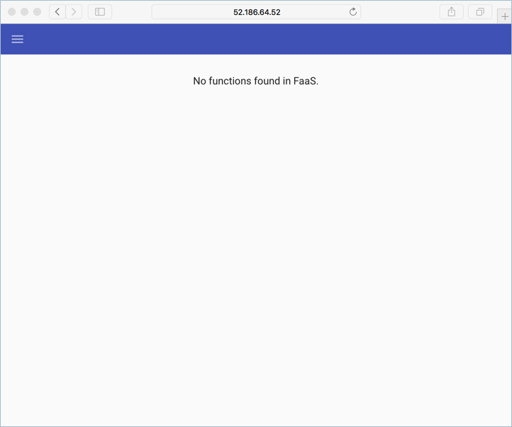
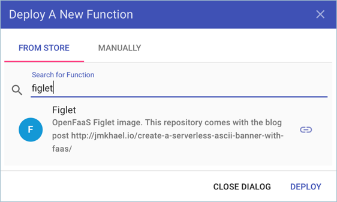
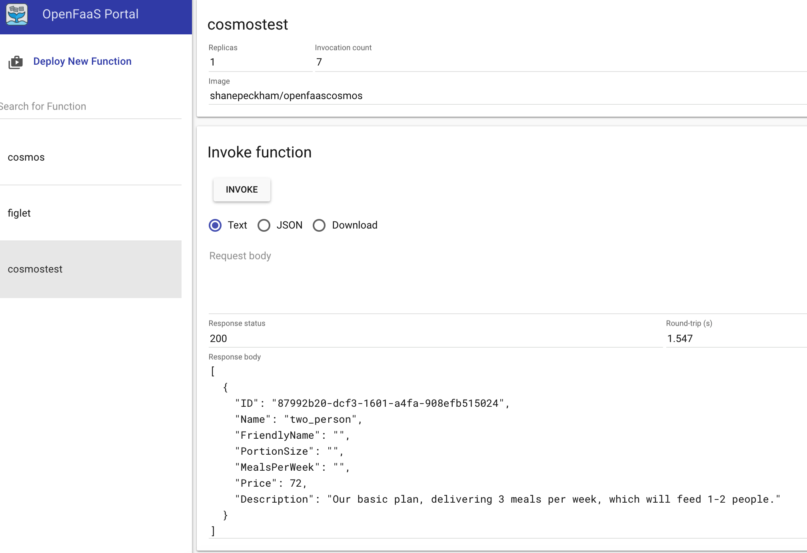

# Using OpenFaaS on AKS

[OpenFaaS][open-faas] is a framework for building serverless functions on top of containers. As an open source project, it has gained large-scale adoption within the community. This document details installing and using OpenFaas on an Azure Kubernetes Service (AKS) cluster.

## Prerequisites

In order to complete the steps within this article, you need the following.

* Basic understanding of Kubernetes.
* An Azure Kubernetes Service (AKS) cluster and AKS credentials configured on your development system.
* Azure CLI installed on your development system.
* Git command-line tools installed on your system.

## Get OpenFaaS

Clone the OpenFaaS project repository to your development system.

```azurecli-interactive
git clone https://github.com/openfaas/faas-netes
```

Change into the directory of the cloned repository.

```azurecli-interactive
cd faas-netes
```

## Deploy OpenFaaS

As a good practice, OpenFaaS and OpenFaaS functions should be stored in their own Kubernetes namespace.

Create a namespace for the OpenFaaS system.

```azurecli-interactive
kubectl create namespace openfaas
```

Create a second namespace for OpenFaaS functions.

```azurecli-interactive
kubectl create namespace openfaas-fn
```

A Helm chart for OpenFaaS is included in the cloned repository. Use this chart to deploy OpenFaaS into your AKS cluster.

```azurecli-interactive
helm install --namespace openfaas -n openfaas \
  --set functionNamespace=openfaas-fn, \
  --set serviceType=LoadBalancer, \
  --set rbac=false chart/openfaas/
```

Output:

```
NAME:   openfaas
LAST DEPLOYED: Wed Feb 28 08:26:11 2018
NAMESPACE: openfaas
STATUS: DEPLOYED

RESOURCES:
==> v1/ConfigMap
NAME                 DATA  AGE
prometheus-config    2     20s
alertmanager-config  1     20s

{snip}

NOTES:
To verify that openfaas has started, run:

  kubectl --namespace=openfaas get deployments -l "release=openfaas, app=openfaas"
```

A public IP address is created for accessing the OpenFaaS gateway. To retrieve this IP address, use the [kubectl get service][kubectl-get] command. It may take a minute for the IP address to be assigned to the service.

```console
kubectl get service -l component=gateway --namespace openfaas
```

Output.

```console
NAME               TYPE           CLUSTER-IP     EXTERNAL-IP    PORT(S)          AGE
gateway            ClusterIP      10.0.156.194   <none>         8080/TCP         7m
gateway-external   LoadBalancer   10.0.28.18     52.186.64.52   8080:30800/TCP   7m
```

To test the OpenFaaS system, browse to the external IP address on port 8080, `http://52.186.64.52:8080` in this example.



Finally, install the OpenFaaS CLI. This example used brew, see the [OpenFaaS CLI documentation][open-faas-cli] for more options.

```console
brew install faas-cli
```

## Create first function

Now that OpenFaaS is operational, create a function using the OpenFaas portal.

Click on **Deploy New Function** and search for **Figlet**. Select the Figlet function, and click **Deploy**.



Use curl to invoke the function. Replace the IP address in the following example with that of your OpenFaas gateway.

```azurecli-interactive
curl -X POST http://52.186.64.52:8080/function/figlet -d "Hello Azure"
```

Output:

```console
 _   _      _ _            _
| | | | ___| | | ___      / \    _____   _ _ __ ___
| |_| |/ _ \ | |/ _ \    / _ \  |_  / | | | '__/ _ \
|  _  |  __/ | | (_) |  / ___ \  / /| |_| | | |  __/
|_| |_|\___|_|_|\___/  /_/   \_\/___|\__,_|_|  \___|

```

## Create second function

Now create a second function. This example will be deployed using the OpenFaaS CLI and includes a custom container image and retrieving data from a Cosmos DB. Several items need to be configured before creating the function.

First, create a new resource group for the Cosmos DB.

```azurecli-interactive
az group create --name serverless-backing --location eastus
```

Deploy a CosmosDB instance of kind `MongoDB`. The instance needs a unique name, update `openfaas-cosmos` to something unique to your environment.

```azurecli-interactive
az cosmosdb create --resource-group serverless-backing --name openfaas-cosmos --kind MongoDB
```

Get the Cosmos database connection string and store it in a variable.

Update the value for the `--resource-group` argument to the name of your resource group, and the `--name` argument to the name of your Cosmos DB.

```azurecli-interactive
COSMOS=$(az cosmosdb list-connection-strings \
  --resource-group serverless-backing \
  --name openfaas-cosmos \
  --query connectionStrings[0].connectionString \
  --output tsv)
```

Now populate the Cosmos DB with test data. Create a file named `plans.json` and copy in the following json.

```json
{
	"name" : "two_person",
	"friendlyName" : "Two Person Plan",
	"portionSize" : "1-2 Person",
	"mealsPerWeek" : "3 Unique meals per week",
	"price" : 72,
	"description" : "Our basic plan, delivering 3 meals per week, which will feed 1-2 people.",
	"__v" : 0
}
```

Use the *mongoimport* tool to load the CosmosDB instance with data.

If needed, install the MongoDB tools. The following example installs these tools using brew, see the [MongoDB documentation][install-mongo] for other options.

```azurecli-interactive
brew install mongodb
```

Load the data into the database.

```azurecli-interactive
mongoimport --uri=$COSMOS -c plans < plans.json
```

Output:

```console
2018-02-19T14:42:14.313+0000    connected to: localhost
2018-02-19T14:42:14.918+0000    imported 1 document
```

Run the following command to create the function. Update the value of the `-g` argument with your OpenFaaS gateway address.

```azurecli-interctive
faas-cli deploy -g http://52.186.64.52:8080 --image=shanepeckham/openfaascosmos --name=cosmos-query --env=NODE_ENV=$COSMOS
```

Once deployed, you should see your newly created OpenFaaS endpoint for the function.

```console
Deployed. 202 Accepted.
URL: http://52.186.64.52:8080/function/cosmos-query
```

Test the function using curl. Update the IP address with the OpenFaaS gateway address.

```console
curl -s http://52.186.64.52:8080/function/cosmos-query
```

Output:

```json
[{"ID":"","Name":"two_person","FriendlyName":"","PortionSize":"","MealsPerWeek":"","Price":72,"Description":"Our basic plan, delivering 3 meals per week, which will feed 1-2 people."}]
```

You can also test the function within the OpenFaaS UI.



## Next Steps

The default deployment of OpenFaas needs to be locked down for both OpenFaaS Gateway and Functions. [Alex Ellis' Blog post](https://blog.alexellis.io/lock-down-openfaas/) has more details on secure configuration options.

<!-- LINKS - external -->
[install-mongo]: https://docs.mongodb.com/manual/installation/
[kubectl-get]: https://kubernetes.io/docs/reference/generated/kubectl/kubectl-commands#get
[open-faas]: https://www.openfaas.com/
[open-faas-cli]: https://github.com/openfaas/faas-cli
