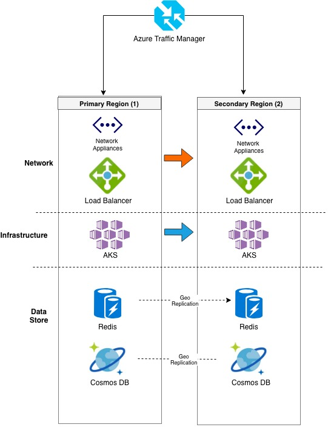

# Best practices for business continuity and disaster recovery in Azure Kubernetes Service (AKS)

As you manage clusters in Azure Kubernetes Service (AKS), your application uptime becomes important. you may want to consider removing Single Point of Failures and increasing the application's fault tolerance. AKS provides high availability by using multiple nodes in an availability set. Multiple nodes don’t protect you from a region failure. To maximize your uptime, you should implement business continuity and disaster recovery features.

This best practices article focuses on considerations that help you plan for business continuity and disaster recovery in AKS. You learn how to:

> [!div class="checklist"]
* [Region Planning](#region-planning)
* [Ingress Traffic](#ingress-traffic)
* [Container Registry](#container-registry)
* [Managing Application State](#managing-application-state)
* [Storage](#storage)

## Plan for multi-region deployment

**Best practice guidance** - When you deploy multiple AKS clusters for BC/DR, use regions where both AKS clusters are available, and use Azure Paired Regions.

By default, an AKS cluster is deployed into a single region. To protect yourself from region failure, deploy your application into multiple AKS clusters across different region. When you plan what regions to deploy your AKS cluster, the following considerations apply:

* [AKS region availability](https://docs.microsoft.com/en-us/azure/aks/container-service-quotas#region-availability)
* [Azure paired regions](https://docs.microsoft.com/en-us/azure/best-practices-availability-paired-regions)
* Service Availability Level (Hot/Hot, Hot/Warm, Hot/Cold)

AKS region availability and paired regions are joint consideration. Deploy your AKS clusters into paired regions that are designed to manage region disaster recovery together. For example, AKS is available in *East US* and *West US*. These regions are also paired. These two regions would be recommended when creating an AKS BC/DR strategy.

When you deploy your application, you must also add another step to your CI/CD pipeline to deploy to these multiple AKS clusters.

## Use Azure Traffic Manager to route traffic to desired regions

**Best practice guidance** - Ensure that all application traffic is directed through Azure Traffic Manager before going to your AKS cluster.

To route incoming traffic to the desired region, use [Azure Traffic Manager](https://docs.microsoft.com/en-us/azure/traffic-manager/). Azure Traffic Manager is a DNS-based traffic load balancer that can distribute network traffic across regions.

Instead of directly publishing your Kubernetes Service IP, end users should be directed to the Azure Traffic Manager CNAME that point to the intended IP. This configuration can be set up by using Azure Traffic Manager Endpoints. Each endpoint is the Service Load Balancer IP. This configuration lets you direct network traffic from the Azure Endpoint in one region to the Azure Endpoint in a different region.

For more information on how to configure this network routing, see [Traffic Manager Routing Details](https://docs.microsoft.com/en-us/azure/traffic-manager/traffic-manager-routing-methods#geographic).

Azure Traffic Manager uses DNS (layer 3) to shape traffic. [Azure Front Door (preview)](https://docs.microsoft.com/en-us/azure/frontdoor/front-door-overview) provides an HTTP/HTTPS (layer 7) routing option. Additional features of Front Door include SSL termination, custom domain, Web Application Firewall, URL Rewrite, and Session Affinity.

## Enable geo-replication in Azure Container Registry

**Best practice guidance** - Store your container images in Azure Container Registry with geo-replication enabled for each AKS region.

Azure Container Registry supports multi-master geo-replication. Use ACR geo-replication to store a registry in each region your AKS cluster resides.

The benefits of using ACR geo-replication include:

* Pulling images from within the same region is faster
* Pulling images from within the same region is more reliable
* Pulling images from within the same region is cheaper (no network egress charge between datacenters)

For more information on configuring this replication, see [Azure Container Registry geo-replication](https://docs.microsoft.com/en-us/azure/container-registry/container-registry-geo-replication)

## Remove service state from inside containers

**Best practice guidance** - Where possible, do not store service state inside the container. Instead, use Azure PaaS services that support multi-region replication.

Service state refers to the in-memory or on-disk data that a service requires to function. State includes the data structures and member variables that the service reads and writes. Depending on how the service is architected, it may also include files or other resources that are stored on disk. For example, the files a database would use to store data and transaction logs.

State can be either externalized or colocated with the code that is manipulating the state. Externalization of state is typically done by using an external database or other data store that runs on different machines over the network or out of process on the same machine.

Containers and microservices are most resilient when the processes that run inside them do not retain state. Your applications almost always contain some state, and it is recommended to use a Platform as a Service solution (such as Azure Database for MySQL/Postgres or Azure SQL).  

For details on for how to build applications that are more portable, see the following guidelines:

* [The Twelve-Factor App Methodology](https://12factor.net/).
* [Run a web application in multiple Azure Regions](https://docs.microsoft.com/en-us/azure/architecture/reference-architectures/app-service-web-app/multi-region)

## Create a storage migration plan

**Best practice guidance** - If you use Azure Storage, prepare and test how you plan to migrate your storage from the primary to the backup region.

The two common ways of replicating storage are:

* Application-based asynchronous replication
* Infrastructure-based asynchronous replication

### Infrastructure-based asynchronous replication

Sometimes your application requires persistent storage even after the pod is deleted. Kubernetes enables this ability by using Persistent Volumes. These volumes are mounted to host VM and then to the containers running on that VM. Persistent Volumes follow Pods, even if the Pod is moved to a different node inside the same cluster.

Depending on the storage solution you pick, BC/DR strategies change. For example, [Gluster](https://docs.gluster.org/en/latest/Administrator%20Guide/Geo%20Replication/), [CEPH](http://docs.ceph.com/docs/master/cephfs/disaster-recovery/), [Rook](https://rook.io/docs/rook/master/disaster-recovery.html), [Portworx](https://docs.portworx.com/scheduler/kubernetes/going-production-with-k8s.html#disaster-recovery-with-cloudsnaps) have their own guidance.

If you use Azure Managed Disks, the recommended approaches to migrate storage across regions are:

* [Ark on Azure](https://github.com/heptio/ark/blob/master/docs/azure-config.md)
* [Azure Site Recovery](https://azure.microsoft.com/en-us/blog/asr-managed-disks-between-azure-regions/)

### Application-based Asynchronous Replication

Currently, there are no Kubernetes native implementations for application-based asynchronous replication. Due to the loosely coupled nature of containers and Kubernetes, any traditional application/language approach should work.

## Next steps
