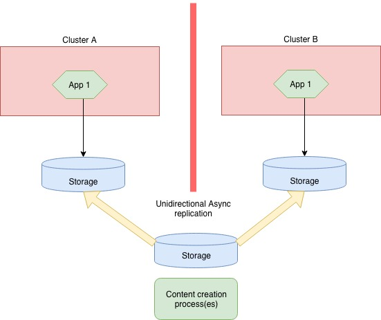
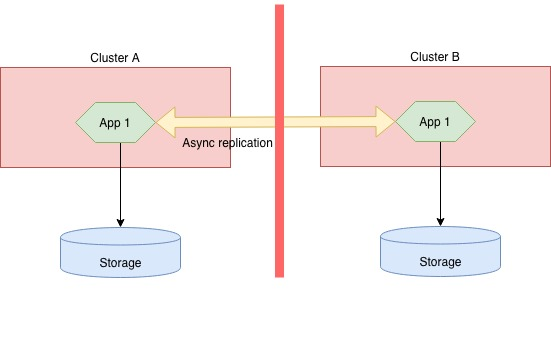

# Best practices for business continuity and disaster recovery in Azure Kubernetes Service (AKS)

As you manage clusters in Azure Kubernetes Service (AKS), application uptime becomes important. AKS provides high availability by using multiple nodes in an availability set. These multiple nodes don’t protect you from a region failure. To maximize your uptime, implement some business continuity and disaster recovery features.

This best practices article focuses on considerations that help you plan for business continuity and disaster recovery in AKS. You learn how to:

> [!div class="checklist"]
* [Plan for AKS clusters in multiple regions](#region-planning)
* [Route traffic across multiple clusters with Azure Traffic Manager](#ingress-traffic)
* [Use geo-replication for your container image registries](#container-registry)
* [Plan for application state across multiple clusters](#managing-application-state)
* [Replicate storage across multiple regions](#storage)

## Plan for multi-region deployment

**Best practice guidance** - When you deploy multiple AKS clusters, choose regions where AKS is available and use paired regions.

An AKS cluster is deployed into a single region. To protect yourself from region failure, deploy your application into multiple AKS clusters across different regions. When you plan what regions to deploy your AKS cluster, the following considerations apply:

* [AKS region availability](https://docs.microsoft.com/azure/aks/container-service-quotas#region-availability)
  * Choose regions close to your users. AKS is continually expanding into new regions.
* [Azure paired regions](https://docs.microsoft.com/azure/best-practices-availability-paired-regions)
  * For your geographic area, choose two regions that are paired with each other. These regions coordinate platform updates, and prioritize recovery efforts where needed.
* Service Availability Level (Hot/Hot, Hot/Warm, Hot/Cold)
  * Do you want to run both regions at the same time, with one region *ready* to start serving traffic, or one region that needs to time get ready to serve traffic.

AKS region availability and paired regions are joint consideration. Deploy your AKS clusters into paired regions that are designed to manage region disaster recovery together. For example, AKS is available in *East US* and *West US*. These regions are also paired. These two regions would be recommended when creating an AKS BC/DR strategy.

When you deploy your application, you must also add another step to your CI/CD pipeline to deploy to these multiple AKS clusters. If you don't update your deployment pipelines, application deployments may only be deployed into one of your regions and AKS clusters. Customer traffic that is directed to a secondary region won't receive the latest code updates.

## Use Azure Traffic Manager to route traffic to desired regions

**Best practice guidance** - Azure Traffic Manager can direct customers to their closest AKS cluster and application instance. For the best performance and redundancy, direct all application traffic through Traffic Manager before going to your AKS cluster.

With multiple AKS clusters in different regions, you need to control how traffic is directed to the applications that run in each cluster. [Azure Traffic Manager](https://docs.microsoft.com/azure/traffic-manager/) is a DNS-based traffic load balancer that can distribute network traffic across regions. You can route users based on cluster response time, or based on geography.

With a single AKS cluster, customers typically connect to the *Service IP* or DNS name of a given application. In a multi-cluster deployment, customers should connect to a Traffic Manager DNS name that points to the services on each AKS cluster. These services are defined using Traffic Manager endpoints. Each endpoint is the *Service Load Balancer IP*. This configuration lets you direct network traffic from the Traffic Manager endpoint in one region to the endpoint in a different region.

Traffic Manager is used to perform the DNS lookups and return the most appropriate endpoint for a user. Nested profiles can be used, with priority given for a primary location. For example, a user should primarily connect to their closest geographic region. If that region has a problem, Traffic Manager instead directs them to a secondary region. This approach makes sure customers can always connect to an application instance, even if their closest geographic region is unavailable.

For steps on how to set up these endpoints and routing, see [Configure the geographic traffic routing method using Traffic Manager](https://docs.microsoft.com/azure/traffic-manager/traffic-manager-configure-geographic-routing-method).

### Layer 7 application routing with Azure Front Door

Azure Traffic Manager uses DNS (layer 3) to shape traffic. [Azure Front Door (preview)](https://docs.microsoft.com/azure/frontdoor/front-door-overview) provides an HTTP/HTTPS (layer 7) routing option. Additional features of Front Door include SSL termination, custom domain, Web Application Firewall, URL Rewrite, and Session Affinity.

Review the needs of your application traffic to understand which solution is the most suitable.

## Enable geo-replication for container images in Azure Container Registry

**Best practice guidance** - Store your container images in Azure Container Registry and geo-replicate the registry to each AKS region.

To deploy and run your applications in AKS, you need a way to store and pull the container images. Azure Container Registry (ACR) can integrate with AKS to securely store your container images or Helm charts. ACR supports multi-master geo-replication to automatically replicate your images to Azure regions around the world. To improve performance and availability, use ACR geo-replication to create a registry in each region where you have an AKS cluster. Each AKS cluster then pulls container images from the local ACR registry in the same region:

The benefits of using ACR geo-replication include the following:

* **Pulling images from the same region is faster.** You pull images from high-speed, low latency network connections within the same Azure region.
* **Pulling images from the same region is more reliable.** If a region is unavailable, your AKS cluster pulls the image from a different ACR registry that remains available.
* **Pulling images from the same region is cheaper.** There's no network egress charge between datacenters.

Geo-replication is a feature of *Premium* SKU ACR registries. For steps on how to configure replication, see [Azure Container Registry geo-replication](https://docs.microsoft.com/azure/container-registry/container-registry-geo-replication)

## Remove service state from inside containers

**Best practice guidance** - Where possible, don't store service state inside the container. Instead, use Azure PaaS services that support multi-region replication.

Service state refers to the in-memory or on-disk data that a service requires to function. State includes the data structures and member variables that the service reads and writes. Depending on how the service is architected, the state may also include files or other resources that are stored on disk. For example, the files a database would use to store data and transaction logs.

State can be either externalized or colocated with the code that is manipulating the state. Externalization of state is typically done by using a database or other data store that runs on different machines over the network or out of process on the same machine.

Containers and microservices are most resilient when the processes that run inside them do not retain state. As your applications almost always contain some state, use a Platform as a Service solution such as Azure Database for MySQL/Postgres or Azure SQL.

For details on for how to build applications that are more portable, see the following guidelines:

* [The Twelve-Factor App Methodology](https://12factor.net/).
* [Run a web application in multiple Azure Regions](https://docs.microsoft.com/azure/architecture/reference-architectures/app-service-web-app/multi-region)

## Create a storage migration plan

**Best practice guidance** - If you use Azure Storage, prepare and test how to migrate your storage from the primary to the backup region.

Your applications may use Azure Storage for their data. As your applications are spread across multiple AKS clusters in different regions, you need to keep the storage synchronized. Two common ways of replicating storage include the following approaches:

* Application-based asynchronous replication
* Infrastructure-based asynchronous replication

### Infrastructure-based asynchronous replication

Your applications may require persistent storage even after a pod is deleted. In Kubernetes, you can use Persistent Volumes to persist data storage. These persistent volumes are mounted to node VM, and then exposed to the pods. Persistent volumes follow pods, even if the pod is moved to a different node inside the same cluster.

Depending on the storage solution use, replication strategies may be different. Common storage solutions such as [Gluster](https://docs.gluster.org/en/latest/Administrator%20Guide/Geo%20Replication/), [CEPH](http://docs.ceph.com/docs/master/cephfs/disaster-recovery/), [Rook](https://rook.io/docs/rook/master/disaster-recovery.html), and [Portworx](https://docs.portworx.com/scheduler/kubernetes/going-production-with-k8s.html#disaster-recovery-with-cloudsnaps) all have their own guidance.

The central approach is a common storage point for applications to write their data. This data is then replicated across regions and then accessed locally.

If you use Azure Managed Disks, available replication and DR solutions include using one of the following approaches:

* [Ark on Azure](https://github.com/heptio/ark/blob/master/docs/azure-config.md)
* [Azure Site Recovery](https://azure.microsoft.com/blog/asr-managed-disks-between-azure-regions/)

### Application-based Asynchronous Replication

There is currently no Kubernetes-native implementation for application-based asynchronous replication. With the loosely coupled nature of containers and Kubernetes, any traditional application or language approach should work. The central approach is for the applications themselves to replicate the storage requests that are then written to each cluster's underlying data storage.

## Next steps

This article focused on business continuity and disaster recovery considerations in AKS clusters. For more information about cluster operations in AKS, see the following best practices:

* [Multi-tenancy and cluster isolation][aks-best-practices-cluster-isolation]
* [Basic Kubernetes scheduler features][aks-best-practices-scheduler]

<!-- INTERNAL LINKS -->
[aks-best-practices-scheduler]: operator-best-practices-scheduler.md
[aks-best-practices-cluster-isolation]: operator-best-practices-cluster-isolation.md
