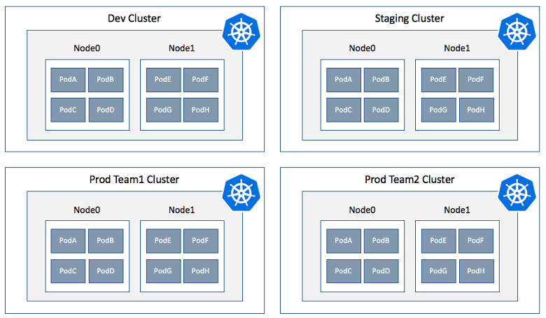

# Cluster operator best practices for isolation and resource management in Azure Kubernetes Service (AKS)

As you manage clusters in Azure Kubernetes Service (AKS), there are a few key areas to consider. How you manage your cluster and application deployments can negatively impact the end-user experience of services that you provide. To help you succeed, there are some best practices you can follow as you design and run AKS clusters.

This best practices article focuses on how to run your cluster and workloads from a cluster operator perspective. For information about developer best practices, see [Application developer best practices for resource management in Azure Kubernetes Service (AKS)][developer-best-practices-resources]. In this article, you learn:

> [!div class="checklist"]
> * How and why to use physical or logical cluster isolation
> * How to set resource quotas for a namespace
> * How to use the `kube-advisor` tool to check for issues with deployments

## Logically isolate clusters

Kubernetes offers logical isolation using *Namespaces*. With a namespace, you can safely isolate tenants for the following components:

* **Scheduler** - You can use resource quotas, discussed in the following sections, to define and enforce limits for the amount of CPU, memory, or storage that each tenant can consume within the cluster.
* **Authentication and authorization** - You can use Kubernetes role-based access controls (RBAC) to assign permissions to users and groups. As a best practice, you should also integrate with Azure Active Directory (AD) to provide a central way to manage those users, groups, permissions, and credentials.


With logical isolation using namespaces, a single AKS cluster can be used for multiple development teams and a staging environment. Pods from these different teams can run on the same hosts as each other, but are logically separate and with their own resource quotas and access permissions in place. For production use, you can use a single AKS cluster to support multiple application teams, all logically separated from each other.

Logical separation of clusters usually provides a higher pod density than physically isolated clusters. There is less excess compute capacity that sits idle in the cluster. When combined with the Kubernetes cluster autoscaler, you can scale the number of nodes up or down to meet demands. This best practice approach to autoscaling lets you run only the number of nodes required and minimizes costs.

**Best practice guidance** - Use logical isolation to separate teams and projects. You can use logical isolation alongside physical isolation, but try to minimize the number of physical AKS clusters you deploy just to separate teams or applications.

## Physically isolate clusters

A common alternative approach to cluster isolation is to use physically separate AKS clusters. In this isolation model, teams or projects are assigned their own AKS cluster. This approach often looks like the easiest way to isolate development teams, but adds additional management and financial overhead. You now have to maintain these multiple clusters, are billed for all the individual nodes, and have to individually provide access and assign permissions.



Physically separate clusters usually have a low pod density. As each team or project has their own AKS cluster, the cluster is often over-provisioned with compute resources, with a small number of pods scheduled on those nodes. Unused capacity on the nodes cannot be used for applications or services in development by other teams. These excess resources contribute to the additional costs in physically separate clusters.

**Best practice guidance** - Minimize the use of physical isolation for each separate team or application deployment. Instead, use *logical* isolation, as discussed in the previous section.

## Enforce resource quotas

Resource requests and limits are placed in the pod specification and used at deployment time for the Kubernetes scheduler to find an available node in the cluster. These limits and requests work at the individual pod level. For more information about how to define these values, see [Define pod resource requests and limits][resource-limits]

To provide a way to reserve and limit resources across a development team or project, you should use *resource quotas*. These quotas are defined on a namespace, and can be used to set quotas on the following basis:

* **Compute resources**, such as CPU and memory, or GPUs.
* **Storage resources**, including the total number of volumes, persistent volume claims, or amount of disk space for a given storage class.
* **Object count**, such as maximum number of secrets, services, or jobs can be created.

Kubernetes does not overcommit resources. Once the cumulative total of resource requests or limits passes the assigned quota, no further deployments are successful.

When you define resource quotas, all pods created in the namespace must provide limits or requests in their pod specifications. If they don't provide these values, you can reject the deployment. Alternatively, you can [configure default requests and limits for a namespace][configure-default-quotas].

The following example YAML manifest named *dev-app-team-quotas.yaml* sets a hard limit of a total of *10* CPUs, *20Gi* of memory, and *10* pods:

```yaml
apiVersion: v1
kind: ResourceQuota
metadata:
  name: dev-app-team
spec:
  hard:
    cpu: "10"
    memory: 20Gi
    pods: "10"
```

This resource quota can be applied by specifying the namespace, such as *dev-apps*:

```console
kubectl apply -f dev-app-team-quotas.yaml --namespace dev-apps
```

For more information about available resource objects, scopes, and priorities, see [Resource quotas in Kubernetes][k8s-resource-quotas].

**Best practice guidance** - Plan and apply resource quotas at the namespace level. If pods don't define resource requests and limits, reject the deployment. Monitor resource usage and adjust quotas as needed.

## Regularly check for cluster issues with kube-advisor

The [kube-advisor][kube-advisor] tool scans a Kubernetes cluster and reports on issues that it finds. This tool helps identify pods that do not have resource requests and limits in place, for example.

Especially in an AKS cluster that hosts multiple development teams and applications, it can be hard to track pods without these resource requests and limits set. As a best practice, regularly run `kube-advisor` on your AKS clusters, especially if you don't assign resource quotas to namespaces.

**Best practice guidance** - Regularly run the latest version of `kube-advisor` to detect issues in your cluster. If you apply resource quotas on an existing AKS cluster, run `kube-advisor` first to find pods that don't have resource requests and limits defined.

## Next steps

This best practices article focused on how to run your cluster and workloads from a cluster operator perspective. For information about developer best practices, see [Application developer best practices for resource management in Azure Kubernetes Service (AKS)][developer-best-practices-resources].

To implement some of these best practices, see the following articles:

* [Enable Azure Active Directory (AD) integration][aks-azuread]
* [Check for issues with kube-advisor][aks-kubeadvisor]

<!-- EXTERNAL LINKS -->
[k8s-resource-quotas]: https://kubernetes.io/docs/concepts/policy/resource-quotas/
[configure-default-quotas]: https://kubernetes.io/docs/tasks/administer-cluster/manage-resources/memory-default-namespace/
[kube-advisor]: https://github.com/Azure/kube-advisor

<!-- INTERNAL LINKS -->
[aks-azuread]: aad-integration.md
[aks-kubeadvisor]: kube-advisor-tool.md
[developer-best-practices-resources]: developer-best-practices-resource-management.md
[resource-limits]: developer-best-practices-resource-management.md#define-pod-resource-requests-and-limits
