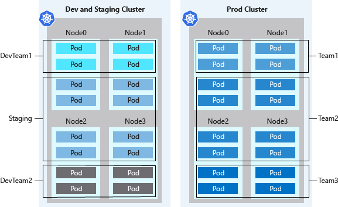
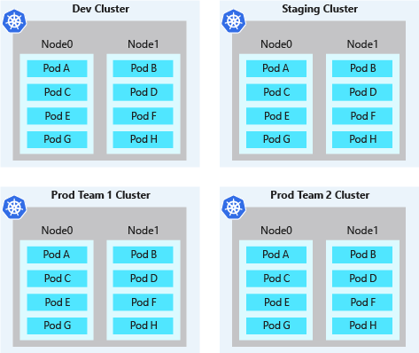

# Best practices for cluster isolation in Azure Kubernetes Service (AKS)

As you manage clusters in Azure Kubernetes Service (AKS), you often need to isolate teams and workloads. AKS allows flexibility in how you run multi-tenant clusters and isolate resources. To maximize your investment in Kubernetes, it's important you understand AKS multi-tenancy and isolation features.

This best practices article focuses on isolation for cluster operators. In this article, you learn how to:

> [!div class="checklist"]
>
> * Plan for multi-tenant clusters and separation of resources.
> * Use logical or physical isolation in your AKS clusters.

## Design clusters for multi-tenancy

Kubernetes lets you logically isolate teams and workloads in the same cluster. The goal is to provide the least number of privileges scoped to the resources each team needs. A Kubernetes [Namespace][k8s-namespaces] creates a logical isolation boundary. Other Kubernetes features and considerations for isolation and multi-tenancy include the following areas:

- [Best practices for cluster isolation in Azure Kubernetes Service (AKS)](#best-practices-for-cluster-isolation-in-azure-kubernetes-service-aks)
  - [Design clusters for multi-tenancy](#design-clusters-for-multi-tenancy)
    - [Scheduling](#scheduling)
    - [Networking](#networking)
    - [Authentication and authorization](#authentication-and-authorization)
    - [Containers](#containers)
  - [Logically isolated clusters](#logically-isolated-clusters)
  - [Physically isolated clusters](#physically-isolated-clusters)
  - [Next steps](#next-steps)

### Scheduling

*Scheduling* uses basic features like resource quotas and pod disruption budgets. For more information about these features, see [Best practices for basic scheduler features in AKS][aks-best-practices-scheduler].

More advanced scheduler features include:

* Taints and tolerations.
* Node selectors.
* Node and pod affinity or anti-affinity.

For more information about these features, see [Best practices for advanced scheduler features in AKS][aks-best-practices-advanced-scheduler].

### Networking

*Networking* uses network policies to control the flow of traffic in and out of pods.

### Authentication and authorization

*Authentication and authorization* uses:

* Role-based access control (RBAC).
* Microsoft Entra integration.
* Pod identities.
* Secrets in Azure Key Vault.

For more information about these features, see [Best practices for authentication and authorization in AKS][aks-best-practices-identity].

### Containers

*Containers* include:

* The Azure Policy add-on for AKS to enforce pod security.
* Pod security admission.
* Scanning images and runtime for vulnerabilities.
* Using App Armor or Seccomp (Secure Computing) to restrict container access to the underlying node.

## Logically isolated clusters

> **Best practice guidance**
>
> Separate teams and projects using *logical isolation*. Minimize the number of physical AKS clusters you deploy to isolate teams or applications.

With logical isolation, you can use a single AKS cluster for multiple workloads, teams, or environments. Kubernetes [Namespaces][k8s-namespaces] form the logical isolation boundary for workloads and resources.

Logical separation of clusters usually provides a higher pod density than physically isolated clusters, with less excess compute capacity sitting idle in the cluster. When combined with the Kubernetes cluster autoscaler, you can scale the number of nodes up or down to meet demands. This best practice approach minimizes costs by running only the required number of nodes.

Kubernetes environments aren't entirely safe for hostile multi-tenant usage. In a multi-tenant environment, multiple tenants work on a shared infrastructure. If all tenants can't be trusted, you need extra planning to prevent tenants from impacting the security and service of others.

Other security features, like Kubernetes RBAC for nodes, efficiently block exploits. For true security when running hostile multi-tenant workloads, you should only trust a hypervisor. The security domain for Kubernetes becomes the entire cluster and not an individual node.

For these types of hostile multi-tenant workloads, you should use physically isolated clusters.

## Physically isolated clusters

> **Best practice guidance**
>
> Minimize the use of physical isolation for each separate team or application deployment and use *logical* isolation instead.

Physically separating AKS clusters is a common approach to cluster isolation. In this isolation model, teams or workloads are assigned their own AKS cluster. While physical isolation might look like the easiest way to isolate workloads or teams, it adds management and financial overhead. With physically isolated clusters, you must maintain multiple clusters and individually provide access and assign permissions. You're also billed for each individual node.

Physically isolated clusters usually have a low pod density. Since each team or workload has their own AKS cluster, the cluster is often over-provisioned with compute resources. Often, a few pods are scheduled on those nodes. Unclaimed node capacity can't be used for applications or services in development by other teams. These excess resources contribute to the extra costs in physically isolated clusters.

## Next steps

This article focused on cluster isolation. For more information about cluster operations in AKS, see the following best practice articles:

* [Basic Kubernetes scheduler features][aks-best-practices-scheduler]
* [Advanced Kubernetes scheduler features][aks-best-practices-advanced-scheduler]
* [Authentication and authorization][aks-best-practices-identity]

<!-- EXTERNAL LINKS -->

<!-- INTERNAL LINKS -->
[k8s-namespaces]: concepts-clusters-workloads.md#namespaces
[aks-best-practices-scheduler]: operator-best-practices-scheduler.md
[aks-best-practices-advanced-scheduler]: operator-best-practices-advanced-scheduler.md
[aks-best-practices-identity]: operator-best-practices-identity.md
