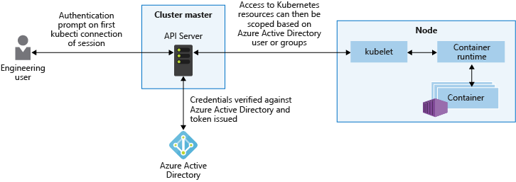
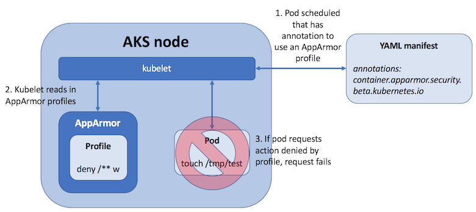
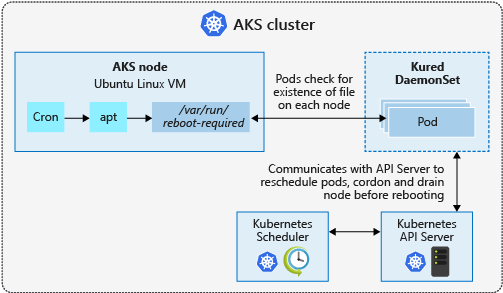

# Best practices for cluster security and upgrades in Azure Kubernetes Service (AKS)

As you manage clusters in Azure Kubernetes Service (AKS), the security of your workloads and data is a key consideration. Especially when you run multi-tenant clusters using logical isolation, you need to secure access to resources and workloads. To minimize the risk of attack, you also need to make sure you apply the latest Kubernetes and node OS security updates.

This article focuses on how to secure your AKS cluster. You learn how to:

> [!div class="checklist"]
> * Use Azure Active Directory and role-based access controls to secure API server access
> * Secure container access to node resources
> * Upgrade an AKS cluster to the latest Kubernetes version
> * Keep nodes up to date and automatically apply security patches

You can also read the best practices for [container image management][best-practices-container-image-management] and for [pod security][best-practices-pod-security].

You can also use [Azure Kubernetes Services integration with Security Center][security-center-aks] to help detect threats and view recommendations for securing your AKS clusters.

## Secure access to the API server and cluster nodes

**Best practice guidance** - Securing access to the Kubernetes API-Server is one of the most important things you can do to secure your cluster. Integrate Kubernetes role-based access control (RBAC) with Azure Active Directory to control access to the API server. These controls let you secure AKS the same way that you secure access to your Azure subscriptions.

The Kubernetes API server provides a single connection point for requests to perform actions within a cluster. To secure and audit access to the API server, limit access and provide the least privileged access permissions required. This approach isn't unique to Kubernetes, but is especially important when the AKS cluster is logically isolated for multi-tenant use.

Azure Active Directory (AD) provides an enterprise-ready identity management solution that integrates with AKS clusters. As Kubernetes doesn't provide an identity management solution, it can otherwise be hard to provide a granular way to restrict access to the API server. With Azure AD-integrated clusters in AKS, you use your existing user and group accounts to authenticate users to the API server.



Use Kubernetes RBAC and Azure AD-integration to secure the API server and provide the least number of permissions required to a scoped set of resources, such as a single namespace. Different users or groups in Azure AD can be granted different RBAC roles. These granular permissions let you restrict access to the API server, and provide a clear audit trail of actions performed.

The recommended best practice is to use groups to provide access to files and folders versus individual identities, use Azure AD *group* membership to bind users to RBAC roles rather than individual *users*. As a user's group membership changes, their access permissions on the AKS cluster would change accordingly. If you bind the user directly to a role, their job function may change. The Azure AD group memberships would update, but permissions on the AKS cluster would not reflect that. In this scenario, the user ends up being granted more permissions than a user requires.

For more information about Azure AD integration and RBAC, see [Best practices for authentication and authorization in AKS][aks-best-practices-identity].

## Secure container access to resources

**Best practice guidance** - Limit access to actions that containers can perform. Provide the least number of permissions, and avoid the use of root / privileged escalation.

In the same way that you should grant users or groups the least number of privileges required, containers should also be limited to only the actions and processes that they need. To minimize the risk of attack, don't configure applications and containers that require escalated privileges or root access. For example, set `allowPrivilegeEscalation: false` in the pod manifest. These *pod security contexts* are built in to Kubernetes and let you define additional permissions such as the user or group to run as, or what Linux capabilities to expose. For more best practices, see [Secure pod access to resources][pod-security-contexts].

For more granular control of container actions, you can also use built-in Linux security features such as *AppArmor* and *seccomp*. These features are defined at the node level, and then implemented through a pod manifest. Built-in Linux security features are only available on Linux nodes and pods.

> [!NOTE]
> Kubernetes environments, in AKS or elsewhere, aren't completely safe for hostile multi-tenant usage. Additional security features such as *AppArmor*, *seccomp*, *Pod Security Policies*, or more fine-grained role-based access controls (RBAC) for nodes make exploits more difficult. However, for true security when running hostile multi-tenant workloads, a hypervisor is the only level of security that you should trust. The security domain for Kubernetes becomes the entire cluster, not an individual node. For these types of hostile multi-tenant workloads, you should use physically isolated clusters.

### App Armor

To limit the actions that containers can perform, you can use the [AppArmor][k8s-apparmor] Linux kernel security module. AppArmor is available as part of the underlying AKS node OS, and is enabled by default. You create AppArmor profiles that restrict actions such as read, write, or execute, or system functions such as mounting filesystems. Default AppArmor profiles restrict access to various `/proc` and `/sys` locations, and provide a means to logically isolate containers from the underlying node. AppArmor works for any application that runs on Linux, not just Kubernetes pods.



To see AppArmor in action, the following example creates a profile that prevents writing to files. [SSH][aks-ssh] to an AKS node, then create a file named *deny-write.profile* and paste the following content:

```
#include <tunables/global>
profile k8s-apparmor-example-deny-write flags=(attach_disconnected) {
  #include <abstractions/base>
  
  file,
  # Deny all file writes.
  deny /** w,
}
```

AppArmor profiles are added using the `apparmor_parser` command. Add the profile to AppArmor and specify the name of the profile created in the previous step:

```console
sudo apparmor_parser deny-write.profile
```

There's no output returned if the profile is correctly parsed and applied to AppArmor. You're returned to the command prompt.

From your local machine, now create a pod manifest named *aks-apparmor.yaml* and paste the following content. This manifest defines an annotation for `container.apparmor.security.beta.kubernetes` add references the *deny-write* profile created in the previous steps:

```yaml
apiVersion: v1
kind: Pod
metadata:
  name: hello-apparmor
  annotations:
    container.apparmor.security.beta.kubernetes.io/hello: localhost/k8s-apparmor-example-deny-write
spec:
  containers:
  - name: hello
    image: busybox
    command: [ "sh", "-c", "echo 'Hello AppArmor!' && sleep 1h" ]
```

Deploy the sample pod using the [kubectl apply][kubectl-apply] command:

```console
kubectl apply -f aks-apparmor.yaml
```

With the pod deployed, use the [kubectl exec][kubectl-exec] command to write to a file. The command can't be executed, as shown in the following example output:

```
$ kubectl exec hello-apparmor touch /tmp/test

touch: /tmp/test: Permission denied
command terminated with exit code 1
```

For more information about AppArmor, see [AppArmor profiles in Kubernetes][k8s-apparmor].

### Secure computing

While AppArmor works for any Linux application, [seccomp (*sec*ure *comp*uting)][seccomp] works at the process level. Seccomp is also a Linux kernel security module, and is natively supported by the Docker runtime used by AKS nodes. With seccomp, the process calls that containers can perform are limited. You create filters that define what actions to allow or deny, and then use annotations within a pod YAML manifest to associate with the seccomp filter. This aligns to the best practice of only granting the container the minimal permissions that are needed to run, and no more.

To see seccomp in action, create a filter that prevents changing permissions on a file. [SSH][aks-ssh] to an AKS node, then create a seccomp filter named */var/lib/kubelet/seccomp/prevent-chmod* and paste the following content:

```
{
  "defaultAction": "SCMP_ACT_ALLOW",
  "syscalls": [
    {
      "name": "chmod",
      "action": "SCMP_ACT_ERRNO"
    }
  ]
}
```

From your local machine, now create a pod manifest named *aks-seccomp.yaml* and paste the following content. This manifest defines an annotation for `seccomp.security.alpha.kubernetes.io` and references the *prevent-chmod* filter created in the previous step:

```yaml
apiVersion: v1
kind: Pod
metadata:
  name: chmod-prevented
  annotations:
    seccomp.security.alpha.kubernetes.io/pod: localhost/prevent-chmod
spec:
  containers:
  - name: chmod
    image: busybox
    command:
      - "chmod"
    args:
     - "777"
     - /etc/hostname
  restartPolicy: Never
```

Deploy the sample pod using the [kubectl apply][kubectl-apply] command:

```console
kubectl apply -f ./aks-seccomp.yaml
```

View the status of the pods using the [kubectl get pods][kubectl-get] command. The pod reports an error. The `chmod` command is prevented from running by the seccomp filter, as shown in the following example output:

```
$ kubectl get pods

NAME                      READY     STATUS    RESTARTS   AGE
chmod-prevented           0/1       Error     0          7s
```

For more information about available filters, see [Seccomp security profiles for Docker][seccomp].

## Regularly update to the latest version of Kubernetes

**Best practice guidance** - To stay current on new features and bug fixes, regularly upgrade to the Kubernetes version in your AKS cluster.

Kubernetes releases new features at a quicker pace than more traditional infrastructure platforms. Kubernetes updates include new features, and bug or security fixes. New features typically move through an *alpha* and then *beta* status before they become *stable* and are generally available and recommended for production use. This release cycle should allow you to update Kubernetes without regularly encountering breaking changes or adjusting your deployments and templates.

AKS supports four minor versions of Kubernetes. This means that when a new minor patch version is introduced, the oldest minor version and patch releases supported are retired. Minor updates to Kubernetes happen on a periodic basis. Make sure that you have a governance process to check and upgrade as needed so you don't fall out of support. For more information, see [Supported Kubernetes versions AKS][aks-supported-versions]

To check the versions that are available for your cluster, use the [az aks get-upgrades][az-aks-get-upgrades] command as shown in the following example:

```azurecli-interactive
az aks get-upgrades --resource-group myResourceGroup --name myAKSCluster
```

You can then upgrade your AKS cluster using the [az aks upgrade][az-aks-upgrade] command. The upgrade process safely cordons and drains one node at a time, schedules pods on remaining nodes, and then deploys a new node running the latest OS and Kubernetes versions.

```azurecli-interactive
az aks upgrade --resource-group myResourceGroup --name myAKSCluster --kubernetes-version KUBERNETES_VERSION
```

For more information about upgrades in AKS, see [Supported Kubernetes versions in AKS][aks-supported-versions] and [Upgrade an AKS cluster][aks-upgrade].

## Process Linux node updates and reboots using kured

**Best practice guidance** - AKS automatically downloads and installs security fixes on each Linux nodes, but does not automatically reboot if necessary. Use `kured` to watch for pending reboots, then safely cordon and drain the node to allow the node to reboot, apply the updates and be as secure as possible with respect to the OS. For Windows Server nodes (currently in preview in AKS), regularly perform an AKS upgrade operation to safely cordon and drain pods and deploy updated nodes.

Each evening, Linux nodes in AKS get security patches available through their distro update channel. This behavior is configured automatically as the nodes are deployed in an AKS cluster. To minimize disruption and potential impact to running workloads, nodes are not automatically rebooted if a security patch or kernel update requires it.

The open-source [kured (KUbernetes REboot Daemon)][kured] project by Weaveworks watches for pending node reboots. When a Linux node applies updates that require a reboot, the node is safely cordoned and drained to move and schedule the pods on other nodes in the cluster. Once the node is rebooted, it is added back into the cluster and Kubernetes resumes scheduling pods on it. To minimize disruption, only one node at a time is permitted to be rebooted by `kured`.



If you want finer grain control over when reboots happen, `kured` can integrate with Prometheus to prevent reboots if there are other maintenance events or cluster issues in progress. This integration minimizes additional complications by rebooting nodes while you are actively troubleshooting other issues.

For more information about how to handle node reboots, see [Apply security and kernel updates to nodes in AKS][aks-kured].

## Next steps

This article focused on how to secure your AKS cluster. To implement some of these areas, see the following articles:

* [Integrate Azure Active Directory with AKS][aks-aad]
* [Upgrade an AKS cluster to the latest version of Kubernetes][aks-upgrade]
* [Process security updates and node reboots with kured][aks-kured]

<!-- EXTERNAL LINKS -->
[kured]: https://github.com/weaveworks/kured
[k8s-apparmor]: https://kubernetes.io/docs/tutorials/clusters/apparmor/
[seccomp]: https://kubernetes.io/docs/concepts/policy/pod-security-policy/#seccomp
[kubectl-apply]: https://kubernetes.io/docs/reference/generated/kubectl/kubectl-commands#apply
[kubectl-exec]: https://kubernetes.io/docs/reference/generated/kubectl/kubectl-commands#exec
[kubectl-get]: https://kubernetes.io/docs/reference/generated/kubectl/kubectl-commands#get

<!-- INTERNAL LINKS -->
[az-aks-get-upgrades]: /cli/azure/aks#az-aks-get-upgrades
[az-aks-upgrade]: /cli/azure/aks#az-aks-upgrade
[aks-supported-versions]: supported-kubernetes-versions.md
[aks-upgrade]: upgrade-cluster.md
[aks-best-practices-identity]: concepts-identity.md
[aks-kured]: node-updates-kured.md
[aks-aad]: azure-ad-integration.md
[best-practices-container-image-management]: operator-best-practices-container-image-management.md
[best-practices-pod-security]: developer-best-practices-pod-security.md
[pod-security-contexts]: developer-best-practices-pod-security.md#secure-pod-access-to-resources
[aks-ssh]: ssh.md
[security-center-aks]: /azure/security-center/azure-kubernetes-service-integration
