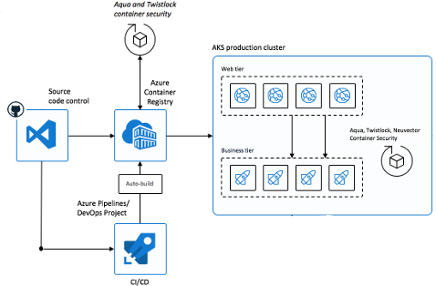

# Best practices for container image management and security in Azure Kubernetes Service (AKS)

Container and container image security is a major priority while you develop and run applications in Azure Kubernetes Service (AKS). Containers with outdated base images or unpatched application runtimes introduce a security risk and possible attack vector. 

Minimize risks by integrating and running scan and remediation tools in your containers at build and runtime. The earlier you catch the vulnerability or outdated base image, the more secure your cluster. 

In this article, *"containers"* means both:
* The container images stored in a container registry.
* The running containers.

This article focuses on how to secure your containers in AKS. You learn how to:

> [!div class="checklist"]
> * Scan for and remediate image vulnerabilities.
> * Automatically trigger and redeploy container images when a base image is updated.

You can also read the best practices for [cluster security][best-practices-cluster-security] and for [pod security][best-practices-pod-security].

You can also use [Container security in Security Center][security-center-containers] to help scan your containers for vulnerabilities. [Azure Container Registry integration][security-center-acr] with Security Center helps protect your images and registry from vulnerabilities.

## Secure the images and run time

> **Best practice guidance** 
>
> Scan your container images for vulnerabilities. Only deploy validated images. Regularly update the base images and application runtime. Redeploy workloads in the AKS cluster.

When adopting container-based workloads, you'll want to verify the security of images and runtime used to build your own applications. How do you avoid introducing security vulnerabilities into your deployments? 
* Include in your deployment workflow a process to scan container images using tools such as [Twistlock][twistlock] or [Aqua][aqua].
* Only allow verified images to be deployed.

For example, you can use a continuous integration and continuous deployment (CI/CD) pipeline to automate the image scans, verification, and deployments. Azure Container Registry includes these vulnerabilities scanning capabilities.

## Automatically build new images on base image update

> **Best practice guidance** 
>
> As you use base images for application images, use automation to build new images when the base image is updated. Since updated base images typically include security fixes, update any downstream application container images.

Each time a base image is updated, you should also update any downstream container images. Integrate this build process into validation and deployment pipelines such as [Azure Pipelines][azure-pipelines] or Jenkins. These pipelines make sure that your applications continue to run on the updated based images. Once your application container images are validated, the AKS deployments can then be updated to run the latest, secure images.

Azure Container Registry Tasks can also automatically update container images when the base image is updated. With this feature, you build a few base images and keep them updated with bug and security fixes.

For more information about base image updates, see [Automate image builds on base image update with Azure Container Registry Tasks][acr-base-image-update].

## Next steps

This article focused on how to secure your containers. To implement some of these areas, see the following articles:

* [Automate image builds on base image update with Azure Container Registry Tasks][acr-base-image-update]

<!-- EXTERNAL LINKS -->
[azure-pipelines]: /azure/devops/pipelines/
[twistlock]: https://www.twistlock.com/
[aqua]: https://www.aquasec.com/

<!-- INTERNAL LINKS -->
[best-practices-cluster-security]: operator-best-practices-cluster-security.md
[best-practices-pod-security]: developer-best-practices-pod-security.md
[acr-base-image-update]: ../container-registry/container-registry-tutorial-base-image-update.md
[security-center-containers]: ../security-center/container-security.md
[security-center-acr]: ../security-center/defender-for-container-registries-introduction.md