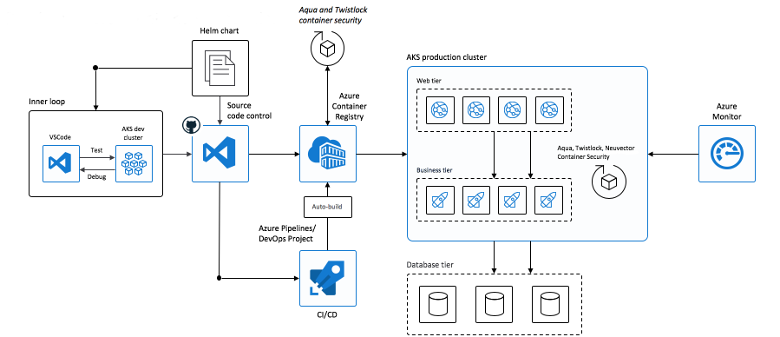

# Best practices for container security in Azure Kubernetes Service (AKS)

As you develop and run applications in Azure Kubernetes Service (AKS), the security of the containers you use is a key consideration. Containers that include out-of-date base images or application runtimes introduce a security risk and possible attack vector. To minimize these risks, you should integrate tools that scan for and remediate issues in your containers, and limit access that containers have to the underlying AKS nodes.

This best practices article focuses on how to secure your containers in AKS. You learn how to:

> [!div class="checklist"]
> * Scan for and remediate image vulnerabilities
> * Use a trusted registry with digitally signed container images
> * Automatically trigger and redeploy container images when a base image is updated
> * Limit access to node resources from within a container using AppArmour or Seccomp

You can also read the [best practices for cluster security][best-practices-cluster-security] and the [best practices for pod security][best-practices-pod-security].

## Secure the images and run time

**Best practice guidance** - Scan your container images for vulnerabilities, and only deploy images that have passed validation. Regularly update the base images and application runtimes, then redeploy workloads in the AKS cluster.

One concern with the adoption of container-based workloads is verifying the security of images and runtimes used to build your own applications. How do you make sure that you don't introduce security vulnerabilities into your deployments? Your deployment workflow should include a process to scan container images using tools such as [Twistlock][twistlock] or [Aqua][aqua], and then only allow verified images to be deployed. In a real-world example, you can use a continuous integration and continuous deployment (CI/CD) pipeline to automate the image scans, verification, and deployments. Azure Container Registry includes these vulnerabilities scanning capabilities.

For additional security, you can also digitally sign your container images and then only permit deployments of signed images. This process provides an additional layer of security in that you can further restrict what images can be deployed, not just those that pass a vulnerability check. Trusted registries that provide digitally signed container images add complexity to your environment, but may be required for certain policy or regulatory compliance. Azure Container Registry supports the use of trusted registries and signed images.

For more information about digitally signed images, see [Content trust in Azure Container Registry][acr-content-trust].

Azure Container Registry Tasks can also automatically update container images when the base image is updated. This feature allows you to build a small number of base images, and regularly keep them updated with bug and security fixes. Each time those base images are updated, any downstream container images can also then be updated to use the new base image. This process should be integrated into validation and deployment pipelines such as [Azure Pipelines][azure-pipelines] to make sure your applications continue to run on the updated based images. Once your application container images are validated, the AKS deployments can then be updated to run the latest, secure images.

For more information about base image updates, see [Automate image builds on base image update with Azure Container Registry Tasks][acr-base-image-update].

## Secure container access

**Best practice guidance** - 

Avoid access to HOST IPC and HOST PID namespace
Avoid root / privileged access

### Use App Armor

### Use Seccomp

## Next steps

This best practices article focused on how to manage identity and authentication. To implement some of these best practices, see the following articles:

* [Automate image builds on base image update with Azure Container Registry Tasks][acr-base-image-update]
* [Content trust in Azure Container Registry][acr-content-trust]

<!-- EXTERNAL LINKS -->
[azure-pipelines]: /azure/devops/pipelines/?view=vsts
[twistlock]: https://www.twistlock.com/
[aqua]: https://www.aquasec.com/

<!-- INTERNAL LINKS -->
[best-practices-cluster-security]: operator-best-practices-cluster-security.md
[best-practices-pod-security]: developer-best-practices-pod-security.md
[acr-content-trust]: ../container-registry/container-registry-content-trust.md
[acr-base-image-update]: ../container-registry/container-registry-tutorial-base-image-update.md
