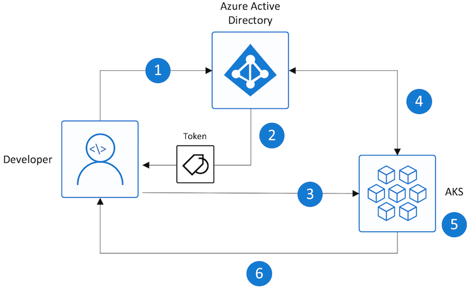
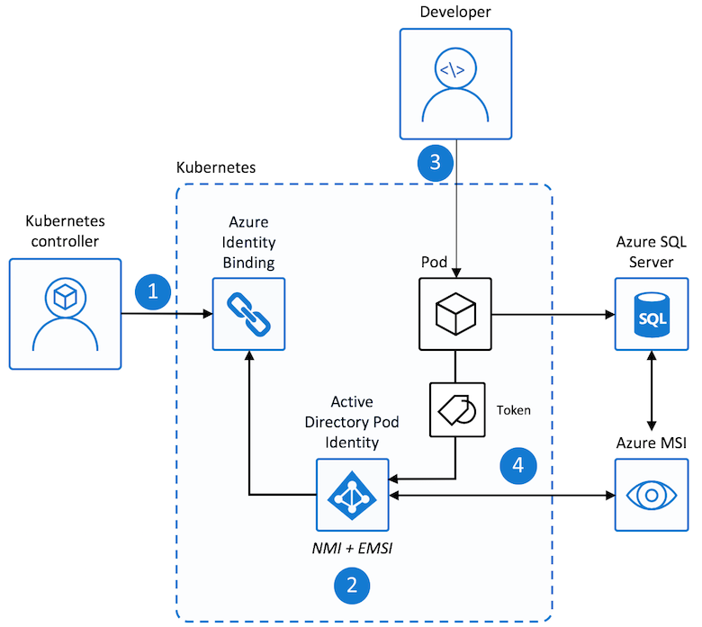

# Best practices for authentication and authorization in Azure Kubernetes Service (AKS)

As you deploy and maintain clusters in Azure Kubernetes Service (AKS), you implement ways to manage access to resources and services. Without these controls:

* Accounts could have access to unnecessary resources and services.
* Tracking credentials used to make changes can be difficult.

In this article, we discuss what recommended practices a cluster operator can follow to manage access and identity for AKS clusters. You'll learn how to:

> [!div class="checklist"]
>
> * Authenticate AKS cluster users with Microsoft Entra ID.
> * Control access to resources with Kubernetes role-based access control (Kubernetes RBAC).
> * Use Azure RBAC to granularly control access to the AKS resource, the Kubernetes API at scale, and the `kubeconfig`.
> * Use a [managed identity][managed-identities] to authenticate pods with other services.

<a name='use-azure-active-directory-azure-ad'></a>

## Use Microsoft Entra ID

> **Best practice guidance**
>
> Deploy AKS clusters with [Microsoft Entra integration][azure-ad-integration]. Using Microsoft Entra ID centralizes the identity management layer. Any change in user account or group status is automatically updated in access to the AKS cluster. Scope users or groups to the minimum permissions amount using [Roles, ClusterRoles, or Bindings](#use-kubernetes-role-based-access-control-kubernetes-rbac).

Your Kubernetes cluster developers and application owners need access to different resources. Kubernetes lacks an identity management solution for you to control the resources with which users can interact. Instead, you can integrate your cluster with an existing identity solution like Microsoft Entra ID, an enterprise-ready identity management solution.

With Microsoft Entra integrated clusters in AKS, you create *Roles* or *ClusterRoles* defining access permissions to resources. You then *bind* the roles to users or groups from Microsoft Entra ID. Learn more about these Kubernetes RBAC in [the next section](#use-kubernetes-role-based-access-control-kubernetes-rbac). Microsoft Entra integration and how you control access to resources can be seen in the following diagram:



1. Developer authenticates with Microsoft Entra ID.
1. The Microsoft Entra token issuance endpoint issues the access token.
1. The developer performs an action using the Microsoft Entra token, such as `kubectl create pod`.
1. Kubernetes validates the token with Microsoft Entra ID and fetches the developer's group memberships.
1. Kubernetes RBAC and cluster policies are applied.
1. The developer's request is successful based on previous validation of Microsoft Entra group membership and Kubernetes RBAC and policies.

To create an AKS cluster that uses Microsoft Entra ID, see [Integrate Microsoft Entra ID with AKS][aks-aad].

## Use Kubernetes role-based access control (Kubernetes RBAC)

> **Best practice guidance**
>
> Define user or group permissions to cluster resources with Kubernetes RBAC. Create roles and bindings that assign the least amount of permissions required. Integrate with Microsoft Entra ID to automatically update any user status or group membership change and keep access to cluster resources current.

In Kubernetes, you provide granular access control to cluster resources. You define permissions at the cluster level, or to specific namespaces. You determine what resources can be managed and with what permissions. You then apply these roles to users or groups with a binding. For more information about *Roles*, *ClusterRoles*, and *Bindings*, see [Access and identity options for Azure Kubernetes Service (AKS)][aks-concepts-identity].

For example, you create a role with full access to resources in the namespace named *finance-app*, as shown in the following example YAML manifest:

```yaml
kind: Role
apiVersion: rbac.authorization.k8s.io/v1
metadata:
  name: finance-app-full-access-role
  namespace: finance-app
rules:
- apiGroups: [""]
  resources: ["*"]
  verbs: ["*"]
```

You then create a *RoleBinding* and bind the Microsoft Entra user *developer1\@contoso.com* to it, as shown in the following YAML manifest:

```yaml
kind: RoleBinding
apiVersion: rbac.authorization.k8s.io/v1
metadata:
  name: finance-app-full-access-role-binding
  namespace: finance-app
subjects:
- kind: User
  name: developer1@contoso.com
  apiGroup: rbac.authorization.k8s.io
roleRef:
  kind: Role
  name: finance-app-full-access-role
  apiGroup: rbac.authorization.k8s.io
```

When *developer1\@contoso.com* is authenticated against the AKS cluster, they have full permissions to resources in the *finance-app* namespace. In this way, you logically separate and control access to resources. Use Kubernetes RBAC with Microsoft Entra ID-integration.

To learn how to use Microsoft Entra groups to control access to Kubernetes resources using Kubernetes RBAC, see [Control access to cluster resources using role-based access control and Microsoft Entra identities in AKS][azure-ad-rbac].

## Use Azure RBAC

> **Best practice guidance**
>
> Use Azure RBAC to define the minimum required user and group permissions to AKS resources in one or more subscriptions.

There are two levels of access needed to fully operate an AKS cluster:

* Access the AKS resource on your Azure subscription.

    This access level allows you to:

     * Control scaling or upgrading your cluster using the AKS APIs
     * Pull your `kubeconfig`.

    To learn how to control access to the AKS resource and the `kubeconfig`, see [Limit access to cluster configuration file](control-kubeconfig-access.md).

* Access to the Kubernetes API.

    This access level is controlled either by:

    * [Kubernetes RBAC](#use-kubernetes-role-based-access-control-kubernetes-rbac) (traditionally) or
    * By integrating Azure RBAC with AKS for kubernetes authorization.

    To learn how to granularly grant permissions to the Kubernetes API using Azure RBAC, see [Use Azure RBAC for Kubernetes authorization](manage-azure-rbac.md).

## Use pod-managed identities

Don't use fixed credentials within pods or container images, as they are at risk of exposure or abuse. Instead, use *pod identities* to automatically request access using Microsoft Entra ID.

> [!NOTE]
> Pod identities are intended for use with Linux pods and container images only. Pod-managed identities (preview) support for Windows containers is coming soon.

To access other Azure resources, like Azure Cosmos DB, Key Vault, or Blob storage, the pod needs authentication credentials. You could define authentication credentials with the container image or inject them as a Kubernetes secret. Either way, you would need to manually create and assign them. Usually, these credentials are reused across pods and aren't regularly rotated.

With pod-managed identities (preview) for Azure resources, you automatically request access to services through Microsoft Entra ID. Pod-managed identities is currently in preview for AKS. Refer to the [Use Microsoft Entra pod-managed identities in Azure Kubernetes Service (Preview)](./use-azure-ad-pod-identity.md) documentation to get started.

> [!NOTE]
> If you have enabled [Microsoft Entra pod-managed identity][aad-pod-identity] on your AKS cluster or are considering implementing it,
> we recommend you first review the [workload identity overview][workload-identity-overview] article to understand our
> recommendations and options to set up your cluster to use a Microsoft Entra Workload ID (preview).
> This authentication method replaces pod-managed identity (preview), which integrates with the Kubernetes native capabilities
> to federate with any external identity providers.
>
> The open source Microsoft Entra pod-managed identity (preview) in Azure Kubernetes Service has been deprecated as of 10/24/2022.

Microsoft Entra pod-managed identity (preview) supports two modes of operation:

* **Standard** mode: In this mode, the following 2 components are deployed to the AKS cluster:

    * [Managed Identity Controller(MIC)](https://azure.github.io/aad-pod-identity/docs/concepts/mic/): A Kubernetes controller that watches for changes to pods, [AzureIdentity](https://azure.github.io/aad-pod-identity/docs/concepts/azureidentity/) and [AzureIdentityBinding](https://azure.github.io/aad-pod-identity/docs/concepts/azureidentitybinding/) through the Kubernetes API Server. When it detects a relevant change, the MIC adds or deletes [AzureAssignedIdentity](https://azure.github.io/aad-pod-identity/docs/concepts/azureassignedidentity/) as needed. Specifically, when a pod is scheduled, the MIC assigns the managed identity on Azure to the underlying virtual machine scale set  used by the node pool during the creation phase. When all pods using the identity are deleted, it removes the identity from the virtual machine scale set of the node pool, unless the same managed identity is used by other pods. The MIC takes similar actions when AzureIdentity or AzureIdentityBinding are created or deleted.

    * [Node Managed Identity (NMI)](https://azure.github.io/aad-pod-identity/docs/concepts/nmi/): is a pod that runs as a DaemonSet on each node in the AKS cluster. NMI intercepts security token requests to the [Azure Instance Metadata Service](../virtual-machines/linux/instance-metadata-service.md?tabs=linux) on each node. It redirects requests to itself and validates if the pod has access to the identity it's requesting a token for, and fetch the token from the Microsoft Entra tenant on behalf of the application.

* **Managed** mode: In this mode, there's only NMI. The identity needs to be manually assigned and managed by the user. For more information, see [Pod Identity in Managed Mode](https://azure.github.io/aad-pod-identity/docs/configure/pod_identity_in_managed_mode/). In this mode, when you use the [az aks pod-identity add](/cli/azure/aks/pod-identity#az-aks-pod-identity-add) command to add a pod identity to an Azure Kubernetes Service (AKS) cluster, it creates the [AzureIdentity](https://azure.github.io/aad-pod-identity/docs/concepts/azureidentity/) and [AzureIdentityBinding](https://azure.github.io/aad-pod-identity/docs/concepts/azureidentitybinding/) in the namespace specified by the `--namespace` parameter, while the AKS resource provider assigns the managed identity specified by the `--identity-resource-id` parameter to virtual machine scale set of each node pool in the AKS cluster.

> [!NOTE]
> If you instead decide to install the Microsoft Entra pod-managed identity using the [AKS cluster add-on](./use-azure-ad-pod-identity.md), setup uses the `managed` mode.

The `managed` mode provides the following advantages over the `standard`:

* Identity assignment on the virtual machine scale set of a node pool can take up 40-60s. With cronjobs or applications that require access to the identity and can't tolerate the assignment delay, it's best to use `managed` mode as the identity is pre-assigned to the virtual machine scale set of the node pool. Either manually or using the [az aks pod-identity add](/cli/azure/aks/pod-identity#az-aks-pod-identity-add) command.
* In `standard` mode, MIC requires write permissions on the virtual machine scale set used by the AKS cluster and `Managed Identity Operator` permission on the user-assigned managed identities. When running in `managed mode`, since there's no MIC, the role assignments aren't required.

Instead of manually defining credentials for pods, pod-managed identities request an access token in real time, using it to access only their assigned resources. In AKS, there are two components that handle the operations to allow pods to use managed identities:

* **The Node Management Identity (NMI) server** is a pod that runs as a DaemonSet on each node in the AKS cluster. The NMI server listens for pod requests to Azure services.
* **The Azure Resource Provider** queries the Kubernetes API server and checks for an Azure identity mapping that corresponds to a pod.

When pods request a security token from Microsoft Entra ID to access to an Azure resource, network rules redirect the traffic to the NMI server.

1. The NMI server:

    * Identifies pods requesting access to Azure resources based on their remote address.
    * Queries the Azure Resource Provider.

1. The Azure Resource Provider checks for Azure identity mappings in the AKS cluster.
1. The NMI server requests an access token from Microsoft Entra ID based on the pod's identity mapping.
1. Microsoft Entra ID provides access to the NMI server, which is returned to the pod.
    * This access token can be used by the pod to then request access to resources in Azure.

In the following example, a developer creates a pod that uses a managed identity to request access to Azure SQL Database:



1. Cluster operator creates a service account to map identities when pods request access to resources.
1. The NMI server is deployed to relay any pod requests, along with the Azure Resource Provider, for access tokens to Microsoft Entra ID.
1. A developer deploys a pod with a managed identity that requests an access token through the NMI server.
1. The token is returned to the pod and used to access Azure SQL Database

To use Pod-managed identities, see [Use Microsoft Entra pod-managed identities in Azure Kubernetes Service (preview)](use-azure-ad-pod-identity.md).

## Next steps

This best practices article focused on authentication and authorization for your cluster and resources. To implement some of these best practices, see the following articles:

* [Integrate Microsoft Entra ID with AKS][aks-aad]
* [Use Microsoft Entra pod-managed identities in Azure Kubernetes Service (preview)](use-azure-ad-pod-identity.md)

For more information about cluster operations in AKS, see the following best practices:

* [Multi-tenancy and cluster isolation][aks-best-practices-cluster-isolation]
* [Basic Kubernetes scheduler features][aks-best-practices-scheduler]
* [Advanced Kubernetes scheduler features][aks-best-practices-advanced-scheduler]

<!-- EXTERNAL LINKS -->

<!-- INTERNAL LINKS -->
[aks-concepts-identity]: concepts-identity.md
[azure-ad-integration]: managed-azure-ad.md
[aks-aad]: azure-ad-integration-cli.md
[managed-identities]: ../active-directory/managed-identities-azure-resources/overview.md
[aks-best-practices-scheduler]: operator-best-practices-scheduler.md
[aks-best-practices-advanced-scheduler]: operator-best-practices-advanced-scheduler.md
[aks-best-practices-cluster-isolation]: operator-best-practices-cluster-isolation.md
[azure-ad-rbac]: azure-ad-rbac.md
[aad-pod-identity]: ./use-azure-ad-pod-identity.md
[workload-identity-overview]: workload-identity-overview.md
