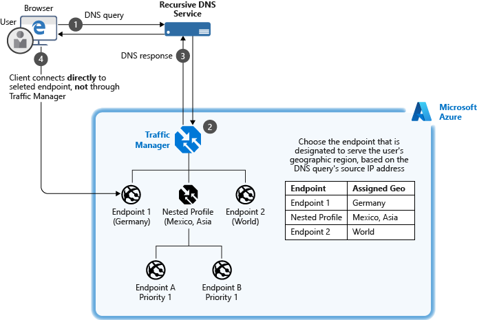
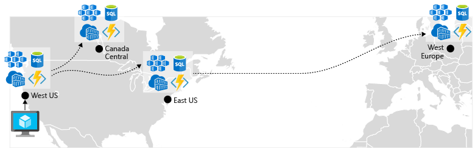
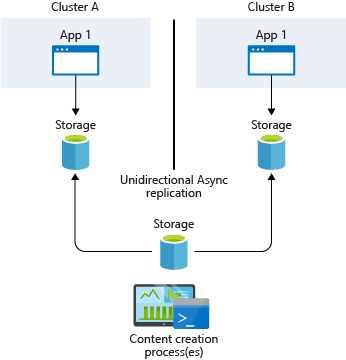
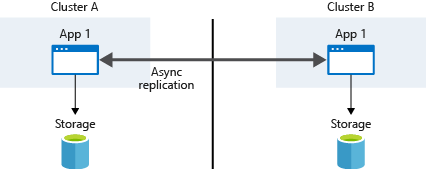

# Best practices for business continuity and disaster recovery in Azure Kubernetes Service (AKS)

As you manage clusters in Azure Kubernetes Service (AKS), application uptime becomes important. AKS provides high availability by using multiple nodes in an availability set. But these multiple nodes don’t protect your system from a region failure. To maximize your uptime, plan ahead to maintain business continuity and prepare for disaster recovery.

This article focuses on how to plan for business continuity and disaster recovery in AKS. You learn how to:

> [!div class="checklist"]
> * Plan for AKS clusters in multiple regions.
> * Route traffic across multiple clusters by using Azure Traffic Manager.
> * Use geo-replication for your container image registries.
> * Plan for application state across multiple clusters.
> * Replicate storage across multiple regions.

## Plan for multiregion deployment

**Best practice**: When you deploy multiple AKS clusters, choose regions where AKS is available, and use paired regions.

An AKS cluster is deployed into a single region. To protect your system from region failure, deploy your application into multiple AKS clusters across different regions. When you plan where to deploy your AKS cluster, consider:

* [**AKS region availability**](https://docs.microsoft.com/azure/aks/quotas-skus-regions#region-availability): Choose regions close to your users. AKS continually expands into new regions.
* [**Azure paired regions**](https://docs.microsoft.com/azure/best-practices-availability-paired-regions):
For your geographic area, choose two regions that are paired with each other. Paired regions coordinate platform updates and prioritize recovery efforts where needed.
* **Service availability**: Decide whether your paired regions should be hot/hot, hot/warm, or hot/cold. Do you want to run both regions at the same time, with one region *ready* to start serving traffic? Or do you want one region to have time to get ready to serve traffic?

AKS region availability and paired regions are a joint consideration. Deploy your AKS clusters into paired regions that are designed to manage region disaster recovery together. For example, AKS is available in East US and West US. These regions are paired. Choose these two regions when you're creating an AKS BC/DR strategy.

When you deploy your application, add another step to your CI/CD pipeline to deploy to these multiple AKS clusters. If you don't update your deployment pipelines, applications might be deployed into only one of your regions and AKS clusters. Customer traffic that's directed to a secondary region won't receive the latest code updates.

## Use Azure Traffic Manager to route traffic

**Best practice**: Azure Traffic Manager can direct customers to their closest AKS cluster and application instance. For the best performance and redundancy, direct all application traffic through Traffic Manager before it goes to your AKS cluster.

If you have multiple AKS clusters in different regions, use Traffic Manager to control how traffic flows to the applications that run in each cluster. [Azure Traffic Manager](https://docs.microsoft.com/azure/traffic-manager/) is a DNS-based traffic load balancer that can distribute network traffic across regions. Use Traffic Manager to route users based on cluster response time or based on geography.

Customers who have a single AKS cluster typically connect to the service IP or DNS name of a given application. In a multicluster deployment, customers should connect to a Traffic Manager DNS name that points to the services on each AKS cluster. Define these services by using Traffic Manager endpoints. Each endpoint is the *service load balancer IP*. Use this configuration to direct network traffic from the Traffic Manager endpoint in one region to the endpoint in a different region.

Traffic Manager performs DNS lookups and returns a user's most appropriate endpoint. Nested profiles can prioritize a primary location. For example, users should generally connect to their closest geographic region. If that region has a problem, Traffic Manager instead directs the users to a secondary region. This approach ensures that customers can connect to an application instance even if their closest geographic region is unavailable.

For information on how to set up endpoints and routing, see [Configure the geographic traffic routing method by using Traffic Manager](https://docs.microsoft.com/azure/traffic-manager/traffic-manager-configure-geographic-routing-method).

### Layer 7 application routing with Azure Front Door Service

Traffic Manager uses DNS (layer 3) to shape traffic. [Azure Front Door Service](https://docs.microsoft.com/azure/frontdoor/front-door-overview) provides an HTTP/HTTPS (layer 7) routing option. Additional features of Azure Front Door Service include SSL termination, custom domain, web application firewall, URL Rewrite, and session affinity. Review the needs of your application traffic to understand which solution is the most suitable.

### Interconnect regions with global virtual network peering

If the clusters need to talk to each other, connecting both virtual networks to each other can be achieved through [virtual network peering](https://docs.microsoft.com/azure/virtual-network/virtual-network-peering-overview). This technology interconnects virtual networks to each other providing high bandwidth across Microsoft's backbone network, even across different geographic regions.

A prerequisite to peer the virtual networks where AKS clusters are running is to use the standard Load Balancer in your AKS cluster, so that Kubernetes services are reachable across the virtual network peering.

## Enable geo-replication for container images

**Best practice**: Store your container images in Azure Container Registry and geo-replicate the registry to each AKS region.

To deploy and run your applications in AKS, you need a way to store and pull the container images. Container Registry integrates with AKS, so it can securely store your container images or Helm charts. Container Registry supports multimaster geo-replication to automatically replicate your images to Azure regions around the world. 

To improve performance and availability, use Container Registry geo-replication to create a registry in each region where you have an AKS cluster. Each AKS cluster then pulls container images from the local container registry in the same region:

When you use Container Registry geo-replication to pull images from the same region, the results are:

* **Faster**: You pull images from high-speed, low-latency network connections within the same Azure region.
* **More reliable**: If a region is unavailable, your AKS cluster pulls the images from an available container registry.
* **Cheaper**: There's no network egress charge between datacenters.

Geo-replication is a feature of *Premium* SKU container registries. For information on how to configure geo-replication, see [Container Registry geo-replication](https://docs.microsoft.com/azure/container-registry/container-registry-geo-replication).

## Remove service state from inside containers

**Best practice**: Where possible, don't store service state inside the container. Instead, use an Azure platform as a service (PaaS) that supports multiregion replication.

*Service state* refers to the in-memory or on-disk data that a service requires to function. State includes the data structures and member variables that the service reads and writes. Depending on how the service is architected, the state might also include files or other resources that are stored on the disk. For example, the state might include the files a database uses to store data and transaction logs.

State can be either externalized or colocated with the code that manipulates the state. Typically, you externalize state by using a database or other data store that runs on different machines over the network or that runs out of process on the same machine.

Containers and microservices are most resilient when the processes that run inside them don't retain state. Because applications almost always contain some state, use a PaaS solution such as Azure Database for MySQL, Azure Database for PostgreSQL, or Azure SQL Database.

To build portable applications, see the following guidelines:

* [The 12-factor app methodology](https://12factor.net/)
* [Run a web application in multiple Azure regions](https://docs.microsoft.com/azure/architecture/reference-architectures/app-service-web-app/multi-region)

## Create a storage migration plan

**Best practice**: If you use Azure Storage, prepare and test how to migrate your storage from the primary region to the backup region.

Your applications might use Azure Storage for their data. Because your applications are spread across multiple AKS clusters in different regions, you need to keep the storage synchronized. Here are two common ways to replicate storage:

* Infrastructure-based asynchronous replication
* Application-based asynchronous replication

### Infrastructure-based asynchronous replication

Your applications might require persistent storage even after a pod is deleted. In Kubernetes, you can use persistent volumes to persist data storage. Persistent volumes are mounted to a node VM and then exposed to the pods. Persistent volumes follow pods even if the pods are moved to a different node inside the same cluster.

The replication strategy you use depends on your storage solution. Common storage solutions such as [Gluster](https://docs.gluster.org/en/latest/Administrator%20Guide/Geo%20Replication/), [Ceph](https://docs.ceph.com/docs/master/cephfs/disaster-recovery/), [Rook](https://rook.io/docs/rook/v1.2/ceph-disaster-recovery.html), and [Portworx](https://docs.portworx.com/scheduler/kubernetes/going-production-with-k8s.html#disaster-recovery-with-cloudsnaps) provide their own guidance about disaster recovery and replication.

The typical strategy is to provide a common storage point where applications can write their data. This data is then replicated across regions and then accessed locally.

If you use Azure Managed Disks, you can choose replication and DR solutions such as these:

* [Velero on Azure](https://github.com/vmware-tanzu/velero-plugin-for-microsoft-azure/blob/master/README.md)
* [Azure Site Recovery](https://azure.microsoft.com/blog/asr-managed-disks-between-azure-regions/)

### Application-based asynchronous replication

Kubernetes currently provides no native implementation for application-based asynchronous replication. Because containers and Kubernetes are loosely coupled, any traditional application or language approach should work. Typically, the applications themselves replicate the storage requests, which are then written to each cluster's underlying data storage.

## Next steps

This article focuses on business continuity and disaster recovery considerations for AKS clusters. For more information about cluster operations in AKS, see these articles about best practices:

* [Multitenancy and cluster isolation][aks-best-practices-cluster-isolation]
* [Basic Kubernetes scheduler features][aks-best-practices-scheduler]

<!-- INTERNAL LINKS -->
[aks-best-practices-scheduler]: operator-best-practices-scheduler.md
[aks-best-practices-cluster-isolation]: operator-best-practices-cluster-isolation.md
