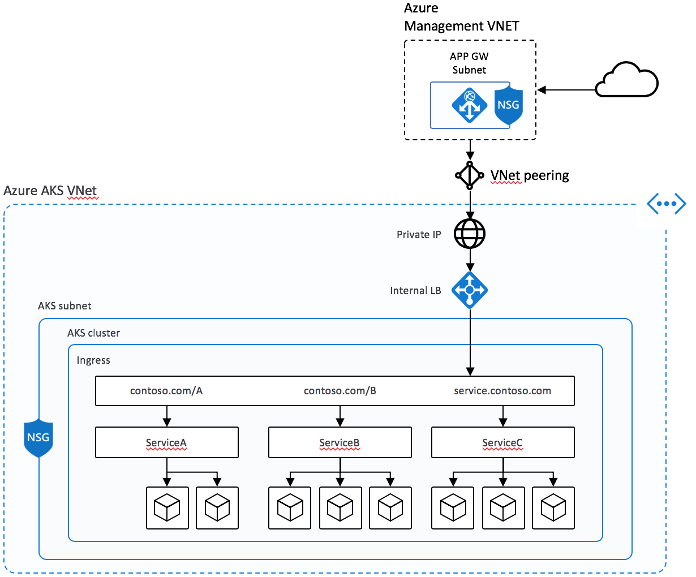
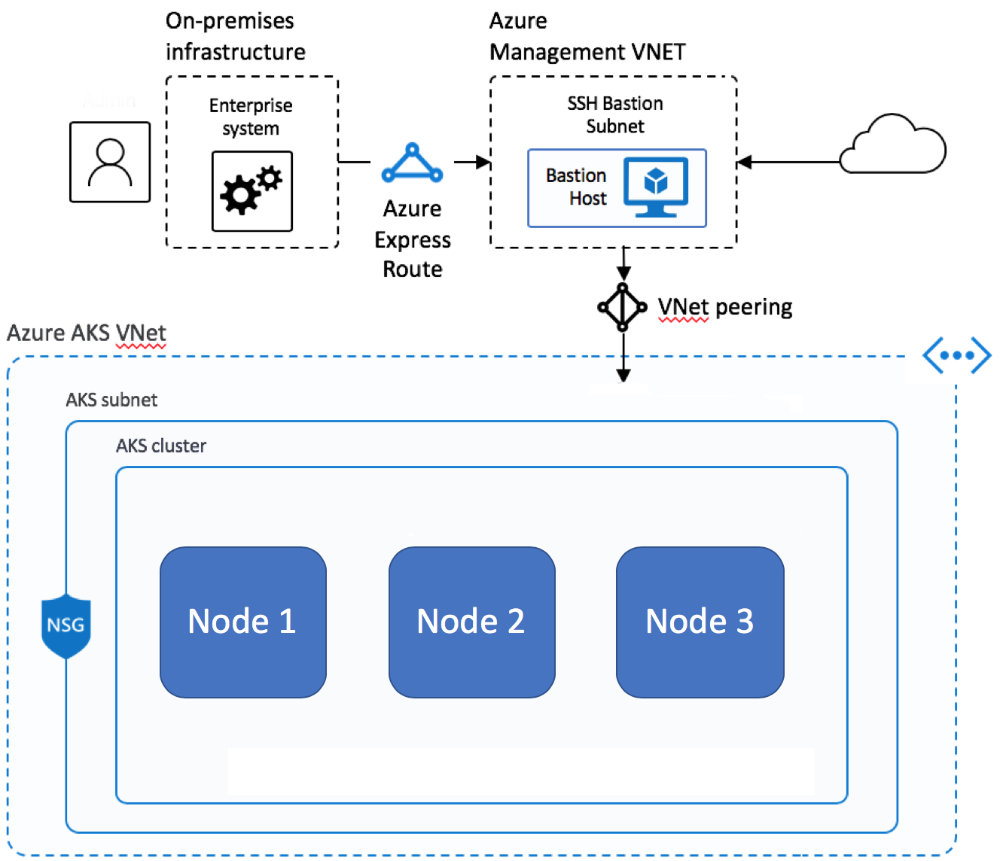

# Best practices for network connectivity and security in Azure Kubernetes Service (AKS)

As you create and manage clusters in Azure Kubernetes Service (AKS), you provide network connectivity for your nodes and applications. These network resources include IP address ranges, load balancers, and ingress controllers.

This best practices article focuses on network connectivity and security for cluster operators. In this article, you learn how to:

> [!div class="checklist"]
>
> * Compare the kubenet and Azure Container Networking Interface (CNI) network modes in AKS.
> * Plan for required IP addressing and connectivity.
> * Distribute traffic using load balancers, ingress controllers, or a web application firewall (WAF).
> * Securely connect to cluster nodes.

## Choose the appropriate network model

> **Best practice guidance**
>
> Use Azure CNI networking in AKS for integration with existing virtual networks or on-premises networks. This network model allows greater separation of resources and controls in an enterprise environment.

Virtual networks provide the basic connectivity for AKS nodes and customers to access your applications. There are two different ways to deploy AKS clusters into virtual networks:

* **Azure CNI networking**: Deploys into a virtual network and uses the [Azure CNI][cni-networking] Kubernetes plugin. Pods receive individual IPs that can route to other network services or on-premises resources.
* **Kubenet networking**: Azure manages the virtual network resources as the cluster is deployed and uses the [kubenet][kubenet] Kubernetes plugin.

Azure CNI and kubenet are both valid options for production deployments.

### CNI Networking

Azure CNI is a vendor-neutral protocol that lets the container runtime make requests to a network provider. It assigns IP addresses to pods and nodes, and provides IP address management (IPAM) features as you connect to existing Azure virtual networks. Each node and pod resource receives an IP address in the Azure virtual network. There's no need for extra routing to communicate with other resources or services.


Notably, Azure CNI networking for production allows for separation of control and management of resources. From a security perspective, you often want different teams to manage and secure those resources. With Azure CNI networking, you connect to existing Azure resources, on-premises resources, or other services directly via IP addresses assigned to each pod.

When you use Azure CNI networking, the virtual network resource is in a separate resource group to the AKS cluster. Delegate permissions for the AKS cluster identity to access and manage these resources. The cluster identity used by the AKS cluster must have at least [Network Contributor](../role-based-access-control/built-in-roles.md#network-contributor) permissions on the subnet within your virtual network.

If you wish to define a [custom role](../role-based-access-control/custom-roles.md) instead of using the built-in Network Contributor role, the following permissions are required:

* `Microsoft.Network/virtualNetworks/subnets/join/action`
* `Microsoft.Network/virtualNetworks/subnets/read`

By default, AKS uses a managed identity for its cluster identity. However, you can use a service principal instead.

* For more information about AKS service principal delegation, see [Delegate access to other Azure resources][sp-delegation].
* For more information about managed identities, see [Use managed identities](use-managed-identity.md).

As each node and pod receives its own IP address, plan out the address ranges for the AKS subnets. Keep the following criteria in mind:

* The subnet must be large enough to provide IP addresses for every node, pod, and network resource you deploy.
  * With both kubenet and Azure CNI networking, each running node has default limits to the number of pods.
* Avoid using IP address ranges that overlap with existing network resources.
  * It's necessary to allow connectivity to on-premises or peered networks in Azure.
* To handle scale out events or cluster upgrades, you need extra IP addresses available in the assigned subnet.
  * This extra address space is especially important if you use Windows Server containers, as those node pools require an upgrade to apply the latest security patches. For more information on Windows Server nodes, see [Upgrade a node pool in AKS][nodepool-upgrade].

To calculate the IP address required, see [Configure Azure CNI networking in AKS][advanced-networking].

When creating a cluster with Azure CNI networking, you specify other address ranges for the cluster, such as the Docker bridge address, DNS service IP, and service address range. In general, make sure these address ranges don't overlap each other or any networks associated with the cluster, including any virtual networks, subnets, on-premises and peered networks.

For the specific details around limits and sizing for these address ranges, see [Configure Azure CNI networking in AKS][advanced-networking].

### Kubenet networking

Although kubenet doesn't require you to configure the virtual networks before deploying the cluster, there are disadvantages to waiting, such as:

* Since nodes and pods are placed on different IP subnets, User Defined Routing (UDR) and IP forwarding routes traffic between pods and nodes. This extra routing may reduce network performance.
* Connections to existing on-premises networks or peering to other Azure virtual networks can be complex.

Since you don't create the virtual network and subnets separately from the AKS cluster, Kubenet is ideal for the following scenarios:

* Small development or test workloads.
* Simple websites with low traffic.
* Lifting and shifting workloads into containers.

For most production deployments, you should plan for and use Azure CNI networking.

You can also [configure your own IP address ranges and virtual networks using kubenet][aks-configure-kubenet-networking]. Like Azure CNI networking, these address ranges shouldn't overlap each other or any networks associated with the cluster (virtual networks, subnets, on-premises and peered networks).

For the specific details around limits and sizing for these address ranges, see [Use kubenet networking with your own IP address ranges in AKS][aks-configure-kubenet-networking].

## Distribute ingress traffic

> **Best practice guidance**
>
> To distribute HTTP or HTTPS traffic to your applications, use ingress resources and controllers. Compared to an Azure load balancer, ingress controllers provide extra features and can be managed as native Kubernetes resources.

While an Azure load balancer can distribute customer traffic to applications in your AKS cluster, it's limited in understanding that traffic. A load balancer resource works at *layer 4* and distributes traffic based on protocol or ports.

Most web applications using HTTP or HTTPS should use Kubernetes ingress resources and controllers, which work at *layer 7*. Ingress can distribute traffic based on the URL of the application and handle TLS/SSL termination. Ingress also reduces the number of IP addresses you expose and map.

With a load balancer, each application typically needs a public IP address assigned and mapped to the service in the AKS cluster. With an ingress resource, a single IP address can distribute traffic to multiple applications.


There are two components for ingress:

1. An ingress *resource*
2. An ingress *controller*

### Ingress resource

The *ingress resource* is a YAML manifest of `kind: Ingress`. It defines the host, certificates, and rules to route traffic to services running in your AKS cluster.

The following example YAML manifest distributes traffic for *myapp.com* to one of two services, *blogservice* or *storeservice*, and directs the customer to one service or the other based on the URL they access.

```yaml
apiVersion: networking.k8s.io/v1
kind: Ingress
metadata:
 name: myapp-ingress
spec:
 ingressClassName: PublicIngress
 tls:
 - hosts:
   - myapp.com
   secretName: myapp-secret
 rules:
   - host: myapp.com
     http:
      paths:
      - path: /blog
        backend:
         service
           name: blogservice
           port: 80
      - path: /store
        backend:
         service
           name: storeservice
           port: 80
```

### Ingress controller

An *ingress controller* is a daemon that runs on an AKS node and watches for incoming requests. Traffic is then distributed based on the rules defined in the ingress resource. While the most common ingress controller is based on [NGINX], AKS doesn't restrict you to a specific controller. You can use [Contour][contour], [HAProxy][haproxy], [Traefik][traefik], etc.

Ingress controllers must be scheduled on a Linux node. Indicate that the resource should run on a Linux-based node using a node selector in your YAML manifest or Helm chart deployment. For more information, see [Use node selectors to control where pods are scheduled in AKS][concepts-node-selectors].

> [!NOTE]
> Windows Server nodes shouldn't run the ingress controller.

There are many scenarios for ingress, including the following how-to guides:

* [Create a basic ingress controller with external network connectivity][aks-ingress-basic]
* [Create an ingress controller that uses an internal, private network and IP address][aks-ingress-internal]
* [Create an ingress controller that uses your own TLS certificates][aks-ingress-own-tls]
* Create an ingress controller that uses Let's Encrypt to automatically generate TLS certificates [with a dynamic public IP address][aks-ingress-tls] or [with a static public IP address][aks-ingress-static-tls]

## Secure traffic with a web application firewall (WAF)

> **Best practice guidance**
> 
> To scan incoming traffic for potential attacks, use a web application firewall (WAF) such as [Barracuda WAF for Azure][barracuda-waf] or Azure Application Gateway. These more advanced network resources can also route traffic beyond just HTTP and HTTPS connections or basic TLS termination.

Typically, an ingress controller is a Kubernetes resource in your AKS cluster that distributes traffic to services and applications. The controller runs as a daemon on an AKS node, and consumes some of the node's resources, like CPU, memory, and network bandwidth. In larger environments, you may want to consider the following:

* Offload some of this traffic routing or TLS termination to a network resource outside of the AKS cluster.
* Scan incoming traffic for potential attacks.



For that extra layer of security, a web application firewall (WAF) filters the incoming traffic. With a set of rules, the Open Web Application Security Project (OWASP) watches for attacks like cross-site scripting or cookie poisoning. [Azure Application Gateway][app-gateway] (currently in preview in AKS) is a WAF that integrates with AKS clusters, locking in these security features before the traffic reaches your AKS cluster and applications.

Since other third-party solutions also perform these functions, you can continue to use existing investments or expertise in your preferred product.

Load balancer or ingress resources continually run in your AKS cluster and refine the traffic distribution. App Gateway can be centrally managed as an ingress controller with a resource definition. To get started, [create an Application Gateway Ingress controller][app-gateway-ingress].

## Control traffic flow with network policies

> **Best practice guidance**
>
> Use network policies to allow or deny traffic to pods. By default, all traffic is allowed between pods within a cluster. For improved security, define rules that limit pod communication.

Network policy is a Kubernetes feature available in AKS that lets you control the traffic flow between pods. You allow or deny traffic to the pod based on settings such as assigned labels, namespace, or traffic port. Network policies are a cloud-native way to control the flow of traffic for pods. As pods are dynamically created in an AKS cluster, required network policies can be automatically applied.

To use network policy, enable the feature when you create a new AKS cluster. You can't enable network policy on an existing AKS cluster. Plan ahead to enable network policy on the necessary clusters.

>[!NOTE]
> Network policy should only be used for Linux-based nodes and pods in AKS.

You create a network policy as a Kubernetes resource using a YAML manifest. Policies are applied to defined pods, with ingress or egress rules defining traffic flow.

The following example applies a network policy to pods with the *app: backend* label applied to them. The ingress rule only allows traffic from pods with the *app: frontend* label.

```yaml
kind: NetworkPolicy
apiVersion: networking.k8s.io/v1
metadata:
  name: backend-policy
spec:
  podSelector:
    matchLabels:
      app: backend
  ingress:
  - from:
    - podSelector:
        matchLabels:
          app: frontend
```

To get started with policies, see [Secure traffic between pods using network policies in Azure Kubernetes Service (AKS)][use-network-policies].

## Securely connect to nodes through a bastion host

> **Best practice guidance**
>
> Don't expose remote connectivity to your AKS nodes. Create a bastion host, or jump box, in a management virtual network. Use the bastion host to securely route traffic into your AKS cluster to remote management tasks.

You can complete most operations in AKS using the Azure management tools or through the Kubernetes API server. AKS nodes are only available on a private network and aren't connected to the public internet. To connect to nodes and provide maintenance and support, route your connections through a bastion host, or jump box. Verify this host lives in a separate, securely peered management virtual network to the AKS cluster virtual network.



You should also secure the management network for the bastion host. Use an [Azure ExpressRoute][expressroute] or [VPN gateway][vpn-gateway] to connect to an on-premises network and control access using network security groups.

## Next steps

This article focused on network connectivity and security. For more information about network basics in Kubernetes, see [Network concepts for applications in Azure Kubernetes Service (AKS)][aks-concepts-network]

<!-- LINKS - External -->
[cni-networking]: https://github.com/Azure/azure-container-networking/blob/master/docs/cni.md
[kubenet]: https://kubernetes.io/docs/concepts/cluster-administration/network-plugins/#kubenet
[app-gateway-ingress]: https://github.com/Azure/application-gateway-kubernetes-ingress
[nginx]: https://www.nginx.com/products/nginx/kubernetes-ingress-controller
[contour]: https://github.com/heptio/contour
[haproxy]: https://www.haproxy.org
[traefik]: https://github.com/containous/traefik
[barracuda-waf]: https://www.barracuda.com/products/webapplicationfirewall/models/

<!-- INTERNAL LINKS -->
[aks-concepts-network]: concepts-network.md
[sp-delegation]: kubernetes-service-principal.md#delegate-access-to-other-azure-resources
[expressroute]: ../expressroute/expressroute-introduction.md
[vpn-gateway]: ../vpn-gateway/vpn-gateway-about-vpngateways.md
[aks-ingress-internal]: ingress-internal-ip.md
[aks-ingress-static-tls]: ingress-static-ip.md
[aks-ingress-basic]: ingress-basic.md
[aks-ingress-tls]: ingress-tls.md
[aks-ingress-own-tls]: ingress-own-tls.md
[app-gateway]: ../application-gateway/overview.md
[use-network-policies]: use-network-policies.md
[advanced-networking]: configure-azure-cni.md
[aks-configure-kubenet-networking]: configure-kubenet.md
[concepts-node-selectors]: concepts-clusters-workloads.md#node-selectors
[nodepool-upgrade]: manage-node-pools.md#upgrade-a-single-node-pool
