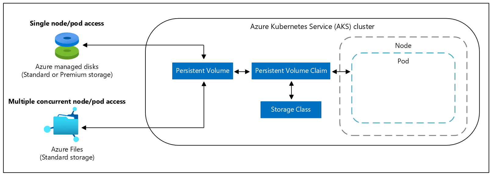

# Best practices for storage and backups in Azure Kubernetes Service (AKS)

As you create and manage clusters in Azure Kubernetes Service (AKS), your applications often need storage. Make sure you understand pod performance needs and access methods so that you can select the best storage for your application. The AKS node size may impact your storage choices. Plan for ways to back up and test the restore process for attached storage.

This best practices article focuses on storage considerations for cluster operators. In this article, you learn:

> [!div class="checklist"]
> * What types of storage are available.
> * How to correctly size AKS nodes for storage performance.
> * Differences between dynamic and static provisioning of volumes.
> * Ways to back up and secure your data volumes.

## Choose the appropriate storage type

> **Best practice guidance**
>
> Understand the needs of your application to pick the right storage. Use high performance, SSD-backed storage for production workloads. Plan for network-based storage when you need multiple concurrent connections.

Applications often require different types and speeds of storage. Determine the most appropriate storage type by asking the following questions.

* Do your applications need storage that connects to individual pods?
* Do your applications need storage shared across multiple pods? 
* Is the storage for read-only access to data?
* Will the storage be used to write large amounts of structured data? 

The following table outlines the available storage types and their capabilities:

| Use case | Volume plugin | Read/write once | Read-only many | Read/write many | Windows Server container support |
|----------|---------------|-----------------|----------------|-----------------|--------------------|
| Shared configuration       | Azure Files   | Yes | Yes | Yes | Yes |
| Structured app data        | Azure Disks   | Yes | No  | No  | Yes |
| Unstructured data, file system operations | [BlobFuse][blobfuse] | Yes | Yes | Yes | No |

AKS provides two primary types of secure storage for volumes backed by Azure Disks or Azure Files. Both use the default Azure Storage Service Encryption (SSE) that encrypts data at rest. Disks cannot be encrypted using Azure Disk Encryption at the AKS node level. With Azure Files shares, there is no limit as to how many can be mounted on a node.

Both Azure Files and Azure Disks are available in Standard and Premium performance tiers:

- *Premium* disks
    - Backed by high-performance solid-state disks (SSDs).
    - Recommended for all production workloads.
- *Standard* disks
    - Backed by regular spinning disks (HDDs).
    - Good for archival or infrequently accessed data.

While the default storage tier for the Azure Disk CSI driver is Premium SSD, your custom StorageClass can use Premium SSD, Standard SSD, or Standard HDD.

Understand the application performance needs and access patterns to choose the appropriate storage tier. For more information about Managed Disks sizes and performance tiers, see [Azure Managed Disks overview][managed-disks]. 

### Create and use storage classes to define application needs

Define the type of storage you want using Kubernetes *storage classes*. The storage class is then referenced in the pod or deployment specification. Storage class definitions work together to create the appropriate storage and connect it to pods. 

For more information, see [Storage classes in AKS][aks-concepts-storage-classes].

## Size the nodes for storage needs

> **Best practice guidance**
> 
> Each node size supports a maximum number of disks. Different node sizes also provide different amounts of local storage and network bandwidth. Plan appropriately for your application demands to deploy the right size of nodes.

AKS nodes run as various Azure VM types and sizes. Each VM size provides:
* A different amount of core resources such as CPU and memory. 
* A maximum number of disks that can be attached. 

Storage performance also varies between VM sizes for the maximum local and attached disk IOPS (input/output operations per second).

If your applications require Azure Disks as their storage solution, strategize an appropriate node VM size. Storage capabilities and CPU and memory amounts play a major role when deciding on a VM size. 

For example, while both the *Standard_B2ms* and *Standard_DS2_v2* VM sizes include a similar amount of CPU and memory resources, their potential storage performance is different:

| Node type and size | vCPU | Memory (GiB) | Max data disks | Max uncached disk IOPS | Max uncached throughput (MBps) |
|--------------------|------|--------------|----------------|------------------------|--------------------------------|
| Standard_B2ms      | 2    | 8            | 4              | 1,920                  | 22.5                           |
| Standard_DS2_v2    | 2    | 7            | 8              | 6,400                  | 96                             |

In this example, the *Standard_DS2_v2* offers twice as many attached disks, and three to four times the amount of IOPS and disk throughput. If you only compared core compute resources and compared costs, you might have chosen the *Standard_B2ms* VM size with poor storage performance and limitations. 

Work with your application development team to understand their storage capacity and performance needs. Choose the appropriate VM size for the AKS nodes to meet or exceed their performance needs. Regularly baseline applications to adjust VM size as needed.

> [!NOTE]
> By default, disk size and performance for managed disks is assigned according to the selected VM SKU and vCPU count. Default OS disk sizing is only used on new clusters or node pools when Ephemeral OS disks are not supported and a default OS disk size is not specified. For more information, see [Default OS disk sizing](cluster-configuration.md#default-os-disk-sizing).

For more information about available VM sizes, see [Sizes for Linux virtual machines in Azure][vm-sizes].

## Dynamically provision volumes

> **Best practice guidance** 
>
> To reduce management overhead and enable scaling, avoid statically create and assign persistent volumes. Use dynamic provisioning. In your storage classes, define the appropriate reclaim policy to minimize unneeded storage costs once pods are deleted.

To attach storage to pods, use persistent volumes. Persistent volumes can be created manually or dynamically. Creating persistent volumes manually adds management overhead and limits your ability to scale. Instead, provision persistent volume dynamically to simplify storage management and allow your applications to grow and scale as needed.

A persistent volume claim (PVC) lets you dynamically create storage as needed. Underlying Azure disks are created as pods request them. In the pod definition, request a volume to be created and attached to a designated mount path.

For the concepts on how to dynamically create and use volumes, see [Persistent Volumes Claims][aks-concepts-storage-pvcs].

To see these volumes in action, see how to dynamically create and use a persistent volume with [Azure Disks][dynamic-disks] or [Azure Files][dynamic-files].

As part of your storage class definitions, set the appropriate *reclaimPolicy*. This reclaimPolicy controls the behavior of the underlying Azure storage resource when the pod is deleted. The underlying storage resource can either be deleted or retained for future pod use. Set the reclaimPolicy to *retain* or *delete*. 

Understand your application needs, and implement regular checks for retained storage to minimize the amount of unused and billed storage.

For more information about storage class options, see [storage reclaim policies][reclaim-policy].

## Secure and back up your data

> **Best practice guidance** 
> 
> Back up your data using an appropriate tool for your storage type, such as Velero or Azure Backup. Verify the integrity and security of those backups.

When your applications store and consume data persisted on disks or in files, you need to take regular backups or snapshots of that data. Azure Disks can use built-in snapshot technologies. Your applications may need to flush writes-to-disk before you perform the snapshot operation. [Velero][velero] can back up persistent volumes along with additional cluster resources and configurations. If you can't [remove state from your applications][remove-state], back up the data from persistent volumes and regularly test the restore operations to verify data integrity and the processes required.

Understand the limitations of the different approaches to data backups and if you need to quiesce your data prior to snapshot. Data backups don't necessarily let you restore your application environment of cluster deployment. For more information about those scenarios, see [Best practices for business continuity and disaster recovery in AKS][best-practices-multi-region].

## Next steps

This article focused on storage best practices in AKS. For more information about storage basics in Kubernetes, see [Storage concepts for applications in AKS][aks-concepts-storage].

<!-- LINKS - External -->
[velero]: https://github.com/heptio/velero
[blobfuse]: https://github.com/Azure/azure-storage-fuse

<!-- LINKS - Internal -->
[aks-concepts-storage]: concepts-storage.md
[vm-sizes]: ../virtual-machines/sizes.md
[dynamic-disks]: azure-disk-csi.md
[dynamic-files]: azure-files-csi.md
[reclaim-policy]: concepts-storage.md#storage-classes
[aks-concepts-storage-pvcs]: concepts-storage.md#persistent-volume-claims
[aks-concepts-storage-classes]: concepts-storage.md#storage-classes
[managed-disks]: ../virtual-machines/managed-disks-overview.md
[best-practices-multi-region]: operator-best-practices-multi-region.md
[remove-state]: operator-best-practices-multi-region.md#remove-service-state-from-inside-containers
