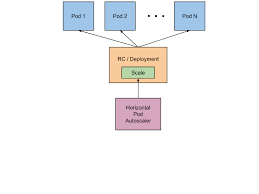

## Overview of Horizontal Pod Autoscaler

__Introduction__
One of the nicer features of Kubernetes is the ability to code and configure autoscale on your running services. Without autoscaling, it’s difficult to accomodate deployment scaling . This feature is called Horizontal Pod Autoscaler (HPA) on Kubernetes clusters.

__Why use Horizontal Pod Autoscaling__
Using HPA, you can achieve up/down autoscaling in your deployments, based on resource use and/or custom metrics, and to accomodate deployments scale to realtime load of your services.

HPA produces two direct improvements to your services:

1. Use compute and memory resources when needed, releasing them if not required.
2. Increase/decrease performance as needed to accomplish requirements.

__How HPA works__
HPA automatically scales the number of pods (defined minimum and maximum number of pods) in a replication controller, deployment or replica set, based on observed CPU/memory utilization (resource metrics). HPA is implemented as a control loop, with a period controlled by the Kubernetes controller manager ``code--horizontal-pod-autoscaler-sync-period flag`` (default value 30s).


## Before you begin

This article also requires that you are running the Azure CLI version 2.0.64 or later. Run `az --version` to find the version. If you need to install or upgrade, see [Install Azure CLI][azure-cli-install].

## Deploying Application to Kubernetes

The steps detailed in this document assume that you have created an AKS cluster and have established a `kubectl` connection with the cluster. If you need to create an AKS cluster, see the [AKS quickstart][aks-quickstart].

Before applying kubernetes yaml manifest make sure that your pods have CPU request and limits defined. 
In the azure-vote-front deployment, the front-end container already requests 0.25 CPU, with a limit of 0.5 CPU. These resource requests and limits are defined as shown in the following example snippet:

```yaml
resources:
  requests:
     cpu: 250m
  limits:
     cpu: 500m
```

If above snippet is not present in the deployment file Add this snippet in deployment file.

After adding the snippet apply kubernetes-manifest files.

The following is the output after deploying azure vote app :

```azurecli-interactive
$  kubectl get pods

NAME                                READY   STATUS    RESTARTS   AGE
azure-vote-back-5966fd4fd4-nqz7r    1/1     Running   0          42m
azure-vote-front-67fc95647d-4f7bz   1/1     Running   0          42m


$ kubectl get svc

NAME               TYPE           CLUSTER-IP     EXTERNAL-IP      PORT(S)        AGE
azure-vote-back    ClusterIP      10.0.124.184   <none>           6379/TCP       43m
azure-vote-front   LoadBalancer   10.0.70.131    52.147.216.130   80:32570/TCP   43m
```
## Create an Horizontal Pod Autoscaler manifest
Create a file named `azure-vote-hpa.yaml` and copy in the following example YAML

```yaml
apiVersion: autoscaling/v1
kind: HorizontalPodAutoscaler
metadata:
  name: azure-vote-back-hpa
spec:
  maxReplicas: 3 #define max replica count
  minReplicas: 1 #define min replica count
  scaleTargetRef:
    apiVersion: apps/v1
    kind: Deployment
    name: azure-vote-back
  targetCPUUtilizationPercentage: 80 #target utilization as applicable

---
apiVersion: autoscaling/v1
kind: HorizontalPodAutoscaler
metadata:
  name: azure-vote-front-hpa
spec:
  maxReplicas: 3 #define max replica count
  minReplicas: 1 #define min replica count
  scaleTargetRef:
    apiVersion: apps/v1
    kind: Deployment
    name: azure-vote-front
  targetCPUUtilizationPercentage: 80 #target utilization as applicable

```
Deploy the application using the [kubectl apply][kubectl-apply] command and specify the name of your YAML manifest:

```azurecli-interactive
kubectl apply -f azure-vote-hpa.yaml
```
The following example output shows the hpa created successfully:

```output
horizontalpodautoscaler.autoscaling/azure-vote-back-hpa created
horizontalpodautoscaler.autoscaling/azure-vote-front-hpa created
```

After Deploying the check the HPA Status:

```azurecli-interactive
kubectl get hpa --watch
NAME                   REFERENCE                     TARGETS         MINPODS   MAXPODS   REPLICAS   AGE
azure-vote-back-hpa    Deployment/azure-vote-back    <unknown>/80%   1         3         0          7s
azure-vote-front-hpa   Deployment/azure-vote-front   <unknown>/80%   1         3         0          7s

azure-vote-back-hpa    Deployment/azure-vote-back    2%/80%    1         3         1          17s
azure-vote-front-hpa   Deployment/azure-vote-front   1%/80%    1         3         1          17s
```
Now HPA is up and running.Test by giving some load on the services which are Created.

## Conclusion
We’ve seen how Kubernetes HPA can be used for autoscaling your deployments up and down. It’s a very nice and useful feature to accomodate deployments scale to real service load and to accomplish services.

We’ve also seen how *horizontal-pod-autoscaler-downscale-delay* (5m by default) and *horizontal-pod-autoscaler-upscale-delay* (3m by default) could be parametrized at kube-controller to adjust the up and down scale reaction.

<!-- LINKS - external -->
[kubectl-apply]: https://kubernetes.io/docs/reference/generated/kubectl/kubectl-commands#apply
[hpa-overview]: https://kubernetes.io/docs/tasks/run-application/horizontal-pod-autoscale/

<!-- LINKS - internal -->
[aks-quickstart]: ./kubernetes-walkthrough.md
[install-azure-cli]: /cli/azure/install-azure-cli