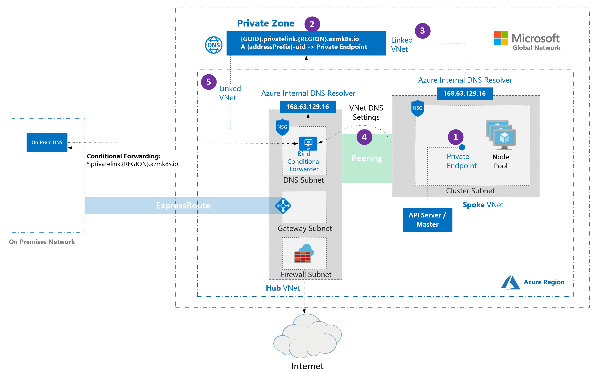

# Create a private Azure Kubernetes Service (AKS) cluster

In a private cluster, the control plane or API server has internal IP addresses that are defined in the [RFC1918 - Address Allocation for Private Internet][rfc1918-document] document. By using a private cluster, you can ensure network traffic between your API server and your node pools remains on the private network only.

The control plane or API server is in an Azure Kubernetes Service (AKS)-managed Azure resource group. Your cluster or node pool is in your resource group. The server and the cluster or node pool can communicate with each other through the [Azure Private Link service][private-link-service] in the API server virtual network and a private endpoint that's exposed on the subnet of your AKS cluster.

When you provision a private AKS cluster, AKS by default creates a private FQDN with a private DNS zone and an additional public FQDN with a corresponding A record in Azure public DNS. The agent nodes continue to use the A record in the private DNS zone to resolve the private IP address of the private endpoint for communication to the API server.

The purpose of this article is to help you deploy a private link-based AKS cluster. If you're interested in creating an AKS cluster without required private link or tunnel, see [create an Azure Kubernetes Service cluster with API Server VNet Integration][create-aks-cluster-api-vnet-integration] (preview).

## Region availability

Private cluster is available in public regions, Azure Government, and Microsoft Azure operated by 21Vianet regions where [AKS is supported][aks-supported-regions].

## Prerequisites

* The Azure CLI version 2.28.0 and higher. Run `az --version` to find the version, and run `az upgrade` to upgrade the version. If you need to install or upgrade, see [Install Azure CLI][install-azure-cli].
* The `aks-preview` extension 0.5.29 or higher.
* If using Azure Resource Manager (ARM) or the Azure REST API, the AKS API version must be 2021-05-01 or higher.
* Azure Private Link service is supported on Standard Azure Load Balancer only. Basic Azure Load Balancer isn't supported.  
* To use a custom DNS server, add the Azure public IP address 168.63.129.16 as the upstream DNS server in the custom DNS server, and make sure to add this public IP address as the *first* DNS server. For more information about the Azure IP address, see [What is IP address 168.63.129.16?][virtual-networks-168.63.129.16]
  * The cluster's DNS zone should be what you forward to 168.63.129.16. You can find more information on zone names in [Azure services DNS zone configuration][az-dns-zone].

## Limitations

* IP authorized ranges can't be applied to the private API server endpoint, they only apply to the public API server
* [Azure Private Link service limitations][private-link-service] apply to private clusters.
* There's no support for Azure DevOps Microsoft-hosted Agents with private clusters. Consider using [Self-hosted Agents](/azure/devops/pipelines/agents/agents).
* If you need to enable Azure Container Registry to work with a private AKS cluster, [set up a private link for the container registry in the cluster virtual network][container-registry-private-link] or set up peering between the Container Registry virtual network and the private cluster's virtual network.
* There's no support for converting existing AKS clusters into private clusters.
* Deleting or modifying the private endpoint in the customer subnet will cause the cluster to stop functioning.

## Create a private AKS cluster

### Create a resource group

Create a resource group using the [`az group create`][az-group-create] command. You can also use an existing resource group for your AKS cluster.

```azurecli-interactive
az group create -l eastus -n myResourceGroup
```

### Default basic networking

Create a private cluster with default basic networking using the [`az aks create`][az-aks-create] command with the `--enable-private-cluster` flag.

```azurecli-interactive
az aks create -n <private-cluster-name> -g <private-cluster-resource-group> --load-balancer-sku standard --enable-private-cluster  
```

### Advanced networking  

Create a private cluster with advanced networking using the [`az aks create`][az-aks-create] command with the following flags:

```azurecli-interactive
az aks create \
    --resource-group <private-cluster-resource-group> \
    --name <private-cluster-name> \
    --load-balancer-sku standard \
    --enable-private-cluster \
    --network-plugin azure \
    --vnet-subnet-id <subnet-id> \
    --docker-bridge-address 172.17.0.1/16 \
    --dns-service-ip 10.2.0.10 \
    --service-cidr 10.2.0.0/24 
```

> [!NOTE]
> If the Docker bridge address CIDR *172.17.0.1/16* clashes with the subnet CIDR, change the Docker bridge address.

## Use custom domains

If you want to configure custom domains that can only be resolved internally, see [Use custom domains][use-custom-domains].

## Disable a public FQDN

### Disable a public FQDN on a new AKS cluster

Disable a public FQDN when creating a private AKS cluster using the `--disable-public-fqdn` flag.

```azurecli-interactive
az aks create -n <private-cluster-name> -g <private-cluster-resource-group> --load-balancer-sku standard --enable-private-cluster --enable-managed-identity --assign-identity <resourceID> --private-dns-zone <private-dns-zone-mode> --disable-public-fqdn
```

### Disable a public FQDN on an existing cluster

Disable a public FQDN on an existing AKS cluster using the [`az aks update`][az-aks-update] command with the `--disable-public-fqdn` flag.

```azurecli-interactive
az aks update -n <private-cluster-name> -g <private-cluster-resource-group> --disable-public-fqdn
```

## Configure a private DNS zone

You can configure private DNS zones using the following parameters:

* **system**: This is the default value. If the `--private-dns-zone` argument is omitted, AKS creates a private DNS zone in the node resource group.
* **none**: The default is public DNS. AKS won't create a private DNS zone.
* **CUSTOM_PRIVATE_DNS_ZONE_RESOURCE_ID**: This requires you to create a private DNS zone in the following format for Azure global cloud: `privatelink.<region>.azmk8s.io` or `<subzone>.privatelink.<region>.azmk8s.io`. You'll need the resource ID of the private DNS zone for future use. You also need a user-assigned identity or service principal with the [Private DNS Zone Contributor][private-dns-zone-contributor-role] and [Network Contributor][network-contributor-role] roles. When deploying using API server VNet integration, a private DNS zone supports the naming format of `private.<region>.azmk8s.io` or `<subzone>.private.<region>.azmk8s.io`.
  * If the private DNS zone is in a different subscription than the AKS cluster, you need to register the Azure provider **Microsoft.ContainerServices** in both subscriptions.
  * "fqdn-subdomain" can be utilized with "CUSTOM_PRIVATE_DNS_ZONE_RESOURCE_ID" only to provide subdomain capabilities to `privatelink.<region>.azmk8s.io`.
  * If your AKS cluster is configured with an Active Directory service principal, AKS doesn't support using a system-assigned managed identity with custom private DNS zone.
  * If you are specifying a `<subzone>` there is a 32 character limit for the `<subzone>` name.

>[!NOTE]
>**CUSTOM_PRIVATE_DNS_ZONE_RESOURCE_ID** can be configured using an ARM Template in addition to the Azure CLI. `privateDNSZone` accepts the private DNZ zone resourceID as shown in the following example:
>
>```json
>properties.apiServerAccessProfile.privateDNSZone.
>"apiServerAccessProfile": {
>"enablePrivateCluster": true,
>"privateDNSZone": "system|none|[resourceId(..., 'Microsoft.Network/privateDnsZones', 'privatelink.<region>.azmk8s.io']"
>}
>```

  > [!IMPORTANT]
  > The **CUSTOM_PRIVATE_DNS_ZONE_RESOURCE_ID** cannot be changed after the cluster has been created and it can't be deleted. Otherwise, the cluster will have issues performing upgrade operations.

### Create a private AKS cluster with a private DNS zone

Create a private AKS cluster with a private DNS zone using the [`az aks create`][az-aks-create] command with the following flags:

```azurecli-interactive
az aks create -n <private-cluster-name> -g <private-cluster-resource-group> --load-balancer-sku standard --enable-private-cluster --enable-managed-identity --assign-identity <resourceID> --private-dns-zone [system|none]
```

### Create a private AKS cluster with a custom private DNS zone or private DNS subzone

Create a private AKS cluster with a custom private DNS zone or subzone using the [`az aks create`][az-aks-create] command with the following flags:

```azurecli-interactive
# The custom private DNS zone name should be in the following format: "<subzone>.privatelink.<region>.azmk8s.io"

az aks create -n <private-cluster-name> -g <private-cluster-resource-group> --load-balancer-sku standard --enable-private-cluster --enable-managed-identity --assign-identity <resourceID> --private-dns-zone <custom private dns zone or custom private dns subzone resourceID>
```

### Create a private AKS cluster with a custom private DNS zone and custom subdomain

Create a private AKS cluster with a custom private DNS zone and subdomain using the [`az aks create`][az-aks-create] command with the following flags:

```azurecli-interactive
# The custom private DNS zone name should be in one of the following formats: "privatelink.<region>.azmk8s.io" or "<subzone>.privatelink.<region>.azmk8s.io"

az aks create -n <private-cluster-name> -g <private-cluster-resource-group> --load-balancer-sku standard --enable-private-cluster --enable-managed-identity --assign-identity <resourceID> --private-dns-zone <custom private dns zone resourceID> --fqdn-subdomain <subdomain>
```

### Update a private cluster from a private DNS zone to public

> [!NOTE]
> This feature requires the `aks-preview` extension version >= 0.5.97

Update a private cluster from `byo` or `system` to `none` using the [`az aks update`][az-aks-update] command with the following flags:

```azurecli-interactive
az aks update -n <private-cluster-name> -g <private-cluster-resource-group> --private-dns-zone none
```

> [!NOTE]
> You can only update from `byo` or `system` to `none`. No other combination of update values is supported.

## Options for connecting to the private cluster

The API server endpoint has no public IP address. To manage the API server, you'll need to use a VM that has access to the AKS cluster's Azure Virtual Network (VNet). There are several options for establishing network connectivity to the private cluster:

* Create a VM in the same VNet as the AKS cluster using the [`az vm create`][az-vm-create] command with the `--vnet-name` flag.
* Use a VM in a separate network and set up [virtual network peering][virtual-network-peering].
* Use an [Express Route or VPN][express-route-or-VPN] connection.
* Use the [AKS `command invoke` feature][command-invoke].
* Use a [private endpoint][private-endpoint-service] connection.

> [!NOTE]
> Creating a VM in the same VNet as the AKS cluster is the easiest option. Express Route and VPNs add costs and require additional networking complexity. Virtual network peering requires you to plan your network CIDR ranges to ensure there are no overlapping ranges.

## Virtual network peering

Virtual network peering is one way to access your private cluster. To use virtual network peering, you need to set up a link between the virtual network and the private DNS zone.

### [Azure portal](#tab/azure-portal)

1. From your browser, go to the [Azure portal](https://portal.azure.com).
1. From the Azure portal, go to the node resource group.  
1. Select the private DNS zone.
1. In the left pane, select **Virtual network**.  
1. Create a new link to add the virtual network of the VM to the private DNS zone. It takes a few minutes for the DNS zone link to become available.  
1. In the Azure portal, navigate to the resource group that contains your cluster's virtual network.  
1. In the right pane, select the virtual network. The virtual network name is in the form *aks-vnet-\**.  
1. In the left pane, select **Peerings**.  
1. Select **Add**, add the virtual network of the VM, and then create the peering. For more information, see  [Virtual network peering][virtual-network-peering].

### [Azure CLI](#tab/azure-cli)

1. Create a new link to add the virtual network of the VM to the private DNS zone using the [`az network private-dns link vnet create`][az-network-private-dns-link-vnet-create] command.

    ```azurecli-interactive
    az network private-dns link vnet create --name <new-link-name> --resource-group <node-resource-group-name> --zone-name <private-dns-zone-name> --virtual-network <vm-virtual-network-resource-id> --registration-enabled false
    ```

2. Create a peering between the virtual network of the VM and the virtual network of the node resource group using the [`az network vnet peering create`][az-network-vnet-peering-create] command.

    ```azurecli-interactive
    az network vnet peering create --name <new-peering-name-1> --resource-group <vm-virtual-network-resource-group-name> --vnet-name <vm-virtual-network-name> --remote-vnet <node-resource-group-virtual-network-resource-id> --allow-vnet-access
    ```

3. Create a second peering between the virtual network of the node resource group and the virtual network of the VM using the [`az network vnet peering create`][az-network-vnet-peering-create] command.

    ```azurecli-interactive
    az network vnet peering create --name <new-peering-name-2> --resource-group <node-resource-group-name> --vnet-name <node-resource-group-virtual-network-name> --remote-vnet <vm-virtual-network-resource-id> --allow-vnet-access
    ```

4. List the virtual network peerings you created using the [`az network vnet peering list`][az-network-vnet-peering-list] command.

    ```azurecli-interactive
    az network vnet peering list --resource-group <node-resource-group-name> --vnet-name <private-dns-zone-name>
    ```

---

## Hub and spoke with custom DNS

[Hub and spoke architectures](/azure/architecture/reference-architectures/hybrid-networking/hub-spoke) are commonly used to deploy networks in Azure. In many of these deployments, DNS settings in the spoke VNets are configured to reference a central DNS forwarder to allow for on-premises and Azure-based DNS resolution. When deploying an AKS cluster into such a networking environment, there are some special considerations:



* When a private cluster is provisioned, a private endpoint (1) and a private DNS zone (2) are created in the cluster-managed resource group by default. The cluster uses an `A` record in the private zone to resolve the IP of the private endpoint for communication to the API server.
* The private DNS zone is linked only to the VNet that the cluster nodes are attached to (3). This means that the private endpoint can only be resolved by hosts in that linked VNet. In scenarios where no custom DNS is configured on the VNet (default), this works without issue as hosts point at *168.63.129.16* for DNS that can resolve records in the private DNS zone because of the link.
* In scenarios where the VNet containing your cluster has custom DNS settings (4), cluster deployment fails unless the private DNS zone is linked to the VNet that contains the custom DNS resolvers (5). This link can be created manually after the private zone is created during cluster provisioning or via automation upon detection of creation of the zone using event-based deployment mechanisms (for example, Azure Event Grid and Azure Functions). To avoid cluster failure during initial deployment, the cluster can be deployed with the private DNS zone resource ID. This only works with resource type `Microsoft.ContainerService/managedCluster` and API version `2022-07-01`. Using an older version with an ARM template or Bicep resource definition isn't supported.

> [!NOTE]
> Conditional Forwarding doesn't support subdomains.

> [!NOTE]
> If you're using [bring your own route table with kubenet](./configure-kubenet.md#bring-your-own-subnet-and-route-table-with-kubenet) and bring your own DNS with private clusters, the cluster creation will fail. You need to associate the [`RouteTable`](./configure-kubenet.md#bring-your-own-subnet-and-route-table-with-kubenet) in the node resource group to the subnet after the cluster creation failed to make the creation successful.

## Use a private endpoint connection

A private endpoint can be set up so that a VNet doesn't need to be peered to communicate with the private cluster. To use a private endpoint, create a new private endpoint in your virtual network and then create a link between your virtual network and a new private DNS zone.

> [!IMPORTANT]
> If the virtual network is configured with custom DNS servers, private DNS will need to be set up appropriately for the environment. See the [virtual networks name resolution documentation][virtual-networks-name-resolution] for more details.

### Create a private endpoint resource

Create a private endpoint resource in your VNet:

1. From your browser, go to the [Azure portal](https://portal.azure.com).
2. From the Azure portal menu, select **Create a resource**.
3. Search for **Private Endpoint** and select **Create > Private Endpoint**.
4. Select **Create**.
5. On the **Basics** tab, set up the following options:
   * **Project details**:
     * Select an Azure **Subscription**.
     * Select the Azure **Resource group** where your virtual network is located.
   * **Instance details**:
     * Enter a **Name** for the private endpoint, such as *myPrivateEndpoint*.
     * Select a **Region** for the private endpoint.
  
  > [!IMPORTANT]
  > Check that the region selected is the same as the virtual network where you want to connect from, otherwise you won't see your virtual network in the **Configuration** tab.

6. Select **Next: Resource** and set up the following options:
   * **Connection method**: Select *Connect to an Azure resource in my directory.*
   * **Subscription**: Select the subscription where your private cluster is located.
   * **Resource type**: Select *Microsoft.ContainerService/managedClusters*.
   * **Resource**: Select your private cluster.
   * **Target sub-resource**: Select *management*.
7. Select **Next: Virtual Network** and set up the following options:
   * **Networking**:
     * **Virtual network**: Select your virtual network.
     * **Subnet**: Select your subnet.
8. Select **Next: DNS** > **Next: Tags** and (optionally) set up key-values as needed.
9. Select **Next: Review + create** > **Create**.

Once the resource is created, record the private IP address of the private endpoint for future use.

### Create a private DNS zone

Once the private endpoint is created, create a new private DNS zone with the same name as the private DNS zone created by the private cluster:

1. Go to the node resource group in the Azure portal.  
2. Select the private DNS zone and record:
   * The name of the private DNS zone, which follows the pattern `*.privatelink.<region>.azmk8s.io`.
   * The name of the `A` record (excluding the private DNS name).
   * The time-to-live (TTL).
3. From the Azure portal, select **Create a resource**.
4. Search for **Private DNS zone** and select **Create > Private DNS zone**.
5. On the **Basics** tab, set up the following options:
   * **Project details**:
     * Select your **Subscription**.
     * Select the **Resource group** where you created the private endpoint.
   * **Instance details**:
     * Enter the **Name** of the DNS zone retrieved from previous steps.
     * **Region** defaults to the location of your resource group.
6. Select **Review + create** > **Create**.

### Create an `A` record

Once the private DNS zone is created, create an `A` record, which associates the private endpoint to the private cluster:

1. Go to the private DNS zone you created in previous steps.
2. On the **Overview** page, select **Record set**.
3. On the **Add record set** tab, set up the following options:
   * **Name**: Input the name retrieved from the `A` record in the private cluster's DNS zone.
   * **Type**: Select *A - Address record*.
   * **TTL**: Enter the number from the `A` record in the private cluster's DNS zone.
   * **TTL unit**: Change the dropdown value to match the one in the `A` record from the private cluster's DNS zone.
   * **IP address**: Enter the IP address of the private endpoint you created.

> [!IMPORTANT]
> When creating the `A` record, only use the name and not the fully qualified domain name (FQDN).

### Link the private DNS zone to the virtual network

Once the `A` record is created, link the private DNS zone to the virtual network that will access the private cluster:

1. Go to the private DNS zone you created in previous steps.  
2. From the left pane, select **Virtual network links**.  
3. Select **Add** and set up the following options:
   * **Link name**: Enter a name for your virtual network link.
   * **Subscription**: Select the subscription where your private cluster is located.
   * **Virtual network**: Select the virtual network of your private cluster.
4. Select **OK** to create the link.

It may take a few minutes for the operation to complete. Once the virtual network link is created, you can access it from the **Virtual network links** tab you used in step 2.

> [!WARNING]
> If the private cluster is stopped and restarted, the private cluster's original private link service is removed and recreated, which breaks the connection between your private endpoint and the private cluster. To resolve this issue, delete and recreate any user-created private endpoints linked to the private cluster. If the recreated private endpoints have new IP addresses, you'll also need to update DNS records.

## Next steps

For associated best practices, see [Best practices for network connectivity and security in AKS][operator-best-practices-network].

<!-- LINKS - external -->
[rfc1918-document]: https://tools.ietf.org/html/rfc1918
[aks-supported-regions]: https://azure.microsoft.com/global-infrastructure/services/?products=kubernetes-service

<!-- LINKS - internal -->
[private-link-service]: ../private-link/private-link-service-overview.md#limitations
[private-endpoint-service]: ../private-link/private-endpoint-overview.md
[virtual-network-peering]: ../virtual-network/virtual-network-peering-overview.md
[express-route-or-vpn]: ../expressroute/expressroute-about-virtual-network-gateways.md
[command-invoke]: ./access-private-cluster.md
[container-registry-private-link]: ../container-registry/container-registry-private-link.md
[virtual-networks-name-resolution]: ../virtual-network/virtual-networks-name-resolution-for-vms-and-role-instances.md#name-resolution-that-uses-your-own-dns-server
[virtual-networks-168.63.129.16]: ../virtual-network/what-is-ip-address-168-63-129-16.md
[use-custom-domains]: coredns-custom.md#use-custom-domains
[create-aks-cluster-api-vnet-integration]: api-server-vnet-integration.md
[operator-best-practices-network]: operator-best-practices-network.md
[install-azure-cli]: /cli/azure/install-azure-cli
[private-dns-zone-contributor-role]: ../role-based-access-control/built-in-roles.md#dns-zone-contributor
[network-contributor-role]: ../role-based-access-control/built-in-roles.md#network-contributor
[az-vm-create]: /cli/azure/vm#az-vm-create
[az-group-create]: /cli/azure/group#az_group_create
[az-aks-create]: /cli/azure/aks#az_aks_create
[az-aks-update]: /cli/azure/aks#az_aks_update
[az-dns-zone]: ../private-link/private-endpoint-dns.md#azure-services-dns-zone-configuration
[az-network-private-dns-link-vnet-create]: /cli/azure/network/private-dns/link/vnet#az_network_private_dns_link_vnet_create
[az-network-vnet-peering-create]: /cli/azure/network/vnet/peering#az_network_vnet_peering_create
[az-network-vnet-peering-list]: /cli/azure/network/vnet/peering#az_network_vnet_peering_list
