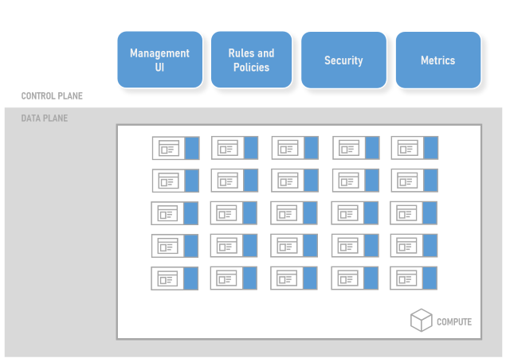

# About service meshes

A service mesh provides capabilities like traffic management, resiliency, policy, security, strong identity, and observability to your workloads. Your application is decoupled from these operational capabilities and the service mesh moves them out of the application layer, and down to the infrastructure layer.

## Scenarios

These are some of the scenarios that can be enabled for your workloads when you use a service mesh:

- **Encrypt all traffic in cluster** - Enable mutual TLS between specified services in the cluster. This can be extended to ingress and egress at the network perimeter. Provides a secure by default option with no changes needed for application code and infrastructure.

- **Canary and phased rollouts** - Specify conditions for a subset of traffic to be routed to a set of new services in the cluster. On successful test of canary release, remove conditional routing and phase gradually increasing % of all traffic to new service. Eventually all traffic will be directed to new service.

- **Traffic management and manipulation** - Create a policy on a service that will rate limit all traffic to a version of a service from a specific origin. Or a policy that applies a retry strategy to  classes of failures between specified services. Mirror live traffic to new versions of services during a migration or to debug issues. Inject faults between services in a test environment to test resiliency.

- **Observability** - Gain insight into how your services are connected the traffic that flows between them. Obtain metrics, logs, and traces for all traffic in cluster, and ingress/egress. Add distributed tracing abilities to your applications.

## Architecture

A service mesh is typically composed of a control plane and the data plane.

The **control plane** has a number of components that support managing the service mesh. This will typically include a management interface which could be a UI or an API. There will also typically be components that manage the rule and policy definitions that define how the service mesh should implement specific capabilities. There are also components that manage aspects of security like strong identity and certificates for mTLS. Service meshes will also typically have a metrics or observability component that collects and aggregates metrics and telemetry from the workloads.

The **data plane** typically consists of a proxy that is transparently injected as a sidecar to your workloads. This proxy is configured to control all network traffic in and out of the pod containing your workload. This allows the proxy to be configured to secure traffic via mTLS, dynamically route traffic, apply policies to traffic and to collect metrics and tracing information. 

## Capabilities

Each of the service meshes have a natural fit and focus on supporting specific scenarios, but you'll typically find that most will implement a number of, if not all, of the following capabilities.

### Traffic management 

- **Protocol** – layer 7 (http, grpc)
- **Dynamic Routing** – conditional, weighting, mirroring
- **Resiliency** – timeouts, retries, circuit breakers
- **Policy** – access control, rate limits, quotas
- **Testing** - fault injection

### Security

- **Encryption** – mTLS, certificate management, external CA
- **Strong Identity** – SPIFFE or similar
- **Auth** – authentication, authorisation

### Observability

- **Metrics** – golden metrics, prometheus, grafana
- **Tracing** - traces across workloads
- **Traffic** – cluster, ingress/egress

### Mesh

- **Supported Compute** - Kubernetes, virtual machines
- **Multi-cluster** - gateways, federation

## Selection criteria

Before you select a service mesh, ensure that you understand your requirements and the reasons for installing a service mesh. Try asking the following questions.

- **Is an Ingress Controller sufficient for my needs?** - Sometimes having a capability like a/b testing or traffic splitting at the ingress is sufficient to support the required scenario. Don't add complexity to your environment with no upside.

- **Can my workloads and environment tolerate the additional overheads?** - All the additional components required to support the service mesh require additional resources like cpu and memory. In addition, all the proxies and their associated policy checks add latency to your traffic. If you have workloads that are very sensitive to latency or cannot provide the additional resources to cover the service mesh components, then re-consider.

- **Is this adding additional complexity unnecessarily?** - If the reason for installing a service mesh is to gain a capability that is not necessarily critical to the business or operational teams, then consider whether the additional complexity of installation, maintenance, and configuration is worth it.

- **Can this be adopted in an incremental approach?** - Some of the service meshes that provide a lot of capabilities can be adopted in a more incremental approach. Install just the components you need to ensure your success. Once you are more confident and additional capabilities are required, then explore those. Resist the urge to install *everything* from the start.

If, after careful consideration, you decide that you need a service mesh to provide the capabilities required, then your next decision is *which service mesh?*

Consider the following areas and which of them are most aligned with your requirements. This will guide you towards the best fit for your environment and workloads. The [Next steps](#next-steps) section will take you to further detailed information about specific service meshes and how they map to these areas.

- **Technical** - traffic management, policy, security, observability

- **Business** - commercial support, foundation (CNCF), OSS license, governance

- **Operational** – installation/upgrades, resource requirements, performance requirements, integrations (metrics, telemetry, dashboards, tools, SMI), mixed workloads (Linux and Windows node pools), compute (Kubernetes, virtual machines), multi-cluster

- **Security** - auth, identity, certificate management and rotation, pluggable external CA

## Next steps

The following documentation provides more information about service meshes that you can try out on Azure Kubernetes Service (AKS):

> [!div class="nextstepaction"]
> [Learn more about Istio ...][istio-about]

> [!div class="nextstepaction"]
> [Learn more about Linkerd ...][linkerd-about]

> [!div class="nextstepaction"]
> [Learn more about Consul ...][consul-about]

You may also want to explore Service Mesh Interface (SMI), a standard interface for service meshes on Kubernetes:

- [Service Mesh Interface (SMI)][smi]

<!-- LINKS - external -->
[smi]: https://smi-spec.io/

<!-- LINKS - internal -->
[istio-about]: ./servicemesh-istio-about.md
[linkerd-about]: ./servicemesh-linkerd-about.md
[consul-about]: ./servicemesh-consul-about.md