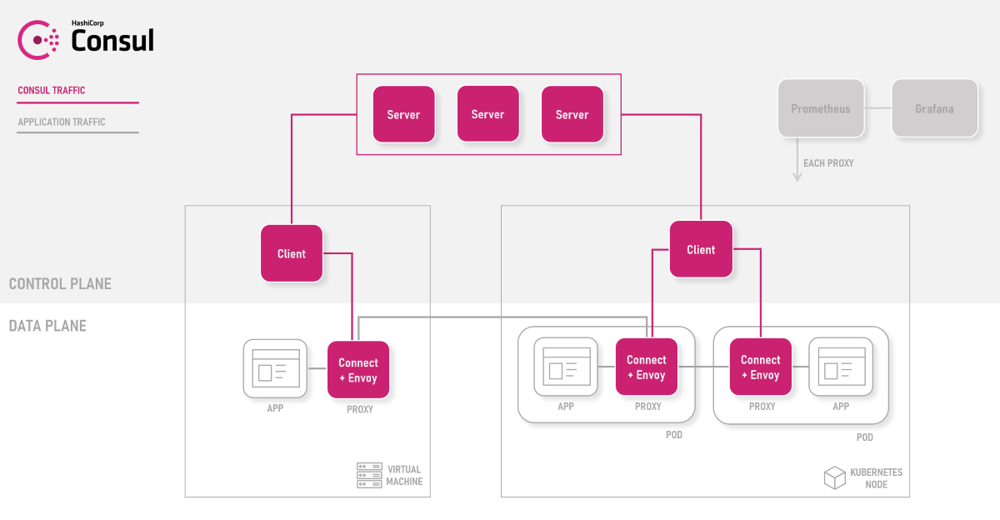

# Consul

## Overview

[Consul][consul] is a multi data centre aware service networking solution to connect and secure services across runtime platforms. [Connect][consul-features] is the component that provides service mesh capabilities.

## Architecture

Consul provides a data plane that is composed of [Envoy][envoy-proxy]-based [sidecars][consul-sidecar] by default. Consul has a pluggable proxy architecture. These intelligent proxies control all network traffic in and out of your meshed apps and workloads.

The control plane manages the configuration, and policy via the following [components][consul-architecture]:

- **Server** - A Consul Agent running in Server mode that maintains Consul cluster state.

- **Client** - A Consul Agent running in lightweight Client Mode. Each compute node must have a Client agent running. This client brokers configuration and policy between the workloads and the Consul configuration. 

The following architecture diagram demonstrates how the various components within the data plane and control plane interact.

## Selection criteria

It's important to understand and consider the following areas when evaluating Consul for your workloads:

- [Consul Principles](#consul-principles)
- [Capabilities](#capabilities)
- [Scenarios](#scenarios)

### Consul principles

The following principles [guide][consul-principles] the Consul project:

- **API-Driven** - Codify all configuration and policy.

- **Run and Connect Anywhere** - Connect workloads across runtime platforms (Kubernetes, VMs, Serverless).

- **Extend and Integrate** - Securely connect workloads across infrastructure.

### Capabilities

Consul provides the following set of capabilities:

- **Mesh** – gateway (multi data centre), virtual machines (out of cluster nodes), service sync, built in debugging option

- **Proxies** – Envoy, built-in proxy, pluggable, l4 proxy available for Windows workloads

- **Traffic Management** – routing, splitting, resolution

- **Policy** – intentions, ACLs

- **Security** – authorisation, authentication, encryption, SPIFFE-based identities, external CA (Vault), certificate management, and rotation

- **Observability** – metrics, ui dashboard, prometheus, grafana

### Scenarios

Consul is well suited to and suggested for the following scenarios:

- Extending existing Consul connected workloads

- Compliance requirements around certificate management

- Multi cluster service mesh

- VM-based workloads to be included in the service mesh

## Next steps

The following documentation describes how you can install Consul on Azure Kubernetes Service (AKS):

> [!div class="nextstepaction"]
> [Install Consul in Azure Kubernetes Service (AKS)][consul-install]

You can also further explore Consul features and architecture:

- [Consul Getting Started Tutorials][consul-getting-started]
- [Consul Features][consul-features]
- [Consul Architecture][consul-architecture]
- [Consul - How Connect Works][consul-how-connect-works]

<!-- LINKS - external -->
[consul]: https://www.consul.io/mesh.html
[consul-features]: https://www.consul.io/docs/connect/index.html
[consul-architecture]: https://www.consul.io/docs/internals/architecture.html
[consul-sidecar]: https://www.consul.io/docs/connect/proxies.html
[consul-how-connect-works]: https://www.consul.io/docs/connect/connect-internals.html
[consul-principles]: https://www.consul.io/
[consul-getting-started]:https://learn.hashicorp.com/consul?track=gs-consul-service-mesh#gs-consul-service-mesh

[envoy-proxy]: https://www.envoyproxy.io/
[grafana]: https://grafana.com/
[prometheus]: https://prometheus.io/

<!-- LINKS - internal -->
[consul-install]: ./servicemesh-consul-install.md
