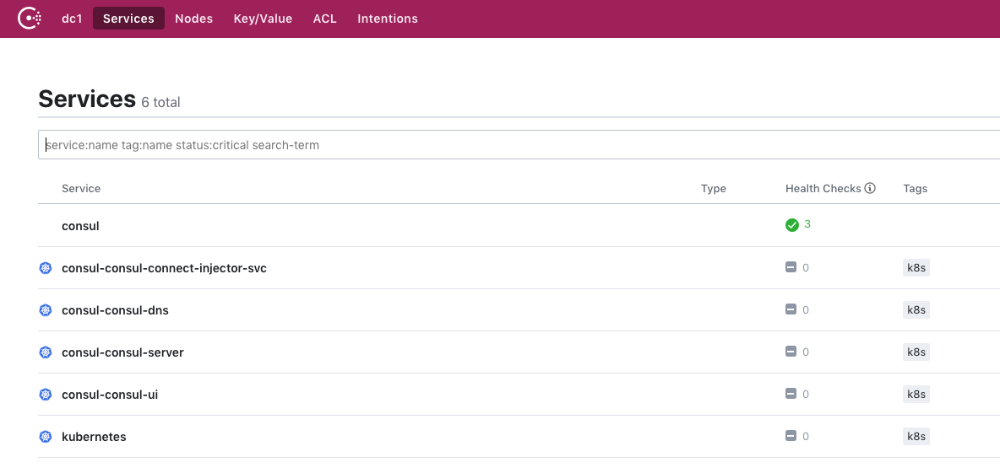

# Install and use Consul in Azure Kubernetes Service (AKS)

[Consul][consul-github] is an open-source service mesh that provides a key set of functionality across the microservices in a Kubernetes cluster. These features include service discovery, health checking, service segmentation, and observability. For more information about Consul, see the official [What is Consul?][consul-docs-concepts] documentation.

This article shows you how to install Consul. The Consul components are installed into a Kubernetes cluster on AKS.

> [!NOTE]
> These instructions reference Consul version `1.6.0`, and use at least Helm version `2.14.2`.
>
> The Consul `1.6.x` releases can be run against Kubernetes versions `1.13+`. You can find additional Consul versions at [GitHub - Consul Releases][consul-github-releases] and information about each of the releases at [Consul- Release Notes][consul-release-notes].

In this article, you learn how to:

> [!div class="checklist"]
> * Install the Consul components on AKS
> * Validate the Consul installation
> * Uninstall Consul from AKS

## Before you begin

The steps detailed in this article assume that you've created an AKS cluster (Kubernetes `1.13` and above, with RBAC enabled) and have established a `kubectl` connection with the cluster. If you need help with any of these items, then see the [AKS quickstart][aks-quickstart]. Ensure that your cluster has at least 3 nodes in the Linux node pool.

You'll need [Helm][helm] to follow these instructions and install Consul. It's recommended that you have the latest stable version correctly installed and configured in your cluster. If you need help with installing Helm, then see the [AKS Helm installation guidance][helm-install]. All Consul pods must also be scheduled to run on Linux nodes.

This article separates the Consul installation guidance into several discrete steps. The end result is the same in structure as the official Consul installation [guidance][consul-install-k8].

### Install the Consul components on AKS

We'll start by downloading version `v0.10.0` of the Consul Helm chart. This version of the chart includes Consul version `1.6.0`.

::: zone pivot="client-operating-system-linux"

[!INCLUDE [Linux - download](includes/servicemesh/consul/download-bash.md)]

::: zone-end

::: zone pivot="client-operating-system-macos"

[!INCLUDE [macOS - download](includes/servicemesh/consul/download-bash.md)]

::: zone-end

::: zone pivot="client-operating-system-windows"

[!INCLUDE [Windows - download](includes/servicemesh/consul/download-powershell.md)]

::: zone-end

Use Helm and the downloaded `consul-helm` chart to install the Consul components into the `consul` namespace in your AKS cluster. 

> [!NOTE]
> **Installation options**
> 
> We are using the following options as part of our installation:
> - `connectInject.enabled=true` - enable proxies to be injected into pods
> - `client.enabled=true` - enable Consul clients to run on every node
> - `client.grpc=true` - enable gRPC listener for connectInject
> - `syncCatalog.enabled=true` - sync Kubernetes and Consul services
>
> **Node selectors**
>
> Consul currently must be scheduled to run on Linux nodes. If you have Windows Server nodes in your cluster, you must ensure that the Consul pods are only scheduled to run on Linux nodes. We'll use [node selectors][kubernetes-node-selectors] to make sure pods are scheduled to the correct nodes.

::: zone pivot="client-operating-system-linux"

[!INCLUDE [Bash - install Istio components](includes/servicemesh/consul/install-components-bash.md)]

::: zone-end

::: zone pivot="client-operating-system-macos"

[!INCLUDE [Bash - install Istio components](includes/servicemesh/consul/install-components-bash.md)]

::: zone-end

::: zone pivot="client-operating-system-windows"

[!INCLUDE [PowerShell - install Istio components](includes/servicemesh/consul/install-components-powershell.md)]

::: zone-end

The `Consul` Helm chart deploys a number of objects. You can see the list from the output of your `helm install` command above. The deployment of the Consul components can take around 3 minutes to complete, depending on your cluster environment.

At this point, you've deployed Consul to your AKS cluster. To ensure that we have a successful deployment of Consul, let's move on to the next section to validate the Consul installation.

## Validate the Consul installation

Confirm that the resources have been successfully created. Use the [kubectl get svc][kubectl-get] and [kubectl get pod][kubectl-get] commands to query the `consul` namespace, where the Consul components were installed by the `helm install` command:

```console
kubectl get svc --namespace consul --output wide
kubectl get pod --namespace consul --output wide
```

The following example output shows the services and pods (scheduled on Linux nodes) that should now be running:

```output
NAME                                 TYPE           CLUSTER-IP    EXTERNAL-IP             PORT(S)                                                                   AGE     SELECTOR
consul                               ExternalName   <none>        consul.service.consul   <none>                                                                    38s     <none>
consul-consul-connect-injector-svc   ClusterIP      10.0.98.102   <none>                  443/TCP                                                                   3m26s   app=consul,component=connect-injector,release=consul
consul-consul-dns                    ClusterIP      10.0.46.194   <none>                  53/TCP,53/UDP                                                             3m26s   app=consul,hasDNS=true,release=consul
consul-consul-server                 ClusterIP      None          <none>                  8500/TCP,8301/TCP,8301/UDP,8302/TCP,8302/UDP,8300/TCP,8600/TCP,8600/UDP   3m26s   app=consul,component=server,release=consul
consul-consul-ui                     ClusterIP      10.0.50.188   <none>                  80/TCP                                                                    3m26s   app=consul,component=server,release=consul

NAME                                                              READY   STATUS    RESTARTS   AGE    IP            NODE                            NOMINATED NODE   READINESS GATES
consul-consul-connect-injector-webhook-deployment-99f74fdbcr5zj   1/1     Running   0          3m9s   10.240.0.68   aks-linux-92468653-vmss000002   <none>           <none>
consul-consul-jbksc                                               1/1     Running   0          3m9s   10.240.0.44   aks-linux-92468653-vmss000001   <none>           <none>
consul-consul-jkwtq                                               1/1     Running   0          3m9s   10.240.0.70   aks-linux-92468653-vmss000002   <none>           <none>
consul-consul-server-0                                            1/1     Running   0          3m9s   10.240.0.91   aks-linux-92468653-vmss000002   <none>           <none>
consul-consul-server-1                                            1/1     Running   0          3m9s   10.240.0.38   aks-linux-92468653-vmss000001   <none>           <none>
consul-consul-server-2                                            1/1     Running   0          3m9s   10.240.0.10   aks-linux-92468653-vmss000000   <none>           <none>
consul-consul-sync-catalog-d846b79c-8ssr8                         1/1     Running   2          3m9s   10.240.0.94   aks-linux-92468653-vmss000002   <none>           <none>
consul-consul-tz2t5                                               1/1     Running   0          3m9s   10.240.0.12   aks-linux-92468653-vmss000000   <none>           <none>
```

All of the pods should show a status of `Running`. If your pods don't have these statuses, wait a minute or two until they do. If any pods report an issue, use the [kubectl describe pod][kubectl-describe] command to review their output and status.

## Accessing the Consul UI

The Consul UI was installed in our setup above and provides UI based configuration for Consul. The UI for Consul is not exposed publicly via an external ip address. To access the Consul user interface, use the [kubectl port-forward][kubectl-port-forward] command. This command creates a secure connection between your client machine and the relevant pod in your AKS cluster.

```console
kubectl port-forward -n consul svc/consul-consul-ui 8080:80
```

You can now open a browser and point it to `http://localhost:8080/ui` to open the Consul UI. You should see the following when you open the UI:



## Uninstall Consul from AKS

> [!WARNING]
> Deleting Consul from a running system may result in traffic related issues between your services. Ensure that you have made provisions for your system to still operate correctly without Consul before proceeding.

### Remove Consul components and namespace

To remove Consul from your AKS cluster, use the following commands. The `helm delete` commands will remove the `consul` chart, and the `kubectl delete namespace` command will remove the `consul` namespace.

```console
helm delete --purge consul
kubectl delete namespace consul
```

## Next steps

To explore more installation and configuration options for Consul, see the following official Consul articles:

- [Consul - Helm installation guide][consul-install-k8]
- [Consul - Helm installation options][consul-install-helm-options]

You can also follow additional scenarios using:

- [Consul Example Application][consul-app-example]
- [Consul Kubernetes Reference Architecture][consul-reference]
- [Consul Mesh Gateways][consul-mesh-gateways]

<!-- LINKS - external -->
[Hashicorp]: https://hashicorp.com
[cosul-github]: https://github.com/hashicorp/consul
[helm]: https://helm.sh

[consul-docs-concepts]: https://www.consul.io/docs/platform/k8s/index.html
[consul-github]: https://github.com/hashicorp/consul
[consul-github-releases]: https://github.com/hashicorp/consul/releases
[consul-release-notes]: https://github.com/hashicorp/consul/blob/master/CHANGELOG.md
[consul-install-download]: https://www.consul.io/downloads.html
[consul-install-k8]: https://learn.hashicorp.com/consul/kubernetes/kubernetes-deployment-guide
[consul-install-helm-options]: https://www.consul.io/docs/platform/k8s/helm.html#configuration-values-
[consul-mesh-gateways]: https://learn.hashicorp.com/consul/kubernetes/mesh-gateways
[consul-reference]: https://learn.hashicorp.com/consul/kubernetes/kubernetes-reference
[consul-app-example]: https://learn.hashicorp.com/consul?track=gs-consul-service-mesh#gs-consul-service-mesh
[install-wsl]: https://docs.microsoft.com/windows/wsl/install-win10

[kubectl-get]: https://kubernetes.io/docs/reference/generated/kubectl/kubectl-commands#get
[kubectl-describe]: https://kubernetes.io/docs/reference/generated/kubectl/kubectl-commands#describe
[kubectl-port-forward]: https://kubernetes.io/docs/reference/generated/kubectl/kubectl-commands#port-forward
[kubernetes-node-selectors]: https://docs.microsoft.com/azure/aks/concepts-clusters-workloads#node-selectors

<!-- LINKS - internal -->
[aks-quickstart]: ./kubernetes-walkthrough.md
[consul-scenario-mtls]: ./consul-mtls.md
[helm-install]: ./kubernetes-helm.md
