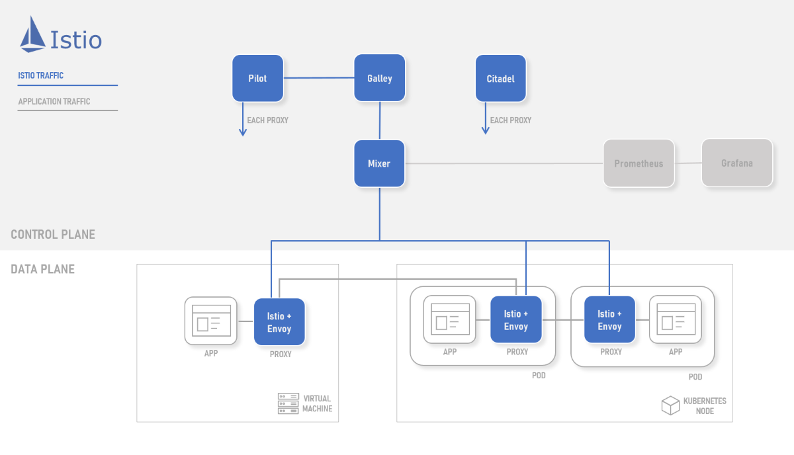

# Istio

## Overview

[Istio][istio] is a full featured, customisable and extensible service mesh.

## Architecture

Istio provides a data plane that is composed of [Envoy][envoy-proxy] based sidecars. These intelligent proxies control all network traffic in and out of your meshed apps and workloads.

The control plane manages the configuration, policy and telemetry via the following [components][what-is-istio]:

- **Mixer** - Enforces access control and usage policies, and collects telemetry from the proxies which is pushed into [Prometheus][prometheus].

- **Pilot** - Provides service discovery and traffic management policy/configuration for the proxies.

- **Citadel** - Provides identity and security capabilities that allow for mTLS between services.

- **Galley** - Abstracts and provides configuration to components.

The following architecture diagram demonstrates how the various components within the data plane and control plane interact.

## Selection Criteria

It is important to understand and consider the following when evaluating Istio for your workloads:

- [Design Goals](#design-goals)
- [Capabilities](#capabilities)
- [Scenarios](#scenarios)

### Design Goals

The following design goals [guide][design-goals] the Istio project:

- **Maximize Transparency** - Allow adoption with the minimum amount of work to get real value from the system.

- **Extensibility** - Must be able to grow and adapt with changing needs.

- **Portability** - Run easily in a variety of environments - cloud, on-premises.

- **Policy Uniformity** - Consistency in policy definition across variety of resources.

### Capabilities

Istio provides the following set of capabilities:

- **Mesh** – gateways (multi-cluster), virtual machines (mesh expansion)

- **Traffic Management** – routing, splitting, timeouts, circuit breakers, retries, ingress, egress

- **Policy** – access control, rate limit, quota, custom policy adapters

- **Security** – authentication (jwt), authorisation, encryption (mtls), external CA (HashiCorp Vault)

- **Observability** – golden metrics, mirror, tracing, custom adapters, prometheus, grafana

### Scenarios

Istio is well suited to and suggested for the following scenarios:

- Require extensibility and rich set of capabilities

- Mesh expansion to include VM based workloads

- Multi-cluster service mesh

## Next steps

The following documentation describes how you can install Istio on Azue Kubernetes Service (AKS):

> [!div class="nextstepaction"]
> [Install Istio in Azure Kubernetes Service (AKS)][istio-install]

You can also dive deeper into Istio concepts and/or explore additional Istio deployment models:

- [Istio Concepts][what-is-istio]
- [Istio Deployment Models][deployment-models]

<!-- LINKS - external -->
[istio]: https://istio.io
[what-is-istio]: https://istio.io/docs/concepts/what-is-istio/
[design-goals]: https://istio.io/docs/concepts/what-is-istio/#design-goals
[deployment-models]: https://istio.io/docs/concepts/deployment-models/

[envoy-proxy]: https://www.envoyproxy.io/
[grafana]: https://grafana.com/
[prometheus]: https://prometheus.io/

<!-- LINKS - internal -->
[istio-install]: ./servicemesh-istio-install.md
