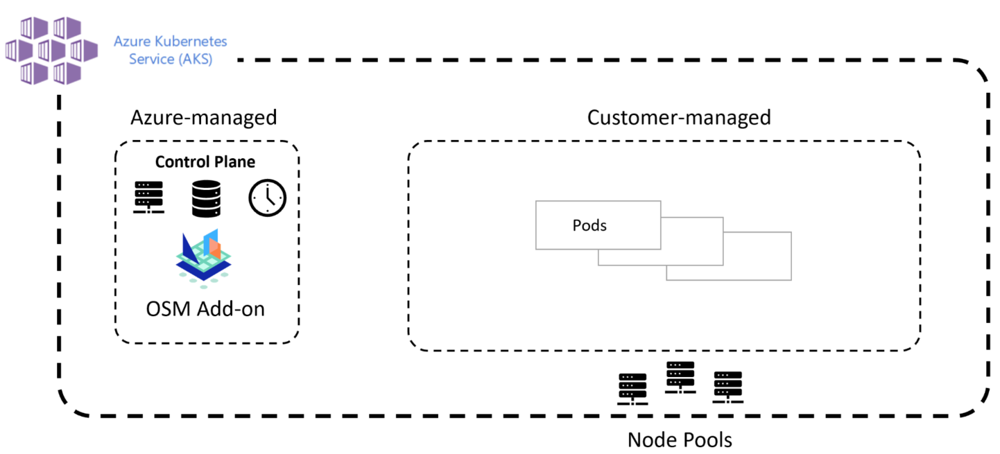
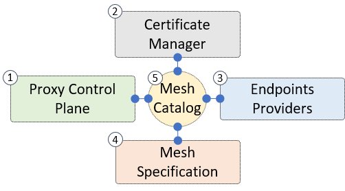

# Open Service Mesh AKS add-on (Preview)

## Overview

[Open Service Mesh (OSM)](https://docs.openservicemesh.io/) is a lightweight, extensible, Cloud Native service mesh that allows users to uniformly manage, secure, and get out-of-the-box observability features for highly dynamic microservice environments.

OSM runs an Envoy based control plane on Kubernetes, can be configured with SMI APIs, and works by injecting an Envoy proxy as a sidecar container next to each instance of your application. The Envoy proxy contains and executes rules around access control policies, implements routing configuration, and captures metrics. The control plane continually configures proxies to ensure policies and routing rules are up to date and ensures proxies are healthy.

[!INCLUDE [preview features callout](./includes/preview/preview-callout.md)]

## Architecture

The OSM add-on is integrated with the Azure Kubernetes Service (AKS) and is provided as a managed add-on component to the AKS managed control plane. The OSM add-on provides full lifecycle management of the service mesh as part of your AKS cluster. More detailed information on the architecture of the AKS managed control plane can be found at the AKS core concepts documentation under [Kubernetes cluster architecture](https://docs.microsoft.com/azure/aks/concepts-clusters-workloads#kubernetes-cluster-architecture).

## High-level software architecture

The Open Service Mesh project is composed of the following five high-level components:

1. [Proxy control plane](#1-proxy-control-plane) - handles gRPC connections from the service mesh sidecar proxies
2. [Certificate manager](#2-certificate-manager) - handles issuance and management of certificates
3. [Endpoints providers](#3-endpoints-providers) - components capable of introspecting the participating compute platforms; these retrieve the IP addresses of the compute backing the services in the mesh
4. [Mesh specification](#4-mesh-specification) - wrapper around the [SMI Spec's Go SDK](https://github.com/deislabs/smi-sdk-go); this facility provides simple methods to retrieve [SMI Spec](https://smi-spec.io/) [resources](https://github.com/deislabs/smi-spec#service-mesh-interface), abstracting away cluster and storage specifics
5. [Mesh catalog](#5-mesh-catalog) - the service mesh's heart; this is the central component that collects inputs from all other components and dispatches configuration to the proxy control plane

Let's take a look at each component:

### (1) Proxy Control Plane

The Proxy Control Plane plays a key part in operating the [service mesh](https://www.bing.com/search?q=What%27s+a+service+mesh%3F). All proxies are installed as [sidecars](https://docs.microsoft.com/azure/architecture/patterns/sidecar) and establish an mTLS gRPC connection to the Proxy Control Plane. The proxies continuously receive configuration updates. This component implements the interfaces required by the specific reverse proxy chosen. OSM implements [Envoy's go-control-plane xDS v3 API](https://github.com/envoyproxy/go-control-plane). The xDS v3 API can also be used to extend the functionality provided by SMI, when [advanced Envoy features are needed](https://github.com/openservicemesh/osm/issues/1376).

The Proxy Control Plane's availability is of foremost importance when it comes to traffic policy enforcement and connectivity management between services. Some of the Control Plane design decisions are heavily influenced by that fact, such as its stateless nature. To read more on the design decisions behind the High Availability design of the Control Plane, please refer to the [HA design doc](https://docs.openservicemesh.io/docs/ha/).

### (2) Certificate Manager

Certificate Manager is a component that provides each service participating in the service mesh with a TLS certificate.
These service certificates are used to establish and encrypt connections between services using mTLS.

### (3) Endpoints Providers

Endpoints Providers are one or more components that communicate with the compute platforms (Kubernetes clusters, on-prem machines, or cloud-providers' VMs) participating in the service mesh. Endpoints providers resolve service names into lists of IP addresses. The Endpoints Providers understand the specific primitives of the compute provider they are implemented for, such as virtual machines, virtual machine scale sets, and Kubernetes clusters.

### (4) Mesh specification

Mesh Specification is a wrapper around the existing [SMI Spec](https://github.com/deislabs/smi-spec) components. This component abstracts the specific storage chosen for the YAML definitions. This module is effectively a wrapper around [SMI Spec's Kubernetes informers](https://github.com/deislabs/smi-sdk-go), currently abstracting away the storage (Kubernetes/etcd) specifics.

### (5) Mesh catalog

Mesh Catalog is the central component of OSM, which combines the outputs of all other components into a structure, which can then be transformed into proxy configuration and dispatched to all listening proxies via the proxy control plane.
This component:

1. Communicates with the [mesh specification module (4)](#4-mesh-specification) to detect when a [Kubernetes service](https://kubernetes.io/docs/concepts/services-networking/service/) was created, changed, or deleted via [SMI Spec](https://github.com/deislabs/smi-spec).
1. Reaches out to the [certificate manager (2)](#2-certificate-manager) and requests a new TLS certificate for the newly discovered service.
1. Retrieves the IP addresses of the mesh workloads by observing the compute platforms via the [endpoints providers (3)](#3-endpoints-providers).
1. Combines the outputs of 1, 2, and 3 above into a data structure, which is then passed to the [proxy control plane (1)](#1-proxy-control-plane), serialized and sent to all relevant connected proxies.

## Design goals

The OSM design goals were influenced by not wanting to add additional complexity to operators for managing their current cluster. With that goal in mind the following five core princilples were created to guide the design and develoopment process.

_The system must be:_

- easy to understand
- simple to install
- effortless to maintain
- painless to troubleshoot
- configurable via [SMI Spec](https://smi-spec.io/)

## Capabilities

OSM provides the following set of capabilities:

- Secure service to service communication by enabling mTLS

- Easily onnboard applications onto the mesh by enabling automatic sidecar injection of Envoy proxy

- Easily and transparent configurations for traffic shifting on deployments

- Ability to define and execute fine grained access control polices for servcies

- Observability and insights into application metrics for debugging and monitoring services

- Integration with external certificate management services/solutions with a pluggable interface

## Scenarios

OSM can assist your AKS deployments with the following scenarios:

- Provide encrypted communications between service endpoints deployed in the cluster

- Traffic authorization of both HTTP/HTTPS and TCP traffic in the mesh

- Configuration of weighted traffic controls between two or more servcies for A/B or canary deployments

- Collection and viewing of KPIs from application traffic

## Next steps

Learn how you can install the OSM add-on for Azure Kubernetes Service (AKS):

> [!div class="nextstepaction"] > [Enable the OSM add-on for Azure Kubernetes Service (AKS)](./servicemesh-osm-install.md)
