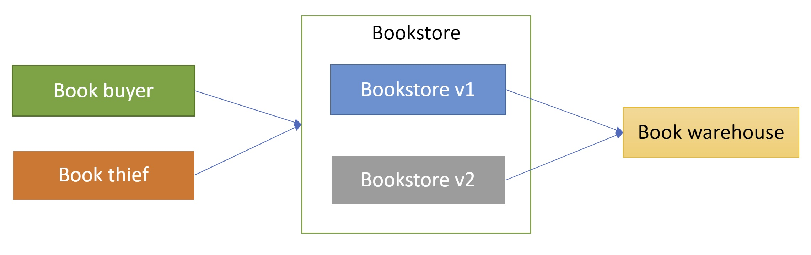
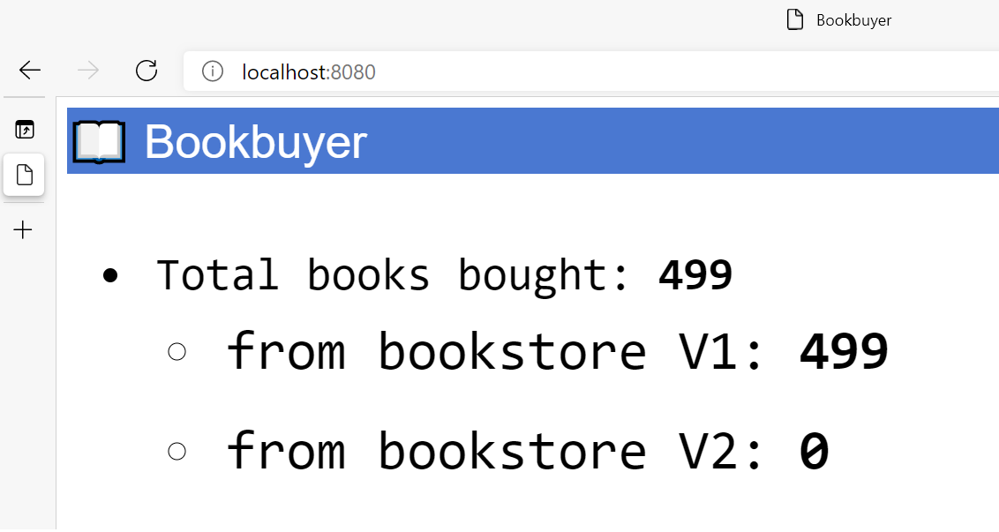
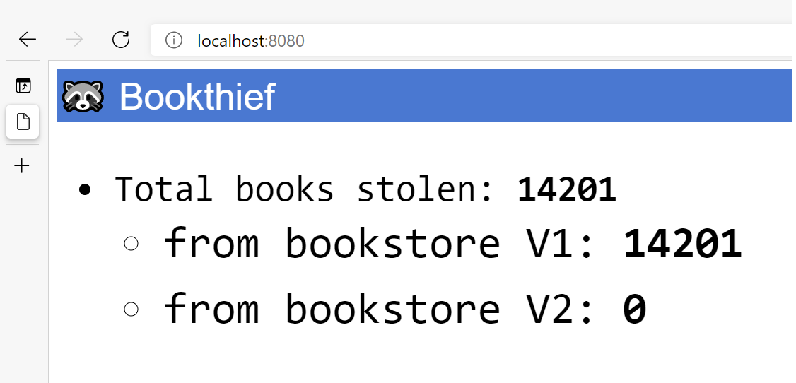

# Open Service Mesh AKS add-on (Preview)

## Overview

[Open Service Mesh (OSM)](https://docs.openservicemesh.io/) is a lightweight, extensible, Cloud Native service mesh that allows users to uniformly manage, secure, and get out-of-the-box observability features for highly dynamic microservice environments.

OSM runs an Envoy based control plane on Kubernetes, can be configured with [SMI](https://smi-spec.io/) APIs, and works by injecting an Envoy proxy as a sidecar container next to each instance of your application. The Envoy proxy contains and executes rules around access control policies, implements routing configuration, and captures metrics. The control plane continually configures proxies to ensure policies and routing rules are up to date and ensures proxies are healthy.

[!INCLUDE [preview features callout](./includes/preview/preview-callout.md)]

## Capabilities and Features

OSM provides the following set of capabilities and features to provide a cloud native service mesh for your Azure Kubernetes Service (AKS) clusters :

- Secure service to service communication by enabling mTLS

- Easily onnboard applications onto the mesh by enabling automatic sidecar injection of Envoy proxy

- Easily and transparent configurations for traffic shifting on deployments

- Ability to define and execute fine grained access control polices for servcies

- Observability and insights into application metrics for debugging and monitoring services

- Integration with external certificate management services/solutions with a pluggable interface

## Scenarios

OSM can assist your AKS deployments with the following scenarios:

- Provide encrypted communications between service endpoints deployed in the cluster

- Traffic authorization of both HTTP/HTTPS and TCP traffic in the mesh

- Configuration of weighted traffic controls between two or more servcies for A/B or canary deployments

- Collection and viewing of KPIs from application traffic

## OSM Service Quotas and Limits (Preview)

As noted prior, the OSM add-on for AKS is in a preview state and will undergo additional enhancements prior to general availablity (GA). During the preview phase it is recommended to not surpass the limits shown in the following table:

| Resource                                           | Limit |
| -------------------------------------------------- | :---- |
| Kubernetes Cluster Version                         | 1.19+ |
| Maximum OSM controllers per cluster                | 1     |
| Maximum pods per OSM controller                    | 500   |
| Maximum Kubernetes service accounts managed my OSM | 50    |

::: zone pivot="client-operating-system-linux"

[!INCLUDE [Linux - download and install client binary](includes/servicemesh/osm/install-osm-binary-linux.md)]

::: zone-end

::: zone pivot="client-operating-system-macos"

[!INCLUDE [macOS - download and install client binary](includes/servicemesh/osm/install-osm-binary-macos.md)]

::: zone-end

::: zone pivot="client-operating-system-windows"

[!INCLUDE [Windows - download and install client binary](includes/servicemesh/osm/install-osm-binary-windows.md)]

::: zone-end

> [!NOTE]
> Do not attempt to install OSM from the binary using `osm install`. This will result in a installation of OSM that is not integrated as an add-on for AKS.

## Install Open Service Mesh (OSM) Azure Kubernetes Service (AKS) add-on - Greenfield Deployment

In the greenfield scenario, you will start with a brand new deployment of an AKS cluster enabling the OSM add-on at the cluster create operation.

### Create a resource group

In Azure, you allocate related resources to a resource group. Create a resource group by using [az group create](/cli/azure/group#az-group-create). The following example creates a resource group named _myOsmAksGroup_ in the _eastus2_ location (region):

```azurecli-interactive
az group create --name myosmaksgroup --location eastus2
```

### Deploy an AKS cluster with the OSM add-on enabled

You'll now deploy a new AKS cluster with the OSM add-on enabled.

> [!NOTE]
> Please be aware the following AKS deployment command utilizes OS ephemeral disks. You can find more information here about [Ephemeral OS disks for AKS](https://docs.microsoft.com/azure/aks/cluster-configuration#ephemeral-os)

```azurecli-interactive
az aks create -n osm-addon-cluster -g myOsmAksGroup --kubernetes-version 1.19.6 --node-osdisk-type Ephemeral --node-osdisk-size 30 --network-plugin azure --enable-managed-identity -a open-service-mesh
```

## Enable Open Service Mesh (OSM) Azure Kubernetes Service (AKS) add-on - Brownfield Deployment

In the brownfield scenario, you will enable the OSM add-on to an existing AKS cluster that has already been deployed.

### Enable the OSM add-on to existing AKS cluster

To enable the AKS OSM add-on you will need to run the `az aks enable-addons --addons` command passing the parameter `open-service-mesh`

```azurecli-interactive
az aks enable-addons --addons open-service-mesh -g <resource group name> -n <AKS cluster name>
```

You should see output similar to the output shown below to confirm the AKS OSM add-on has been installed.

```json
{- Finished ..
  "aadProfile": null,
  "addonProfiles": {
    "KubeDashboard": {
      "config": null,
      "enabled": false,
      "identity": null
    },
    "openServiceMesh": {
      "config": {},
      "enabled": true,
      "identity": {
...
```

## Validate the AKS OSM add-on installation

There are several commands to run to check all of the components of the AKS OSM add-on are enabled and running:

First we can query the add-on profiles of the cluster to check the enabled state of the add-ons installed. The following command should return "true".

```azurecli-interactive
az aks list -g <resource group name> | jq -r .[].addonProfiles.openServiceMesh.enabled
```

The following `kubectl` commands will report the status of the osm-controller.

```azurecli-interactive
kubectl get deployments -n kube-system --selector app=osm-controller
kubectl get pods -n kube-system --selector app=osm-controller
kubectl get services -n kube-system --selector app=osm-controller
```

## Accessing the AKS OSM add-on

Currently you can access and configure the OSM controller configuration via the configmap. To view the OSM controller configuration settings, query the osm-config configmap via `kubectl` to view its configuration settings.

```azurecli-interactive
kubectl get configmap -n kube-system osm-config -o json | jq '.data'
```

Output of the OSM configmap should look like the following:

```json
{
  "egress": "true",
  "enable_debug_server": "true",
  "envoy_log_level": "error",
  "permissive_traffic_policy_mode": "true",
  "prometheus_scraping": "false",
  "service_cert_validity_duration": "24h",
  "use_https_ingress": "false"
}
```

Notice the **permissive_traffic_policy_mode** is configured to **true**. Permissive traffic policy mode in OSM is a mode where the [SMI](https://smi-spec.io/) traffic policy enforcement is bypassed. In this mode, OSM automatically discovers services that are a part of the service mesh and programs traffic policy rules on each Envoy proxy sidecar to be able to communicate with these services.

## Deploy a new application to be managed by the Open Service Mesh (OSM) Azure Kubernetes Service (AKS) add-on

### Before you begin

The steps detailed in this walkthrough assume that you've created an AKS cluster (Kubernetes `1.19+` and above, with Kubernetes RBAC enabled), have established a `kubectl` connection with the cluster (If you need help with any of these items, then see the [AKS quickstart](./kubernetes-walkthrough.md), and have installed the AKS OSM add-on.

You must have the following resources installed:

- The Azure CLI, version 2.20.0 or later
- The `azure-preview` extension version 0.5.5 or later
- OSM version v0.8.0 or later
- apt-get install jq

### Create namespaces for the application

In this walkthrough we will be using the OMS bookstore appplication that has the following Kubernetes services:

- bookbuyer
- booktheif
- bookstore
- bookwarehouse

Create namespaces for each of these application components.

```azurecli-interactive
for i in bookstore bookbuyer bookthief bookwarehouse; do kubectl create ns $i; done
```

You should see the following output:

```Output
namespace/bookstore created
namespace/bookbuyer created
namespace/bookthief created
namespace/bookwarehouse created
```

### Onboard the namespaces to be managed by OSM

When you add the namespaces to the OSM mesh, this will allow the OSM controller to automatically inject the Envoy sidecar proxy containers with you application. Run the following command to onboard the OSM bookstore application namespaces.

```azurecli-interactive
osm namespace add bookstore bookbuyer bookthief bookwarehouse
```

You should see the following output:

```Output
Namespace [bookstore] successfully added to mesh [osm]
Namespace [bookbuyer] successfully added to mesh [osm]
Namespace [bookthief] successfully added to mesh [osm]
Namespace [bookwarehouse] successfully added to mesh [osm]
```

### Deploy the Bookstore application to the AKS cluster

```azurecli-interactive
kubectl apply -f https://raw.githubusercontent.com/openservicemesh/osm/release-v0.8/docs/example/manifests/apps/bookbuyer.yaml
```

```azurecli-interactive
kubectl apply -f https://raw.githubusercontent.com/openservicemesh/osm/release-v0.8/docs/example/manifests/apps/bookthief.yaml
```

```azurecli-interactive
kubectl apply -f https://raw.githubusercontent.com/openservicemesh/osm/release-v0.8/docs/example/manifests/apps/bookstore.yaml
```

```azurecli-interactive
kubectl apply -f https://raw.githubusercontent.com/openservicemesh/osm/release-v0.8/docs/example/manifests/apps/bookwarehouse.yaml
```

All of the deployment outputs are summarized below.

```Output
serviceaccount/bookbuyer created
service/bookbuyer created
deployment.apps/bookbuyer created

serviceaccount/bookthief created
service/bookthief created
deployment.apps/bookthief created

service/bookstore created
serviceaccount/bookstore created
deployment.apps/bookstore created

serviceaccount/bookwarehouse created
service/bookwarehouse created
deployment.apps/bookwarehouse created
```

### Checkpoint: What got installed?

The example Bookstore application is a multi-tiered app that consists of four services, being the bookbuyer, bookthief, bookstore, and bookwarehouse. Both the bookbuyer and bookthief service communicate to the bookstore service to retrieve books from the bookstore service. The bookstore service retrievs books out of the bookwarehouse service to supply the bookbuyer and bookthief. This is a simple multi-tiered application that works well in showing how a service mesh can be used to protect and authorize communications between the applications services. As we continue through the walkthrough, we will be enabling and disabling Service Mesh Interface (SMI) policies to both allow and disallow the services to communicate via OSM. Below is an architecture diagram of what got installed for the bookstore application.



### Verify the Bookstore application running inside the AKS cluster

As of now we have deployed the bookstore mulit-container application, but it is only accessible from within the AKS cluster. Later tutorials will assist you in exposing the application outside the cluster via an ingress controller. For now we will be utilizing port forwarding to access the bookbuyer application inside the AKS cluster to verify it is buying books from the bookstore service.

To verify that the application is running inside the cluster, we will use a port forward to view both the bookbuyer and bookthief components UI.

First let's get the bookbuyer pod's name

```azurecli-interactive
kubectl get pod -n bookbuyer
```

You should see output similar to the following. Your bookbuyer pod will have a unique name appended.

```Output
NAME                         READY   STATUS    RESTARTS   AGE
bookbuyer-7676c7fcfb-mtnrz   2/2     Running   0          7m8s
```

Once we have the pod's name, we can now use the port-forward command to setup a tunnel from our local system to the application inside the AKS cluster. Run the following command to setup the port forward for the local system port 8080. Again use your specice bookbuyer pod name.

> [!NOTE]
> For all port forwarding commands it is best to use an additional terminal so that you can continue to work through this walkthrough and not disconnect the tunnel. It is also best that you establish the port forward tunnel outside of the Azure Cloud Shell.

```Bash
kubectl port-forward bookbuyer-7676c7fcfb-mtnrz -n bookbuyer 8080:14001
```

You should see output similar to this.

```Output
Forwarding from 127.0.0.1:8080 -> 14001
Forwarding from [::1]:8080 -> 14001
```

While the port forwarding session is in place, navigate to the following url from a browser `http://localhost:8080`. You should now be able to see the bookbuyer application UI in the browser similar to the image below.



You will also notice that the the total books bought number continues to increment to the bookstore v1 service. The bookstore v2 service has not been deployed yet. We will deploy the bookstore v2 service when we demonstrate the SMI traffic split policies.

You can also check the same for the bookthief service.

```azurecli-interactive
kubectl get pod -n booktheif
```

You should see output similar to the following. Your bookthief pod will have a unique name appended.

```Output
NAME                         READY   STATUS    RESTARTS   AGE
bookthief-59549fb69c-cr8vl   2/2     Running   0          15m54s
```

Port forward to bookthief pod.

```Bash
kubectl port-forward bookbuyer-7676c7fcfb-mtnrz -n bookbuyer 8080:14001
```

Navigate to the following url from a browser `http://localhost:8080`. You should see the bookthief is currently stealing books from the bookstore service! Later on we will implement a traffic policy to stop the bookthief.



## Manage existing deployed applications to be managed by the Open Service Mesh (OSM) Azure Kubernetes Service (AKS) add-on

### Before you begin

The steps detailed in this walkthrough assume that you have previously enabled the OSM AKS add-on for your AKS cluster. If not, please review the section [Enable Open Service Mesh (OSM) Azure Kubernetes Service (AKS) add-on - Brownfield Deployment](<#Enable-Open-Service-Mesh-(OSM)-Azure-Kubernetes-Service-(AKS)-add-on---Brownfield-Deployment>) before proceeding. Also, your AKS cluster needs to be version Kubernetes `1.19+` and above, have Kubernetes RBAC enabled, and have established a `kubectl` connection with the cluster (If you need help with any of these items, then see the [AKS quickstart](./kubernetes-walkthrough.md), and have installed the AKS OSM add-on.

You must have the following resources installed:

- The Azure CLI, version 2.20.0 or later
- The `azure-preview` extension version 0.5.5 or later
- OSM version v0.8.0 or later
- apt-get install jq

### Verify the Open Service Mesh (OSM) Permissive Traffic Mode Policy

The OSM Permissive Traffic Policy mode is a mode where the [SMI](https://smi-spec.io/) traffic policy enforcement is bypassed. In this mode, OSM automatically discovers services that are a part of the service mesh and programs traffic policy rules on each Envoy proxy sidecar to be able to communicate with these services.

To verify the current permissive traffic mode of OSM for your cluster, run the following command:

```azurecli-interactive
kubectl get configmap -n kube-system osm-config -o json | jq '.data'
```

Output of the OSM configmap should look like the following:

```Output
{
  "egress": "true",
  "enable_debug_server": "true",
  "envoy_log_level": "error",
  "permissive_traffic_policy_mode": "true",
  "prometheus_scraping": "false",
  "service_cert_validity_duration": "24h",
  "use_https_ingress": "false"
}
```

If the **permissive_traffic_policy_mode** is configured to **true**, you can safely onboard your namespaces without any disruption to your service-to-service communications. If the **permissive_traffic_policy_mode** is configured to **false**, You will need to ensure you have the correct [SMI](https://smi-spec.io/) traffic access policy manifests deployed as well as ensuring you have a service account representing each service deployed in the namespace. Please follow the guidance for [Onboard existing deployed applications with Open Service Mesh (OSM) Permissive Traffic Policy configured as False](<#Onboard-existing-deployed-applications-with-Open-Service-Mesh-(OSM)-Permissive-Traffic-Policy-configured-as-False>)

### Onboard existing deployed applications with Open Service Mesh (OSM) Permissive Traffic Policy configured as True

The first thing we'll do is add the deployed application namespace(s) to OSM to manage.

```azurecli-interactive
osm namespace add bookstore
```

You should see the following output:

```Output
Namespace [bookstore] successfully added to mesh [osm]
```

Next we will take a look at the current pod deployment in the namespace. Run the following command to view the pods in the designated namespace.

```azurecli-interactive
kubectl get pod -n bookbuyer
```

You should see the following similar output:

```Output
NAME                         READY   STATUS    RESTARTS   AGE
bookbuyer-78666dcff8-wh6wl   1/1     Running   0          43s
```

Notice the **READY** column showing **1/1**, meaning that the application pod has only one container. Next we will need to restart your application deployments so that OSM can inject the Envoy sidecar proxy container with your application pod. Let's get a list of deployments in the namespace.

```azurecli-interactive
kubectl get deployment -n bookbuyer
```

You should see the following output:

```Output
NAME        READY   UP-TO-DATE   AVAILABLE   AGE
bookbuyer   1/1     1            1           23h
```

Now we will restart the deployment to inject the Envoy sidecar proxy container with your application pod. Run the following commmand.

```azurecli-interactive
kubectl rollout restart deployment bookbuyer -n bookbuyer
```

You should see the following output:

```Output
deployment.apps/bookbuyer restarted
```

If we take a look at the pods in the namespace again.

```azurecli-interactive
kubectl get pod -n bookbuyer
```

You will now notice that the **READY** column is now showing **2/2** containers being ready for your pod. The second container is the Envoy sidecar proxy.

```Output
NAME                         READY   STATUS    RESTARTS   AGE
bookbuyer-84446dd5bd-j4tlr   2/2     Running   0          3m30s
```

We can further inspect the pod to view the Envoy proxy by running the describe command to view the configuration.

```azurecli-interactive
kubectl describe pod bookbuyer-84446dd5bd-j4tlr -n bookbuyer
```

```Output
Containers:
  bookbuyer:
    Container ID:  containerd://b7503b866f915711002292ea53970bd994e788e33fb718f1c4f8f12cd4a88198
    Image:         openservicemesh/bookbuyer:v0.8.0
    Image ID:      docker.io/openservicemesh/bookbuyer@sha256:813874bd2dc9c5a259b9657995348cf0822b905e29c4e86f21fdefa0ef21dcee
    Port:          <none>
    Host Port:     <none>
    Command:
      /bookbuyer
    State:          Running
      Started:      Tue, 23 Mar 2021 10:52:53 -0400
    Ready:          True
    Restart Count:  0
    Environment:
      BOOKSTORE_NAMESPACE:  bookstore
      BOOKSTORE_SVC:        bookstore
    Mounts:
      /var/run/secrets/kubernetes.io/serviceaccount from bookbuyer-token-zft2r (ro)
  envoy:
    Container ID:  containerd://f5f1cb5db8d5304e23cc984eb08146ea162a3e82d4262c4472c28d5579c25e10
    Image:         envoyproxy/envoy-alpine:v1.17.1
    Image ID:      docker.io/envoyproxy/envoy-alpine@sha256:511e76b9b73fccd98af2fbfb75c34833343d1999469229fdfb191abd2bbe3dfb
    Ports:         15000/TCP, 15003/TCP, 15010/TCP
    Host Ports:    0/TCP, 0/TCP, 0/TCP
```

Please verify your application is still functional after the Envoy sidecar proxy injection.

### Onboard existing deployed applications with Open Service Mesh (OSM) Permissive Traffic Policy configured as False

When the OSM configuration for the permissive traffic policy is set to `false`, OSM will require explicit [SMI](https://smi-spec.io/) traffic access policies deployed for the service-to-service communication to happen within your cluster. Currently, OSM also uses Kubernetes service accounts as part of authorizing service-to-service communications as well. To ensure your existing deployed applications will communicate when managed my the OSM mesh, we will need to verify the existance of a service account to utilize, update the application deployment with the service account information, apply the [SMI](https://smi-spec.io/) traffic access policies.

#### Verify Kubernetes Service Accounts

Verify if you have a kubernetes service account in the namespace your application is deployed to.

```azurecli-interactive
kubectl get serviceaccounts -n bookbuyer
```

In the following there is a service account named `bookbuyer` in the bookbuyer namespace.

```Output
NAME        SECRETS   AGE
bookbuyer   1         25h
default     1         25h
```

If you do not have a service account listed other than the default account, you will need to create one for your application. Use the following command as an example to create a service account in the application's deployed namespace.

```azurecli-interactive
kubectl create serviceaccount myserviceaccount -n bookbuyer
```

```Output
serviceaccount/myserviceaccount created
```

#### View your application's current deployment specification

If you had to create a service account from the earlier section, chances are your application deployment is not configured with a specific `serviceAccountName` in the deployment spec. We can view your application's deployment spec with the following commands:

```azurecli-interactive
kubectl get deployment -n bookbuyer
```

A list of deployments will be listed in the output.

```Output
NAME        READY   UP-TO-DATE   AVAILABLE   AGE
bookbuyer   1/1     1            1           25h
```

We will now describe the deployment as a check to see if there is a service account listed in the Pod Template section.

```azurecli-interactive
kubectl describe deployment bookbuyer -n bookbuyer
```

In this particular deployment you can see that there is a service account associated with the deployment listed under the Pod Template section. This deployment is using the service account bookbuyer. If you do not see the **Serivce Account:** property, your deployment is not configured to use a service account.

```Output
Pod Template:
  Labels:           app=bookbuyer
                    version=v1
  Annotations:      kubectl.kubernetes.io/restartedAt: 2021-03-23T10:52:49-04:00
  Service Account:  bookbuyer
  Containers:
   bookbuyer:
    Image:      openservicemesh/bookbuyer:v0.8.0

```

There are several techniques to update your deployment to add a kubernetes service account. Please review the Kubernetes documentation on [Updating a Deployment](https://kubernetes.io/docs/concepts/workloads/controllers/deployment/#updating-a-deployment) inline, or [Configure Service Accounts for Pods](https://kubernetes.io/docs/tasks/configure-pod-container/configure-service-account/). Once you have updated your deployment spec with the service account, re-deploy (kubectl apply -f your-deployment.yaml) your deployment to the cluster.

#### Deploy the necessary Service Mesh Interface (SMI) Policies

The last step to allowing authorized traffic to flow in the mesh is to deploy the necessary [SMI](https://smi-spec.io/) traffic access policies for you application. The amount of configuration you can achieve with [SMI](https://smi-spec.io/) traffic access policies is beyond the scope of this walkthrough, but we will detail some of the common components of the specification and show how to configure both a simple TrafficTarget and HTTPRouteGroup policy to enable service-to-service communication for you application.

The [SMI](https://smi-spec.io/) [**Traffic Access Control**](https://github.com/servicemeshinterface/smi-spec/blob/main/apis/traffic-access/v1alpha3/traffic-access.md#traffic-access-control) specification allows users to define the access control policy for their applications. We will focus on the **TrafficTarget** and **HTTPRoutGroup** api resources.

The TrafficTarget resource consist of three main configuration settings destination, rules, and sources. An example TrafficTarget is shown below.

```TrafficTarget Example spec
apiVersion: access.smi-spec.io/v1alpha3
kind: TrafficTarget
metadata:
  name: bookbuyer-access-bookstore-v1
  namespace: bookstore
spec:
  destination:
    kind: ServiceAccount
    name: bookstore
    namespace: bookstore
  rules:
  - kind: HTTPRouteGroup
    name: bookstore-service-routes
    matches:
    - buy-a-book
    - books-bought
  sources:
  - kind: ServiceAccount
    name: bookbuyer
    namespace: bookbuyer
```

In the above TrafficTarget spec, the `destination` denotes the service account that is configured for the destination source service. Remember the service account that was added to the deployment earlier will be used to authorize access to the deloyment it is attached to. The `rules` section , in this partricular example, defines the type of HTTP traffic that is allowed over the connection. You can configure fine grain regex patterns for the HTTP headers to be very specific on what traffic is allowed via HTTP. The `sources` section is the service originating communications. This spec reads bookbuyer needs to communicate to the bookstore.

The HTTPRouteGroup resource consist of one or an array of matches of HTTP header information and is a requirment for the TrafficTarget spec. In the example below, you can see that the HTTPRouteGroup is authorizing three HTTP actions, two GET and one POST.

```HTTPRouteGroup Example Spec
apiVersion: specs.smi-spec.io/v1alpha4
kind: HTTPRouteGroup
metadata:
  name: bookstore-service-routes
  namespace: bookstore
spec:
  matches:
  - name: books-bought
    pathRegex: /books-bought
    methods:
    - GET
    headers:
    - "user-agent": ".*-http-client/*.*"
    - "client-app": "bookbuyer"
  - name: buy-a-book
    pathRegex: ".*a-book.*new"
    methods:
    - GET
  - name: update-books-bought
    pathRegex: /update-books-bought
    methods:
    - POST
```

If you are not familiar with the type of HTTP traffic your front-end application makes to other tiers of the application, since the TrafficTarget spec requires a rule, you can create the equivalent of an allow all rule using the below spec for HTTPRouteGroup.

```HTTPRouteGroup Allow All Example
apiVersion: specs.smi-spec.io/v1alpha4
kind: HTTPRouteGroup
metadata:
  name: allow-all
  namespace: yournamespace
spec:
  matches:
  - name: allow-all
    pathRegex: '.*'
    methods: ["GET","PUT","POST","DELETE","PATCH"]
```

Once you configure your TrafficTarget and HTTPRouteGroup spec, you can put them together as one YAML and deploy. Below is the bookstore example configuration.

```Bookstore Example TrafficTarget and HTTPRouteGroup configuration
kubectl apply -f - <<EOF
---
apiVersion: access.smi-spec.io/v1alpha3
kind: TrafficTarget
metadata:
  name: bookbuyer-access-bookstore-v1
  namespace: bookstore
spec:
  destination:
    kind: ServiceAccount
    name: bookstore
    namespace: bookstore
  rules:
  - kind: HTTPRouteGroup
    name: bookstore-service-routes
    matches:
    - buy-a-book
    - books-bought
  sources:
  - kind: ServiceAccount
    name: bookbuyer
    namespace: bookbuyer
---
apiVersion: specs.smi-spec.io/v1alpha4
kind: HTTPRouteGroup
metadata:
  name: bookstore-service-routes
  namespace: bookstore
spec:
  matches:
  - name: books-bought
    pathRegex: /books-bought
    methods:
    - GET
    headers:
    - "user-agent": ".*-http-client/*.*"
    - "client-app": "bookbuyer"
  - name: buy-a-book
    pathRegex: ".*a-book.*new"
    methods:
    - GET
  - name: update-books-bought
    pathRegex: /update-books-bought
    methods:
    - POST
EOF
```

Please visit the [SMI](https://smi-spec.io/) site for more detailed information on the specification.

## Tutorial: Deploy a application managed by Open Service Mesh (OSM) with NGINX ingress

Open Service Mesh (OSM) is a lightweight, extensible, Cloud Native service mesh that allows users to uniformly manage, secure, and get out-of-the-box observability features for highly dynamic microservice environments.

In this tutorial, you will:

> [!div class="checklist"]
>
> - View the current OSM cluster configuration
> - Create the namespace(s) for OSM to manage deployed applications in the namespace(s)
> - Onboard the namespaces to be managed by OSM
> - Deploy the sample application
> - Verify the application running inside the AKS cluster
> - Create a NGINX ingress controller used for the appliction
> - Expose a service via the Azure Application Gateway ingress to the internet

### Before you begin

The steps detailed in this article assume that you've created an AKS cluster (Kubernetes `1.19+` and above, with Kubernetes RBAC enabled), have established a `kubectl` connection with the cluster (If you need help with any of these items, then see the [AKS quickstart](./kubernetes-walkthrough.md), and have installed the [AKS OSM add-on](./servicemesh-osm-install.md).

You must have the following resources installed:

- The Azure CLI, version 2.20.0 or later
- The `azure-preview` extension version 0.5.5 or later
- OSM version v0.8.0 or later
- apt-get install jq

### View and verify the current OSM cluster configuration

Once the OSM add-on for AKS has been enabled on the AKS cluster, you can view the current configuration parmaters in the osm-config Kubernetes ConfigMap. Run the following command to view the ConfigMap properties:

```azurecli-interactive
kubectl get configmap -n kube-system osm-config -o json | jq '.data'
```

Output shows the current OSM configuration for the cluster.

```Output
{
  "egress": "false",
  "enable_debug_server": "false",
  "enable_privileged_init_container": "false",
  "envoy_log_level": "error",
  "permissive_traffic_policy_mode": "true",
  "prometheus_scraping": "true",
  "service_cert_validity_duration": "24h",
  "tracing_enable": "false",
  "use_https_ingress": "false"
}
```

Notice the **permissive_traffic_policy_mode** is configured to **true**. Permissive traffic policy mode in OSM is a mode where the [SMI](https://smi-spec.io/) traffic policy enforcement is bypassed. In this mode, OSM automatically discovers services that are a part of the service mesh and programs traffic policy rules on each Envoy proxy sidecar to be able to communicate with these services.

### Create namespaces for the application

In this totorial we will be using the OMS bookstore appplication that has the following application components:

- bookbuyer
- booktheif
- bookstore
- bookwarehouse

Create namespaces for each of these application components.

```azurecli-interactive
for i in bookstore bookbuyer bookthief bookwarehouse; do kubectl create ns $i; done
```

You should see the following output:

```Output
namespace/bookstore created
namespace/bookbuyer created
namespace/bookthief created
namespace/bookwarehouse created
```

### Onboard the namespaces to be managed by OSM

When you add the namespaces to the OSM mesh, this will allow the OSM controller to automatically inject the Envoy sidecar proxy containers with you application. Run the following command to onboard the OSM bookstore application namespaces.

```azurecli-interactive
osm namespace add bookstore bookbuyer bookthief bookwarehouse
```

You should see the following output:

```Output
Namespace [bookstore] successfully added to mesh [osm]
Namespace [bookbuyer] successfully added to mesh [osm]
Namespace [bookthief] successfully added to mesh [osm]
Namespace [bookwarehouse] successfully added to mesh [osm]
```

### Deploy the Bookstore application to the AKS cluster

```azurecli-interactive
kubectl apply -f https://raw.githubusercontent.com/openservicemesh/osm/release-v0.8/docs/example/manifests/apps/bookbuyer.yaml
```

```azurecli-interactive
kubectl apply -f https://raw.githubusercontent.com/openservicemesh/osm/release-v0.8/docs/example/manifests/apps/bookthief.yaml
```

```azurecli-interactive
kubectl apply -f https://raw.githubusercontent.com/openservicemesh/osm/release-v0.8/docs/example/manifests/apps/bookstore.yaml
```

```azurecli-interactive
kubectl apply -f https://raw.githubusercontent.com/openservicemesh/osm/release-v0.8/docs/example/manifests/apps/bookwarehouse.yaml
```

All of the deployment outputs are summarized below.

```Output
serviceaccount/bookbuyer created
service/bookbuyer created
deployment.apps/bookbuyer created

serviceaccount/bookthief created
service/bookthief created
deployment.apps/bookthief created

service/bookstore created
serviceaccount/bookstore created
deployment.apps/bookstore created

serviceaccount/bookwarehouse created
service/bookwarehouse created
deployment.apps/bookwarehouse created
```

### Verify the Bookstore application running inside the AKS cluster

As of now we have deployed the bookstore mulit-container application, but it is only accessible from within the AKS cluster. Later we will add the Azure Application Gateway ingress controller to expose the appliction outside the AKS cluster. To verify that the application is running inside the cluster, we will use a port forward to view the bookbuyer component UI.

First let's get the bookbuyer pod's name

```azurecli-interactive
kubectl get pod -n bookbuyer
```

You should see output similar to the following. Your bookbuyer pod will have a unique name appended.

```Output
NAME                         READY   STATUS    RESTARTS   AGE
bookbuyer-7676c7fcfb-mtnrz   2/2     Running   0          7m8s
```

Once we have the pod's name, we can now use the port-forward command to setup a tunnel from our local system to the application inside the AKS cluster. Run the following command to setup the port forward for the local system port 8080. Again use your specice bookbuyer pod name.

```azurecli-interactive
kubectl port-forward bookbuyer-7676c7fcfb-mtnrz -n bookbuyer 8080:14001
```

You should see output similar to this.

```Output
Forwarding from 127.0.0.1:8080 -> 14001
Forwarding from [::1]:8080 -> 14001
```

While the port forwarding session is in place, navigate to the following url from a browser `http://localhost:8080`. You should now be able to see the bookbuyer application UI in the browser similar to the image below.


### Create an NGINX ingress controller in Azure Kubernetes Service (AKS)

An ingress controller is a piece of software that provides reverse proxy, configurable traffic routing, and TLS termination for Kubernetes services. Kubernetes ingress resources are used to configure the ingress rules and routes for individual Kubernetes services. Using an ingress controller and ingress rules, a single IP address can be used to route traffic to multiple services in a Kubernetes cluster.

We will utilize the ingress controller to expose the application managed by OSM to the internet. To create the ingress controller, use Helm to install nginx-ingress. For added redundancy, two replicas of the NGINX ingress controllers are deployed with the `--set controller.replicaCount` parameter. To fully benefit from running replicas of the ingress controller, make sure there's more than one node in your AKS cluster.

The ingress controller also needs to be scheduled on a Linux node. Windows Server nodes shouldn't run the ingress controller. A node selector is specified using the `--set nodeSelector` parameter to tell the Kubernetes scheduler to run the NGINX ingress controller on a Linux-based node.

> [!TIP]
> The following example creates a Kubernetes namespace for the ingress resources named _ingress-basic_. Specify a namespace for your own environment as needed.

```azurecli-interactive
# Create a namespace for your ingress resources
kubectl create namespace ingress-basic

# Add the ingress-nginx repository
helm repo add ingress-nginx https://helm.nginx.com/stable

# Update the helm repo(s)
helm repo update

# Use Helm to deploy an NGINX ingress controller in the ingress-basic namespace
helm install nginx-ingress ingress-nginx/ingress-nginx \
    --namespace ingress-basic \
    --set controller.replicaCount=1 \
    --set controller.nodeSelector."beta\.kubernetes\.io/os"=linux \
    --set defaultBackend.nodeSelector."beta\.kubernetes\.io/os"=linux \
    --set controller.admissionWebhooks.patch.nodeSelector."beta\.kubernetes\.io/os"=linux
```

When the Kubernetes load balancer service is created for the NGINX ingress controller, a dynamic public IP address is assigned, as shown in the following example output:

```Output
$ kubectl --namespace ingress-basic get services -o wide -w nginx-ingress-ingress-nginx-controller

NAME                                     TYPE           CLUSTER-IP    EXTERNAL-IP     PORT(S)                      AGE   SELECTOR
nginx-ingress-ingress-nginx-controller   LoadBalancer   10.0.74.133   EXTERNAL_IP     80:32486/TCP,443:30953/TCP   44s   app.kubernetes.io/component=controller,app.kubernetes.io/instance=nginx-ingress,app.kubernetes.io/name=ingress-nginx
```

No ingress rules have been created yet, so the NGINX ingress controller's default 404 page is displayed if you browse to the internal IP address. Ingress rules are configured in the following steps.

### Expose the bookbuyer service to the internet

```azurecli-interactive
kubectl apply -f - <<EOF
---
apiVersion: extensions/v1beta1
kind: Ingress
metadata:
  name: bookbuyer-ingress
  namespace: bookbuyer
  annotations:
    kubernetes.io/ingress.class: nginx

spec:

  rules:
    - host: bookbuyer.contoso.com
      http:
        paths:
        - path: /
          backend:
            serviceName: bookbuyer
            servicePort: 14001

  backend:
    serviceName: bookbuyer
    servicePort: 14001
EOF
```

You should see the following output:

```Output
Warning: extensions/v1beta1 Ingress is deprecated in v1.14+, unavailable in v1.22+; use networking.k8s.io/v1 Ingress
ingress.extensions/bookbuyer-ingress created
```

### View the NGINX logs

```azurecli-interactive
POD=$(kubectl get pods -n ingress-basic | grep 'nginx-ingress' | awk '{print $1}')

kubectl logs $POD -f
```

Output shows the NGINX ingress controller status when ingress rule has been applied successfully:

```Output
I0321 <date>       6 event.go:282] Event(v1.ObjectReference{Kind:"Pod", Namespace:"ingress-basic", Name:"nginx-ingress-ingress-nginx-controller-54cf6c8bf4-jdvrw", UID:"3ebbe5e5-50ef-481d-954d-4b82a499ebe1", APIVersion:"v1", ResourceVersion:"3272", FieldPath:""}): type: 'Normal' reason: 'RELOAD' NGINX reload triggered due to a change in configuration
I0321 <date>        6 event.go:282] Event(v1.ObjectReference{Kind:"Ingress", Namespace:"bookbuyer", Name:"bookbuyer-ingress", UID:"e1018efc-8116-493c-9999-294b4566819e", APIVersion:"networking.k8s.io/v1beta1", ResourceVersion:"5460", FieldPath:""}): type: 'Normal' reason: 'Sync' Scheduled for sync
I0321 <date>        6 controller.go:146] "Configuration changes detected, backend reload required"
I0321 <date>        6 controller.go:163] "Backend successfully reloaded"
I0321 <date>        6 event.go:282] Event(v1.ObjectReference{Kind:"Pod", Namespace:"ingress-basic", Name:"nginx-ingress-ingress-nginx-controller-54cf6c8bf4-jdvrw", UID:"3ebbe5e5-50ef-481d-954d-4b82a499ebe1", APIVersion:"v1", ResourceVersion:"3272", FieldPath:""}): type: 'Normal' reason: 'RELOAD' NGINX reload triggered due to a change in configuration
```

### View the NGINX services

```azurecli-interactive
kubectl get services -n ingress-basic
```

```Output
NAME                                     TYPE           CLUSTER-IP     EXTERNAL-IP    PORT(S)                      AGE
nginx-ingress-1616041155-nginx-ingress   LoadBalancer   10.0.120.194   EXTERNAL-IP    80:32237/TCP,443:31563/TCP   23m
```

Since the host name in the ingress manifest is a psuedo name used for testing, the DNS name will not be available on the internet. We can alternatively use the curl program and past the hostname header to the NGINX public IP address and receive a 200 code succesfully connecting us to the bookbuyer service.

```azurecli-interactive
curl -H 'Host: bookbuyer.contoso.com' http://EXTERNAL-IP/
```

## Tutorial: Deploy an application managed by Open Service Mesh (OSM) using Azure Application Gateway ingress AKS add-on

Open Service Mesh (OSM) is a lightweight, extensible, Cloud Native service mesh that allows users to uniformly manage, secure, and get out-of-the-box observability features for highly dynamic microservice environments.

In this tutorial, you will:

> [!div class="checklist"]
>
> - View the current OSM cluster configuration
> - Create the namespace(s) for OSM to manage deployed applications in the namespace(s)
> - Onboard the namespaces to be managed by OSM
> - Deploy the sample application
> - Verify the application running inside the AKS cluster
> - Create an Azure Application Gateway to be used as the ingress controller for the appliction
> - Expose a service via the Azure Application Gateway ingress to the internet

### Before you begin

The steps detailed in this article assume that you've created an AKS cluster (Kubernetes `1.19+` and above, with Kubernetes RBAC enabled), have established a `kubectl` connection with the cluster (If you need help with any of these items, then see the [AKS quickstart](./kubernetes-walkthrough.md), have installed the [AKS OSM add-on](./servicemesh-osm-instgll.md), and will be creating a new Azure Application Gateway for ingress.

You must have the following resources installed:

- The Azure CLI, version 2.20.0 or later
- The `azure-preview` extension version 0.5.5 or later
- AKS cluster version 1.19+ using Azure CNI networking (Attached to an Azure Vnet)
- OSM version v0.8.0 or later
- apt-get install jq

### View and verify the current OSM cluster configuration

Once the OSM add-on for AKS has been enabled on the AKS cluster, you can view the current configuration parmaters in the osm-config Kubernetes ConfigMap. Run the following command to view the ConfigMap properties:

```azurecli-interactive
kubectl get configmap -n kube-system osm-config -o json | jq '.data'
```

Output shows the current OSM configuration for the cluster.

```Output
{
  "egress": "false",
  "enable_debug_server": "false",
  "enable_privileged_init_container": "false",
  "envoy_log_level": "error",
  "permissive_traffic_policy_mode": "true",
  "prometheus_scraping": "true",
  "service_cert_validity_duration": "24h",
  "tracing_enable": "false",
  "use_https_ingress": "false"
}
```

Notice the **permissive_traffic_policy_mode** is configured to **true**. Permissive traffic policy mode in OSM is a mode where the [SMI](https://smi-spec.io/) traffic policy enforcement is bypassed. In this mode, OSM automatically discovers services that are a part of the service mesh and programs traffic policy rules on each Envoy proxy sidecar to be able to communicate with these services.

### Create namespaces for the application

In this totorial we will be using the OMS bookstore appplication that has the following application components:

- bookbuyer
- booktheif
- bookstore
- bookwarehouse

Create namespaces for each of these application components.

```azurecli-interactive
for i in bookstore bookbuyer bookthief bookwarehouse; do kubectl create ns $i; done
```

You should see the following output:

```Output
namespace/bookstore created
namespace/bookbuyer created
namespace/bookthief created
namespace/bookwarehouse created
```

### Onboard the namespaces to be managed by OSM

When you add the namespaces to the OSM mesh, this will allow the OSM controller to automatically inject the Envoy sidecar proxy containers with you application. Run the following command to onboard the OSM bookstore application namespaces.

```azurecli-interactive
osm namespace add bookstore bookbuyer bookthief bookwarehouse
```

You should see the following output:

```Output
Namespace [bookstore] successfully added to mesh [osm]
Namespace [bookbuyer] successfully added to mesh [osm]
Namespace [bookthief] successfully added to mesh [osm]
Namespace [bookwarehouse] successfully added to mesh [osm]
```

### Deploy the Bookstore application to the AKS cluster

```azurecli-interactive
kubectl apply -f https://raw.githubusercontent.com/openservicemesh/osm/release-v0.8/docs/example/manifests/apps/bookbuyer.yaml
```

```azurecli-interactive
kubectl apply -f https://raw.githubusercontent.com/openservicemesh/osm/release-v0.8/docs/example/manifests/apps/bookthief.yaml
```

```azurecli-interactive
kubectl apply -f https://raw.githubusercontent.com/openservicemesh/osm/release-v0.8/docs/example/manifests/apps/bookstore.yaml
```

```azurecli-interactive
kubectl apply -f https://raw.githubusercontent.com/openservicemesh/osm/release-v0.8/docs/example/manifests/apps/bookwarehouse.yaml
```

All of the deployment outputs are summarized below.

```Output
serviceaccount/bookbuyer created
service/bookbuyer created
deployment.apps/bookbuyer created

serviceaccount/bookthief created
service/bookthief created
deployment.apps/bookthief created

service/bookstore created
serviceaccount/bookstore created
deployment.apps/bookstore created

serviceaccount/bookwarehouse created
service/bookwarehouse created
deployment.apps/bookwarehouse created
```

### Verify the Bookstore application running inside the AKS cluster

As of now we have deployed the bookstore mulit-container application, but it is only accessible from within the AKS cluster. Later we will add the Azure Application Gateway ingress controller to expose the appliction outside the AKS cluster. To verify that the application is running inside the cluster, we will use a port forward to view the bookbuyer component UI.

First let's get the bookbuyer pod's name

```azurecli-interactive
kubectl get pod -n bookbuyer
```

You should see output similar to the following. Your bookbuyer pod will have a unique name appended.

```Output
NAME                         READY   STATUS    RESTARTS   AGE
bookbuyer-7676c7fcfb-mtnrz   2/2     Running   0          7m8s
```

Once we have the pod's name, we can now use the port-forward command to setup a tunnel from our local system to the application inside the AKS cluster. Run the following command to setup the port forward for the local system port 8080. Again use your specice bookbuyer pod name.

```azurecli-interactive
kubectl port-forward bookbuyer-7676c7fcfb-mtnrz -n bookbuyer 8080:14001
```

You should see output similar to this.

```Output
Forwarding from 127.0.0.1:8080 -> 14001
Forwarding from [::1]:8080 -> 14001
```

While the port forwarding session is in place, navigate to the following url from a browser `http://localhost:8080`. You should now be able to see the bookbuyer application UI in the browser similar to the image below.


### Create an Azure Application Gateway to expose the bookbuyer application outside the AKS cluster

> [!NOTE]
> The following directions will create a new instance of the Azure Application Gateway to be used for ingress. If you have an existing Azure Application Gateway you wish to use, skip to the section for enabling the Application Gateway Ingress Controller add-on.

#### Deploy a new Application Gateway

> [!NOTE]
> We are referencing existing documentation for enabling the Application Gateway Ingress Controller add-on for an existing AKS cluster. Some modifications have been made to suit the OSM materials. More detailed documentation on the subject can be found [here](https://docs.microsoft.com/azure/application-gateway/tutorial-ingress-controller-add-on-existing).

You'll now deploy a new Application Gateway, to simulate having an existing Application Gateway that you want to use to load balance traffic to your AKS cluster, _myCluster_. The name of the Application Gateway will be _myApplicationGateway_, but you will need to first create a public IP resource, named _myPublicIp_, and a new virtual network called _myVnet_ with address space 11.0.0.0/8, and a subnet with address space 11.1.0.0/16 called _mySubnet_, and deploy your Application Gateway in _mySubnet_ using _myPublicIp_.

When using an AKS cluster and Application Gateway in separate virtual networks, the address spaces of the two virtual networks must not overlap. The default address space that an AKS cluster deploys in is 10.0.0.0/8, so we set the Application Gateway virtual network address prefix to 11.0.0.0/8.

```azurecli-interactive
az group create --name myResourceGroup --location eastus2
az network public-ip create -n myPublicIp -g MyResourceGroup --allocation-method Static --sku Standard
az network vnet create -n myVnet -g myResourceGroup --address-prefix 11.0.0.0/8 --subnet-name mySubnet --subnet-prefix 11.1.0.0/16
az network application-gateway create -n myApplicationGateway -l canadacentral -g myResourceGroup --sku Standard_v2 --public-ip-address myPublicIp --vnet-name myVnet --subnet mySubnet
```

> [!NOTE]
> Application Gateway Ingress Controller (AGIC) add-on **only** supports Application Gateway v2 SKUs (Standard and WAF), and **not** the Application Gateway v1 SKUs.

#### Enable the AGIC add-on in existing AKS cluster through Azure CLI

If you'd like to continue using Azure CLI, you can continue to enable the AGIC add-on in the AKS cluster you created, _myCluster_, and specify the AGIC add-on to use the existing Application Gateway you created, _myApplicationGateway_.

```azurecli-interactive
appgwId=$(az network application-gateway show -n myApplicationGateway -g myResourceGroup -o tsv --query "id")
az aks enable-addons -n myCluster -g myResourceGroup -a ingress-appgw --appgw-id $appgwId
```

You can verify the Azue Application Gateway AKS add-on has been enabled by the following command.

```azurecli-interactive
az aks list -g osm-aks-rg | jq -r .[].addonProfiles.ingressApplicationGateway.enabled
```

This should show the output as `true`.

#### Peer the two virtual networks together

Since we deployed the AKS cluster in its own virtual network and the Application Gateway in another virtual network, you'll need to peer the two virtual networks together in order for traffic to flow from the Application Gateway to the pods in the cluster. Peering the two virtual networks requires running the Azure CLI command two separate times, to ensure that the connection is bi-directional. The first command will create a peering connection from the Application Gateway virtual network to the AKS virtual network; the second command will create a peering connection in the other direction.

```azurecli-interactive
nodeResourceGroup=$(az aks show -n myCluster -g myResourceGroup -o tsv --query "nodeResourceGroup")
aksVnetName=$(az network vnet list -g $nodeResourceGroup -o tsv --query "[0].name")

aksVnetId=$(az network vnet show -n $aksVnetName -g $nodeResourceGroup -o tsv --query "id")
az network vnet peering create -n AppGWtoAKSVnetPeering -g myResourceGroup --vnet-name myVnet --remote-vnet $aksVnetId --allow-vnet-access

appGWVnetId=$(az network vnet show -n myVnet -g myResourceGroup -o tsv --query "id")
az network vnet peering create -n AKStoAppGWVnetPeering -g $nodeResourceGroup --vnet-name $aksVnetName --remote-vnet $appGWVnetId --allow-vnet-access
```

### Expose the bookbuyer service to the internet

Apply the following ingress manifest to the AKS cluster to expose the bookbuyer service to the internet via the Azure Application Gateway.

```azurecli-interactive
kubectl apply -f - <<EOF
---
apiVersion: extensions/v1beta1
kind: Ingress
metadata:
  name: bookbuyer-ingress
  namespace: bookbuyer
  annotations:
    kubernetes.io/ingress.class: azure/application-gateway

spec:

  rules:
    - host: bookbuyer.contoso.com
      http:
        paths:
        - path: /
          backend:
            serviceName: bookbuyer
            servicePort: 14001

  backend:
    serviceName: bookbuyer
    servicePort: 14001
EOF
```

You should see the following output

```Output
Warning: extensions/v1beta1 Ingress is deprecated in v1.14+, unavailable in v1.22+; use networking.k8s.io/v1 Ingress
ingress.extensions/bookbuyer-ingress created
```

Since the host name in the ingress manifest is a psuedo name used for testing, the DNS name will not be available on the internet. We can alternatively use the curl program and past the hostname header to the Azure Application Gateway public IP address and receive a 200 code succesfully connecting us to the bookbuyer service.

```azurecli-interactive
appGWPIP=$(az network public-ip show -g MyResourceGroup -n myPublicIp -o tsv --query "ipAddress')
curl -H 'Host: bookbuyer.contoso.com' http://$appGWPIP/
```

You should see the following output

```Output

```

### Troubleshooting

- [AGIC Troubleshooting Documentation](https://docs.microsoft.com/en-us/azure/application-gateway/ingress-controller-troubleshoot)
- [Additional troubleshooting tools are available on AGIC's GitHub repo](https://github.com/Azure/application-gateway-kubernetes-ingress/blob/master/docs/troubleshootings/troubleshooting-installing-a-simple-application.md)

## Next steps

<!-- LINKS - internal -->

[kubernetes-service]: concepts-network.md#services
