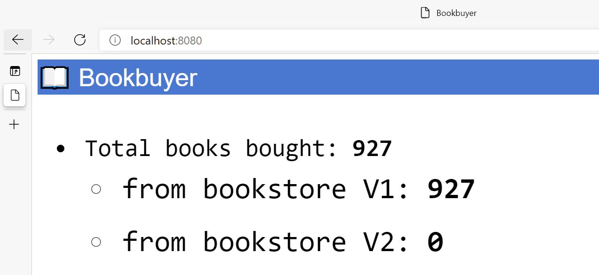

# Tutorial: Deploy a multi-container application managed by Open Service Mesh (OSM) using Azure Application Gateway ingress AKS add-on

Open Service Mesh (OSM) is a lightweight, extensible, Cloud Native service mesh that allows users to uniformly manage, secure, and get out-of-the-box observability features for highly dynamic microservice environments.

In this tutorial, you will:

> [!div class="checklist"]
>
> - View the current OSM cluster configuration
> - Create the namespace(s) for OSM to manage deployed applications in the namespace(s)
> - Onboard the namespaces to be managed by OSM
> - Deploy the sample multi-container application
> - Verify the multi-container application running inside the AKS cluster
> - Create an Azure Application Gateway to be used as the ingress controller for the multi-container appliction
> - Expose a service via the Azure Application Gateway ingress to the internet

## Before you begin

The steps detailed in this article assume that you've created an AKS cluster (Kubernetes `1.19+` and above, with Kubernetes RBAC enabled), have established a `kubectl` connection with the cluster (If you need help with any of these items, then see the [AKS quickstart](./kubernetes-walkthrough.md), have installed the [AKS OSM add-on](./servicemesh-osm-instgll.md), and will be creating a new Azure Application Gateway for ingress.

You must have the following resource installed:

- The Azure CLI, version 2.20.0 or later
- The `azure-preview` extension version 0.5.5 or later
- AKS cluster version 1.19+ using Azure CNI networking (Attached to an Azure Vnet)
- OSM version v0.8.0 or later

## View and verify the current OSM cluster configuration

Once the OSM add-on for AKS has been enabled on the AKS cluster, you can view the current configuration parmaters in the osm-config Kubernetes ConfigMap. Run the following command to view the ConfigMap properties:

```azurecli
kubectl get configmap -n kube-system osm-config -o json | jq '.data'
```

Output shows the current OSM configuration for the cluster.

```Output
{
  "egress": "false",
  "enable_debug_server": "false",
  "enable_privileged_init_container": "false",
  "envoy_log_level": "error",
  "permissive_traffic_policy_mode": "true",
  "prometheus_scraping": "true",
  "service_cert_validity_duration": "24h",
  "tracing_enable": "false",
  "use_https_ingress": "false"
}
```

Notice the **permissive_traffic_policy_mode** is configured to **true**. Permissive traffic policy mode in OSM is a mode where the [SMI](https://smi-spec.io/) traffic policy enforcement is bypassed. In this mode, OSM automatically discovers services that are a part of the service mesh and programs traffic policy rules on each Envoy proxy sidecar to be able to communicate with these services.

## Create namespaces for the multi-container application

In this totorial we will be using the OMS bookstore appplication that has the following application components:

- bookbuyer
- booktheif
- bookstore
- bookwarehous

Create namespaces for each of these application components.

```azurecli
for i in bookstore bookbuyer bookthief bookwarehouse; do kubectl create ns $i; done
```

You should see the following output:

```Output
namespace/bookstore created
namespace/bookbuyer created
namespace/bookthief created
namespace/bookwarehouse created
```

## Onboard the namespaces to be managed by OSM

When you add the namespaces to the OSM mesh, this will allow the OSM controller to automatically inject the Envoy sidecar proxy containers with you application. Run the following command to onboard the OSM bookstore application namespaces.

```azurecli
osm namespace add bookstore bookbuyer bookthief bookwarehouse
```

You should see the following output:

```Output
Namespace [bookstore] successfully added to mesh [osm]
Namespace [bookbuyer] successfully added to mesh [osm]
Namespace [bookthief] successfully added to mesh [osm]
Namespace [bookwarehouse] successfully added to mesh [osm]
```

## Deploy the Bookstore multi-container application to the AKS cluster

```azurecli
kubectl apply -f https://raw.githubusercontent.com/openservicemesh/osm/main/docs/example/manifests/apps/bookbuyer.yaml
```

```azurecli
kubectl apply -f https://raw.githubusercontent.com/openservicemesh/osm/main/docs/example/manifests/apps/bookthief.yaml
```

```azurecli
kubectl apply -f https://raw.githubusercontent.com/openservicemesh/osm/main/docs/example/manifests/apps/bookstore.yaml
```

```azurecli
kubectl apply -f https://raw.githubusercontent.com/openservicemesh/osm/main/docs/example/manifests/apps/bookwarehouse.yaml
```

All of the deployment outputs are summarized below.

```Output
serviceaccount/bookbuyer created
service/bookbuyer created
deployment.apps/bookbuyer created

serviceaccount/bookthief created
service/bookthief created
deployment.apps/bookthief created

service/bookstore created
serviceaccount/bookstore created
deployment.apps/bookstore created

serviceaccount/bookwarehouse created
service/bookwarehouse created
deployment.apps/bookwarehouse created
```

## Verify the Bookstore multi-container application running inside the AKS cluster

As of now we have deployed the bookstore mulit-container application, but it is only accessible from within the AKS cluster. Later we will add the Azure Application Gateway ingress controller to expose the appliction outside the AKS cluster. To verify that the application is running inside the cluster, we will use a port forward to view the bookbuyer component UI.

First let's get the bookbuyer pod's name

```Console
kubectl get pod -n bookbuyer
```

You should see output similar to the following. Your bookbuyer pod will have a unique name appended.

```Output
NAME                         READY   STATUS    RESTARTS   AGE
bookbuyer-7676c7fcfb-mtnrz   2/2     Running   0          7m8s
```

Once we have the pod's name, we can now use the port-forward command to setup a tunnel from our local system to the application inside the AKS cluster. Run the following command to setup the port forward for the local system port 8080. Again use your specice bookbuyer pod name.

```Console
kubectl port-forward bookbuyer-7676c7fcfb-mtnrz -n bookbuyer 8080:14001
```

You should see output similar to this.

```Output
Forwarding from 127.0.0.1:8080 -> 14001
Forwarding from [::1]:8080 -> 14001
```

While the port forwarding session is in place, navigate to the following url from a browser `http://localhost:8080`. You should now be able to see the bookbuyer application UI in the browser similar to the image below.



## Create an Azure Application Gateway to expose the bookbuyer application outside the AKS cluster

> [!NOTE]
> The following directions will create a new instance of the Azure Application Gateway to be used for ingress. If you have an existing Azure Application Gateway you wish to use, skip to the section for enabling the Application Gateway Ingress Controller add-on.

### Deploy a new Application Gateway

> [!NOTE]
> We are referencing existing documentation for enabling the Application Gateway Ingress Controller add-on for an existing AKS cluster. Some modifications have been made to suit the OSM materials. More detailed documentation on the subject can be found [here](https://docs.microsoft.com/azure/application-gateway/tutorial-ingress-controller-add-on-existing).

You'll now deploy a new Application Gateway, to simulate having an existing Application Gateway that you want to use to load balance traffic to your AKS cluster, _myCluster_. The name of the Application Gateway will be _myApplicationGateway_, but you will need to first create a public IP resource, named _myPublicIp_, and a new virtual network called _myVnet_ with address space 11.0.0.0/8, and a subnet with address space 11.1.0.0/16 called _mySubnet_, and deploy your Application Gateway in _mySubnet_ using _myPublicIp_.

When using an AKS cluster and Application Gateway in separate virtual networks, the address spaces of the two virtual networks must not overlap. The default address space that an AKS cluster deploys in is 10.0.0.0/8, so we set the Application Gateway virtual network address prefix to 11.0.0.0/8.

```azurecli-interactive
az group create --name myResourceGroup --location eastus2
az network public-ip create -n myPublicIp -g MyResourceGroup --allocation-method Static --sku Standard
az network vnet create -n myVnet -g myResourceGroup --address-prefix 11.0.0.0/8 --subnet-name mySubnet --subnet-prefix 11.1.0.0/16
az network application-gateway create -n myApplicationGateway -l canadacentral -g myResourceGroup --sku Standard_v2 --public-ip-address myPublicIp --vnet-name myVnet --subnet mySubnet
```

> [!NOTE]
> Application Gateway Ingress Controller (AGIC) add-on **only** supports Application Gateway v2 SKUs (Standard and WAF), and **not** the Application Gateway v1 SKUs.

### Enable the AGIC add-on in existing AKS cluster through Azure CLI

If you'd like to continue using Azure CLI, you can continue to enable the AGIC add-on in the AKS cluster you created, _myCluster_, and specify the AGIC add-on to use the existing Application Gateway you created, _myApplicationGateway_.

```azurecli-interactive
appgwId=$(az network application-gateway show -n myApplicationGateway -g myResourceGroup -o tsv --query "id")
az aks enable-addons -n myCluster -g myResourceGroup -a ingress-appgw --appgw-id $appgwId
```

You can verify the Azue Application Gateway AKS add-on has been enabled by the following command.

```azurecli
az aks list -g osm-aks-rg | jq -r .[].addonProfiles.ingressApplicationGateway.enabled
```

This should show the output as `true`.

### Peer the two virtual networks together

Since we deployed the AKS cluster in its own virtual network and the Application Gateway in another virtual network, you'll need to peer the two virtual networks together in order for traffic to flow from the Application Gateway to the pods in the cluster. Peering the two virtual networks requires running the Azure CLI command two separate times, to ensure that the connection is bi-directional. The first command will create a peering connection from the Application Gateway virtual network to the AKS virtual network; the second command will create a peering connection in the other direction.

```azurecli-interactive
nodeResourceGroup=$(az aks show -n myCluster -g myResourceGroup -o tsv --query "nodeResourceGroup")
aksVnetName=$(az network vnet list -g $nodeResourceGroup -o tsv --query "[0].name")

aksVnetId=$(az network vnet show -n $aksVnetName -g $nodeResourceGroup -o tsv --query "id")
az network vnet peering create -n AppGWtoAKSVnetPeering -g myResourceGroup --vnet-name myVnet --remote-vnet $aksVnetId --allow-vnet-access

appGWVnetId=$(az network vnet show -n myVnet -g myResourceGroup -o tsv --query "id")
az network vnet peering create -n AKStoAppGWVnetPeering -g $nodeResourceGroup --vnet-name $aksVnetName --remote-vnet $appGWVnetId --allow-vnet-access
```

## Expose the bookbuyer service to the internet

Apply the following ingress manifest to the AKS cluster to expose the bookbuyer service to the internet via the Azure Application Gateway.

```Console
kubectl apply -f - <<EOF
---
apiVersion: extensions/v1beta1
kind: Ingress
metadata:
  name: bookbuyer-ingress
  annotations:
    kubernetes.io/ingress.class: azure/application-gateway

spec:

  rules:
    - host: bookbuyer.contoso.com
      http:
        paths:
        - path: /
          backend:
            serviceName: bookbuyer
            servicePort: 14001

  backend:
    serviceName: bookbuyer
    servicePort: 14001
EOF
```

You should see the following output

```Output
Warning: extensions/v1beta1 Ingress is deprecated in v1.14+, unavailable in v1.22+; use networking.k8s.io/v1 Ingress
ingress.extensions/bookbuyer-ingress created
```

Since the host name in the ingress manifest is a psuedo name used for testing, the DNS name will not be available on the internet. We can alternatively use the curl program and past the hostname header to the Azure Application Gateway public IP address and receive a 200 code succesfully connecting us to the bookbuyer service.

```azurecli
appGWPIP=$(az network public-ip show -g MyResourceGroup -n myPublicIp -o tsv --query "ipAddress')
curl -H 'Host: bookbuyer.contoso.com' http://$appGWPIP/
```

You should see the following output

```Output

```

## Troubleshooting

- [AGIC Troubleshooting Documentation](https://docs.microsoft.com/en-us/azure/application-gateway/ingress-controller-troubleshoot)
- [Additional troubleshooting tools are available on AGIC's GitHub repo](https://github.com/Azure/application-gateway-kubernetes-ingress/blob/master/docs/troubleshootings/troubleshooting-installing-a-simple-application.md)
