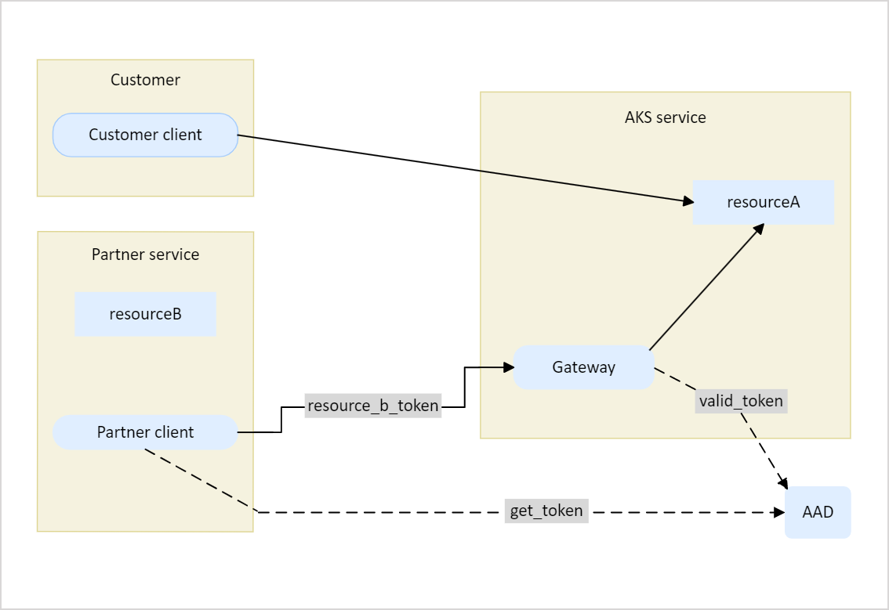

# Enable Azure resources to access Azure Kubernetes Service (AKS) clusters using Trusted Access

Many first-party partners depend on clusterAdmin kubeconfig and the publicly accessible kube-apiserver endpoint for authentication and access between their services and their customers' Azure Kubernetes Service (AKS) clusters. This approach


This article shows you how to use the AKS Trusted Access feature to enable your Azure resources to access your AKS clusters.

## Trusted Access feature overview

Trusted Access enables you to give explicit consent to your system-assigned MSI of allowed resources to access your AKS clusters using an Azure resource *RoleBinding*. Your Azure resources access AKS clusters through the AKS regional gateway via system-assigned MSI authentication with the appropriate Kubernetes permissions via an Azure resource *Role*. The Trusted Access feature allows you to access AKS clusters with different configurations, including but not limited to [private clusters](private-clusters.md), [clusters with local accounts disabled](managed-aad#disable-local-accounts), [AAD clusters](managed-aad.md), and [authorized IP range clusters](api-server-authorized-ip-ranges.md). The workflow is as follows:



At this time, the Trusted Access feature isn't available in any sovereign clouds. It's also hidden under the private feature flag, meaning that only allowed subscriptions can access this feature. To request access for your subscription, contact akssec@microsoft.com with the following thread:

    ```md
    Title: [TrustedAccess] Request feature preview for <your team name>
    Content:
    Team contact email(s): <>
    Subscription(s): <>
    ```

## Prerequisites

* An Azure account with an active subscription. [Create an account for free](https://azure.microsoft.com/free/?WT.mc_id=A261C142F).
* Resource type(s) that support [system-assigned managed identity](../active-directory/managed-identities-azure-resources/overview.md).
* Pre-defined roles with appropriate [AKS permissions](concepts-identity.md).
  * To learn about what roles to use in various scenarios, check out TBD.
* You can optionally provide IP ranges to access the AKS regional gateway.
* The **aks-preview** Azure CLI extension version **0.5.74 or later** is required for this action. If you're using Azure CLI, install the extension:
  
    ```azurecli
    az extension add --name aks-preview
    ```

    If you already have the extension, install any available updates:

    ```azurecli
    az extension update --name aks-preview
    ```
  
## Create an AKS cluster

Begin by [creating an AKS cluster](tutorial-kubernetes-deploy-cluster.md) in the same subscription as the Azure resource you want to allow to access the cluster.

## Create a Trusted Access RoleBinding

Use a REST API or the Azure CLI to create a Trusted Access RoleBinding under an AKS cluster.

# [API](#tab/REST API)

    ```rest
    PUT /subscriptions/<subscriptionId>/resourceGroups/<resourceGroup>/providers/Microsoft.ContainerService/managedClusters/<clusterName>/trustedAccessRoleBindings/<bindingName>
    ```

# [CLI](#tab/CLI)

    ```azurecli
    az aks trustedaccess rolebinding create --resource-group <resourceGroup> --cluster-name <clusterName> --name <bindingName> --role <roleName> [--allowed-azure-resource-id-with-system-assigned-msi=/subscriptions/<subscriptionID>/resourceGroups/TBD/providers/Microsoft.ContainerService/managedClusters/<clusterName>]
    ```

---

The following API is used to create an Azure resource RoleBinding:

    ```rest
    Request: PUT /subscriptions/<subscriptionID>/resourcegroups/<resourceGroup>/providers/Microsoft.ContainerService/managedClusters/<clusterName>/azureResourceRoleBindings/<bindingName>

    {
    "type": "Microsoft.ContainerService/ManagedClusters/AzureResourceRoleBindings",
    "name": "<bindingName>",
    "properties": {
        "role": "<roleName>",
        "targetResourceID": "<target-resource-id-with-system-assigned-msi>",
        "isClusterAdmin": false
    } 
    }
    ```
    * **`role`**: The name of the Azure resource *Role*.
    * **`targetResourceID`**: Optional. The resource ID of the Azure resource that's allowed to access the AKS cluster. If not provided, all the Azure resources that match the resource type in the specified subscription can manage the AKS cluster.
    * **`isClusterAdmin`**: Optional. TBD.

## List the Trusted Access Role

Use a REST API or the Azure CLI to list your available Trusted Access Roles.

# [API](#tab/REST API)

    ```rest
    GET /subscriptions/<subscriptionID>/providers/Microsoft.ContainerService/locations/<location>/trustedAccessRoles
    ```

# [CLI](#tab/CLI)

    ```azurecli
    az aks trustedaccess role list -l <location>
    ```

---

## List the Trusted Access RoleBinding

Use a REST API or the Azure CLI to list your specific Trusted Access RoleBinding.

# [API](#tab/REST API)

    ```rest
    GET /subscriptions/<subscriptionID>/resourceGroups/<resourceGroup>/providers/Microsoft.ContainerService/managedClusters/<clusterName>/trustedAccessRoleBindings
    ```

# [CLI](#tab/CLI)

    ```azurecli
    az aks trustedaccess rolebinding show --name <bindingName> --resource-group <clusterResourceGroup> --cluster-name <clusterName>
    ```

You can also use kubectl to list the RoleBinding:

    ```azurecli
    az aks get-credentials --resource-group <resourceGroup> --name <clusterName> --kubectl get clusterrolebinding |grep trustedaccess
    ```
---

## Troubleshooting

You may run into one of the following errors when listing your Trusted Access RoleBinding:

* `Connection timeout to data plane endpoint`: Make sure the outbound IP address is inside Azure Cloud. The data plane endpoint only accepts network requests from Azure Cloud.
* `Data plane endpoint returned error`: Check the status code and response body for details. If you're using kubectl, add the `-v=10` flag to show more debugging information.
* `401 error: Invalid token`: Debug your token using [jwt.ms](https://jwt.ms/) and check the following:
  * Token must not be expired
  * AUD must be `839858a7-cb51-4fcf-ad2f-222fe0d2d0d0`
  * Token must have a claim of `xms_mirid`
  * Value should match the `partner resource ID`

## Next steps

For more information on TBD.
