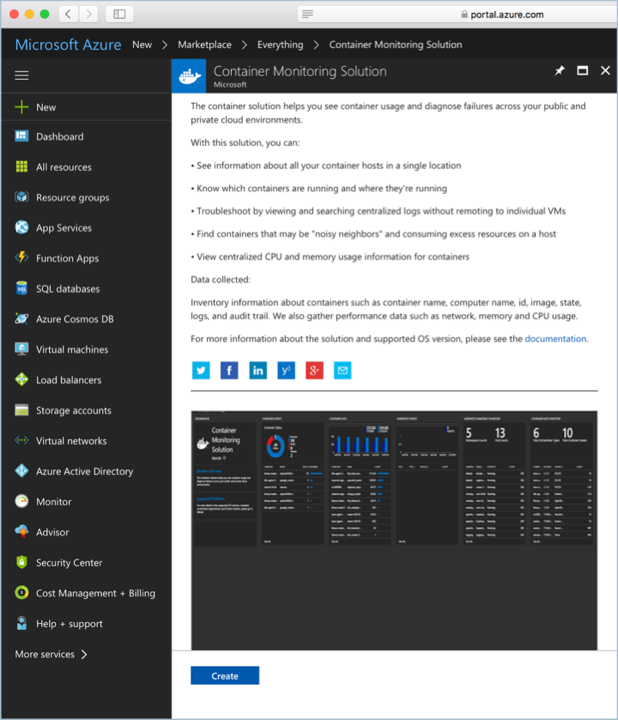
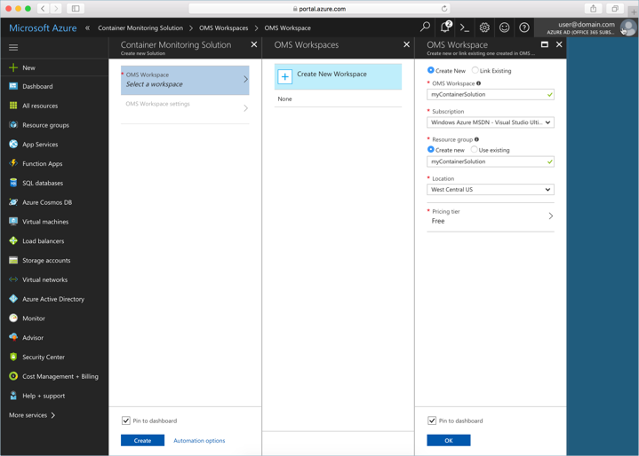
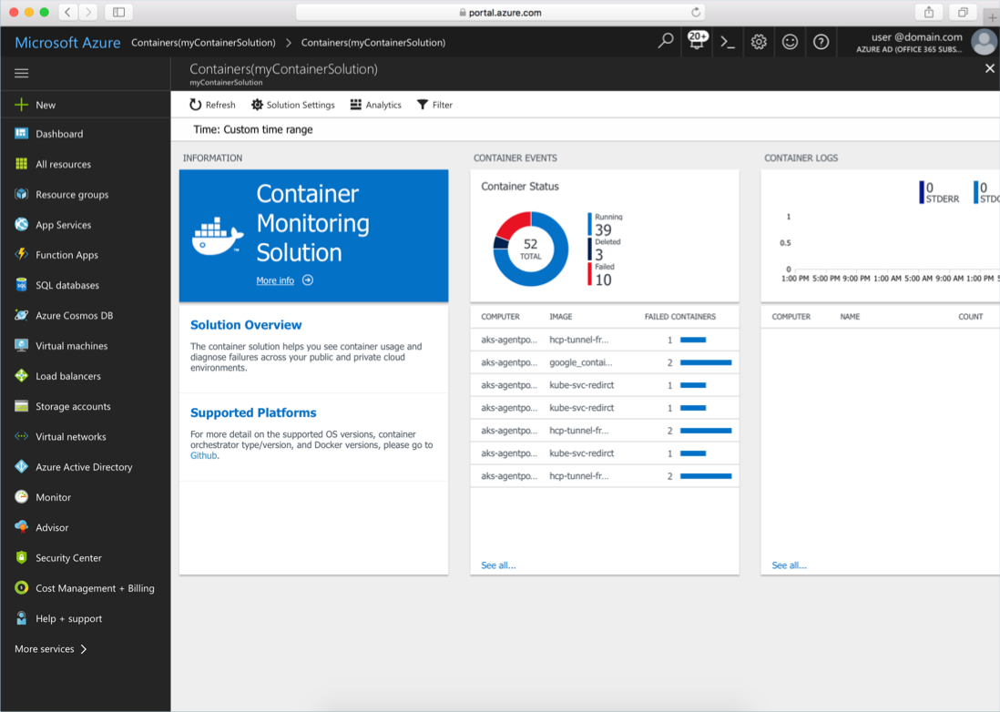

# Monitor Azure Container Service (AKS)

Monitoring your Kubernetes cluster and containers is critical, especially when running a production cluster, at scale, with multiple applications.

In this tutorial, you configure monitoring of your AKS cluster using the [Containers solution for Log Analytics](../log-analytics/log-analytics-containers.md).

This tutorial, part seven of eight, covers the following tasks:

> [!div class="checklist"]
> * Configuring the container monitoring solution
> * Configuring the monitoring agents
> * Access monitoring information in the Azure portal

## Before you begin

In previous tutorials, an application was packaged into container images, these images uploaded to Azure Container Registry, and a Kubernetes cluster created.

If you have not done these steps, and would like to follow along, return to [Tutorial 1 – Create container images](./tutorial-kubernetes-prepare-app.md).

## Configure the monitoring solution

In the Azure portal, select **New** and search for `Container Monitoring Solution`. Once located, select **Create**.



Create a new OMS workspace, or select an existing one. The OMS Workspace form guides you through this process.

When creating the workspace, select **Pin to dashboard** for easy retrieval.



When done, select **OK**. Once validation has completed, select **Create** to create the container monitoring solution.

Once the workspace has been created, it is presented to you in the Azure portal.

## Get Workspace settings

The Log analytics Workspace ID and Key are needed for configuring the solution agent on the Kubernetes nodes.

To retrieve these values, Select **OMS Workspace** from the container solutions left-hand menu. Select **Advanced settings** and take note of the **WORKSPACE ID** and the **PRIMARY KEY**.

## Configure monitoring agents

The following Kubernetes manifest file can be used to configure the container monitoring agents on a Kubernetes cluster. It creates a Kubernetes [DaemonSet](https://kubernetes.io/docs/concepts/workloads/controllers/daemonset/), which runs a single pod on each cluster node.

Save the following text to a file named `oms-daemonset.yaml`, and replace the placeholder values for `WSID` and `KEY` with your Log Analytics Workspace ID and Key.

```YAML
apiVersion: extensions/v1beta1
kind: DaemonSet
metadata:
 name: omsagent
spec:
 template:
  metadata:
   labels:
    app: omsagent
    agentVersion: 1.4.0-12
    dockerProviderVersion: 10.0.0-25
  spec:
   containers:
     - name: omsagent
       image: "microsoft/oms"
       imagePullPolicy: Always
       env:
       - name: WSID
         value: <WSID>
       - name: KEY
         value: <KEY>
       securityContext:
         privileged: true
       ports:
       - containerPort: 25225
         protocol: TCP
       - containerPort: 25224
         protocol: UDP
       volumeMounts:
        - mountPath: /var/run/docker.sock
          name: docker-sock
        - mountPath: /var/opt/microsoft/omsagent/state/containerhostname
          name: container-hostname
        - mountPath: /var/log
          name: host-log
       livenessProbe:
        exec:
         command:
         - /bin/bash
         - -c
         - ps -ef | grep omsagent | grep -v "grep"
        initialDelaySeconds: 60
        periodSeconds: 60
   nodeSelector:
    beta.kubernetes.io/os: linux
   # Tolerate a NoSchedule taint on master that ACS Engine sets.
   tolerations:
    - key: "node-role.kubernetes.io/master"
      operator: "Equal"
      value: "true"
      effect: "NoSchedule"
   volumes:
    - name: docker-sock
      hostPath:
       path: /var/run/docker.sock
    - name: container-hostname
      hostPath:
       path: /etc/hostname
    - name: host-log
      hostPath:
       path: /var/log
```

Create the DaemonSet with the following command:

```azurecli-interactive
kubectl create -f oms-daemonset.yaml
```

To see that the DaemonSet is created, run:

```azurecli-interactive
kubectl get daemonset
```

Output is similar to the following:

```
NAME       DESIRED   CURRENT   READY     UP-TO-DATE   AVAILABLE   NODE-SELECTOR                 AGE
omsagent   3         3         3         3            3           beta.kubernetes.io/os=linux   8m
```

After the agents are running, it takes several minutes for OMS to ingest and process the data.

## Access monitoring data

In the Azure portal, select the Log Analytics workspace that has been pinned to the portal dashboard. Click on the **Container Monitoring Solution** tile. Here you can find information about the AKS cluster and containers from the cluster.



See the [Azure Log Analytics documentation](../log-analytics/index.yml) for detailed guidance on querying and analyzing monitoring data.

## Next steps

In this tutorial, you monitored your Kubernetes cluster with OMS. Tasks covered included:

> [!div class="checklist"]
> * Configuring the container monitoring solution
> * Configuring the monitoring agents
> * Access monitoring information in the Azure portal

Advance to the next tutorial to learn about upgrading Kubernetes to a new version.

> [!div class="nextstepaction"]
> [Upgrade Kubernetes](./tutorial-kubernetes-upgrade-cluster.md)