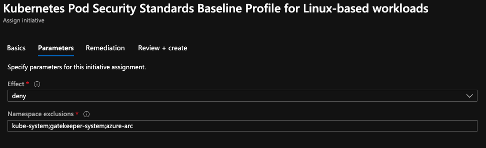
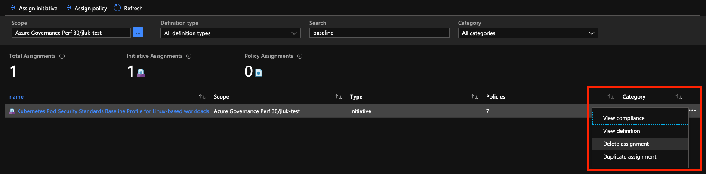

# Secure pods with Azure Policy

To improve the security of your AKS cluster, you can control what functions pods are granted and if anything is running against company policy. This access is defined through built-in policies provided by the [Azure Policy Add-on for AKS][kubernetes-policy-reference]. By providing additional control over the security aspects of your pod's specification, like root privileges, enables stricter security adherence and visibility into what is deployed in your cluster. If a pod does not meet conditions specified in the policy, Azure Policy can disallow the pod to start or flag a violation. This article shows you how to use Azure Policy to limit the deployment of pods in AKS.

## Before you begin

This article assumes that you have an existing AKS cluster. If you need an AKS cluster, see the AKS quickstart [using the Azure CLI][aks-quickstart-cli] or [using the Azure portal][aks-quickstart-portal].

### Install the Azure Policy Add-on for AKS

To secure AKS pods through Azure Policy, you need to install the Azure Policy Add-on for AKS on an AKS cluster. Follow these [steps to install the Azure Policy Add-on](../governance/policy/concepts/policy-for-kubernetes.md#install-azure-policy-add-on-for-aks).

This document assumes you have the following, which are deployed in the walk-through linked above.

* Registered the `Microsoft.ContainerService` and `Microsoft.PolicyInsights` resource providers using `az provider register`
* Azure CLI 2.12 or greater
* An AKS cluster on a version of 1.15 or greater installed with the Azure Policy Add-on

## Overview of securing pods with Azure Policy for AKS

>[!NOTE]
> This document details how to use Azure Policy to secure pods, which is the successor to the [Kubernetes pod security policy feature in preview](use-pod-security-policies.md).
> **Both pod security policy (preview) and the Azure Policy Add-on for AKS cannot be enabled simultaneously.**
> 
> If installing the Azure Policy Add-on into a cluster with pod security policy enabled, [follow these steps to disable pod security policy](use-pod-security-policies.md#enable-pod-security-policy-on-an-aks-cluster).

In an AKS cluster, an admission controller is used to intercept requests to the API server when a resource is to be created and updated. The admission controller can then *validate* the resource request against a set of rules on whether it should be created.

Previously, the feature [pod security policy (preview)](use-pod-security-policies.md) was enabled through the Kubernetes project to limit what pods can be deployed.

By using the Azure Policy Add-on, an AKS cluster can use built-in Azure policies, which secure pods and other Kubernetes resources similar to pod security policy previously. The Azure Policy Add-on for AKS installs a managed instance of [Gatekeeper](https://github.com/open-policy-agent/gatekeeper), a validating admission controller. Azure Policy for Kubernetes is built on the open-source Open Policy Agent, which relies on the [Rego policy language](../governance/policy/concepts/policy-for-kubernetes.md#policy-language).

This document details how to use Azure Policy to secure pods in an AKS cluster and instruct how to migrate from pod security policies (preview).

## Limitations

The following general limitations apply to the Azure Policy Add-on for Kubernetes clusters:

- Azure Policy Add-on for Kubernetes is supported on Kubernetes version **1.14** or higher.
- Azure Policy Add-on for Kubernetes can only be deployed to Linux node pools
- Only built-in policy definitions are supported
- Maximum number of Non-compliant records per policy per cluster: **500**
- Maximum number of Non-compliant records per subscription: **1 million**
- Installations of Gatekeeper outside of the Azure Policy Add-on aren't supported. Uninstall any
  components installed by a previous Gatekeeper installation before enabling the Azure Policy
  Add-on.
- [Reasons for non-compliance](../governance/policy/how-to/determine-non-compliance.md#compliance-reasons) aren't
  available for this [Resource Provider mode](../governance/policy/concepts/definition-structure.md#resource-provider-modes)

The following limitations apply only to the Azure Policy Add-on for AKS:

- [AKS Pod security policy (preview)](use-pod-security-policies.md) and the Azure Policy Add-on
  for AKS can't both be enabled. 
- Namespaces automatically excluded by Azure Policy Add-on for evaluation: _kube-system_,
  _gatekeeper-system_, and _aks-periscope_.

### Recommendations

The following are general recommendations for using the Azure Policy Add-on:

- The Azure Policy Add-on requires 3 Gatekeeper components to run: 1 audit pod and 2 webhook pod
  replicas. These components consume more resources as the count of Kubernetes resources and policy
  assignments increases in the cluster which requires audit and enforcement operations.

  - For less than 500 pods in a single cluster with a max of 20 constraints: 2 vCPUs and 350 MB
    memory per component.
  - For more than 500 pods in a single cluster with a max of 40 constraints: 3 vCPUs and 600 MB
    memory per component.

The following recommendation applies only to AKS and the Azure Policy Add-on:

- Use system node pool with `CriticalAddonsOnly` taint to schedule Gatekeeper pods. For more
  information, see
  [Using system node pools](use-system-pools.md#system-and-user-node-pools).
- Secure outbound traffic from your AKS clusters. For more information, see
  [Control egress traffic for cluster nodes](limit-egress-traffic.md).
- If the cluster has `aad-pod-identity` enabled, Node Managed Identity (NMI) pods modify the nodes'
  iptables to intercept calls to the Azure Instance Metadata endpoint. This configuration means any
  request made to the Metadata endpoint is intercepted by NMI even if the pod doesn't use
  `aad-pod-identity`. AzurePodIdentityException CRD can be configured to inform `aad-pod-identity`
  that any requests to the Metadata endpoint originating from a pod that matches labels defined in
  CRD should be proxied without any processing in NMI. The system pods with
  `kubernetes.azure.com/managedby: aks` label in _kube-system_ namespace should be excluded in
  `aad-pod-identity` by configuring the AzurePodIdentityException CRD. For more information, see
  [Disable aad-pod-identity for a specific pod or application](https://github.com/Azure/aad-pod-identity/blob/master/docs/readmes/README.app-exception.md).
  To configure an exception, install the
  [mic-exception YAML](https://github.com/Azure/aad-pod-identity/blob/master/deploy/infra/mic-exception.yaml).

The Azure Policy add-on requires CPU and memory resources to operate. These requirements increase as the size of a cluster increases. See [Azure Policy recommendations][policy-recommendations] for general guidance for using the Azure Policy add-on.

## Azure policies to secure Kubernetes pods

After installing the Azure Policy Add-on, no policies are applied by default.

There are 11 built-in individual Azure policies and two built-in initiatives that specifically secure pods in an AKS cluster.
Each policy can be customized with an effect. A full list of [AKS policies and their supported effects is listed here][policy-samples]. Read more about [Azure Policy effects](../governance/policy/concepts/effects.md).

Azure policies can be applied at the management group, subscription, or resource group level. When assigning a policy at the resource group level, ensure the target AKS cluster's resource group is selected within scope of the policy. Every cluster in the assigned scope with the Azure Policy Add-on installed is in scope for the policy.

If using [pod security policy (preview) ](use-pod-security-policies.md), learn how to [migrate to Azure Policy and about other behavioral differences](#migrate-from-kubernetes-pod-security-policy-to-azure-policy).

### Built-in policy initiatives

An initiative in Azure Policy is a collection of policy definitions that are tailored towards achieving a singular overarching goal. The use of initiatives can simplify the management and assignment of policies across AKS clusters. An initiative exists as a single object, learn more about [Azure Policy initiatives](../governance/policy/overview.md#initiative-definition).

Azure Policy for Kubernetes offers two built-in initiatives, which secure pods, [baseline](https://portal.azure.com/#blade/Microsoft_Azure_Policy/PolicyDetailBlade/definitionId/%2Fproviders%2FMicrosoft.Authorization%2FpolicySetDefinitions%2Fa8640138-9b0a-4a28-b8cb-1666c838647d) and [restricted](https://portal.azure.com/#blade/Microsoft_Azure_Policy/PolicyDetailBlade/definitionId/%2Fproviders%2FMicrosoft.Authorization%2FpolicySetDefinitions%2F42b8ef37-b724-4e24-bbc8-7a7708edfe00).

Both built-in initiatives are built from definitions used in [pod security policy from Kubernetes](https://github.com/kubernetes/website/blob/master/content/en/examples/policy/baseline-psp.yaml).

|[Pod security policy control](https://kubernetes.io/docs/concepts/policy/pod-security-policy/#what-is-a-pod-security-policy)| Azure Policy Definition Link| [Baseline initiative](https://portal.azure.com/#blade/Microsoft_Azure_Policy/PolicyDetailBlade/definitionId/%2Fproviders%2FMicrosoft.Authorization%2FpolicySetDefinitions%2Fa8640138-9b0a-4a28-b8cb-1666c838647d) | [Restricted initiative](https://portal.azure.com/#blade/Microsoft_Azure_Policy/PolicyDetailBlade/definitionId/%2Fproviders%2FMicrosoft.Authorization%2FpolicySetDefinitions%2F42b8ef37-b724-4e24-bbc8-7a7708edfe00) |
|---|---|---|---|
|Disallow running of privileged containers|[Public Cloud](https://portal.azure.com/#blade/Microsoft_Azure_Policy/PolicyDetailBlade/definitionId/%2Fproviders%2FMicrosoft.Authorization%2FpolicyDefinitions%2F95edb821-ddaf-4404-9732-666045e056b4)| Yes | Yes
|Disallow shared usage of host namespaces|[Public Cloud](https://portal.azure.com/#blade/Microsoft_Azure_Policy/PolicyDetailBlade/definitionId/%2Fproviders%2FMicrosoft.Authorization%2FpolicyDefinitions%2F47a1ee2f-2a2a-4576-bf2a-e0e36709c2b8)| Yes | Yes
|Restrict all usage of host networking and ports|[Public Cloud](https://portal.azure.com/#blade/Microsoft_Azure_Policy/PolicyDetailBlade/definitionId/%2Fproviders%2FMicrosoft.Authorization%2FpolicyDefinitions%2F82985f06-dc18-4a48-bc1c-b9f4f0098cfe)| Yes | Yes
|Restrict any usage of the host filesystem|[Public Cloud](https://portal.azure.com/#blade/Microsoft_Azure_Policy/PolicyDetailBlade/definitionId/%2Fproviders%2FMicrosoft.Authorization%2FpolicyDefinitions%2F098fc59e-46c7-4d99-9b16-64990e543d75)| Yes | Yes
|Restrict Linux capabilities to the [default set](https://docs.docker.com/engine/reference/run/#runtime-privilege-and-linux-capabilities)|[Public Cloud](https://portal.azure.com/#blade/Microsoft_Azure_Policy/PolicyDetailBlade/definitionId/%2Fproviders%2FMicrosoft.Authorization%2FpolicyDefinitions%2Fc26596ff-4d70-4e6a-9a30-c2506bd2f80c) | Yes | Yes
|Restrict usage of defined volume types|[Public Cloud](https://portal.azure.com/#blade/Microsoft_Azure_Policy/PolicyDetailBlade/definitionId/%2Fproviders%2FMicrosoft.Authorization%2FpolicyDefinitions%2F16697877-1118-4fb1-9b65-9898ec2509ec)| - | Yes - allowed volume types are `configMap`, `emptyDir`, `projected`, `downwardAPI`, `persistentVolumeClaim`|
|Privilege escalation to root|[Public Cloud](https://portal.azure.com/#blade/Microsoft_Azure_Policy/PolicyDetailBlade/definitionId/%2Fproviders%2FMicrosoft.Authorization%2FpolicyDefinitions%2F1c6e92c9-99f0-4e55-9cf2-0c234dc48f99) | - | Yes |
|Restrict the user and group IDs of the container|[Public Cloud](https://portal.azure.com/#blade/Microsoft_Azure_Policy/PolicyDetailBlade/definitionId/%2Fproviders%2FMicrosoft.Authorization%2FpolicyDefinitions%2Ff06ddb64-5fa3-4b77-b166-acb36f7f6042) | - | Yes|
|Restrict allocating an FSGroup that owns the pod's volumes|[Public Cloud](https://portal.azure.com/#blade/Microsoft_Azure_Policy/PolicyDetailBlade/definitionId/%2Fproviders%2FMicrosoft.Authorization%2FpolicyDefinitions%2Ff06ddb64-5fa3-4b77-b166-acb36f7f6042) | - | Yes - allowed rules are `runAsUser: mustRunAsNonRoot`, `supplementalGroup: mustRunAs 1:65536`, `fsGroup: mustRunAs 1:65535`, `runAsGroup: mustRunAs 1:65535`.  |
|Requires seccomp profile|[Public Cloud](https://portal.azure.com/#blade/Microsoft_Azure_Policy/PolicyDetailBlade/definitionId/%2Fproviders%2FMicrosoft.Authorization%2FpolicyDefinitions%2F975ce327-682c-4f2e-aa46-b9598289b86c) | - | Yes, allowedProfiles are *`docker/default` or `runtime/default` |

\* docker/default is deprecated in Kubernetes since v1.11

### Additional optional policies

There are additional Azure policies, which can be singly applied outside of applying an initiative. Consider appending these policies in addition to initiatives if your requirements are not met by the built-in initiatives.

|[Pod security policy control](https://kubernetes.io/docs/concepts/policy/pod-security-policy/#what-is-a-pod-security-policy)| Azure Policy Definition Link| Apply in addition to Baseline initiative | Apply in addition to Restricted initiative |
|---|---|---|---|
|Define the AppArmor profile used by containers|[Public Cloud](https://portal.azure.com/#blade/Microsoft_Azure_Policy/PolicyDetailBlade/definitionId/%2Fproviders%2FMicrosoft.Authorization%2FpolicyDefinitions%2F511f5417-5d12-434d-ab2e-816901e72a5e) | Optional | Optional |
|Allow mounts that are not read only|[Public Cloud](https://portal.azure.com/#blade/Microsoft_Azure_Policy/PolicyDetailBlade/definitionId/%2Fproviders%2FMicrosoft.Authorization%2FpolicyDefinitions%2Fdf49d893-a74c-421d-bc95-c663042e5b80) | Optional | Optional |
|Restrict to specific FlexVolume drivers|[Public Cloud](https://portal.azure.com/#blade/Microsoft_Azure_Policy/PolicyDetailBlade/definitionId/%2Fproviders%2FMicrosoft.Authorization%2FpolicyDefinitions%2Ff4a8fce0-2dd5-4c21-9a36-8f0ec809d663) | Optional - use if you only want to restrict FlexVolume drivers, but not others set by "Restrict usage of defined volume types" | Not applicable - The restricted initiative includes "Restrict usage of defined volume types," which disallows all FlexVolume drivers |

### Unsupported built-in policies for managed AKS clusters

> [!NOTE]
> The following 3 policies are **not supported in AKS** due to customizing aspects managed and secured by AKS as a managed service. These policies are built specifically for Azure Arc connected clusters with unmanaged control planes.

|[Pod security policy control](https://kubernetes.io/docs/concepts/policy/pod-security-policy/#what-is-a-pod-security-policy)|
|---|
|Define the custom SELinux context of a container|
|Restrict the sysctl profile used by containers|
|Default Proc Mount types are defined to reduce attack surface|

<!---
# Removing until custom initiatives are supported the week after preview

#### Custom initiative

If the built-in initiatives to address pod security do not match your requirements, you can choose your own policies to exist in a custom initiative. Read more about [building custom initatives in Azure Policy](../governance/policy/tutorials/create-and-manage#create-and-assign-an-initiative-definition).

--->

### Namespace exclusion

> [!WARNING]
> Pods in admin namespaces such as kube-system must run for a cluster to remain healthy, removing a required namespace from the the list of default excluded namespaces may trigger policy violations due to a required system pod.

AKS requires system pods to run on a cluster to provide critical services, such as DNS resolution. Policies which limit pod functionality can impact the ability system pod stability. As a result, the following namespaces are **excluded from policy evaluation during admission requests during create, update, and policy auditing**. This forces new deployments to these namespaces to be excluded from Azure policies.

1. kube-system
1. gatekeeper-system
1. azure-arc
1. aks-periscope

Additional custom namespaces can be excluded from evaluation during create, update, and audit. These exclusions should be used if you have specialized pods that run in a sanctioned namespace and want to avoid triggering audit violations.

## Apply the baseline initiative

> [!TIP]
> All policies default to an audit effect. Effects can be updated to deny at any time through Azure Policy.

To apply the baseline initiative, we can assign through the Azure portal.
<!--
1. Navigate to the Policy service in Azure portal
1. In the left pane of the Azure Policy page, select **Definitions**
1. Search for "Baseline Profile" on the search pane to the right of the page
1. Select `Kubernetes Pod Security Standards Baseline Profile for Linux-based workloads` from the `Kubernetes` category
-->
1. Follow [this link to the Azure portal](https://portal.azure.com/#blade/Microsoft_Azure_Policy/PolicyDetailBlade/definitionId/%2Fproviders%2FMicrosoft.Authorization%2FpolicySetDefinitions%2Fa8640138-9b0a-4a28-b8cb-1666c838647d) to review the pod security baseline initiative
1. Set the **Scope** to the subscription level or only the resource group holding AKS clusters with the Azure Policy Add-on enabled
1. Select the **Parameters** page and update the **Effect** from `audit` to `deny` to block new deployments violating the baseline initiative
1. Add additional namespaces to exclude from evaluation during create, update, and audit, [some namespaces are forcibly excluded from policy evaluation.](#namespace-exclusion)

1. Select **Review + create** to submit the policies

Confirm policies are applied to your cluster by running `kubectl get constrainttemplates`.

> [!NOTE]
> Policies can take [up to 20 minutes to sync](../governance/policy/concepts/policy-for-kubernetes.md#assign-a-built-in-policy-definition) into each cluster.

The output should be similar to:

```console
$ kubectl get constrainttemplate
NAME                                     AGE
k8sazureallowedcapabilities              30m
k8sazureblockhostnamespace               30m
k8sazurecontainernoprivilege             30m
k8sazurehostfilesystem                   30m
k8sazurehostnetworkingports              30m
```

## Validate rejection of a privileged pod

Let's first test what happens when you schedule a pod with the security context of `privileged: true`. This security context escalates the pod's privileges. The baseline initiative disallows privileged pods, so the request will be denied resulting in the deployment being rejected.

Create a file named `nginx-privileged.yaml` and paste the following YAML manifest:

```yaml
apiVersion: v1
kind: Pod
metadata:
  name: nginx-privileged
spec:
  containers:
    - name: nginx-privileged
      image: nginx
      securityContext:
        privileged: true
```

Create the pod with [kubectl apply][kubectl-apply] command and specify the name of your YAML manifest:

```console
kubectl apply -f nginx-privileged.yaml
```

As expected the pod fails to be scheduled, as shown in the following example output:

```console
$ kubectl apply -f privileged.yaml

Error from server ([denied by azurepolicy-container-no-privilege-00edd87bf80f443fa51d10910255adbc4013d590bec3d290b4f48725d4dfbdf9] Privileged container is not allowed: nginx-privileged, securityContext: {"privileged": true}): error when creating "privileged.yaml": admission webhook "validation.gatekeeper.sh" denied the request: [denied by azurepolicy-container-no-privilege-00edd87bf80f443fa51d10910255adbc4013d590bec3d290b4f48725d4dfbdf9] Privileged container is not allowed: nginx-privileged, securityContext: {"privileged": true}
```

The pod doesn't reach the scheduling stage, so there are no resources to delete before you move on.

## Test creation of an unprivileged pod

In the previous example, the container image automatically tried to use root to bind NGINX to port 80. This request was denied by the baseline policy initiative, so the pod fails to start. Let's try now running that same NGINX pod without privileged access.

Create a file named `nginx-unprivileged.yaml` and paste the following YAML manifest:

```yaml
apiVersion: v1
kind: Pod
metadata:
  name: nginx-unprivileged
spec:
  containers:
    - name: nginx-unprivileged
      image: nginx
```

Create the pod using the [kubectl apply][kubectl-apply] command and specify the name of your YAML manifest:

```console
kubectl apply -f nginx-unprivileged.yaml
```

The pod is successfully scheduled. When you check the status of the pod using the [kubectl get pods][kubectl-get] command, the pod is *Running*:

```console
$ kubectl get pods

NAME                 READY   STATUS    RESTARTS   AGE
nginx-unprivileged   1/1     Running   0          18s
```

This example shows the baseline initiative affecting only deployments which violate policies in the collection. Allowed deployments continue to function.

Delete the NGINX unprivileged pod using the [kubectl delete][kubectl-delete] command and specify the name of your YAML manifest:

```console
kubectl delete -f nginx-unprivileged.yaml
```

## Disable policies and the Azure Policy Add-on

To remove the baseline initiative:

1. Navigate to the Policy pane on the Azure portal
1. Select **Assignments** from the left pane
1. Click the "..." button next to the Baseline Profile
1. Select "Delete assignment"



To disable the Azure Policy Add-on, use the [az aks disable-addons][az-aks-disable-addons] command.

```azurecli
az aks disable-addons --addons azure-policy --name MyAKSCluster --resource-group MyResourceGroup
```

Learn how to remove the [Azure Policy Add-on from Azure portal](../governance/policy/concepts/policy-for-kubernetes.md#remove-the-add-on-from-aks).

## Migrate from Kubernetes pod security policy to Azure Policy

To migrate from pod security policy, you need to take the following actions on a cluster.

1. [Disable pod security policy](use-pod-security-policies.md#clean-up-resources) on the cluster
1. Enable the [Azure Policy Add-on][kubernetes-policy-reference]
1. Enable the desired Azure policies from [available built-in policies][policy-samples]

Below is a summary of behavior changes between pod security policy and Azure Policy.

|Scenario| Pod security policy | Azure Policy |
|---|---|---|
|Installation|Enable pod security policy feature |Enable Azure Policy Add-on
|Deploy policies| Deploy pod security policy resource| Assign Azure policies to the subscription or resource group scope. The Azure Policy Add-on is required for Kubernetes resource applications.
| Default policies | When pod security policy is enabled in AKS, default Privileged and Unrestricted policies are applied. | No default policies are applied by enabling the Azure Policy Add-on. You must explicitly enable policies in Azure Policy.
| Who can create and assign policies | Cluster admin creates a pod security policy resource | Users must have a minimum role of 'owner' or 'Resource Policy Contributor' permissions on the AKS cluster resource group. - Through API, users can assign policies at the AKS cluster resource scope. The user should have minimum of 'owner' or 'Resource Policy Contributor' permissions on AKS cluster resource. - In the Azure portal, policies can be assigned at the Management group/subscription/resource group level.
| Authorizing policies| Users and Service Accounts require explicit permissions to use pod security policies. | No additional assignment is required to authorize policies. Once policies are assigned in Azure, all cluster users can use these policies.
| Policy applicability | The admin user bypasses the enforcement of pod security policies. | All users (admin & non-admin) sees the same policies. There is no special casing based on users. Policy application can be excluded at the namespace level.
| Policy scope | Pod security policies are not namespaced | Constraint templates used by Azure Policy are not namespaced.
| Deny/Audit/Mutation action | Pod security policies support only deny actions. Mutation can be done with default values on create requests. Validation can be done during update requests.| Azure Policy supports both audit & deny actions. Mutation is not supported yet, but planned.
| Pod security policy compliance | There is no visibility on compliance of pods that existed before enabling pod security policy. Non-compliant pods created after enabling pod security policies are denied. | Non-compliant pods that existed before applying Azure policies would show up in policy violations. Non-compliant pods created after enabling Azure policies are denied if policies are set with a deny effect.
| How to view policies on the cluster | `kubectl get psp` | `kubectl get constrainttemplate` - All policies are returned.
| Pod security policy standard - Privileged | A privileged pod security policy resource is created by default when enabling the feature. | Privileged mode implies no restriction, as a result it is equivalent to not having any Azure Policy assignment.
| [Pod security policy standard - Baseline/default](https://kubernetes.io/docs/concepts/security/pod-security-standards/#baseline-default) | User installs a pod security policy baseline resource. | Azure Policy provides a [built-in baseline initiative](https://portal.azure.com/#blade/Microsoft_Azure_Policy/PolicyDetailBlade/definitionId/%2Fproviders%2FMicrosoft.Authorization%2FpolicySetDefinitions%2Fa8640138-9b0a-4a28-b8cb-1666c838647d) which maps to the baseline pod security policy.
| [Pod security policy standard - Restricted](https://kubernetes.io/docs/concepts/security/pod-security-standards/#restricted) | User installs a pod security policy restricted resource. | Azure Policy provides a [built-in restricted initiative](https://portal.azure.com/#blade/Microsoft_Azure_Policy/PolicyDetailBlade/definitionId/%2Fproviders%2FMicrosoft.Authorization%2FpolicySetDefinitions%2F42b8ef37-b724-4e24-bbc8-7a7708edfe00) which maps to the restricted pod security policy.

## Next steps

This article showed you how to apply an Azure policy which restricts privileged pods from being deployed to prevent the use of privileged access. There are many policies which can be applied, such as policies that restrict the use of volumes. For more information on the available options, see the [Azure Policy for Kubernetes reference docs][kubernetes-policy-reference].

For more information about limiting pod network traffic, see [Secure traffic between pods using network policies in AKS][network-policies].

<!-- LINKS - external -->
[kubectl-apply]: https://kubernetes.io/docs/reference/generated/kubectl/kubectl-commands#apply
[kubectl-delete]: https://kubernetes.io/docs/reference/generated/kubectl/kubectl-commands#delete
[kubectl-get]: https://kubernetes.io/docs/reference/generated/kubectl/kubectl-commands#get
[kubectl-create]: https://kubernetes.io/docs/reference/generated/kubectl/kubectl-commands#create
[kubectl-describe]: https://kubernetes.io/docs/reference/generated/kubectl/kubectl-commands#describe
[kubectl-logs]: https://kubernetes.io/docs/reference/generated/kubectl/kubectl-commands#logs
[terms-of-use]: https://azure.microsoft.com/support/legal/preview-supplemental-terms/
[aad-pod-identity]: https://github.com/Azure/aad-pod-identity
[aad-pod-identity-exception]: https://github.com/Azure/aad-pod-identity/blob/master/docs/readmes/README.app-exception.md

<!-- LINKS - internal -->
[policy-recommendations]: ../governance/policy/concepts/policy-for-kubernetes.md
[policy-limitations]: ../governance/policy/concepts/policy-for-kubernetes.md?#limitations
[kubernetes-policy-reference]: ../governance/policy/concepts/policy-for-kubernetes.md
[policy-samples]: ./policy-reference.md#microsoftcontainerservice
[aks-quickstart-cli]: kubernetes-walkthrough.md
[aks-quickstart-portal]: kubernetes-walkthrough-portal.md
[install-azure-cli]: /cli/azure/install-azure-cli
[network-policies]: use-network-policies.md
[az-feature-register]: /cli/azure/feature#az-feature-register
[az-feature-list]: /cli/azure/feature#az-feature-list
[az-provider-register]: /cli/azure/provider#az-provider-register
[az-aks-get-credentials]: /cli/azure/aks#az-aks-get-credentials
[az-aks-update]: /cli/azure/ext/aks-preview/aks#ext-aks-preview-az-aks-update
[az-extension-add]: /cli/azure/extension#az-extension-add
[aks-support-policies]: support-policies.md
[aks-faq]: faq.md
[az-extension-add]: /cli/azure/extension#az-extension-add
[az-extension-update]: /cli/azure/extension#az-extension-update
[az-aks-disable-addons]: /cli/azure/aks#az-aks-disable-addons
[az-policy-assignment-delete]: /cli/azure/policy/assignment#az-policy-assignment-delete