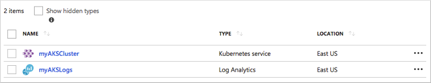
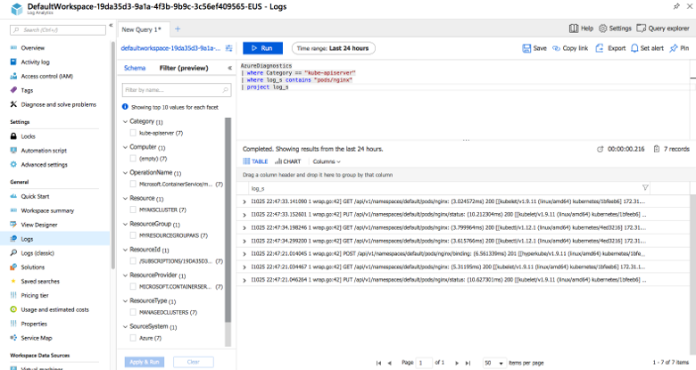

# Enable and review Kubernetes master node logs in Azure Kubernetes Service (AKS)

With Azure Kubernetes Service (AKS), the master components such as the *kube-apiserver* and *kube-controller-manager* are provided as a managed service. You create and manage the nodes that run the *kubelet* and container runtime, and deploy your applications through the managed Kubernetes API server. To help troubleshoot your application and services, you may need to view the logs generated by these master components. This article shows you how to use Azure Monitor logs to enable and query the logs from the Kubernetes master components.

## Before you begin

This article requires an existing AKS cluster running in your Azure account. If you do not already have an AKS cluster, create one using the [Azure CLI][cli-quickstart] or [Azure portal][portal-quickstart]. Azure Monitor logs works with both RBAC and non-RBAC enabled AKS clusters.

## Enable diagnostics logs

To help collect and review data from multiple sources, Azure Monitor logs provides a query language and analytics engine that provides insights to your environment. A workspace is used to collate and analyze the data, and can integrate with other Azure services such as Application Insights and Security Center. To use a different platform to analyze the logs, you can instead choose to send diagnostic logs to an Azure storage account or event hub. For more information, see [What is Azure Monitor logs?][log-analytics-overview].

Azure Monitor logs are enabled and managed in the Azure portal. To enable log collection for the Kubernetes master components in your AKS cluster, open the Azure portal in a web browser and complete the following steps:

1. Select the resource group for your AKS cluster, such as *myResourceGroup*. Don't select the resource group that contains your individual AKS cluster resources, such as *MC_myResourceGroup_myAKSCluster_eastus*.
1. On the left-hand side, choose **Diagnostic settings**.
1. Select your AKS cluster, such as *myAKSCluster*, then choose to **Add diagnostic setting**.
1. Enter a name, such as *myAKSClusterLogs*, then select the option to **Send to Log Analytics**.
1. Select an existing workspace or create a new one. If you create a workspace, provide a workspace name, a resource group, and a location.
1. In the list of available logs, select the logs you wish to enable. Common logs include the *kube-apiserver*, *kube-controller-manager*, and *kube-scheduler*. You can enable additional logs, such as *kube-audit* and *cluster-autoscaler*. You can return and change the collected logs once Log Analytics workspaces are enabled.
1. When ready, select **Save** to enable collection of the selected logs.

> [!NOTE]
> AKS only captures audit logs for clusters that are created or upgraded after a feature flag is enabled on your subscription. To register the *AKSAuditLog* feature flag, use the [az feature register][az-feature-register] command as shown in the following example:
>
> `az feature register --name AKSAuditLog --namespace Microsoft.ContainerService`
>
> Wait for the status to show *Registered*. You can check on the registration status using the [az feature list][az-feature-list] command:
>
> `az feature list -o table --query "[?contains(name, 'Microsoft.ContainerService/AKSAuditLog')].{Name:name,State:properties.state}"`
>
> When ready, refresh the registration of the AKS resource provider using the [az provider register][az-provider-register] command:
>
> `az provider register --namespace Microsoft.ContainerService`

The following example portal screenshot shows the *Diagnostics settings* window:


## Schedule a test pod on the AKS cluster

To generate some logs, create a new pod in your AKS cluster. The following example YAML manifest can be used to create a basic NGINX instance. Create a file named `nginx.yaml` in an editor of your choice and paste the following content:

```yaml
apiVersion: v1
kind: Pod
metadata:
  name: nginx
spec:
  containers:
  - name: mypod
    image: nginx:1.15.5
    resources:
      requests:
        cpu: 100m
        memory: 128Mi
      limits:
        cpu: 250m
        memory: 256Mi
    ports:
    - containerPort: 80
```

Create the pod with the [kubectl create][kubectl-create] command and specify your YAML file, as shown in the following example:

```
$ kubectl create -f nginx.yaml

pod/nginx created
```

## View collected logs

It may take a few minutes for the diagnostics logs to be enabled and appear in the Log Analytics workspace. In the Azure portal, select the resource group for your Log Analytics workspace, such as *myResourceGroup*, then choose your log analytics resource, such as *myAKSLogs*.



On the left-hand side, choose **Logs**. To view the *kube-apiserver*, enter the following query in the text box:

```
AzureDiagnostics
| where Category == "kube-apiserver"
| project log_s
```

Many logs are likely returned for the API server. To scope down the query to view the logs about the NGINX pod created in the previous step, add an additional *where* statement to search for *pods/nginx* as shown in the following example query:

```
AzureDiagnostics
| where Category == "kube-apiserver"
| where log_s contains "pods/nginx"
| project log_s
```

The specific logs for your NGINX pod are displayed, as shown in the following example screenshot:



To view additional logs, you can update the query for the *Category* name to *kube-controller-manager* or *kube-scheduler*, depending on what additional logs you enable. Additional *where* statements can then be used to refine the events you are looking for.

For more information on how to query and filter your log data, see [View or analyze data collected with log analytics log search][analyze-log-analytics].

## Log event schema

To help analyze the log data, the following table details the schema used for each event:

| Field name               | Description |
|--------------------------|-------------|
| *resourceId*             | Azure resource that produced the log |
| *time*                   | Timestamp of when the log was uploaded |
| *category*               | Name of container/component generating the log |
| *operationName*          | Always *Microsoft.ContainerService/managedClusters/diagnosticLogs/Read* |
| *properties.log*         | Full text of the log from the component |
| *properties.stream*      | *stderr* or *stdout* |
| *properties.pod*         | Pod name that the log came from |
| *properties.containerID* | ID of the docker container this log came from |

## Next steps

In this article, you learned how to enable and review the logs for the Kubernetes master components in your AKS cluster. To monitor and troubleshoot further, you can also [view the Kubelet logs][kubelet-logs] and [enable SSH node access][aks-ssh].

<!-- LINKS - external -->
[kubectl-create]: https://kubernetes.io/docs/reference/generated/kubectl/kubectl-commands#create

<!-- LINKS - internal -->
[cli-quickstart]: kubernetes-walkthrough.md
[portal-quickstart]: kubernetes-walkthrough-portal.md
[log-analytics-overview]: ../log-analytics/log-analytics-overview.md
[analyze-log-analytics]: ../azure-monitor/learn/tutorial-viewdata.md
[kubelet-logs]: kubelet-logs.md
[aks-ssh]: ssh.md
[az-feature-register]: /cli/azure/feature#az-feature-register
[az-feature-list]: /cli/azure/feature#az-feature-list
[az-provider-register]: /cli/azure/provider#az-provider-register
