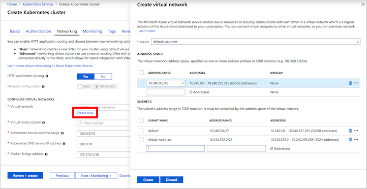

# Create and configure an Azure Kubernetes Services (AKS) cluster to use virtual nodes in the Azure portal

To rapidly scale application workloads in an Azure Kubernetes Service (AKS) cluster, you can use virtual nodes. With virtual nodes, you have quick provisioning of pods, and only pay per second for their execution time. You don't need to wait for Kubernetes cluster autoscaler to deploy VM compute nodes to run the additional pods. This article shows you how to create and configure the virtual network resources and AKS cluster, then enable virtual nodes.

> [!IMPORTANT]
> Virtual nodes for AKS are currently in **preview**. Previews are made available to you on the condition that you agree to the [supplemental terms of use](https://azure.microsoft.com/support/legal/preview-supplemental-terms/). Some aspects of this feature may change prior to general availability (GA).

## Before you begin

To enable network communication between pods that run on virtual nodes and the AKS cluster, virtual nodes need their own virtual network subnet and delegated permissions. Virtual nodes only work with AKS clusters created using *advanced* networking. This article shows you how to create a virtual network and subnets, then deploy an AKS cluster that uses advanced networking.

## Sign in to Azure

Sign in to the Azure portal at http://portal.azure.com.

## Create an AKS cluster

In the top left-hand corner of the Azure portal, select **Create a resource** > **Kubernetes Service**.

To create an AKS cluster, complete the following steps:

1. **Basics** - Configure the following options:
    - *PROJECT DETAILS*: Select an Azure subscription, then select or create an Azure resource group, such as *myResourceGroup*. Enter a **Kubernetes cluster name**, such as *myAKSCluster*.
    - *CLUSTER DETAILS*: Select a region, Kubernetes version, and DNS name prefix for the AKS cluster.
    - *SCALE*: Select a VM size for the AKS nodes. The VM size **cannot** be changed once an AKS cluster has been deployed.
        - Select the number of nodes to deploy into the cluster. For this article, set **Node count** to *1*. Node count **can** be adjusted after the cluster has been deployed.
        - Under **Virtual nodes**, select *Enabled*.
    
    

    Select **Next: Networking** when complete.

1. **Networking**: Select the **Advanced** network configuration using the [Azure CNI][azure-cni] plugin. Virtual nodes requires a delegated subnet, which is configured through advanced networking. For more information on networking options, see [AKS networking overview][aks-network].
    - If you need to create a virtual network and subnet, under *Virtual network*, choose **Create new**.
        - A default virtual network is populated named *default-aks-vnet* with an **Address range** of *10.240.0.0/16*
        - Under **Subnets**, a *default* subnet is defined with the **Address range** of *10.240.0.0/17*.
        - An additional *virtual-node-aci* subnet is defined with the **Address range** of *10.240.252.0/22*.
        - To accept these defaults, select **Create**.

        

    - Under **Virtual nodes subnet**, choose the subnet created in the previous step, such as *virtual-node-aci*.
    - Leave the default addresses for **Kubernetes service address range**, **Kubernetes DNS service IP address**, and **Docker Bridge address**.
    
    

    Select **Review + create** and then **Create** when ready.

It takes a few minutes to create the AKS cluster and to be ready for use.

## Connect to the cluster

To manage a Kubernetes cluster, use [kubectl][kubectl], the Kubernetes command-line client. The `kubectl` client is pre-installed in the Azure Cloud Shell.

Open Cloud Shell using the button on the top right-hand corner of the Azure portal.


Use the [az aks get-credentials][az-aks-get-credentials] command to configure `kubectl` to connect to your Kubernetes cluster. The following example gets credentials for the cluster name *myAKSCluster* in the resource group named *myResourceGroup*:

```azurecli-interactive
az aks get-credentials --resource-group myResourceGroup --name myAKSCluster
```

To verify the connection to your cluster, use the [kubectl get][kubectl-get] command to return a list of the cluster nodes.

```azurecli-interactive
kubectl get nodes
```

The following example output shows the single VM node created and then the virtual node for Linux, *virtual-node-linux*:

```
$ kubectl get nodes

NAME                       STATUS    ROLES     AGE       VERSION
virtual-node-linux         Ready     agent     28m       v1.8.3
aks-agentpool-14693408-0   Ready     agent     32m       v1.11.2
```

## Deploy a sample app

In the Azure Cloud Shell, create a file named `virtual-node.yaml` and copy in the following YAML. To schedule the container on the node, a [nodeSelector][node-selector] and [toleration][toleration] are defined. These settings allow the pod to be scheduled on the virtual node and confirm that the feature is successfully enabled.

```yaml
apiVersion: apps/v1beta1
kind: Deployment
metadata:
  name: virtual-node-helloworld
spec:
  replicas: 1
  template:
    metadata:
      labels:
        app: virtual-node-helloworld
    spec:
      containers:
      - name: virtual-node-helloworld
        image: microsoft/aci-helloworld
        ports:
        - containerPort: 80
      nodeSelector:
        kubernetes.io/hostname: virtual-node-linux
      tolerations:
      - key: virtual-kubelet.io/provider
        operator: Equal
        value: azure
        effect: NoSchedule
```

Run the application with the [kubectl create][kubectl-create] command.

```console
kubectl apply -f virtual-node.yaml
```

Use the [kubectl get pods][kubectl-get] command with the `-o wide` argument to output a list of pods and the scheduled node. Notice that the `virtual-node-helloworld` pod has been scheduled on the `virtual-node-linux` node.

```
$ kubectl get pods -o wide

NAME                                     READY     STATUS    RESTARTS   AGE       IP              NODE
virtual-node-helloworld-9b55975f-bnmfl   1/1       Running   0          4m        40.83.166.145   virtual-node-linux
```

## Next steps

Virtual nodes are one component of a scaling solution in AKS. For more information on scaling solutions, see the following articles:

- [Use the Kubernetes horizontal pod autoscaler][aks-hpa]
- [Use the Kubernetes cluster autoscaler][aks-cluster-autoscaler]

<!-- LINKS - external -->
[kubectl]: https://kubernetes.io/docs/user-guide/kubectl/
[kubectl-get]: https://kubernetes.io/docs/reference/generated/kubectl/kubectl-commands#get
[node-selector]:https://kubernetes.io/docs/concepts/configuration/assign-pod-node/
[toleration]: https://kubernetes.io/docs/concepts/configuration/taint-and-toleration/

<!-- LINKS - internal -->
[aks-network]: ./networking-overview.md
[az-aks-get-credentials]: /cli/azure/aks?view=azure-cli-latest#az-aks-get-credentials
[aks-hpa]: tutorial-kubernetes-scale.md
[aks-cluster-autoscaler]: autoscaler.md
