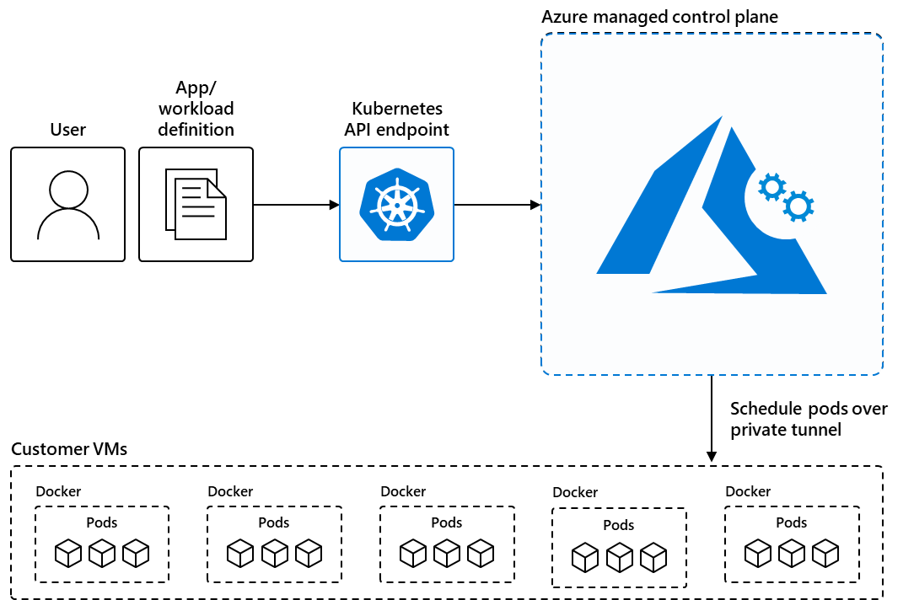

# What is Azure Kubernetes Service (AKS)?

Azure Kubernetes Service (AKS) is a managed Kubernetes service that you can use to deploy and manage containerized applications. You need minimal container orchestration expertise to use AKS. AKS reduces the complexity and operational overhead of managing Kubernetes by offloading much of that responsibility to Azure. AKS is an ideal platform for deploying and managing containerized applications that require high availability, scalability, and portability, and for deploying applications to multiple regions, using open-source tools, and integrating with existing DevOps tools.

This article is intended for platform administrators or developers who are looking for a scalable, automated, managed Kubernetes solution.

## Overview of AKS

AKS reduces the complexity and operational overhead of managing Kubernetes by shifting that responsibility to Azure. When you create an AKS cluster, Azure automatically creates and configures a control plane for you at no cost. The Azure platform manages the AKS control plane, which is responsible for the Kubernetes objects and worker nodes that you deploy to run your applications. Azure takes care of critical operations like health monitoring and maintenance, and you only pay for the AKS nodes that run your applications.

> [!NOTE]
> AKS is [CNCF-certified](https://www.cncf.io/training/certification/software-conformance/) and is compliant with SOC, ISO, PCI DSS, and HIPAA. For more information, see the [Microsoft Azure compliance overview](https://azure.microsoft.com/explore/trusted-cloud/compliance/).

## Container solutions in Azure

Azure offers a range of container solutions designed to accommodate various workloads, architectures, and business needs.

| Container solution | Resource type |
| --------- | ------------- |
| [Azure Kubernetes Service](#overview-of-aks) | Managed Kubernetes |
| [Azure Red Hat OpenShift](../openshift/intro-openshift.md) | Managed Kubernetes |
| [Azure Arc-enabled Kubernetes](../azure-arc/kubernetes/overview.md) | Unmanaged Kubernetes |
| [Azure Container Instances](../container-instances/container-instances-overview.md) | Managed Docker container instance |
| [Azure Container Apps](../container-apps/overview.md) | Managed Kubernetes |

For more information comparing the various solutions, see the following resources:

* [Comparing the service models of Azure container solutions](/azure/architecture/guide/choose-azure-container-service)
* [Comparing Azure compute service options](/azure/architecture/guide/technology-choices/compute-decision-tree)

### When to use AKS

The following list describes some of the common use cases for AKS, but by no means is an exhaustive list:

* **[Lift and shift to containers with AKS](/azure/cloud-adoption-framework/migrate/)**: Migrate existing applications to containers and run them in a fully managed Kubernetes environment.
* **[Microservices with AKS](/azure/architecture/guide/aks/aks-cicd-azure-pipelines)**: Simplify the deployment and management of microservices-based applications with streamlined horizontal scaling, self-healing, load balancing, and secret management.
* **[Secure DevOps for AKS](/azure/architecture/reference-architectures/containers/aks-start-here)**: Efficiently balance speed and security by implementing secure DevOps with Kubernetes.
* **[Bursting from AKS with ACI](/azure/architecture/reference-architectures/containers/aks-start-here)**: Use virtual nodes to provision pods inside ACI that start in seconds and scale to meet demand.
* **[Machine learning model training with AKS](/azure/architecture/ai-ml/idea/machine-learning-model-deployment-aks)**: Train models using large datasets with familiar tools, such as TensorFlow and Kubeflow.
* **[Data streaming with AKS](/azure/architecture/solution-ideas/articles/data-streaming-scenario)**: Ingest and process real-time data streams with millions of data points collected via sensors, and perform fast analyses and computations to develop insights into complex scenarios.
* **[Using Windows containers on AKS](./windows-aks-customer-stories.md)**: Run Windows Server containers on AKS to modernize your Windows applications and infrastructure.

## Features of AKS

The following table lists some of the key features of AKS:

| Feature | Description |
| --- | --- |
| **Identity and security management** | • Enforce [regulatory compliance controls using Azure Policy](./security-controls-policy.md) with built-in guardrails and internet security benchmarks.   • Integrate with [Kubernetes RBAC](./azure-ad-rbac.md) to limit access to cluster resources.   • Use [Microsoft Entra ID](./enable-authentication-microsoft-entra-id.md) to set up Kubernetes access based on existing identity and group membership. |
| **Logging and monitoring** | • Integrate with [Container Insights](../azure-monitor/containers/kubernetes-monitoring-enable.md), a feature in Azure Monitor, to monitor the health and performance of your clusters and containerized applications.   • Set up [Network Observability](./network-observability-overview.md) and [use BYO Prometheus and Grafana](./network-observability-byo-cli.md) to collect and visualize network traffic data from your clusters. |
| **Streamlined deployments** | • Use prebuilt cluster configurations for Kubernetes with [smart defaults](./quotas-skus-regions.md#cluster-configuration-presets-in-the-azure-portal).   • Autoscale your applications using the [Kubernetes Event Driven Autoscaler (KEDA)](./keda-about.md).   • Use [Draft for AKS](./draft.md) to ready source code and prepare your applications for production. |
| **Clusters and nodes** | • Connect storage to nodes and pods, upgrade cluster components, and use GPUs.   • Create clusters that run multiple node pools to support mixed operating systems and Windows Server containers.   • Configure automatic scaling using the [cluster autoscaler](./cluster-autoscaler.md) and [horizontal pod autoscaler](./tutorial-kubernetes-scale.md#autoscale-pods).   • Deploy clusters with [confidential computing nodes](../confidential-computing/confidential-nodes-aks-overview.md) to allow containers to run in a hardware-based trusted execution environment. |
| **Storage volume support** | • Mount static or dynamic storage volumes for persistent data.   • Use [Azure Disks](./azure-disk-csi.md) for single pod access and [Azure Files](./azure-files-csi.md) for multiple, concurrent pod access.   • Use [Azure NetApp Files](./azure-netapp-files.md) for high-performance, high-throughput, and low-latency file shares. |
| **Networking** | • Leverage our [networking options](concepts-network-cni-overview.md) for your needs.   • [Bring your own Container Network Interface (CNI)](./use-byo-cni.md) to use a third-party CNI plugin.   • Easily access applications deployed to your clusters using the [application routing add-on with nginx](./app-routing.md). |
| **Development tooling integration** | • Develop on AKS with [Helm](./quickstart-helm.md).   • Install the [Kubernetes extension for Visual Studio Code](https://marketplace.visualstudio.com/items?itemName=ms-kubernetes-tools.vscode-kubernetes-tools) to manage your workloads.   • Leverage the features of Istio with the [Istio-based service mesh add-on](./istio-about.md). |

## Get started with AKS

Get started with AKS using the following resources:

* Learn the [core Kubernetes concepts for AKS](./concepts-clusters-workloads.md).
* Evaluate application deployment on AKS with our [AKS tutorial series](./tutorial-kubernetes-prepare-app.md).
* Review the [Azure Well-Architected Framework for AKS](/azure/well-architected/service-guides/azure-kubernetes-service) to learn how to design and operate reliable, secure, efficient, and cost-effective applications on AKS.
* [Plan your design and operations](/azure/architecture/reference-architectures/containers/aks-start-here) for AKS using our reference architectures.
* Explore [configuration options and recommended best practices for cost optimization](./best-practices-cost.md) on AKS.
