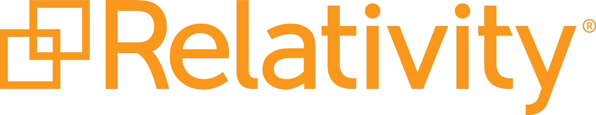
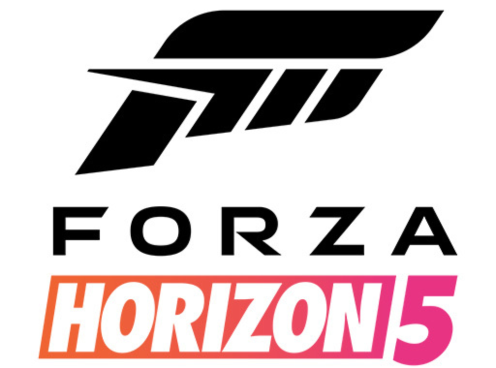

# Windows AKS Customer Stories 

Explore how various industries are using Windows Containers on Azure Kubernetes Service (AKS) for seamless Kubernetes integration with minimal code modifications. 

Learn directly from the customer stories listed here.

## Customer Stories 
1. [Relativity](#relativity)
2. [Duck Creek](#duck-creek)
3. [Forza (Xbox Game Studios)](#forza)
4. [Microsoft Experience + Devices](#microsoft-experience--devices)

### Relativity 

 

Relativity, transitioned from virtual machines to Windows containers on Azure Kubernetes Service (AKS) to modernize its Windows code base, streamline development, and improve scalability. 

This shift enabled faster, more cost-effective deployment of their products and services without rewriting millions of lines of code. The transition to a containerized architecture significantly reduced deployment cycles from six months to a single day, enhancing the speed and flexibility of Relativity’s engineering teams and leading to better performance and security in their application delivery.  

For more information, please visit [Relativity’s Windows AKS customer story](https://customers.microsoft.com/EN-us/story/1516554049543037694-windows-containers-helps-relativity-boost-reliability-security). 
  

### Duck Creek 

 

Duck Creek Technologies modernized its insurance software solutions by adopting Windows containers on Azure Kubernetes Service (AKS), significantly enhancing operational efficiency and reducing time to market for new features. This transition to AKS enabled Duck Creek to offer scalable, reliable, and up-to-date SaaS solutions to its insurance clients, supporting rapid deployment and active delivery of updates.  

By containerizing their applications to Windows Containers, Duck Creek could maintain the flexibility and robustness of their products without extensive code rewriting, thereby ensuring high availability and scalability, especially critical during peak demand periods like natural disasters. This move represents Duck Creek's commitment to leveraging cutting-edge technology for Insurtech innovation. 

For more information, please visit [Duck Creek’s Windows AKS customer story](https://customers.microsoft.com/en-in/story/1547298699206424647-duck-creek-insurance-core-systems-provide-evergreen-saas-solutions-using-windows-containers-aks). 

### Forza 

Forza Horizon 5, developed by Turn 10 Studios, achieved remarkable performance and scalability by transitioning to Azure Kubernetes Service (AKS) with Windows-based containers. This shift allowed the team to adapt swiftly to demand spikes, handling over 10 million concurrent players at launch, the biggest first week in Xbox Game Studios history.  

By utilizing Windows AKS, they were able to significantly reduce infrastructure management tasks, enhancing both the development process and the gaming experience. The move to containerized architecture enabled rapid scaling from 600,000 to 3 million concurrent users and reduced infrastructure costs, demonstrating the effectiveness of AKS in high-demand, low-latency environments like gaming. 

 For more information, please visit [Forza’s Windows AKS customer story](https://customers.microsoft.com/en-us/story/1498781140435260527-forza-horizon-5-crosses-finish-line-fueled-by-azure-kubernetes-service). 

### Microsoft Experience + Devices 

Microsoft's E+D group, responsible for supporting products such as Teams and Office modernized the Microsoft 365 infrastructure by transitioning to Windows containers on Azure Kubernetes Service (AKS), aiming for more consistent, efficient DevOps within strict security and compliance frameworks.  

The transition enabled Microsoft 365 developers to focus more on innovation and iterating quickly, leveraging the benefits of AKS like security-optimized hosting, automated compliance checks, and centralized capacity management, thereby accelerating development while optimizing resource utilization and costs. 

For more information, please visit [Microsoft’s E+D Windows AKS customer story](https://customers.microsoft.com/en-us/story/1536483517282553662-modernizing-microsoft-365-windows-containers-azure-kubernetes-service).
