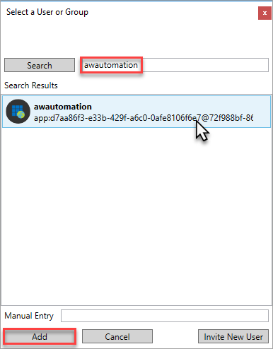
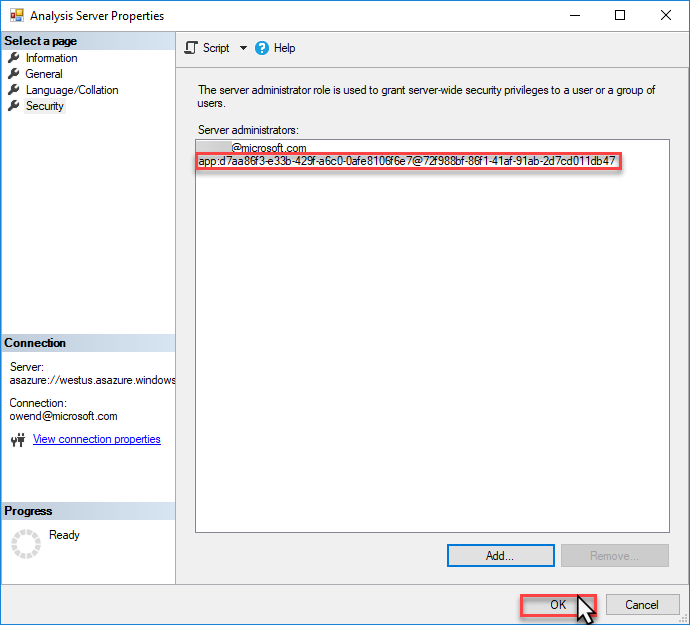

# Add a service principal to the server administrator role 

 To automate unattended PowerShell tasks, a service principal must have **server administrator** privileges on the Analysis Services server being managed. This article describes how to add a service principal to the server administrators role on an Azure AS server.

## Before you begin
Before completing this task, you must have a service principal registered in Azure Active Directory.

[Create service principal - Azure portal](../active-directory/develop/howto-create-service-principal-portal.md)   
[Create service principal - PowerShell](../active-directory/develop/howto-authenticate-service-principal-powershell.md)

## Required permissions
To complete this task, you must have [server administrator](analysis-services-server-admins.md) permissions on the Azure AS server. 

## Add service principal to server administrators role

1. In SSMS, connect to your Azure AS server.
2. In **Server Properties** > **Security**, click **Add**.
3. In **Select a User or Group**, search for your registered app by name, select, and then click **Add**.

    

4. Verify the service principal account ID, and then click **OK**.
    
    

> [!NOTE]
> For server operations using Azure PowerShell cmdlets, service principal running scheduler must also belong to the **Owner** role for the resource in [Azure Role-Based Access Control (RBAC)](../role-based-access-control/overview.md). 

## Related information

* [Download SQL Server PowerShell Module](https://docs.microsoft.com/sql/ssms/download-sql-server-ps-module)   
* [Download SSMS](https://docs.microsoft.com/sql/ssms/download-sql-server-management-studio-ssms)   

