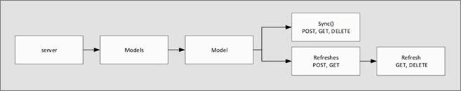

# Asynchronous refresh with the REST API

By using any programming language that supports REST calls, you can  perform asynchronous data-refresh operations on your Azure Analysis Services tabular models. This includes synchronization of read-only replicas for query scale-out. 

Data-refresh operations can take some time depending on a number of factors including data volume, level of optimization using partitions, etc. These operations have traditionally been invoked with existing methods such as using [TOM](https://docs.microsoft.com/sql/analysis-services/tabular-model-programming-compatibility-level-1200/introduction-to-the-tabular-object-model-tom-in-analysis-services-amo) (Tabular Object Model), [PowerShell](https://docs.microsoft.com/sql/analysis-services/powershell/analysis-services-powershell-reference) cmdlets, or [TMSL](https://docs.microsoft.com/sql/analysis-services/tabular-model-scripting-language-tmsl-reference) (Tabular Model Scripting Language). However, these methods can require often unreliable, long-running HTTP connections.

The REST API for Azure Analysis Services enables data-refresh operations to be carried out asynchronously. By using the REST API, long-running HTTP connections from client applications aren't necessary. There are also other built-in features for reliability, such as auto retries and batched commits.

## Base URL

The base URL follows this format:

```
https://<rollout>.asazure.windows.net/servers/<serverName>/models/<resource>/
```

For example, consider a model named AdventureWorks on a server named myserver, located in the West US Azure region. The server name is:

```
asazure://westus.asazure.windows.net/myserver 
```

The base URL for this server name is:

```
https://westus.asazure.windows.net/servers/myserver/models/AdventureWorks/ 
```

By using the base URL, resources and operations can be appended based on the following parameters: 



- Anything that ends in **s** is a collection.
- Anything that ends with **()** is a function.
- Anything else is a resource/object.

For example, you can use the POST verb on the Refreshes collection to perform a refresh operation:

```
https://westus.asazure.windows.net/servers/myserver/models/AdventureWorks/refreshes
```

## Authentication

All calls must be authenticated with a valid Azure Active Directory (OAuth 2) token in the Authorization header and must meet the following requirements:

- The token must be either a user token or an application service principal.
- The token must have the correct audience set to `https://*.asazure.windows.net`.
- The user or application must have sufficient permissions on the server or model to make the requested call. The permission level is determined by roles within the model or the admin group on the server.

    > [!IMPORTANT]
    > Currently, **server admin** role permissions are necessary.

## POST /refreshes

To perform a refresh operation, use the POST verb on the /refreshes collection to add a new refresh item to the collection. The Location header in the response includes the refresh ID. The client application can disconnect and check the status later if required because it is asynchronous.

Only one refresh operation is accepted at a time for a model. If there's a current running refresh operation and another is submitted, the 409 Conflict HTTP status code is returned.

The body may resemble the following:

```
{
    "Type": "Full",
    "CommitMode": "transactional",
    "MaxParallelism": 2,
    "RetryCount": 2,
    "Objects": [
        {
            "table": "DimCustomer",
            "partition": "DimCustomer"
        },
        {
            "table": "DimDate"
        }
    ]
}
```

### Parameters

Specifying parameters is not required. The default is applied.

| Name             | Type  | Description  |Default  |
|------------------|-------|--------------|---------|
| `Type`           | Enum  | The type of processing to perform. The types are aligned with the TMSL [refresh command](https://docs.microsoft.com/sql/analysis-services/tabular-models-scripting-language-commands/refresh-command-tmsl) types: full, clearValues, calculate, dataOnly, automatic, and defragment. Add type is not supported.      |   automatic      |
| `CommitMode`     | Enum  | Determines if objects will be committed in batches or only when complete. Modes include: default, transactional, partialBatch.  |  transactional       |
| `MaxParallelism` | Int   | This value determines the maximum number of threads on which to run processing commands in parallel. This value aligned with the MaxParallelism property that can be set in the TMSL [Sequence command](https://docs.microsoft.com/sql/analysis-services/tabular-models-scripting-language-commands/sequence-command-tmsl) or using other methods.       | 10        |
| `RetryCount`     | Int   | Indicates the number of times the operation will retry before failing.      |     0    |
| `Objects`        | Array | An array of objects to be processed. Each object includes: "table" when processing the entire table or "table" and "partition" when processing a partition. If no objects are specified, the whole model is refreshed. |   Process the entire model      |

CommitMode is equal to partialBatch. It's used when doing an initial load of large datasets that could take hours. If the refresh operation fails after successfully committing one or more batches, the successfully committed batches will remain committed (it will not roll back successfully committed batches).

> [!NOTE]
> At time of writing, the batch size is the MaxParallelism value, but this value could change.

## GET /refreshes/\<refreshId>

To check the status of a refresh operation, use the GET verb on the refresh ID. Here's an example of the response body. If the operation is in progress, **inProgress** is returned in status.

```
{
    "startTime": "2017-12-07T02:06:57.1838734Z",
    "endTime": "2017-12-07T02:07:00.4929675Z",
    "type": "full",
    "status": "succeeded",
    "currentRefreshType": "full",
    "objects": [
        {
            "table": "DimCustomer",
            "partition": "DimCustomer",
            "status": "succeeded"
        },
        {
            "table": "DimDate",
            "partition": "DimDate",
            "status": "succeeded"
        }
    ]
}
```

## GET /refreshes

To get a list of historical refresh operations for a model, use the GET verb on the /refreshes collection. Here's an example of the response body. 

> [!NOTE]
> At time of writing, the last 30 days of refresh operations are stored and returned, but this number could change.

```
[
    {
        "refreshId": "1344a272-7893-4afa-a4b3-3fb87222fdac",
        "startTime": "2017-12-09T01:58:04.76",
        "endTime": "2017-12-09T01:58:12.607",
        "status": "succeeded"
    },
    {
        "refreshId": "474fc5a0-3d69-4c5d-adb4-8a846fa5580b",
        "startTime": "2017-12-07T02:05:48.32",
        "endTime": "2017-12-07T02:05:54.913",
        "status": "succeeded"
    }
]
```

## DELETE /refreshes/\<refreshId>

To cancel an in-progress refresh operation, use the DELETE verb on the refresh ID.

## POST /sync

Having performed refresh operations, it may be necessary to synchronize the new data with replicas for query scale-out. To perform a synchronize operation for a model, use the POST verb on the /sync function. The Location header in the response includes the sync operation ID.

## GET /sync status

To check the status of a sync operation, use the GET verb passing the operation ID as a parameter. Here's an example of the response body:

```
{
    "operationId": "cd5e16c6-6d4e-4347-86a0-762bdf5b4875",
    "database": "AdventureWorks2",
    "UpdatedAt": "2017-12-09T02:44:26.18",
    "StartedAt": "2017-12-09T02:44:20.743",
    "syncstate": 2,
    "details": null
}
```

Values for `syncstate`:

- 0: Replicating. Database files are being replicated to a target folder.
- 1: Rehydrating. The database is being rehydrated on read-only server instance(s).
- 2: Completed. The sync operation completed successfully.
- 3: Failed. The sync operation failed.
- 4: Finalizing. The sync operation has completed but is performing cleanup steps.

## Code sample

Here's a C# code sample to get you started, [RestApiSample on GitHub](https://github.com/Microsoft/Analysis-Services/tree/master/RestApiSample).

### To use the code sample

1.	Clone or download the repo. Open the RestApiSample solution.
2.	Find the line **client.BaseAddress = …** and provide your [base URL](#base-url).

The code sample uses [service principal](#service-principal) authentication.

### Service principal

See [Create service principal - Azure portal](../active-directory/develop/howto-create-service-principal-portal.md) and [Add a service principal to the server administrator role](analysis-services-addservprinc-admins.md) for more info on how to set up a service principal and assign the necessary permissions in Azure AS. Once you've completed the steps, complete the following additional steps:

1.	In the code sample, find **string authority = …**, replace **common** with your organization’s tenant ID.
2.	Comment/uncomment so the ClientCredential class is used to instantiate the cred object. Ensure the \<App ID> and \<App Key> values are accessed in a secure way or use certificate-based authentication for service principals.
3.	Run the sample.


## See also

[Samples](analysis-services-samples.md)   
[REST API](https://docs.microsoft.com/rest/api/analysisservices/servers)   


