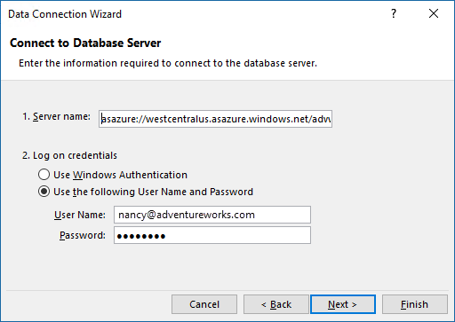
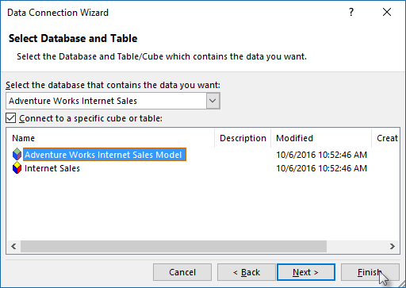

# Get data from Azure Analysis Services
Once you've created a server in Azure, and deployed a tabular model to it, users in your organization are ready to connect and begin exploring data.

Azure Analysis Services supports client connections using [updated object models](#client-libraries); TOM, AMO, Adomd.Net, or MSOLAP, to connect via xmla to the server. For example, Power BI, Power BI Desktop, Excel, or any third-party client application that supports the object models.

## Server name
When you create an Analysis Services server in Azure, you specify a unique name and the region where the server is to be created. When specifying the server name in a connection, the server naming scheme is:

```
<protocol>://<region>/<servername>
```
 Where protocol is string **asazure**, the region is the Uri of the region where the server was created (for example, for West US, westus.asazure.windows.net) and servername is the name of your unique server within the region.

## Get the server name
Before you connect, you need to get the server name. In **Azure portal** > server > **Overview** > **Server name**, copy the entire server name. If other users in your organization are connecting to this server too, you'll want to share this server name with them. When specifying a server name, the entire path must be used.


## Connect in Power BI Desktop
> [!NOTE]
> This feature is Preview.
> 
> 

1. In [Power BI Desktop](https://powerbi.microsoft.com/desktop/), click **Get Data** > **Databases** > **Azure Analysis Services**.
2. In **Server**, paste the server name from the clipboard.
3. In **Database**, if you know the name of the tabular model database or perspective you want to connect to, paste it here. Otherwise, you can leave this field blank. You can select a database or perspective on the next screen.
4. Leave the default **Connect live** option selected, then press **Connect**. If you're prompted to enter an account, enter your organizational account.
5. In **Navigator**, expand the server, then select the model or perspective you want to connect to, then click **Connect**. A single click on a model or perspective shows all the objects for that view.

## Connect in Power BI
1. Create a Power BI Desktop file that has a live connection to your model on your server.
2. In [Power BI](https://powerbi.microsoft.com), click **Get Data** > **Files**. Locate and select your file.

## Connect in Excel
Connecting to Azure Analysis Services server in Excel is supported by using Get Data in Excel 2016 or Power Query in earlier versions. [MSOLAP.7 provider](https://aka.ms/msolap) is required. Connecting by using the Import Table Wizard in Power Pivot is not supported.

1. In Excel 2016, on the **Data** ribbon, click **Get External Data** > **From Other Sources** > **From Analysis Services**.
2. In the Data Connection Wizard, in **Server name**, paste the server name from the clipboard. Then, in **Logon credentials**, select **Use the following User Name and Password**, and then type the organizational user name, for example nancy@adventureworks.com, and password.
   
    
3. In **Select Database and Table**, select the database and model or perspective, and then click **Finish**.
   
    

## Connection string
When connecting to Azure Analysis Services using the Tabular Object Model, use the following connection string formats:

###### Integrated Azure Active Directory authentication
```
"Provider=MSOLAP;Data Source=<Azure AS instance name>;"
```
Integrated authentication will pick up the Azure Active Directory credential cache if available. If not, the Azure login window is shown.

###### Azure Active Directory authentication with username and password
```
"Provider=MSOLAP;Data Source=<Azure AS instance name>;User ID=<user name>;Password=<password>;Persist Security Info=True; Impersonation Level=Impersonate;";
```

## Client libraries
When connecting to Azure Analysis Services from Excel or other interfaces such as TOM, AsCmd, ADOMD.NET, you may need to install the latest provider client libraries. Get the latest:  

[MSOLAP (amd64)](https://go.microsoft.com/fwlink/?linkid=829576)</br>
[MSOLAP (x86)](https://go.microsoft.com/fwlink/?linkid=829575)</br>
[AMO](https://go.microsoft.com/fwlink/?linkid=829578)</br>
[ADOMD](https://go.microsoft.com/fwlink/?linkid=829577)</br>

## Next steps
[Manage your server](analysis-services-manage.md)

