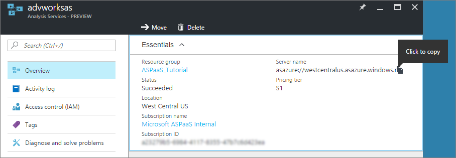

# Connecting to servers

This article describes connecting to a server by using data modeling and management applications like SQL Server Management Studio (SSMS) or Visual Studio with Analysis Services projects, or with client reporting applications like Microsoft Excel, Power BI Desktop, or custom applications. Connections to Azure Analysis Services use HTTPS.

## Client libraries

[Get the latest Client libraries](/analysis-services/client-libraries?view=azure-analysis-services-current&preserve-view=true)

All connections to a server, regardless of type, require updated AMO, ADOMD.NET, and OLEDB client libraries to connect to and interface with an Analysis Services server. For SSMS, Visual Studio, Excel 2016 and later, and Power BI, the latest client libraries are installed or updated with monthly releases. However, in some cases, it's possible an application may not have the latest. For example, when policies delay updates, or Microsoft 365 updates are on the Deferred Channel.

> [!NOTE]
> The client libraries cannot connect to Azure Analysis Services through proxy servers that require a username and password. 

## Server name

When you create an Analysis Services server in Azure, you specify a unique name and the region where the server is to be created. When specifying the server name in a connection, the server naming scheme is:

```
<protocol>://<region>/<servername>
```
 Where protocol is string **asazure**, region is the Uri where the server was created (for example, westus.asazure.windows.net) and servername is the name of your unique server within the region.

### Get the server name

In **Azure portal** > server > **Overview** > **Server name**, copy the entire server name. If other users in your organization are connecting to this server too, you can share this server name with them. When specifying a server name, the entire path must be used.



> [!NOTE]
> The protocol for East US 2 region is **aspaaseastus2**.

## Connection string

When connecting to Azure Analysis Services using the Tabular Object Model, use the following connection string formats:

<a name='integrated-azure-active-directory-authentication'></a>

###### Integrated Microsoft Entra authentication

Integrated authentication picks up the Microsoft Entra credential cache if available. If not, the Azure login window is shown.

```
"Provider=MSOLAP;Data Source=<Azure AS instance name>;"
```


<a name='azure-active-directory-authentication-with-username-and-password'></a>

###### Microsoft Entra authentication with username and password

```
"Provider=MSOLAP;Data Source=<Azure AS instance name>;User ID=<user name>;Password=<password>;Persist Security Info=True; Impersonation Level=Impersonate;";
```

###### Windows authentication (Integrated security)

Use the Windows account running the current process.

```
"Provider=MSOLAP;Data Source=<Azure AS instance name>; Integrated Security=SSPI;Persist Security Info=True;"
```

## Connect using an .odc file

With older versions of Excel, users can connect to an Azure Analysis Services server by using an Office Data Connection (.odc) file. To learn more, see [Create an Office Data Connection (.odc) file](analysis-services-odc.md).

## Connect as a linked server from SQL Server

SQL Server can connect to an Azure Analysis Services resource as a [Linked server](/sql/relational-databases/linked-servers/create-linked-servers-sql-server-database-engine) by specifying MSOLAP as the data source provider. Before configuring a linked server connection, be sure to install the latest [MSOLAP client library](/analysis-services/client-libraries?view=azure-analysis-services-current&preserve-view=true) (provider). 

For linked server connections to Azure Analysis Services, the MSOLAP provider must be instantiated outside the SQL Server process. When configuring linked server options, make sure the **Allow inprocess** option **is not selected**.

If **Allow inprocess** is selected and the provider is instantiated in the SQL Server process, the following error is returned:

```
OLE DB provider "MSOLAP" for linked server "(null)" returned message "The following system error occurred: ".

OLE DB provider "MSOLAP" for linked server "(null)" returned message "The connection failed because user credentials are needed and Sign-In UI is not allowed.".

Msg 7303, Level 16, State 1, Line 2
Cannot initialize the data source object of OLE DB provider "MSOLAP" for linked server "(null)".
```


## Next steps

[Connect with Excel](analysis-services-connect-excel.md)    
[Connect with Power BI](analysis-services-connect-pbi.md)   
[Manage your server](analysis-services-manage.md)
