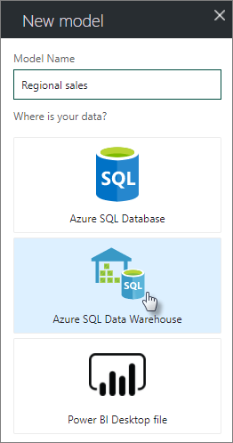
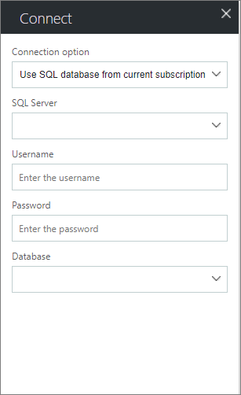
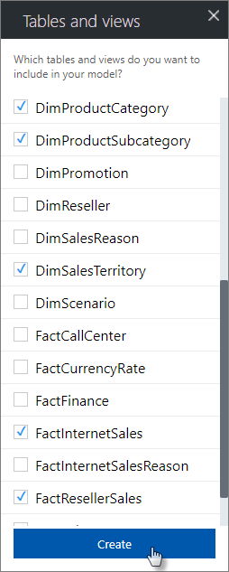
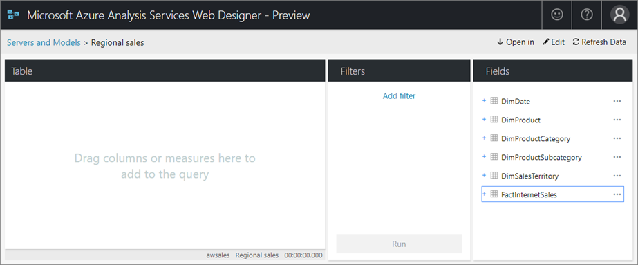

# Create a model in Azure portal

The Azure Analysis Services web designer (preview) feature in Azure portal provides a quick and easy way to create and edit tabular models and query model data right in your browser. 

Keep in mind, the web designer is **preview**. While new functionality is being added all the time, in preview, functionality is limited. For more advanced model development and testing, it's best to use Visual Studio (SSDT) and SQL Server Management Studio (SSMS).

## Prerequisites

- An Azure Analysis Services server at the Standard or Developer tier. New models created by using the Web designer are DirectQuery, supported only by these tiers.
- An Azure SQL Database, Azure SQL Data Warehouse, or Power BI Desktop (.pbix) file as a datasource. New models created from Power BI Desktop files support Azure SQL Database, Azure SQL Data Warehouse, Oracle, and Teradata data sources.
- A SQL Server account and password for connecting to Azure SQL Database or Azure SQL Data Warehouse data sources.

## To create a new tabular model

1. In your server's **Overview** blade > **Web designer**, click **Open**.

    

2. In **Web designer** > **Models**, click **+ Add**.

    

3. In **New model**, type a model name, and then select a data source.

    

4. In **Connect**, enter the connection properties. Username and password must be a SQL Server account.

     

5. In **Tables and views**, select the tables to include in your model, and then click **Create**. Relationships are created automatically between tables with a key pair.

     

Your new model appears in your browser. From here, you can:   

- Query model data by dragging fields to the query designer and adding filters.
- Create new measures in tables.
- Edit model metadata by using the json editor.
- Open the model in Visual Studio (SSDT), Power BI Desktop, or Excel.

> [!NOTE]
> When you edit model metadata or create new measures in your browser, you're saving those changes to your model in Azure. If you're also working on your model in SSDT, Power BI Desktop, or Excel, your model can get out of sync.

## Next steps 
[Manage database roles and users](analysis-services-database-users.md)  
[Connect with Excel](analysis-services-connect-excel.md)  

