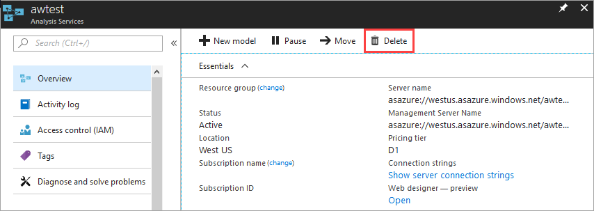

# Quickstart: Create a server - Portal

This quickstart describes how to create an Analysis Services server resource in your Azure subscription by using the portal.

## Prerequisites 

* **Azure subscription**: Visit [Azure Free Trial](https://azure.microsoft.com/offers/ms-azr-0044p/) to create an account.
* **Azure Active Directory**: Your subscription must be associated with an Azure Active Directory tenant. And, you need to be signed in to Azure with an account in that Azure Active Directory. To learn more, see [Authentication and user permissions](analysis-services-manage-users.md).

## Sign in to the Azure portal 

[Sign in to the portal](https://portal.azure.com)

## Create a server

1. Click **+ Create a resource** > **Analytics** > **Analysis Services**.

    

2. In **Analysis Services**, fill in the required fields, and then press **Create**.
   
   * **Server name**: Type a unique name used to reference the server. The server name must begin with a lowercase character and contain between 3 to 128 lowercase characters and numbers. Whitespaces and special characters are not allowed.
   * **Subscription**: Select the subscription this server will be associated with.
   * **Resource group**: Create a new resource group or select one you already have. Resource groups are designed to help you manage a collection of Azure resources. To learn more, see [resource groups](../azure-resource-manager/management/overview.md).
   * **Location**: This Azure datacenter location hosts the server. Choose a location nearest your largest user base.
   * **Pricing tier**: Select a pricing tier. If you are testing and intend to install the sample model database, select the free **D1** tier. To learn more, see [Azure Analysis Services pricing](https://azure.microsoft.com/pricing/details/analysis-services/). 
   * **Administrator**: By default, this will be the account you are logged in with. You can choose a different account from your Azure Active Directory.
   * **Backup Storage setting**: Optional. If you already have a [storage account](../storage/common/storage-introduction.md), you can specify it as the default for model database backup. You can also specify [backup and restore](analysis-services-backup.md) settings later.
   * **Storage key expiration**: Optional. Specify a storage key expiration period.

Creating the server usually takes under a minute. If you selected **Add to Portal**, navigate to your portal to see your new server. Or, navigate to **All services** > **Analysis Services** to see if your server is ready. Servers support tabular models at the 1200 and higher compatibility levels. Model compatibility level is specified in Visual Studio or SSMS.

## Clean up resources

When no longer needed, delete your server. In your server's **Overview**, click **Delete**. 

 

## Next steps
In this quickstart, you learned how to create a server in your Azure subscription. Now that you have server, you can help secure it by configuring an (optional) server firewall. You can also add a basic sample data model to your server right from the portal. Having a sample model is helpful when learning about configuring model database roles and testing client connections. To learn more, continue to the tutorial for adding a sample model.

> [!div class="nextstepaction"]
> [Quickstart: Configure server firewall - Portal](analysis-services-qs-firewall.md)   
