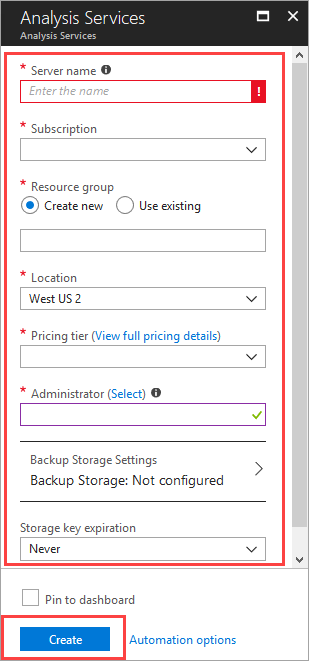
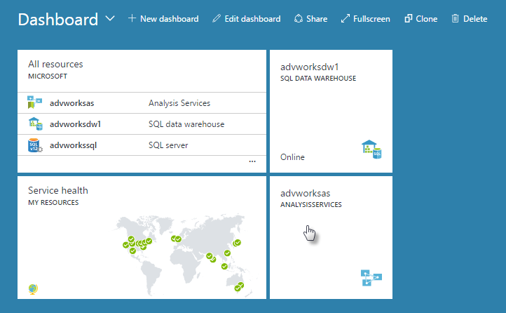

# Create an Azure Analysis Services server in Azure portal
This article walks you through creating an Analysis Services server resource in your Azure subscription.

## Before you begin
To get started, you need:

* **Azure subscription**: Visit [Azure Free Trial](https://azure.microsoft.com/offers/ms-azr-0044p/) to create an account.
* **Azure Active Directory**: Your subscription must be associated with an Azure Active Directory tenant. And, you need to be signed in to Azure with an account in that Azure Active Directory. Microsoft accounts are not supported. To learn more, see [User authentication](analysis-services-overview.md#secure).
* **Resource group**: Use a resource group you already have or [create a new one](../azure-resource-manager/resource-group-overview.md).

> [!NOTE]
> Creating a server might result in a new billable service. To learn more, see [Analysis Services pricing](https://azure.microsoft.com/pricing/details/analysis-services/).
> 
> 

## To create a server in Azure portal
1. Sign in to the [Azure portal](https://portal.azure.com).  
2. Click **+ New** > **Data + analytics** > **Analysis Services**.
3. In the **Analysis Services** blade, fill in the required fields, and then press **Create**.
   
    
   
   * **Server name**: Type a unique name used to reference the server.
   * **Subscription**: Select the subscription this server bills to.
   * **Resource group**: These containers are designed to help you manage a collection of Azure resources. To learn more, see [resource groups](../azure-resource-manager/resource-group-overview.md).
   * **Location**: This Azure datacenter location hosts the server. Choose a location nearest your largest user base.
   * **Pricing tier**: Select a pricing tier. Tabular models up to 400 GB are supported. To learn more, see [Azure Analysis Services pricing](https://azure.microsoft.com/pricing/details/analysis-services/).
4. Click **Create**.

Create usually takes under a minute; often just a few seconds. If you selected **Add to Portal**, navigate to your portal to see your new server. Or, navigate to **More services** > **Analysis Services** to see if your server is ready.

 

## Next steps
Once you've created your server, you can [deploy a model](analysis-services-deploy.md) to it by using SSDT or with SSMS.

If a model you deploy to your server connects to on-premises data sources, you need to install an [On-premises data gateway](analysis-services-gateway.md) on a computer in your network.

