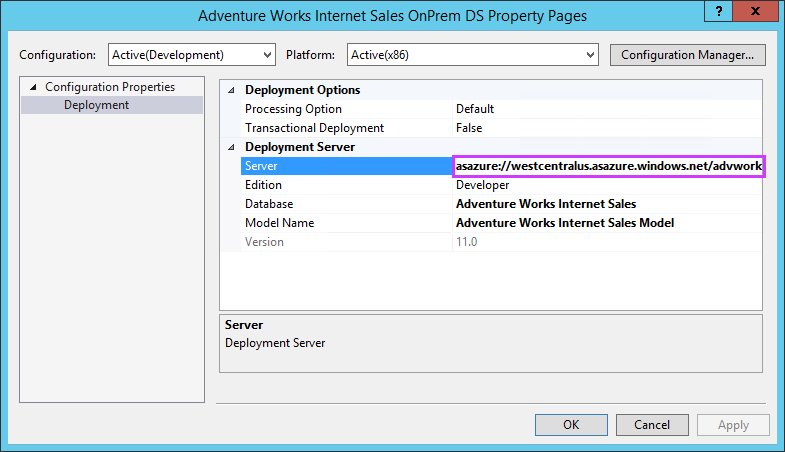
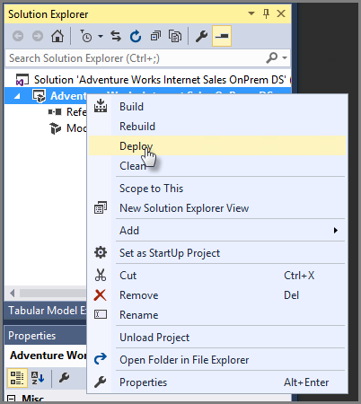
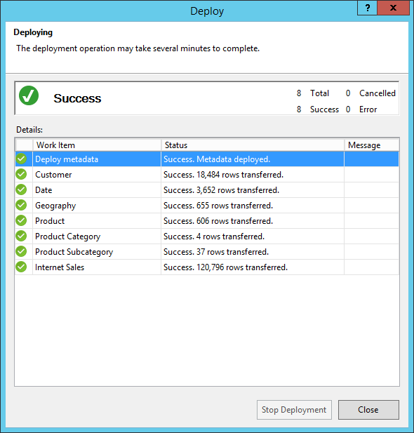

# Deploy a model from Visual Studio

Once you've created a server in your Azure subscription, you're ready to deploy a tabular model database to it. You can use Visual Studio with Analysis Services projects to build and deploy a tabular model project you're working on. 

## Prerequisites

To get started, you need:

* **Analysis Services server** in Azure. To learn more, see [Create an Azure Analysis Services server](analysis-services-create-server.md).
* **Tabular model project** in Visual Studio or an existing tabular model at the 1200 or higher compatibility level. Never created one? Try the [Adventure Works Internet sales tabular modeling tutorial](https://docs.microsoft.com/analysis-services/tutorial-tabular-1400/as-adventure-works-tutorial).
* **On-premises gateway** - If one or more data sources are on-premises in your organization's network, you need to install an [On-premises data gateway](analysis-services-gateway.md). The gateway is necessary for your server in the cloud connect to your on-premises data sources to process and refresh data in the model.

> [!TIP]
> Before you deploy, make sure you can process the data in your tables. In Visual Studio, click **Model** > **Process** > **Process All**. If processing fails, you cannot successfully deploy.
> 
> 

## Get the server name

In **Azure portal** > server > **Overview** > **Server name**, copy the server name.
   

## To deploy from Visual Studio

1. In Visual Studio > **Solution Explorer**, right-click the project > **Properties**. Then in **Deployment** > **Server** paste the server name.   
   
    
2. In **Solution Explorer**, right-click **Properties**, then click **Deploy**. You may be prompted to sign in to Azure.
   
    
   
    Deployment status appears in both the Output window and in Deploy.
   
    

That's all there is to it!

## Troubleshooting

If deployment fails when deploying metadata, it's likely because Visual Studio couldn't connect to your server. Make sure you can connect to your server using SQL Server Management Studio (SSMS). Then make sure the Deployment Server property for the project is correct.

If deployment fails on a table, it's likely because your server couldn't connect to a data source. If your data source is on-premises in your organization's network, be sure to install an [On-premises data gateway](analysis-services-gateway.md).

## Next steps

Now that you have your tabular model deployed to your server, you're ready to connect to it. You can [connect to it with SQL Server Management Studio (SSMS)](analysis-services-manage.md) to manage it. And, you can [connect to it using a client tool](analysis-services-connect.md) like Power BI, Power BI Desktop, or Excel, and start creating reports.   

To learn about advanced deployment methods, see [Tabular model solution deployment](https://docs.microsoft.com/analysis-services/deployment/tabular-model-solution-deployment?view=azure-analysis-services-current).

