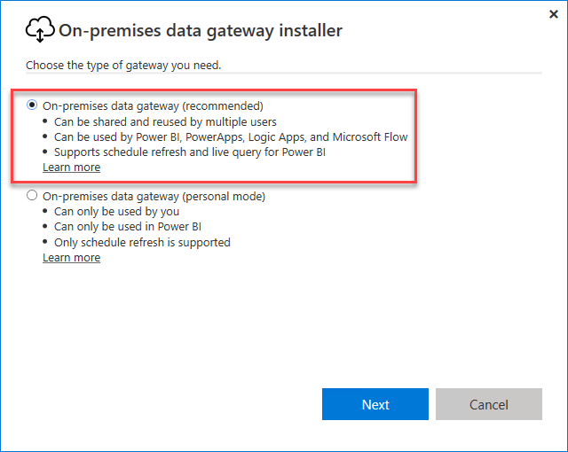
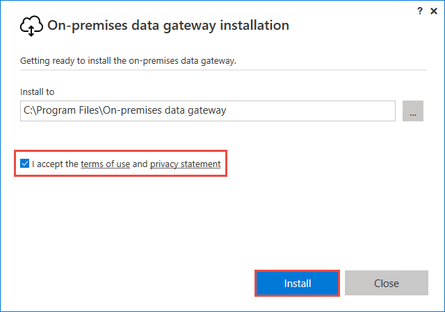
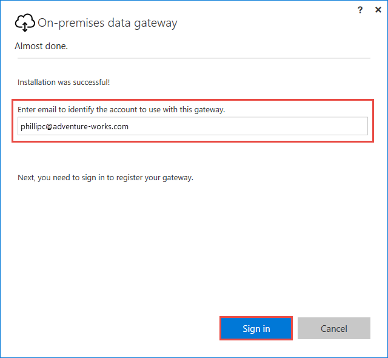
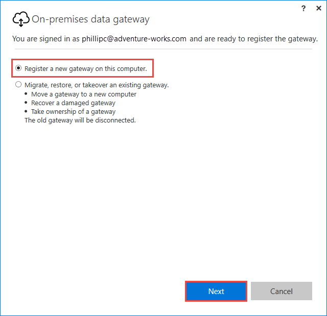
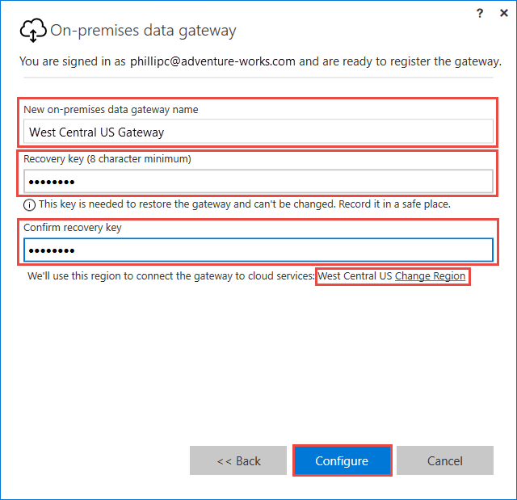
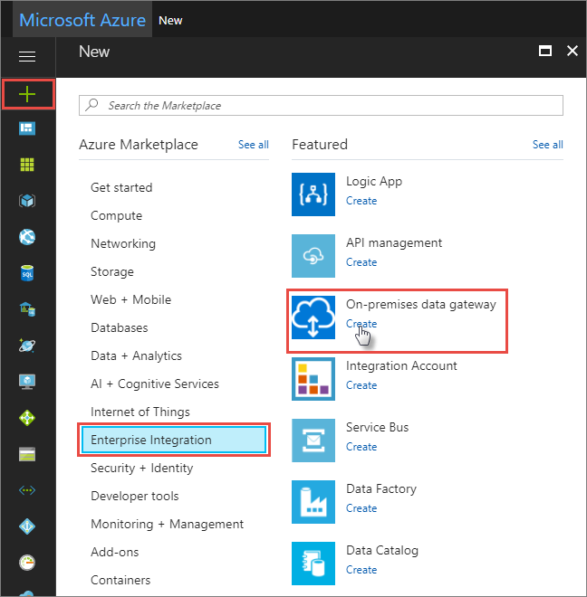
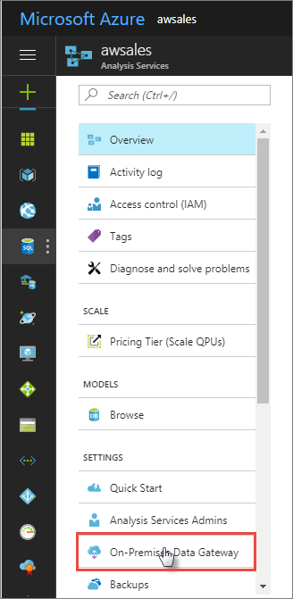
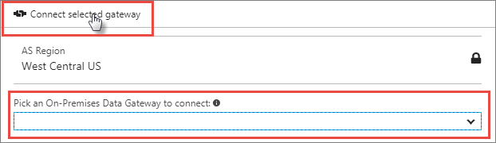
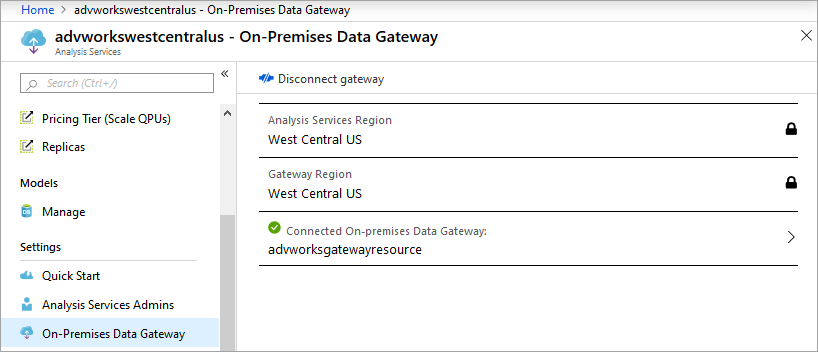

# Install and configure an on-premises data gateway

An on-premises data gateway is required when one or more Azure Analysis Services servers in the same region connect to on-premises data sources. While the gateway you install is the same as used by other services like Power BI, Power Apps, and Logic Apps, when installing for Azure Analysis Services, there are some additional steps you need to complete. This install article is specific to **Azure Analysis Services**. 

To learn more about how Azure Analysis Services works with the gateway, see [Connecting to on-premises data sources](analysis-services-gateway.md). To learn more about advanced installation scenarios and the gateway in general, see [On-premises data gateways documentation](/data-integration/gateway/service-gateway-onprem).

## Prerequisites

**Minimum Requirements:**

* .NET 4.8 Framework
* 64-bit version of Windows 8 / Windows Server 2012 R2 (or later)

**Recommended:**

* 8 Core CPU
* 8 GB Memory
* 64-bit version of Windows 8 / Windows Server 2012 R2 (or later)

**Important considerations:**

* During setup, when registering your gateway with Azure, the default region for your subscription is selected. You can choose a different subscription and region. If you have servers in more than one region, you must install a gateway for each region. 
* The gateway cannot be installed on a domain controller.
* Only one gateway can be installed on a single computer.
* Install the gateway on a computer that remains on and does not go to sleep.
* Do not install the gateway on a computer with a wireless only connection to your network. Performance can be diminished.
* When installing the gateway, the user account you're signed in to your computer with must have Log on as service privileges. When install is complete, the On-premises data gateway service uses the NT SERVICE\PBIEgwService account to log on as a service. A different account can be specified during setup or in Services after setup is complete. Ensure Group Policy settings allow both the account you're signed in with when installing and the service account you choose have Log on as service privileges.
* Sign in to Azure with an account in Azure AD for the same [tenant](/previous-versions/azure/azure-services/jj573650(v=azure.100)#what-is-an-azure-ad-tenant) as the subscription you are registering the gateway in. Azure B2B (guest) accounts are not supported when installing and registering a gateway.
* If data sources are on an Azure Virtual Network (VNet), you must configure the [AlwaysUseGateway](analysis-services-vnet-gateway.md) server property.
* If installing the gateway on an Azure Virtual Machine (VM), ensure optimal networking performance by configuring Accelerated networking. To learn more, see [Create a Windows VM with accelerated networking](../virtual-network/create-vm-accelerated-networking-powershell.md).


## Download

 [Download the gateway](https://go.microsoft.com/fwlink/?LinkId=820925&clcid=0x409)

## Install

1. Run setup.

2. Select **On-premises data gateway**.

   

2. Select a location, accept the terms, and then click **Install**.

   

3. Sign in to Azure. The account must be in your tenant's Azure Active Directory. This account is used for the gateway administrator. Azure B2B (guest) accounts are not supported when installing and registering the gateway.

   

   > [!NOTE]
   > If you sign in with a domain account, it's mapped to your organizational account in Azure AD. Your organizational account is used as the gateway administrator.

## Register

In order to create a gateway resource in Azure, you must register the local instance you installed with the Gateway Cloud Service. 

1.  Select **Register a new gateway on this computer**.

    

2. Type a name and recovery key for your gateway. By default, the gateway uses your subscription's default region. If you need to select a different region, select **Change Region**.

    > [!IMPORTANT]
    > Save your recovery key in a safe place. The recovery key is required in-order to takeover, migrate, or restore a gateway. 

   


## Create an Azure gateway resource

After you've installed and registered your gateway, you need to create a gateway resource in Azure. Sign in to Azure with the same account you used when registering the gateway.

1. In Azure portal, click **Create a resource**, then search for **On-premises data gateway**, and then click **Create**.

   

2. In **Create connection gateway**, enter these settings:

   * **Name**: Enter a name for your gateway resource. 

   * **Subscription**: Select the Azure subscription 
     to associate with your gateway resource. 
   
     The default subscription is based on the 
     Azure account that you used to sign in.

   * **Resource group**: Create a resource group or select an existing resource group.

   * **Location**: Select the region you registered your gateway in.

   * **Installation Name**: If your gateway installation isn't already selected, 
     select the gateway you installed on your computer and registered. 

     When you're done, click **Create**.

## Connect gateway resource to server

> [!NOTE]
> Connecting to a gateway resource in a different subscription from your server is not supported in the portal, but is supported using PowerShell.

# [Portal](#tab/azure-portal)

1. In your Azure Analysis Services server overview, click **On-Premises Data Gateway**.

   

2. In **Pick an On-Premises Data Gateway to connect**, select your gateway resource, and then click **Connect selected gateway**.

   

    > [!NOTE]
    > If your gateway does not appear in the list, your server is likely not in the same region as the region you specified when registering the gateway.

    When connection between your server and gateway resource is successful, status will show **Connected**.


    

# [PowerShell](#tab/azure-powershell)

Use [Get-AzResource](/powershell/module/az.resources/get-azresource) to get the gateway ResourceID. Then connect the gateway resource to an existing or new server by specifying **-GatewayResourceID** in [Set-AzAnalysisServicesServer](/powershell/module/az.analysisservices/set-azanalysisservicesserver) or [New-AzAnalysisServicesServer](/powershell/module/az.analysisservices/new-azanalysisservicesserver).

To get the gateway resource ID:

```azurepowershell-interactive
Connect-AzAccount -Tenant $TenantId -Subscription $subscriptionIdforGateway -Environment "AzureCloud"
$GatewayResourceId = $(Get-AzResource -ResourceType "Microsoft.Web/connectionGateways" -Name $gatewayName).ResourceId  

```

To configure an existing server:

```azurepowershell-interactive
Connect-AzAccount -Tenant $TenantId -Subscription $subscriptionIdforAzureAS -Environment "AzureCloud"
Set-AzAnalysisServicesServer -ResourceGroupName $RGName -Name $servername -GatewayResourceId $GatewayResourceId

```
---

## Optimize

By default, the gateway will spool data before sending it to the Analysis Services server resource, potentially causing slower performance during data load and refresh operations. To ensure optimal performance, override the default setting: 
    
1. In the C:\Program Files\On-Premises data gateway\\**Microsoft.PowerBI.DataMovement.Pipeline.GatewayCore.dll.config** file, set the **StreamBeforeRequestCompletes** setting to **True**, and then save. 

    ```json
    <setting name="StreamBeforeRequestCompletes" serializeAs="String">
       <value>True</value>
    </setting>
    ```
    
1. In **On-premises data gateway** > **Service Settings**, restart the gateway.

## Next steps

* [Connecting to on-premises data sources](analysis-services-gateway.md)   
* [Data sources supported in Azure Analysis Services](analysis-services-datasource.md)   
* [Use gateway for data sources on an Azure Virtual Network](analysis-services-vnet-gateway.md)   
* [Frequently asked questions about Analysis Services network connectivity](analysis-services-network-faq.yml) 
