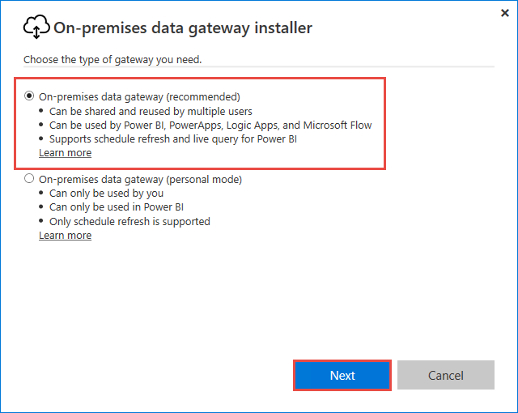

# Install and configure an on-premises data gateway
An on-premises data gateway is required when one or more Azure Analysis Services servers in the same region connect to on-premises data sources. To learn more about the gateway, see [On-premises data gateway](analysis-services-gateway.md).

## Prerequisites
**Minimum Requirements:**

* .NET 4.5 Framework
* 64-bit version of Windows 7 / Windows Server 2008 R2 (or later)

**Recommended:**

* 8 Core CPU
* 8 GB Memory
* 64-bit version of Windows 2012 R2 (or later)

**Important considerations:**

* During setup, when registering your gateway with Azure, the default region for your subscription is selected. You can choose a different region. If you have servers in more than one region, you must install a gateway for each region. 
* The gateway cannot be installed on a domain controller.
* Only one gateway can be installed on a single computer.
* Install the gateway on a computer that remains on and does not go to sleep.
* Do not install the gateway on a computer wirelessly connected to your network. Performance can be diminished.

## Download
 [Download the gateway](https://aka.ms/azureasgateway)

## Install

1. Run setup.

2. Select a location, accept the terms, and then click **Install**.

   

3. Select **On-premises data gateway (recommended)**. Azure Analysis Services does not support personal mode.

   

4. Enter an account to sign in to Azure. The account must be in your tenant's Azure Active Directory. This account is used for the gateway administrator. 

   

   > [!NOTE]
   > If you sign in with a domain account, it will be mapped to your organizational account in Azure AD. Your organizational account will be used as the the gateway administrator.

## Register
In order to create a gateway resource in Azure, you must register the local instance you installed with the Gateway Cloud Service. 

1.  Select **Register a new gateway on this computer**.

    

2. Type a name and recovery key for your gateway. By default, the gateway uses your subscription's default region. If you need to select a different region, select **Change Region**.

   

## Create an Azure gateway resource
After you've installed and registered your gateway, you need to create a gateway resource in your Azure subscription. Sign in to Azure with the same account you used when registering the gateway.

1. In Azure portal, click **Create a new service** > **Enterprise Integration** > **On-premises data gateway** > **Create**.

   

2. In **Create connection gateway**, enter these settings:

    * **Name**: Enter a name for your gateway resource. 

    * **Subscription**: Select the Azure subscription 
    to associate with your gateway resource. 
    This subscription should be the same subscription your servers are in.
   
      The default subscription is based on the 
      Azure account that you used to sign in.

    * **Resource group**: Create a resource group or select an existing resource group.

    * **Location**: Select the region you registered your gateway in.

    * **Installation Name**: If your gateway installation isn't already selected, 
    select the gateway registered. 

    When you're done, click **Create**.

## Connect servers to the gateway resource

1. In your Azure Analysis Services server overview, click **On-Premises Data Gateway**.

   

2. In **Pick an On-Premises Data Gateway to connect**, select your gateway resource, and then click **Connect selected gateway**.

   

    > [!NOTE]
    > If your gateway does not appear in the list, your server is likely not in the same region as the region you specified when registering the gateway. 

That's it. If you need to open ports or do any troubleshooting, be sure to check out [On-premises data gateway](analysis-services-gateway.md).

## Next steps
* [Manage Analysis Services](analysis-services-manage.md)   
* [Get data from Azure Analysis Services](analysis-services-connect.md)
