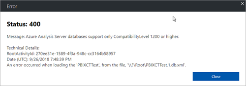
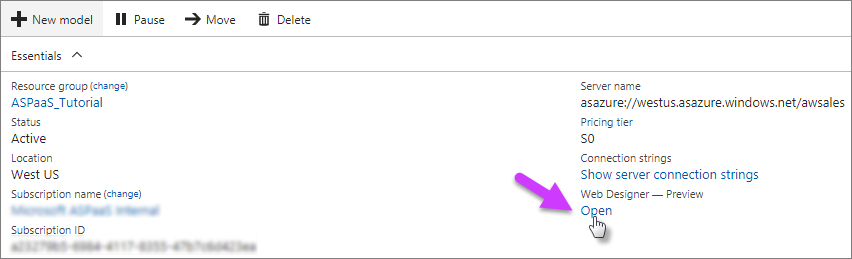
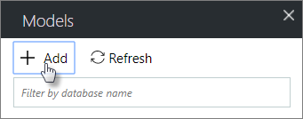
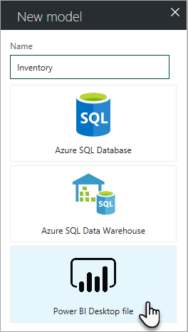
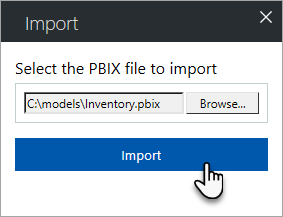
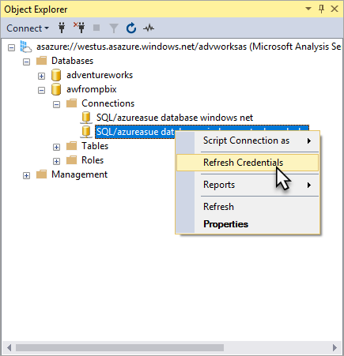
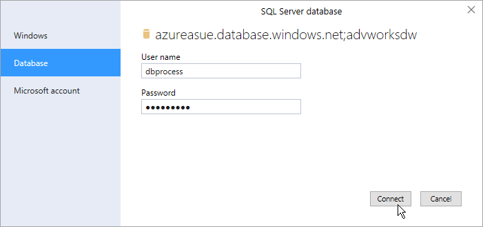

# Import a Power BI Desktop file

You can import a data model in a Power BI Desktop file (pbix) into Azure Analysis Services. Model metadata, cached data, and datasource connections are imported. Reports and visualizations are not imported. Imported data models from Power BI Desktop are at the 1400 compatibility level.

> [!IMPORTANT]
> This feature is deprecated. It may be removed or significantly changed in a future update. It's recommended you discontinue using this features in new and existing projects to maintain compatibility with future updates. For more advanced model development and testing, it's best to use Visual Studio (SSDT) and SQL Server Management Studio (SSMS).

**Restrictions**   

- If your data model is created in Power BI Desktop July 2018 Update (2.60.5169.3201) or later, ensure no preview features are enabled. Preview features are not yet supported in Azure Analysis Services. If you receive the following error when importing, the pbix file has preview features enabled that are not yet supported in Azure Analysis Services.

       
- You must have server administrator permissions to import from a pbix file.
- The pbix model can connect to **Azure SQL Database** and **Azure SQL Data Warehouse** data sources only.
- The pbix model cannot have live or DirectQuery connections. 

## To import from pbix

1. In your server's **Overview** > **Web designer**, click **Open**.

    

2. In **Web designer** > **Models**, click **+ Add**.

    

3. In **New model**, type a model name, and then select Power BI Desktop file.

    

4. In **Import**, locate and select your file.

     

## Change credentials

When you import a data model from a pbix file, by default, the credentials used to connect to a datasource are set to ServiceAccount. After a model has been imported from a pbix, you can change credentials by using the following methods:

- Use the July 2018 (version 17.8.1) or later version of SSMS to edit credentials. This is the easiest way.
- Use TMSL [Alter command](https://docs.microsoft.com/sql/analysis-services/tabular-models-scripting-language-commands/alter-command-tmsl) on the [DataSources object](https://docs.microsoft.com/sql/analysis-services/tabular-models-scripting-language-objects/datasources-object-tmsl) to modify the connection string property. 
- Open the model in Visual Studio, edit the credentials for the datasource connection, and then re-deploy the model.

To change credentials by using SSMS. 

1. In SSMS, expand database > **Connections**. 
2. Right-click the database connection, and then click **Refresh Credentials**. 

    

3. In the credentials dialog, select a credential type, and enter credentials. For SQL authentication, select Database. For organization account (OAuth), select Microsoft account.
    

The July 2018 version of Power BI Desktop includes a new feature for changing datasource permissions. On the **Home** tab, click **Edit Queries**  > **Data source settings**. Select the datasource connection, and then click **Edit Permissions**.

## See also

[Create a model in Azure portal](analysis-services-create-model-portal.md)   
[Connect to Azure Analysis Services](analysis-services-connect.md)  
