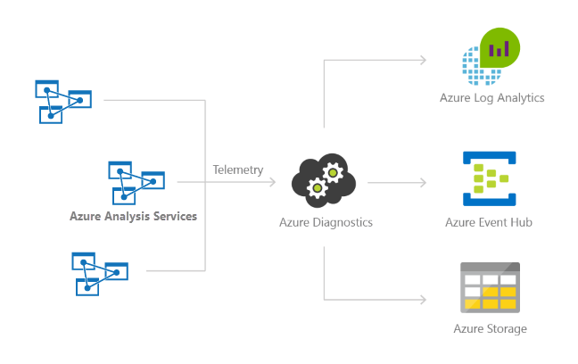
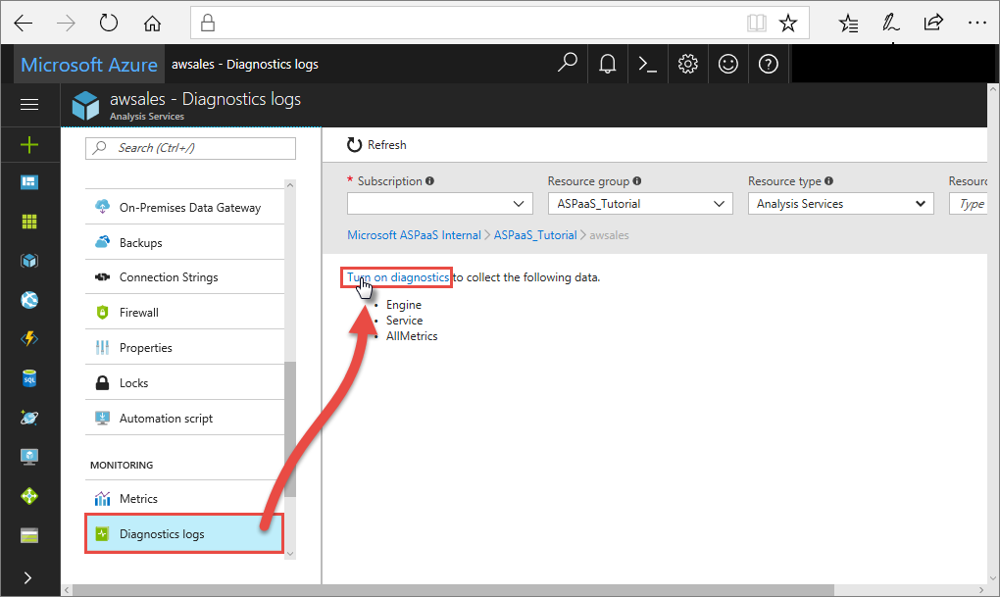

# Set up diagnostic logging

An important part of any Analysis Services solution is monitoring how your servers are performing. For general information about monitoring Azure Analysis Services, see [Monitor Azure Analysis Services](monitor-analysis-services.md).

This article describes how to set up, view, and manage [Azure Monitor resource logs](/azure/azure-monitor/essentials/platform-logs-overview) for your Analysis Services servers. You can send resource logs to [Azure Storage](https://azure.microsoft.com/services/storage/), stream them to [Azure Event Hubs](https://azure.microsoft.com/services/event-hubs/), and export them to [Azure Monitor logs](/azure/azure-monitor/overview).



[!INCLUDE [updated-for-az](../../includes/updated-for-az.md)]

## What's logged?

You can select **Engine**, **Service**, and **Metrics** log categories. For a listing of what's logged for each category, see [Supported resource logs for Microsoft.AnalysisServices/servers](monitor-analysis-services-reference.md#supported-resource-logs-for-microsoftanalysisservicesservers).

## Set up diagnostics logging

### Azure portal

1. In [Azure portal](https://portal.azure.com) > server, click **Diagnostic settings** in the left navigation, and then click **Turn on diagnostics**.

    

2. In **Diagnostic settings**, specify the following options: 

    * **Name**. Enter a name for the logs to create.

    * **Archive to a storage account**. To use this option, you need an existing storage account to connect to. See [Create a storage account](/azure/storage/common/storage-account-create). Follow the instructions to create a Resource Manager, general-purpose account, then select your storage account by returning to this page in the portal. It may take a few minutes for newly created storage accounts to appear in the drop-down menu.
    * **Stream to an event hub**. To use this option, you need an existing Event Hub namespace and event hub to connect to. To learn more, see [Create an Event Hubs namespace and an event hub using the Azure portal](/azure/event-hubs/event-hubs-create). Then return to this page in the portal to select the Event Hub namespace and policy name.
    * **Send to Azure Monitor (Log Analytics workspace)**. To use this option, either use an existing workspace or [create a new workspace](/azure/azure-monitor/logs/quick-create-workspace) resource in the portal. For more information on viewing your logs, see [View logs in Log Analytics workspace](#view-logs-in-log-analytics-workspace) in this article.

    * **Engine**. Select this option to log xEvents. If you're archiving to a storage account, you can select the retention period for the resource logs. Logs are autodeleted after the retention period expires.
    * **Service**. Select this option to log service level events. If you are archiving to a storage account, you can select the retention period for the resource logs. Logs are autodeleted after the retention period expires.
    * **Metrics**. Select this option to store verbose data in [Metrics](analysis-services-monitor.md#server-metrics). If you are archiving to a storage account, you can select the retention period for the resource logs. Logs are autodeleted after the retention period expires.

3. Click **Save**.

    If you receive an error that says "Failed to update diagnostics for \<workspace name>. The subscription \<subscription id> is not registered to use microsoft.insights." follow the [Troubleshoot Azure Diagnostics](../azure-monitor/essentials/resource-logs.md) instructions to register the account, then retry this procedure.

    If you want to change how your resource logs are saved at any point in the future, you can return to this page to modify settings.

### PowerShell

Here are the basic commands to get you going. If you want step-by-step help on setting up logging to a storage account by using PowerShell, see the tutorial later in this article.

To enable metrics and resource logging by using PowerShell, use the following commands:

- To enable storage of resource logs in a storage account, use this command:

   ```powershell
   Set-AzDiagnosticSetting -ResourceId [your resource id] -StorageAccountId [your storage account id] -Enabled $true
   ```

   The storage account ID is the resource ID for the storage account where you want to send the logs.

- To enable streaming of resource logs to an event hub, use this command:

   ```powershell
   Set-AzDiagnosticSetting -ResourceId [your resource id] -ServiceBusRuleId [your service bus rule id] -Enabled $true
   ```

   The Azure Service Bus rule ID is a string with this format:

   ```powershell
   {service bus resource ID}/authorizationrules/{key name}
   ``` 

- To enable sending resource logs to a Log Analytics workspace, use this command:

   ```powershell
   Set-AzDiagnosticSetting -ResourceId [your resource id] -WorkspaceId [resource id of the log analytics workspace] -Enabled $true
   ```

- You can obtain the resource ID of your Log Analytics workspace by using the following command:

   ```powershell
   (Get-AzOperationalInsightsWorkspace).ResourceId
   ```

You can combine these parameters to enable multiple output options.

### REST API

Learn how to [change diagnostics settings by using the Azure Monitor REST API](/rest/api/monitor/). 

### Resource Manager template

Learn how to [enable diagnostics settings at resource creation by using a Resource Manager template](../azure-monitor/essentials/resource-manager-diagnostic-settings.md). 

## Manage your logs

Logs are typically available within a couple hours of setting up logging. It's up to you to manage your logs in your storage account:

* Use standard Azure access control methods to secure your logs by restricting who can access them.
* Delete logs that you no longer want to keep in your storage account.
* Be sure to set a retention period for so old logs are deleted from your storage account.

## View logs in Log Analytics workspace

To view your diagnostic data, in Log Analytics workspace, open **Logs**  from the left menu.


In the query builder, expand **LogManagement** > **AzureDiagnostics**. AzureDiagnostics includes Engine and Service events. Notice a query is created on-the-fly. The EventClass\_s field contains xEvent names, which may look familiar if you've used xEvents for on-premises logging. Click **EventClass\_s** or one of the event names and Log Analytics workspace continues constructing a query. Be sure to save your queries to reuse later.

For more queries you can use with Analysis Services, see [Sample Kusto queries](monitor-analysis-services.md#sample-kusto-queries).

## Turn on logging by using PowerShell

In this quick tutorial, you create a storage account in the same subscription and resource group as your Analysis Service server. You then use Set-AzDiagnosticSetting to turn on diagnostics logging, sending output to the new storage account.

### Prerequisites

To complete this tutorial, you must have the following resources:

* An existing Azure Analysis Services server. For instructions on creating a server resource, see [Create a server in Azure portal](analysis-services-create-server.md), or [Create an Azure Analysis Services server by using PowerShell](analysis-services-create-powershell.md).

### Connect to your subscriptions

Start an Azure PowerShell session and sign in to your Azure account with the following command:  

```powershell
Connect-AzAccount
```

In the pop-up browser window, enter your Azure account user name and password. Azure PowerShell gets all the subscriptions that are associated with this account and by default, uses the first one.

If you have multiple subscriptions, you might have to specify a specific one that was used to create your Azure Key Vault. Type the following to see the subscriptions for your account:

```powershell
Get-AzSubscription
```

Then, to specify the subscription that's associated with the Azure Analysis Services account you are logging, type:

```powershell
Set-AzContext -SubscriptionId <subscription ID>
```

> [!NOTE]
> If you have multiple subscriptions associated with your account, it is important to specify the subscription.
>
>

### Create a new storage account for your logs

You can use an existing storage account for your logs, provided it's in the same subscription as your server. For this tutorial, you create a new storage account dedicated to Analysis Services logs. To make it easy, you're storing the storage account details in a variable named **sa**.

You also use the same resource group as the one that contains your Analysis Services server. Substitute values for `awsales_resgroup`, `awsaleslogs`, and `West Central US` with your own values:

```powershell
$sa = New-AzStorageAccount -ResourceGroupName awsales_resgroup `
-Name awsaleslogs -Type Standard_LRS -Location 'West Central US'
```

### Identify the server account for your logs

Set the account name to a variable named **account**, where ResourceName is the name of the account.

```powershell
$account = Get-AzResource -ResourceGroupName awsales_resgroup `
-ResourceName awsales -ResourceType "Microsoft.AnalysisServices/servers"
```

### Enable logging

To enable logging, use the Set-AzDiagnosticSetting cmdlet together with the variables for the new storage account, server account, and the category. Run the following command, setting the **-Enabled** flag to **$true**:

```powershell
Set-AzDiagnosticSetting  -ResourceId $account.ResourceId -StorageAccountId $sa.Id -Enabled $true -Categories Engine
```

The output should look something like this example:

```powershell
StorageAccountId            : 
/subscriptions/a23279b5-xxxx-xxxx-xxxx-47b7c6d423ea/resourceGroups/awsales_resgroup/providers/Microsoft.Storage/storageAccounts/awsaleslogs
ServiceBusRuleId            :
EventHubAuthorizationRuleId :
Metrics                    
    TimeGrain       : PT1M
    Enabled         : False
    RetentionPolicy
    Enabled : False
    Days    : 0


Logs                       
    Category        : Engine
    Enabled         : True
    RetentionPolicy
    Enabled : False
    Days    : 0


    Category        : Service
    Enabled         : False
    RetentionPolicy
    Enabled : False
    Days    : 0


WorkspaceId                 :
Id                          : /subscriptions/a23279b5-xxxx-xxxx-xxxx-47b7c6d423ea/resourcegroups/awsales_resgroup/providers/microsoft.analysisservic
es/servers/awsales/providers/microsoft.insights/diagnosticSettings/service
Name                        : service
Type                        :
Location                    :
Tags                        :
```

This output confirms that logging is now enabled for the server, saving information to the storage account.

You can also set retention policy for your logs so older logs are automatically deleted. For example, set retention policy using **-RetentionEnabled** flag to **$true**, and set **-RetentionInDays** parameter to **90**. Logs older than 90 days are automatically deleted.

```powershell
Set-AzDiagnosticSetting -ResourceId $account.ResourceId`
 -StorageAccountId $sa.Id -Enabled $true -Categories Engine`
  -RetentionEnabled $true -RetentionInDays 90
```

## Next steps

- Learn more about [Azure Monitor resource logging](/azure/azure-monitor/essentials/platform-logs-overview).
- See [Set-AzDiagnosticSetting](/powershell/module/az.monitor/set-azdiagnosticsetting) in PowerShell help.
