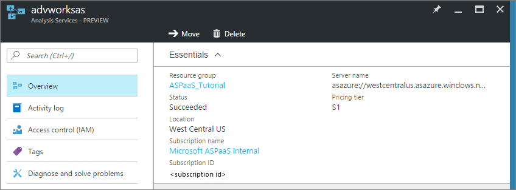
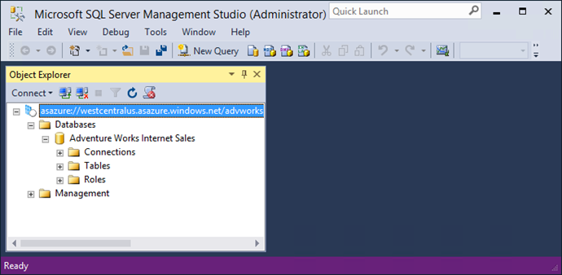
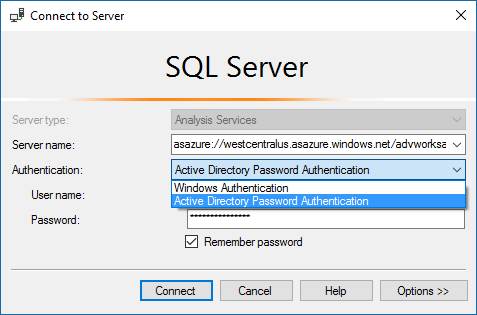

# Manage Analysis Services
Once you've created an Analysis Services server in Azure, there may be some administration and management tasks you need to perform right away or sometime down the road. For example, run processing to the refresh data, control who can access the models on your server, or monitor your server's health. Some management tasks can only be performed in Azure portal, others in SQL Server Management Studio (SSMS), and some tasks can be done in either.

## Azure portal
The [Azure portal](http://portal.azure.com/) is where you can create and delete servers, monitor server resources, change size, and manage who has access to your servers.  If you're having some problems, you can also submit a support request.



## SQL Server Management Studio
Connecting to your server in Azure is just like connecting to a server instance in your own organization. From SSMS, you can perform many of the same tasks such as process data or create a processing script, manage roles, and use PowerShell. [Download and install SSMS](#download-and-install-ssms).
  


 One of the bigger differences is the authentication you use to connect to your server. To connect to your Azure Analysis Services server, you need to select **Active Directory Password Authentication**.

 When using SSMS, before connecting to your server the first time, make sure your username is included in the Analysis Services Admins group. To learn more, see [Server administrators](#server-administrators) later in this article.

### To connect with SSMS
1. Before you connect, you need to get the server name. In **Azure portal** > server > **Overview** > **Server name**, copy the server name.
   
    
2. In SSMS > **Object Explorer**, click **Connect** > **Analysis Services**.
3. In the **Connect to Server** dialog box, paste in the server name, then in in **Authentication**, choose one of the following:
   
    **Active Directory Integrated Authentication** to use single sign-on with Active Directory to Azure Active Directory federation.
   
    **Active Directory Password Authentication** to use an organizational account. For example, when connecting from a non-domain joined computer.
   
    Note: If you don't see Active Directory Authentication, you may need to update to the [latest version of SSMS](#download-and-install-ssms).
   
    

Since managing your server in Azure by using SSMS is much the same as managing an on-premises server, we're not going to go into details here. All the help you need can be found in [Analysis Services Instance Management](https://msdn.microsoft.com/library/hh230806.aspx) on MSDN.

## Server administrators and database users
In Azure Analysis Services there are two types of users, server administrators and database users. Both types of users must be in your Azure Active Directory and must be specified by organizational email address or UPN. This is different from on-premises tabular model databases which support server administrators and database users by Windows domain usernames. To learn more, see [Manage users in Azure Analysis Services](analysis-services-manage-users.md).

## Download and install SSMS
[Download SQL Server Management Studio](https://docs.microsoft.com/sql/ssms/download-sql-server-management-studio-ssms).

On the download page, you'll have two options:
 
* Release candidate - is recommended when connecting to Azure Analysis Services preview only. This release gets the latest updates and works best with Azure Analysis Services preview.
* Current production release - is recommended for use when connecting to both production servers as well Azure Analysis Services preview. When using this release, you may need edit the registry to enable Azure Active Directory authentication.

## Enable Azure Active Directory authentication

To enable the Azure Active Directory authentication feature for SSMS in the registry, create a text file named EnableAAD.reg, then copy and paste the following:

```
Windows Registry Editor Version 5.00
[HKEY_CURRENT_USER\Software\Microsoft\Microsoft SQL Server\Microsoft Analysis Services\Settings]
"AS AAD Enabled"="True"
```

Save and then run the file.

## Troubleshooting connection problems
When connecting to your server using SSMS, if (in step 3) you attempt to sign in using a non-federated account or an account not in your Azure Active Directory, and are unable to connect, you may need to clear your login cache. Close SSMS before following these steps.

1. In File Explorer, navigate to `C:\Users\<user_name>\AppData\Local\`.
2. Delete the **AADCacheOM** folder.
3. Search the **Local** folder for .dat files beginning with the name **omlibs-tokens-cache.** If you find any, delete them.
4. Open SSMS and repeat the steps in [To connect with SSMS](#to-connect-with-ssms) above.

## Next steps
If you haven't already deployed a tabular model to your new server, now is a good time. To learn more, see [Deploy to Azure Analysis Services](analysis-services-deploy.md).

If you've deployed a model to your server, you're ready to connect to it using a client or browser. To learn more, see [Get data from Azure Analysis Services server](analysis-services-connect.md).

