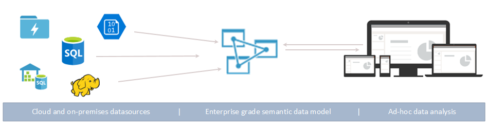
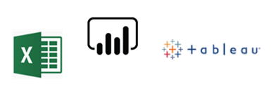
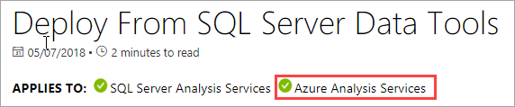
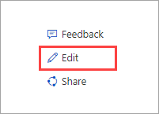

# What is Azure Analysis Services?

Azure Analysis Services is a fully managed platform as a service (PaaS) that provides enterprise-grade data models in the cloud. Use advanced mashup and modeling features to combine data from multiple data sources, define metrics, and secure your data in a single, trusted tabular semantic data model. The data model provides an easier and faster way for users to browse massive amounts of data for ad-hoc data analysis.

**Video:** Check out [Azure Analysis Services Overview](https://sec.ch9.ms/ch9/d6dd/a1cda46b-ef03-4cea-8f11-68da23c5d6dd/AzureASoverview_high.mp4)  to learn how Azure Analysis Services fits in with Microsoft's overall BI capabilities.

## Get up and running quickly

In Azure portal, you can [create a server](analysis-services-create-server.md) within minutes. And with Azure Resource Manager [templates](../azure-resource-manager/resource-manager-create-first-template.md) and PowerShell, you can create servers using a declarative template. With a single template, you can deploy server resources along with other Azure components such as storage accounts and Azure Functions. 

**Video:** Check out [Automating deployent](https://channel9.msdn.com/series/Azure-Analysis-Services/AzureAnalysisServicesAutomation) to learn more about how you can use Azure Automation to speed server creation.

Azure Analysis Services integrates with many Azure services enabling you to build sophisticated analytics solutions. Integration with [Azure Active Directory](../active-directory/fundamentals/active-directory-whatis.md) provides secure, role-based access to your critical data. Integrate with [Azure Data Factory](../data-factory/introduction.md) pipelines by including an activity that loads data into the model. [Azure Automation](../automation/automation-intro.md) and [Azure Functions](../azure-functions/functions-overview.md) can be used for lightweight orchestration of models using custom code. 

## The right tier when you need it

Azure Analysis Services is available in **Developer**, **Basic**, and **Standard** tiers. Within each tier, plan costs vary according to processing power, QPUs, and memory size. When you create a server, you select a plan within a tier. You can change plans up or down within the same tier, or upgrade to a higher tier, but you can't downgrade from a higher tier to a lower tier.

### Developer tier

This tier is recommended for evaluation, development, and test scenarios. A single plan includes the same functionality of the standard tier, but is limited in processing power, QPUs, and memory size. Query replica scale out *is not available* for this tier. This tier does not offer an SLA.

|Plan  |QPUs  |Memory (GB)  |
|---------|---------|---------|
|D1    |    20     |    3     |

### Basic tier

The tier is recommended for production solutions with smaller tabular models, limited user concurrency, and simple data refresh requirements. Query replica scale out *is not available* for this tier. Perspectives, multiple partitions, and DirectQuery tabular model features *are not supported* in this tier.  

|Plan  |QPUs  |Memory (GB)  |
|---------|---------|---------|
|B1    |    40     |    10     |
|B2    |    80     |    20     |

### Standard tier

This tier is for mission-critical production applications that require elastic user-concurrency, and have rapidly growing data models. It supports advanced data refresh for near real-time data model updates, and supports all tabular modeling features.

|Plan  |QPUs  |Memory (GB)  |
|---------|---------|---------|
|S1    |    40     |    10     |
|S2    |    100     |    25     |
|S3    |    200     |    50     |
|S4    |    400     |    100     |
|S8*    |    320     |    200     |
|S9*    |    640    |    400     |

\* Not available in all regions.  

## Availability by region

Azure Analysis Services is supported in regions throughout the world. Supported plans and query replica availability depend on the region you choose. Plan and query replica availability can change depending on need and available resources for each region. 

### Americas

|Region  | Supported plans | Query replicas (Standard plans only) |
|---------|---------|:---------:|
|Brazil South     |    B1, B2, S0, S1, S2, S4, D1     |     1    |
|Canada Central    |     B1, B2, S0, S1, S2, S4, D1    |     1    |
|East US     |     B1, B2, S0, S1, S2, S4, D1    |    1     |
|East US 2     |     B1, B2, S0, S1, S2, S4, D1   S8, S9   |    7 1    |
|North Central US     |     B1, B2, S0, S1, S2, S4, D1     |    1     |
|Central US     |    B1, B2, S0, S1, S2, S4, D1     |    1     |
|South Central US     |    B1, B2, S0, S1, S2, S4, D1     |    1     |
|West Central US   |     B1, B2, S0, S1, S2, S4, D1    |    3     |
|West US     |    B1, B2, S0, S1, S2, S4, D1   S8, S9   |    7 2  |
|West US2    |    B1, B2, S0, S1, S2, S4, D1    S8, S9  |    3 1     |

### Europe

|Region  | Supported plans | Query replicas (Standard plans only) |
|---------|---------|:---------:|
|North Europe     |    B1, B2, S0, S1, S2, S4, D1      |    7     |
|UK South   |    B1, B2, S0, S1, S2, S4, D1      |     1    |
|West Europe     |    B1, B2, S0, S1, S2, S4, D1    S8, S9    |    7 1     |

### Asia Pacific 

|Region  | Supported plans | Query replicas (Standard plans only) |
|---------|---------|:---------:|
|Australia Southeast     | B1, B2, S0, S1, S2, S4, D1       |    1     |
|Australia East     |    B1, B2, S0, S1, S2, S4     S8, S9    |    3 1     |
|Japan East  |   B1, B2, S0, S1, S2, S4, D1       |    1     |
|Southeast Asia     |     B1, B2, S0, S1, S2, S4, S8, S9, D1     |   1      |
|West India     |    B1, B2, S0, S1, S2, S4, D1     |    1     |

## Scale to your needs

### Scale up\down, pause, and resume

Go up, down, or pause your server. Use the Azure portal or have total control on-the-fly by using PowerShell. You only pay for what you use.  

### Scale out resources for fast query responses

With scale out, client queries are distributed among multiple *query replicas* in a query pool. Query replicas have synchronized copies of your tabular models. By spreading the query workload, response times during high query workloads can be reduced. Model processing operations can be separated from the query pool, ensuring client queries are not adversely affected by processing operations. 

You can create a query pool with up to seven additional query replicas (eight total, including your server). The number of query replicas you can have in your pool depend on your chosen plan and region. Query replicas cannot be spread outside your server's region. Query replicas are billed at the same rate as your server.

Just like with changing tiers, you can scale out query replicas according to your needs. Configure scale out in the portal or by using REST APIs. To learn more, see [Azure Analysis Services scale out](analysis-services-scale-out.md).

## Pricing

Total cost depends on a number of factors; for example, your chosen region, tier, query replicas, and pause/resume. Use the [Azure Analysis Services Pricing](https://azure.microsoft.com/pricing/details/analysis-services/) calculator to determine typical pricing for your region. This tool calculates pricing for a single-server instance for a single region. Keep in mind, query replicas are billed at the same rate as the server. 

## Built on SQL Server Analysis Services

Azure Analysis Services is compatible with many great features already in SQL Server Analysis Services Enterprise Edition. Azure Analysis Services supports tabular models at the 1200 and higher [compatibility levels](analysis-services-compat-level.md). Tabular models are relational modeling constructs (model, tables, columns), articulated in tabular metadata object definitions in Tabular Model Scripting Language (TMSL) and Tabular Object Model (TOM) code. Partitions, perspectives, row-level security, bi-directional relationships, and translations are all supported*. Multidimensional models and PowerPivot for Sharepoint *are not* supported in Azure Analysis Services.

Tabular models in both in-memory and DirectQuery modes are supported. In-memory mode (default) tabular models support multiple data sources. Because model data is highly compressed and cached in-memory, this mode provides the fastest query response over large amounts of data. It also provides the greatest flexibility for complex datasets and queries. Partitioning enables incremental loads, increases parallelization, and reduces memory consumption. Other advanced data modeling features like calculated tables, and all DAX functions are supported. In-memory models must be refreshed (processed) to update cached data from data sources. With Azure service principle support, unattended refresh operations using PowerShell, TOM, TMSL and REST offer flexibility in making sure your model data is always up to date. 

DirectQuery mode* leverages the backend relational database for storage and query execution. Extremely large data sets in single SQL Server, SQL Server Data Warehouse, Azure SQL Database, Azure SQL Data Warehouse, Oracle, and Teradata data sources are supported. Backend data sets can exceed available server resource memory. Complex data model refresh scenarios aren't needed. There are also some restrictions, such as limited datasource types, DAX formula limitations, and some advanced data modeling features aren't supported. Before determining the best mode for you, see [Direct Query mode](https://docs.microsoft.com/sql/analysis-services/tabular-models/directquery-mode-ssas-tabular).

\* Feature availability depends on tier.

## Supported datasources

Tabular models in Azure Analysis Services support a wide variety of data sources from simple text files to Big Data in Azure Data Lake Store. To learn more, see [Data sources supported in Azure Analysis Services](analysis-services-datasource.md).

## Your data is secure

Azure Analysis Services provides security for your sensitive data at multiple levels. At the server level: Firewall, Azure authentication, server administrator roles, and Server-Side Encryption. And at the data model level, user roles, row-level, and object-level security ensure your data is safe and gets seen by only those users who are meant to see it.

### Firewall

Azure Analysis Services Firewall blocks all client connections other than those IP addresses specified in rules. Configure rules specifying allowed IP addresses by individual client IPs or by range. Power BI (service) connections can also be allowed or blocked. Configure firewall and rules in the portal or by using PowerShell. To learn more, see [Configure a server firewall](analysis-services-qs-firewall.md).

### Authentication

User authentication is handled by [Azure Active Directory (AAD)](../active-directory/fundamentals/active-directory-whatis.md). When logging in, users use an organization account identity with role-based access to the database. User identities must be members of the default Azure Active Directory for the subscription that the server is in. To learn more, see [Authentication and user permissions](analysis-services-manage-users.md).

### Data security

Azure Analysis Services uses Azure Blob storage to persist storage and metadata for Analysis Services databases. Data files within Blob are encrypted using [Azure Blob Server Side Encryption (SSE)](../storage/common/storage-service-encryption.md). When using Direct Query mode, only metadata is stored. The actual data is accessed through encrypted protocol from the data source at query time.

Secure access to data sources on-premises in your organization is achieved by installing and configuring an [On-premises data gateway](analysis-services-gateway.md). Gateways provide access to data for both DirectQuery and in-memory modes.

### Roles

Analysis Services uses [role-based authorization](https://docs.microsoft.com/sql/analysis-services/tabular-models/roles-ssas-tabular) that grants access to server and model database operations, objects, and data. All users who access a server or database do so with their Azure AD user account within an assigned role. The server administrator role is at the server resource level. By default, the account used when creating a server is automatically included in the Server Admins role. Additional user and group accounts are added by using the portal, SSMS, or PowerShell.
  
Non-administrative end users who query data are granted access through database roles. A database role is created as a separate object in the database, and applies only to the database in which that role is created. Database roles are defined by (database) Administrator, Read, and Read and Process permissions. User and group accounts are added by using SSMS or PowerShell.

### Row-level security

Tabular models at all compatibility levels support row-level security. Row-level security is configured in the model by using DAX expressions that define the rows in a table, and any rows in the many direction of a related table that a user can query. Row filters using DAX expressions are defined for the Read and Read and Process permissions. 

### Object-level security 

Tabular models at the 1400 compatibility level support object-level security, which includes table-level security and column-level security. Object level security is set in the JSON-based metadata in the Model.bim file by using TMSL, or TOM. To learn more, see [Object-level security](https://docs.microsoft.com/sql/analysis-services/tabular-models/object-level-security).

### Automation through service principles

Service principals are an Azure Active Directory application resource you create within your tenant to perform unattended resource and service level operations. Service principals are used with Azure Automation, PowerShell unattended mode, custom client applications, and web apps to automate common tasks like data refresh, scale up/down, and pause/resume. Permissions are assigned to service principals through role membership. To learn more, see [Automation with service principals](analysis-services-service-principal.md).

### Azure governance

Azure Analysis Services is governed by the [Microsoft Online Services Terms](http://www.microsoftvolumelicensing.com/DocumentSearch.aspx?Mode=3&DocumentTypeId=31) and the [Microsoft Privacy Statement](https://privacy.microsoft.com/privacystatement).
To learn more about Azure Security, see the [Microsoft Trust Center](https://www.microsoft.com/trustcenter).

## Use the tools you already know

### SQL Server Data Tools (SSDT) for Visual Studio

Develop and deploy models with the free [SQL Server Data Tools (SSDT) for Visual Studio](https://msdn.microsoft.com/library/mt204009.aspx). SSDT includes Analysis Services project templates that get you up and going quickly. SSDT now includes the modern Get Data datasource query and mashup functionality for tabular 1400 models. If you're familiar with Get Data in Power BI Desktop and Excel 2016, you already know how easy it is to create highly customized data source queries. 
Microsoft Analysis Services Projects are also available for Visual Studio as an installable package VSIX. [Download from Marketplace](https://marketplace.visualstudio.com/items?itemName=ProBITools.MicrosoftAnalysisServicesModelingProjects).

### Sql Server Management Studio

Manage your servers and model databases by using [SQL Server Management Studio (SSMS)](https://docs.microsoft.com/sql/ssms/download-sql-server-management-studio-ssms). Connect to your servers in the cloud. Run TMSL scripts right from the XMLA query window, and automate tasks by using TMSL scripts and PowerShell. New features and functionality happen fast - SSMS is updated monthly.

### PowerShell

Server resource management tasks like creating server resources, suspending or resuming server operations, or changing the service level (tier) use Azure Resource Manager (AzureRM) cmdlets. Other tasks for managing databases such as adding or removing role members, processing, or running TMSL scripts use cmdlets in the SqlServer module. To learn more, see [Manage Azure Analysis Services with PowerShell](analysis-services-powershell.md).

### Object model and scripting

Tabular models offer rapid development and are highly customizable. 
Tabular models include the [Tabular Object Model](https://docs.microsoft.com/sql/analysis-services/tabular-model-programming-compatibility-level-1200/introduction-to-the-tabular-object-model-tom-in-analysis-services-amo) (TOM) to describe model objects. TOM is exposed in JSON through the [Tabular Model Scripting Language (TMSL)](https://docs.microsoft.com/sql/analysis-services/tabular-model-scripting-language-tmsl-reference) and the AMO data definition language through the [Microsoft.AnalysisServices.Tabular](https://msdn.microsoft.com/library/microsoft.analysisservices.tabular.aspx) namespace. 

## Supports the latest client tools

Modern data exploration and visualization tools like Power BI, Excel, Reporting Services, and third-party tools are all supported, providing users with highly interactive and visually rich insights into your model data. 

## Monitoring and diagnostics

Azure Analysis Services is integrated with Azure metrics, providing an extensive number of resource-specific metrics to help you monitor the performance and health of your servers. To learn more, see [Monitor server metrics](analysis-services-monitor.md). Record metrics with [Azure resource diagnostic logs](../monitoring-and-diagnostics/monitoring-overview-of-diagnostic-logs.md). Monitor and send logs to [Azure Storage](https://azure.microsoft.com/services/storage/), stream them to [Azure Event Hubs](https://azure.microsoft.com/services/event-hubs/), and export them to [Log Analytics](https://azure.microsoft.com/services/log-analytics/), a service of [Azure](https://www.microsoft.com/cloud-platform/operations-management-suite). To learn more, see [Setup diagnostic logging](analysis-services-logging.md).

Azure Analysis Services also supports using [Dynamic Management Views (DMVs)](https://docs.microsoft.com/sql/analysis-services/instances/use-dynamic-management-views-dmvs-to-monitor-analysis-services). Based on SQL syntax, DMVs interface schema rowsets that return metadata and monitoring information about server instance.

## Documentation

Documentation specific to Azure Analysis Services is included here. Use the table of contents on the left side of your browser screen to find articles. 

Because Azure Analysis Services tabular models are much the same as tabular models in SQL Server Analysis Services, there's an extensive library of shared  conceptual, procedural, developer, and reference articles in [SQL Server Analysis Services Documentation](https://docs.microsoft.com/sql/analysis-services/analysis-services). Articles in the SQL Server Analysis Services documentation show if they also apply to Azure Analysis Services by an APPLIES TO banner beneath the title.

### Contribute!

Analysis Services documentation, like this article, are open source. If you have a GitHub account, you can edit an article by clicking Edit (pencil) in the upper right corner of your browser screen. Use the in-browser editor  and then click Propose file change. 

Your contribution will be reviewed by the documentation team and if approved, your GitHub account name will be shown as a contributor. To learn more, see the [Docs contributor guide](https://docs.microsoft.com/contribute/).

Azure Analysis Services documentation also uses [GitHub Issues](https://docs.microsoft.com/teamblog/a-new-feedback-system-is-coming-to-docs). You can provide feedback about the product or documentation. Use **Feedback** at the bottom of an article. GitHub Issues aren't yet enabled for SQL Server Analysis Services documentation. 

## Blogs

Things are changing rapidly. Get the latest information on the [Analysis Services team blog](https://blogs.msdn.microsoft.com/analysisservices/) and [Azure blog](https://azure.microsoft.com/blog/).

## Community

Analysis Services has a vibrant community of users. Join the conversation on [Azure Analysis Services forum](https://aka.ms/azureanalysisservicesforum).

## Next steps

> [!div class="nextstepaction"]
> [Sign up for a Free Azure Trial](https://azure.microsoft.com/offers/ms-azr-0044p/)   

> [!div class="nextstepaction"]
> [Quickstart: Create a server - Portal](analysis-services-create-server.md)   

> [!div class="nextstepaction"]
> [Quickstart: Create a server - PowerShell](analysis-services-create-powershell.md)  
