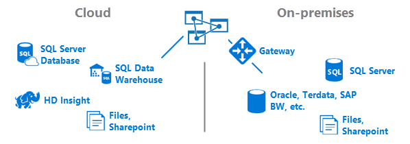
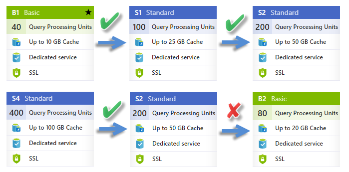

# What is Azure Analysis Services?

Azure Analysis Services provides enterprise-grade data modeling in the cloud. With its highly optimized data analytics engine, Analysis Services provides a semantic model layer between large, complex, and often disparate data sources. By pulling data together, you can define the relationships, the measures, and the security, creating highly customized and highly performant analytics. Clients can connect to in-memory data or near real-time operational data by using DirectQuery. With a trusted semantic model that’s easy to understand and use, and with Azure's legendary reliability, you too can enable self-service data discovery for your organization.

Check out this video to learn how Azure Analysis Services fits in with Microsoft's overall BI capabilities, and how you can benefit from getting your data models into the cloud.

>[!VIDEO https://channel9.msdn.com/series/Azure-Analysis-Services/Azure-Analysis-Services-overview/player]
>
>

## Built on SQL Server Analysis Services
Azure Analysis Services is compatible with the same SQL Server Analysis Services Enterprise Edition you already know. Azure Analysis Services supports tabular models at the 1200 or higher compatibility levels. DirectQuery, partitions, row-level security, bi-directional relationships, and translations are all supported. 

Tabular models offer rapid development, highly customizable, and lightning fast queries over massive and complex datasets. Tabular includes the Tabular Object Model (TOM) to describe model objects. TOM is exposed in JSON through the [Tabular Model Scripting Language (TMSL)](https://docs.microsoft.com/sql/analysis-services/tabular-model-scripting-language-tmsl-reference) and the AMO data definition language through the [Microsoft.AnalysisServices.Tabular](https://msdn.microsoft.com/library/microsoft.analysisservices.tabular.aspx) namespace. 

New features in tabular models support Detail Rows, Object-level security, ragged hierarchies, a modern Get Data experience for data connectivity, and many other enhancements. And because the underlying model metadata is the same, existing on-premises tabular model solutions can be easily migrated to the cloud.

We know how important your existing **multidimensional** model investments are. While not yet supported in Azure Analysis Services, we're working hard to bring multidimensional to the cloud. Stay tuned!
 
## Pricing
Azure Analysis Services is available in Developer, Basic, and Standard tiers. Within each tier, plan costs vary according to processing power, QPUs, and memory size. When you create a server, you select a plan within a tier. You can change plans up or down within the same tier, or upgrade to a higher tier, but you cannot downgrade from a higher tier to a lower tier.

Change tiers on-the fly in Azure portal or with the Set-​Azure​Rm​Analysis​Services​Server PowerShell cmdlet. To learn more about the different plans and tiers, and use the pricing calculator to determine the right plan for you, see [Azure Analysis Services Pricing](https://azure.microsoft.com/pricing/details/analysis-services/).

## Scale resources
Scale up, scale down, or pause your server. Use the Azure portal or have total control on-the-fly by using PowerShell. You only pay for what you use.

When creating new servers, use the [New-​Azure​Rm​Analysis​Services​Server](https://docs.microsoft.com/en-us/powershell/module/azurerm.analysisservices/new-azurermanalysisservicesserver) cmdlet to set your plan. For existing servers, use [Set-​Azure​Rm​Analysis​Services​Server](https://docs.microsoft.com/en-us/powershell/module/azurerm.analysisservices/set-azurermanalysisservicesserver) cmdlet to change your plan. Don't use your service all the time? No problem. You can pause by using the portal or with the [Suspend-​Azure​Rm​Analysis​Services​Server](https://docs.microsoft.com/en-us/powershell/module/azurerm.analysisservices/suspend-azurermanalysisservicesserver) cmdlet. Start again with the
[Resume-​Azure​Rm​Analysis​Services​Server](https://docs.microsoft.com/en-us/powershell/module/azurerm.analysisservices/resume-azurermanalysisservicesserver) cmdlet. You only pay for when your server is active.

## Regions
Azure Analysis Services servers can be created in the following [Azure regions](https://azure.microsoft.com/regions/):

| Americas | Europe | Asia Pacific |
|----------|--------|--------------|
|  Brazil South  Canada Central  East US 2  North Central US  South Central US  West Central US  West US | North Europe  UK South  West Europe |   Australia Southwest  Japan East  Southeast Asia  West India  |

New regions are being added all the time, so this list might be incomplete. You choose a location when you create your server in Azure portal or by using Azure Resource Manager templates. To get the best performance, choose a location nearest your largest user base. Assure [high availability](analysis-services-bcdr.md) by deploying your models on redundant servers in multiple regions.

## Get up and running quickly
With Azure portal, you can [create a server](analysis-services-create-server.md) within minutes. And, with Azure Resource Manager templates and PowerShell, you can provision servers using a declarative template. With a single template, you can deploy multiple services along with other Azure components such as storage accounts.  To learn more, see [Deploy resources with Resource Manager templates and Azure PowerShell](../azure-resource-manager/resource-group-template-deploy.md). 

## Migrate existing tabular models
If you already have existing on-premises SQL Server Analysis Services model solutions, you can migrate to Azure Analysis Services without signficant changes. Use SSDT to deploy your model to your server
In SSMS, you can use backup and restore or use TMSL. 
If you have on-premises data sources, you will need to install an configure an [On-premises data gateway](analysis-services-gateway.md).

## Data sources
Azure Analysis Services support connecting to data sources on-premises in your organization and in the cloud. Combine data from both on-premises and cloud data sources for a hybrid solution. New tabular 1400 models use the modern Get Data feature in SSDT based on the M formula query language. With Get Data, you have more data transformation and mashup features, and the ability to create and edit your own advanced M formula language queries. For example, with tabular 1400 models, you can model on data files in Azure Blob Storage. 

When connecting to on-premises data sources, the [On-premises data gateway](analysis-services-gateway.md) ensures fast, secure connections with your server in the cloud.

## Better with Power BI

[Power BI](https://powerbi.microsoft.com) provides best-in-class data reporting and visualizations. Use Power BI to connect to Azure Analysis Services data models for ad-hoc data analysis and stunning data visualization and dashboards.

Coming soon, you can leverage your Power BI Desktop data models by importing them right into Azure Analysis Services.

## Use the tools you already know

#### SQL Server Data Tools (SSDT) for Visual Studio
Develop and deploy models with the free [SQL Server Data Tools (SSDT) for Visual Studio](https://msdn.microsoft.com/library/mt204009.aspx). SSDT includes Analysis Services project templates that get you up and going quickly. There's no longer any need to install a local instance of Analysis Services to host a workspace database. SSDT now includes its own integrated Analysis Services engine and database. When you're ready, deploy to your servers in Azure right from SSDT. And, SSDT is updated monthly, so you can  get started using the latest features quickly.

#### Sql Server Management Studio
Manage your servers and model databases by using [SQL Server Management Studio (SSMS)](https://msdn.microsoft.com/library/mt238290.aspx). Connect to your servers in the cloud. Run TMSL scripts right from the XMLA query window, and automate tasks by using TMSL scripts. New features and functionality happen fast - SSMS is updated monthly.

#### PowerShell
Server resource management tasks like creating servers, suspending or resuming server operations, or changing the service level (tier) use Azure Resource Manager (AzureRM) cmdlets. Other tasks for managing databases such as adding or removing role members, processing, or running TMSL scripts use cmdlets in the SqlServer module. Both AzureRM and SQLServer modules are available in the [PowerShell gallery](https://www.powershellgallery.com/).

## Secure

#### Authentication
User authentication for Azure Analysis services is handled by [Azure Active Directory (AAD)](../active-directory/active-directory-whatis.md). When attempting to log in to an Azure Analysis Services database, users use an organization account identity with access to the database they are trying to access. These user identities must be members of the default Azure Active Directory for the subscription where the Azure Analysis Services server resides. To learn more, see [Authentication and user permissions](analysis-services-manage-users.md).

#### Data security
Azure Analysis Services utilizes Azure Blob storage to persist storage and metadata for Analysis Services databases. Data files within Blob are encrypted using Azure Blob Server Side Encryption (SSE). When using Direct Query mode, only metadata is stored. The actual data is accessed from the data source at query time.

#### On-premises data sources
Secure access to data residing on-premises in your organization can be achieved by installing and configuring an [On-premises data gateway](analysis-services-gateway.md). Gateways provide access to data for both Direct Query and in-memory modes. When an Azure Analysis Services model connects to an on-premises data source, a query is created along with the encrypted credentials for the on-premises data source. The gateway cloud service analyzes the query and pushes the request to an Azure Service Bus. The on-premises gateway polls the Azure Service Bus for pending requests. The gateway then gets the query, decrypts the credentials, and connects to the data source for execution. The results are then sent from the data source, back to the gateway and then on to the Azure Analysis Services database.

Azure Analysis Services is governed by the [Microsoft Online Services Terms](http://www.microsoftvolumelicensing.com/DocumentSearch.aspx?Mode=3&DocumentTypeId=31) and the [Microsoft Online Services Privacy Statement](https://www.microsoft.com/privacystatement/OnlineServices/Default.aspx).
To learn more about Azure Security, see the [Microsoft Trust Center](https://www.microsoft.com/trustcenter/Security/AzureSecurity).

## Get help

#### Documentation
Azure Analysis Services is simple to set up and to manage. You can find all the info you need to create and manage your server services here. When creating a data model to deploy to your server, it's much the same as it is for creating a data model you deploy to an on-premises server. There's an extensive library of conceptual, procedural, tutorials, and reference articles at [Analysis Services](https://docs.microsoft.com/sql/analysis-services/analysis-services).

#### Videos
Check out helpful videos at [Azure Analysis Services on Channel 9](https://channel9.msdn.com/series/Azure-Analysis-Services).

#### Blogs
Things are changing rapidly. You can always get the latest information on the [Analysis Services team blog](https://blogs.msdn.microsoft.com/analysisservices/) and [Azure blog](https://azure.microsoft.com/blog/).

#### Community
Analysis Services has a vibrant community of users. Join the conversation on [Azure Analysis Services forum](https://aka.ms/azureanalysisservicesforum).

## Feedback
Have suggestions or feature requests? Be sure to leave your comments on [Azure Analysis Services Feedback](https://aka.ms/azureanalysisservicesfeedback).

Have suggestions about the documentation? You can add comments using Livefyre at the bottom of each article.

## Next steps
Now that you know more about Azure Analysis Services, it's time to get started. Learn how to [create a server](analysis-services-create-server.md) in Azure. When your server is ready, step through the [Adventure Works tutorial](tutorials/aas-adventure-works-tutorial.md) to learn how to create a fully functional tabular model and deploy it to your server.
