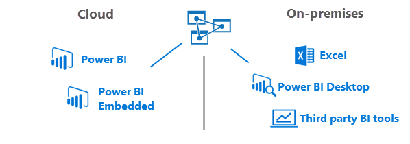

# What is Azure Analysis Services?

Built on the proven analytics engine in Microsoft SQL Server Analysis Services, Azure Analysis Services provides enterprise-grade data modeling in the cloud. 

Watch this video to learn more about how Azure Analysis Services fits in with Microsoft's overall BI capabilities and how you too can benefit from getting your semantic models into the cloud.

>[!VIDEO https://channel9.msdn.com/series/Azure-Analysis-Services/AzureAnalysisServicesGettingStarted/player]
>
>

## Built on SQL Server Analysis Services
Azure Analysis Services is compatible with the same SQL Server 2016 Analysis Services Enterprise Edition you already know. Azure Analysis Services supports tabular models at the 1200 compatibility level. DirectQuery, partitions, row-level security, bi-directional relationships, and translations are all supported.

## Use the tools you already know

When creating data models for Azure Analysis Services, you use the same tools as for SQL Server Analysis Services. Author and deploy tabular models by using the latest versions of [SQL Server Data Tools (SSDT)](https://msdn.microsoft.com/library/mt204009.aspx) or by using [Azure Powershell](/powershell/azureps-cmdlets-docs) and [Azure Resource Manager](../azure-resource-manager/resource-group-overview.md) templates in [SQL Server Management Studio (SSMS)](https://msdn.microsoft.com/library/mt238290.aspx).

## Connect to data sources
Data models deployed to servers in Azure support connecting to data sources on-premises in your organization or in the cloud. Combine data from both on-premises and cloud data sources for a hybrid BI solution.

Because your server is in the cloud, connecting to cloud data sources is seamless. When connecting to on-premises data sources, the [On-premises data gateway](analysis-services-gateway.md) ensures fast, secure connections with your Analysis Services server in the cloud.  

## Explore your data from anywhere
Connect and get data from your servers from about anywhere. Azure Analysis Services supports connecting from Power BI Desktop, Excel, custom apps, and browser-based tools.

## Secure
#### User authentication
User authentication for Azure Analysis services is handled by [Azure Active Directory (AAD)](../active-directory/active-directory-whatis.md). When attempting to log in to an Azure Analysis Services database, users use an organization account identity with access to the database they are trying to access. These user identities must be members of the default Azure Active Directory for the subscription where the Azure Analysis Services server resides. [Directory integration](https://technet.microsoft.com/library/jj573653.aspx) between AAD and an on-premises Active Directory is a great way to get your on-premises users access to an Azure Analysis Services database, but isn't required for all scenarios.

Users log in with the user principal name (UPN) of their account and their password. When synchronized with an on-premises Active Directory, the user’s UPN is often their organizational email address.

Permissions for managing the Azure Analysis Services server resource are handled by assigning users to roles within your Azure subscription. By default, subscription administrators have owner permissions to the server resource in Azure. Additional users can be added by using Azure Resource Manager.

#### Data security
Azure Analysis Services utilizes Azure Blob storage to persist storage and metadata for Analysis Services databases. Data files within Blob are encrypted using Azure Blob Server Side Encryption (SSE). When using Direct Query mode, only metadata is stored; the actual data is accessed from the data source at query time.

#### On-premises data sources
Secure access to data residing on-premises in your organization can be achieved by installing and configuring an [On-premises data gateway](analysis-services-gateway.md). Gateways provide access to data for both Direct Query and in-memory modes. When an Azure Analysis Services model connects to an on-premises data source, a query is created along with the encrypted credentials for the on-premises data source. The gateway cloud service analyzes the query and pushes the request to an Azure Service Bus. The on-premises gateway polls the Azure Service Bus for pending requests. The gateway then gets the query, decrypts the credentials, and connects to the data source for execution. The results are then sent from the data source, back to the gateway and then on to the Azure Analysis Services database.

Azure Analysis Services is governed by the [Microsoft Online Services Terms](http://www.microsoftvolumelicensing.com/DocumentSearch.aspx?Mode=3&DocumentTypeId=31) and the [Microsoft Online Services Privacy Statement](https://www.microsoft.com/privacystatement/OnlineServices/Default.aspx).
To learn more about Azure Security, see the [Microsoft Trust Center](https://www.microsoft.com/trustcenter/Security/AzureSecurity).

## Get help
Azure Analysis Services is simple to set up and to manage. You can find all the info you need to create and manage a server here. When creating a data model to deploy to your server, it's much the same as it is for creating a data model you deploy to an on-premises server. There's an extensive library of conceptual, procedural, tutorials, and reference articles at [Analysis Services on MSDN](https://msdn.microsoft.com/library/bb522607.aspx).

We also have a number of helpful videos at [Azure Analysis Services on Channel 9](https://channel9.msdn.com/series/Azure-Analysis-Services).

Things are changing rapidly. You can always get the latest information on the [Azure Analysis Services blog](https://go.microsoft.com/fwlink/?linkid=830920).

## Community
Analysis Services has a vibrant community of users. Join the conversation on [Azure Analysis Services forum](https://aka.ms/azureanalysisservicesforum).

## Feedback
Have suggestions or feature requests? Be sure to leave your comments on [Azure Analysis Services Feedback](https://aka.ms/azureanalysisservicesfeedback).

Have suggestions about the documentation? You can add comments using Disqus at the bottom of each article.

## Next steps
Now that you know more about Azure Analysis Services, it's time to get started. Learn how to [create a server](analysis-services-create-server.md) in Azure and [deploy a tabular model](analysis-services-deploy.md) to it.

