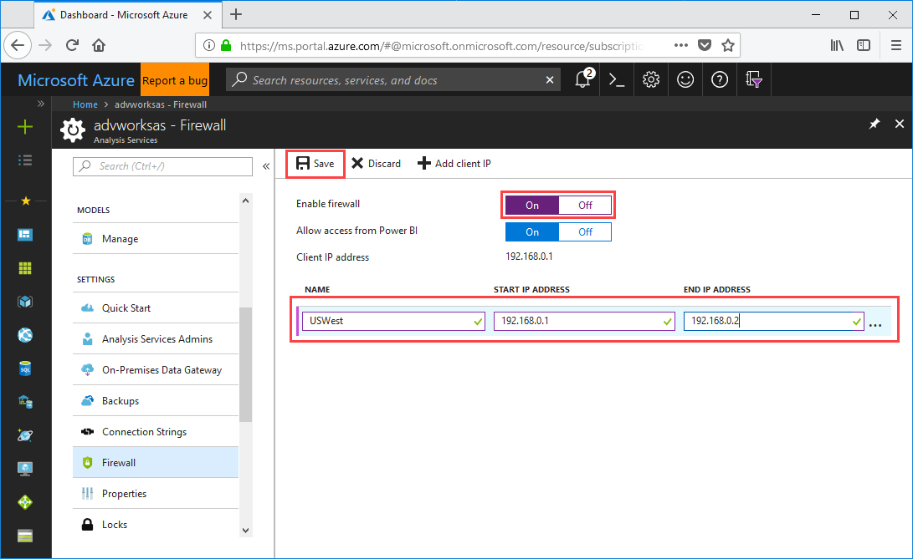

# Quickstart: Configure server firewall - Portal

This quickstart helps you configure a firewall for your Azure Analysis Services server. Enabling a firewall and configuring IP address ranges for only those computers accessing your server are an important part of securing your server and data.

## Prerequisites

- An Analysis Services server in your subscription. To learn more, see [Quickstart: Create a server - Portal](analysis-services-create-server.md) or [Quickstart: Create a server - PowerShell](analysis-services-create-powershell.md)
- One or more IP address ranges for client computers (if needed).

> [!NOTE]
> Data import (refresh) and paginated report connections from Power BI Premium in Microsoft Cloud Germany are currently not supported when a firewall is enabled, even when the Allow access from Power BI setting is set to On.

## Sign in to the Azure portal 

[Sign in to the portal](https://portal.azure.com)

## Configure a firewall

1. Click on your server to open the Overview page. 
2. In **SETTINGS** > **Firewall** > **Enable firewall**, select **On**.
3. To enable connections from Power BI and Power BI Premium, in **Allow access from Power BI**, select **On**.  
4. (Optional) Specify one or more IP address ranges. Enter a name, starting, and ending IP address for each range. Firewall rule name should be limited to 128 characters and can only contain uppercase characters, lowercase characters, numbers, underscore, and hyphen. Blank spaces and other special characters are not allowed.
5. Click **Save**.

     

## Clean up resources

When no longer needed, delete IP address ranges, or disable the firewall.

## Next steps
In this quickstart, you learned how to configure a firewall for your server. Now that you have server, and secured it with a firewall, you can add a basic sample data model to it from the portal. Having a sample model is helpful to learn about configuring model database roles and testing client connections. To learn more, continue to the tutorial for adding a sample model.

> [!div class="nextstepaction"]
> [Tutorial: Add a sample model to your server](analysis-services-create-sample-model.md)
