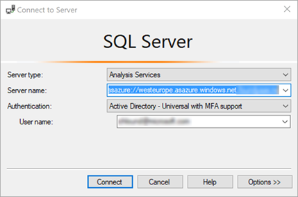
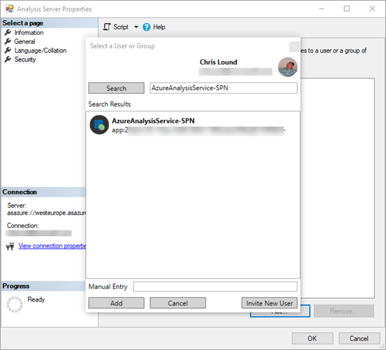

# Refresh with Azure Automation

By using Azure Automation and PowerShell Runbooks, you can perform data-refresh operations on your Azure Analysis tabular models.  

> [!NOTE]
> The example in this article uses the PowerShell SqlServer modules.  For more information on these modules, see the following article:  https://docs.microsoft.com/en-gb/powershell/module/sqlserver/?view=sqlserver-ps

## Download the example Azure Automation Runbook

This example runbook is a basic example of how to use PowerShell to process an Azure Analysis Services model.

ADD LINK TO POWERSHELL FILE HERE

## Authentication

All calls must be authenticated with a valid Azure Active Directory (OAuth 2) token.  The example in this article will use a Service Principal (SPN) to authenticate to Azure Analysis Services.

> [!NOTE]
> For more information on creating a Service Principal, see the following article: https://docs.microsoft.com/en-us/azure/active-directory/develop/howto-create-service-principal-portal

## Pre-requisites

> [!IMPORTANT]
> The following example assume that the Azure Analysis Services firewall is disabled.  If the firewall is enabled then the public IP address of the request initiator will need to be white listed in the Azure Analysis Services firewall.

Install the SqlServer modules from the gallery.

1. In your Azure Automation Account, Click **Modules**, then **Browse gallery**.

2. In the search bar, search for **SqlServer**.

    

3. Select SqlServer, then click **Import**.
 
    

4. Click **OK**
 
Configure permissions to Azure Analysis Services

Make sure you have a Service Principal (SPN) created.

> [!NOTE]
> For more information on creating a Service Principal, see the following article: https://docs.microsoft.com/en-us/azure/active-directory/develop/howto-create-service-principal-portal

1. Connect to the Azure Analysis Services instance through SQL Server Management Studio, and sign in when prompted.

    

2. In object explorer, right click the instance, and select **properties**

    

3. In the security tab, click **Add**.  Search for your Service Principal, and click **Add**.

    

If you are unable to find the SPN in the list, add it manually using the following format:
App:*SPN ClientID*@*TenantID*

> [!NOTE]
> See [Create service principal - Azure portal](https://docs.microsoft.com/en-us/azure/active-directory/develop/howto-create-service-principal-portal) and [Add a service principal to the server administrator role](https://docs.microsoft.com/en-us/azure/analysis-services/analysis-services-addservprinc-admins) for more info on how to set up a service principal and assign the necessary permissions in Azure AS.

## Designing the Azure Automation Runbook

1. In the Automation Account, create a **Credentials** resource which will be used to securely store the Service Principal.

    

2. Enter the details for the credential.  For the **User name**, enter the **SPN ClientId**, for the **Password**, enter the **SPN Secret**.

    

3. Import the Automation Runbook

    

4. Browse for the **Refresh-Model.ps1** file, provide a **Name**, and give the runbook a **description**.  Then click **Create**.

    

5. When the Runbook has been created, it will automatically go into edit mode.  Select **Publish**.

    

> [!NOTE]
> The credential resource that was created previously is retrieved by the runbook by using the **Get-AutomationPSCredential** command.  This command is then passed to the **Invoke-ProcessASADatabase** PowerShell command to perform the authentication to Azure Analysis Services.

6. Test the runbook by clicking **Start**.

    

7. Fill out the **DATABASENAME**, **ANALYSISSERVER** and **REFRESHTYPE** parameters and click **OK**.  The **WEBHOOKDATA** parameter is not required when the Runbook is run manually.

    

If the Runbook was executed successfully, you will receive an output like the following:


## Using a self-contained Azure Automation Runbook

The Runbook can be configured to trigger the Azure Analysis Services model refresh on a scheduled basis.

This can be configured as follows:

1. In the Automation Runbook, click **Schedules**, then **Add a Schedule**.
 
    

2. Click **Schedule** > **Create a new schedule** and fill in the details.

    

3. Click **Create**.

4. Fill in the parameters for the schedule.  These will be used each time the Runbook triggers.  The **WEBHOOKDATA** parameter should be left blank when running via a schedule.

    

5. Click **OK**.

## Consume the Azure Automation Runbook with Azure Data Factory

To consume the runbook using Azure Data Factory, first create a **Webhook** for the runbook.  The **Webhook** will provide a URL which can be called via an Azure Data Factory web activity.

> [!IMPORTANT]
> To create a **Webhook**, the status of the Runbook must be **Published**.

1. In your Automation Runbook, click **Webhooks**, then Add **Webhook**.

   

2. Give the Webhook a name and an expiry.  The name only identifies the Webhook inside the Automation Runbook, it doesn't form part of the URL.

> [!CAUTION]
> Ensure to copy the URL before closing the wizard as you cannot get it back once closed.

   

The parameters for the webhook can remain blank.  When configuring the Azure Data Factory web activity, the parameters can be passed into the body of the web call.

3. In Data Factory, configure a **web activity** 

Example

   

The **URL** is the URL created from the Webhook.

The **body** is a JSON document which should contain the following properties:


|Property  |Value  |
|---------|---------|
|**AnalysisServicesDatabase**     |The name of the Azure Analysis Services database <br/> Example: AdventureWorksDB         |
|**AnalysisServicesServer**     |The Azure Analysis Services server name. <br/> Example: https://westus.asazure.windows.net/servers/myserver/models/AdventureWorks/         |
|**DatabaseRefreshType**     |The type of refresh to perform. <br/> Example: Full         |

Example JSON body:

```json
{
    "AnalysisServicesDatabaseName": "AdventureWorksDB",
    "AnalysisServicesServer": "asazure://westeurope.asazure.windows.net/MyAnalysisServer",
    "DatabaseRefreshType": "Full"
}
```

These parameters are defined in the runbook PowerShell script.  When the web activity is executed, the JSON payload passed is WEBHOOKDATA.

This is deserialized and stored as PowerShell parameters, which are then used by the Invoke-ProcesASDatabase PowerShell command.


## Using an Azure Automation Hybrid Worker with Azure Analysis Services

An Azure Virtual Machine with a static public IP address can be used as an Azure Automation Hybrid Worker.  This public IP address can then be added to the Azure Analysis Services firewall.

> [!IMPORTANT]
> Ensure that the Virtual machine public IP address is configured as static.
>
>To learn more about configuring Azure Automation Hybrid Workers see the following article https://docs.microsoft.com/en-gb/azure/automation/automation-hybrid-runbook-worker#installing-a-hybrid-runbook-worker

Once a Hybrid Worker is configured, create a Webhook as described in the section [Consume the Azure Automation Runbook with Azure Data Factory](#consume-the-azure-automation-runbook-with-azure-data-factory).  The only difference here is to select the **Run on** > **Hybrid Worker** option when configuring the Webhook.

Example webhook using Hybrid Worker:


## See also

[Samples](analysis-services-samples.md)  
[REST API](https://docs.microsoft.com/rest/api/analysisservices/servers)