# Refresh with Azure Automation

By using Azure Automation and PowerShell Runbooks, you can perform automated data refresh operations on your Azure Analysis tabular models.  

The example in this article uses the [SqlServer PowerShell module](https://docs.microsoft.com/powershell/module/sqlserver/?view=sqlserver-ps). A sample PowerShell Runbook, which demonstrates refreshing a model is provided later in this article.  

## Authentication

All calls must be authenticated with a valid Azure Active Directory (OAuth 2) token.  The example in this article uses a Service Principal (SPN) to authenticate to Azure Analysis Services. To learn more, see [Create a service principal by using Azure portal](../active-directory/develop/howto-create-service-principal-portal.md).

## Prerequisites

> [!IMPORTANT]
> The following example assumes the Azure Analysis Services firewall is disabled. If a firewall is enabled, the public IP address of the request initiator must be included in a firewall rule.

### Install SqlServer modules from PowerShell gallery.

1. In your Azure Automation Account, Click **Modules**, then **Browse gallery**.

2. In the search bar, search for **SqlServer**.

    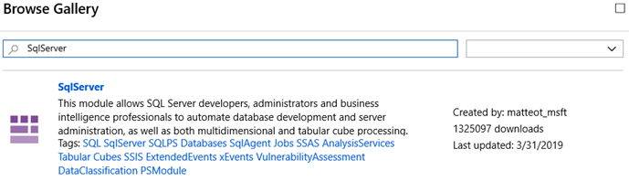

3. Select SqlServer, then click **Import**.
 
    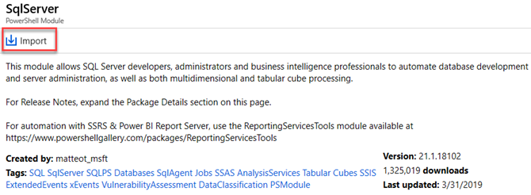

4. Click **OK**.
 
### Create a Service Principal (SPN)

To learn about creating a Service Principal, see [Create a service principal by using Azure portal](../active-directory/develop/howto-create-service-principal-portal.md).

### Configure permissions in Azure Analysis Services
 
The Service Principal you create must have server administrator permissions on the server. To learn more, see [Add a service principal to the server administrator role](analysis-services-addservprinc-admins.md).

## Design the Azure Automation Runbook

1. In the Automation Account, create a **Credentials** resource which will be used to securely store the Service Principal.

    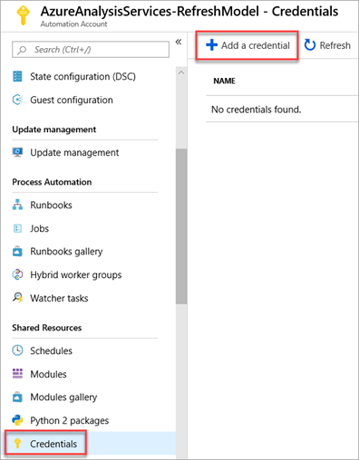

2. Enter the details for the credential. In **User name**, enter the service principal Application Id (appid), and then in **Password**, enter the service principal Secret.

    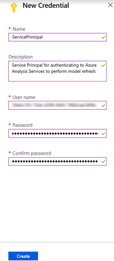

3. Import the Automation Runbook

    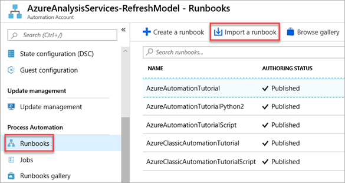

4. Browse for the **Refresh-Model.ps1** file, provide a **Name** and **Description**, and then click **Create**.

    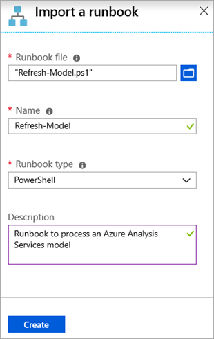

5. When the Runbook has been created, it will automatically go into edit mode.  Select **Publish**.

    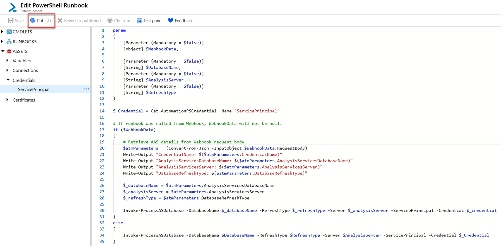

    > [!NOTE]
    > The credential resource that was created previously is retrieved by the runbook by using the **Get-AutomationPSCredential** command.  This command is then passed to the **Invoke-ProcessASADatabase** PowerShell command to perform the authentication to Azure Analysis Services.

6. Test the runbook by clicking **Start**.

    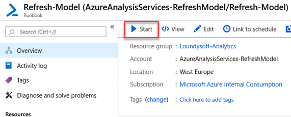

7. Fill out the **DATABASENAME**, **ANALYSISSERVER**, and **REFRESHTYPE** parameters, and then click **OK**. The **WEBHOOKDATA** parameter is not required when the Runbook is run manually.

    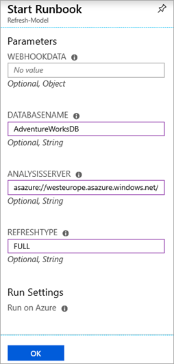

If the Runbook executed successfully, you will receive an output like the following:

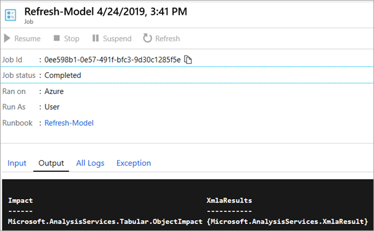

## Use a self-contained Azure Automation Runbook

The Runbook can be configured to trigger the Azure Analysis Services model refresh on a scheduled basis.

This can be configured as follows:

1. In the Automation Runbook, click **Schedules**, then **Add a Schedule**.
 
    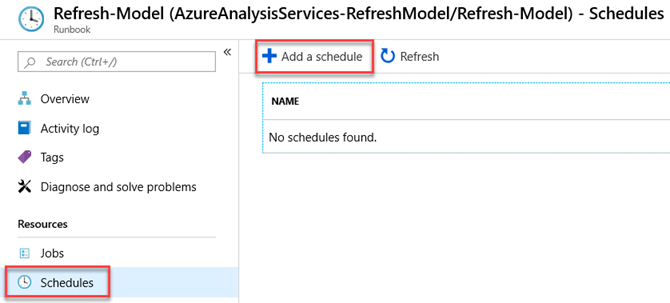

2. Click **Schedule** > **Create a new schedule**, and then fill in the details.

    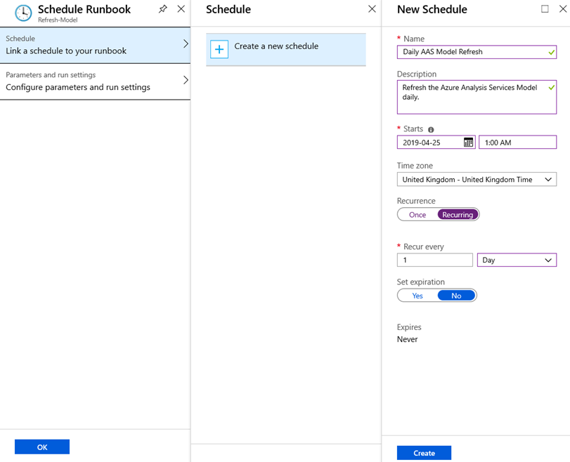

3. Click **Create**.

4. Fill in the parameters for the schedule. These will be used each time the Runbook triggers. The **WEBHOOKDATA** parameter should be left blank when running via a schedule.

    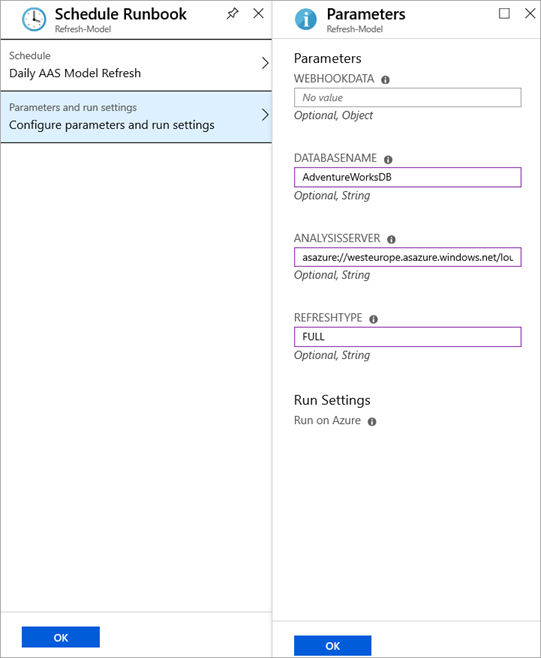

5. Click **OK**.

## Consume with Data Factory

To consume the runbook by using Azure Data Factory, first create a **Webhook** for the runbook. The **Webhook** will provide a URL which can be called via an Azure Data Factory web activity.

> [!IMPORTANT]
> To create a **Webhook**, the status of the Runbook must be **Published**.

1. In your Automation Runbook, click **Webhooks**, and then click **Add Webhook**.

   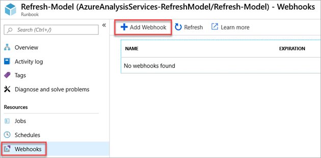

2. Give the Webhook a name and an expiry.  The name only identifies the Webhook inside the Automation Runbook, it doesn't form part of the URL.

   >[!CAUTION]
   >Ensure you copy the URL before closing the wizard as you cannot get it back once closed.
    
   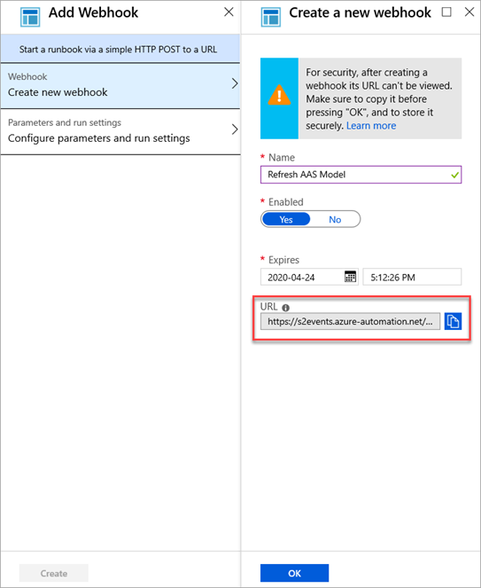

    The parameters for the webhook can remain blank.  When configuring the Azure Data Factory web activity, the parameters can be passed into the body of the web call.

3. In Data Factory, configure a **web activity**

### Example

   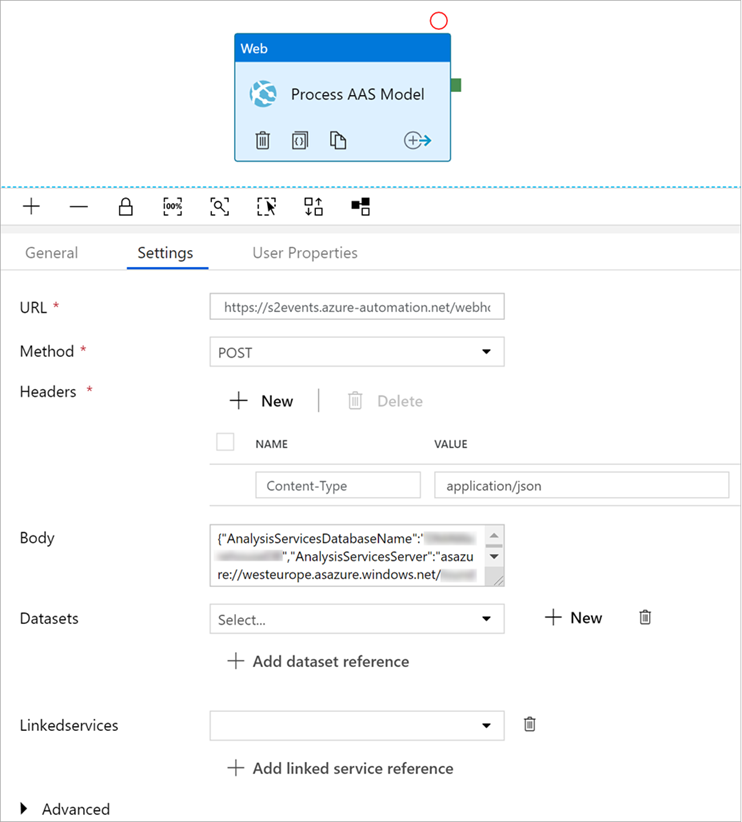

The **URL** is the URL created from the Webhook.

The **body** is a JSON document which should contain the following properties:


|Property  |Value  |
|---------|---------|
|**AnalysisServicesDatabase**     |The name of the Azure Analysis Services database <br/> Example: AdventureWorksDB         |
|**AnalysisServicesServer**     |The Azure Analysis Services server name. <br/> Example: https:\//westus.asazure.windows.net/servers/myserver/models/AdventureWorks/         |
|**DatabaseRefreshType**     |The type of refresh to perform. <br/> Example: Full         |

Example JSON body:

```json
{
    "AnalysisServicesDatabaseName": "AdventureWorksDB",
    "AnalysisServicesServer": "asazure://westeurope.asazure.windows.net/MyAnalysisServer",
    "DatabaseRefreshType": "Full"
}
```

These parameters are defined in the runbook PowerShell script.  When the web activity is executed, the JSON payload passed is WEBHOOKDATA.

This is deserialized and stored as PowerShell parameters, which are then used by the Invoke-ProcesASDatabase PowerShell command.

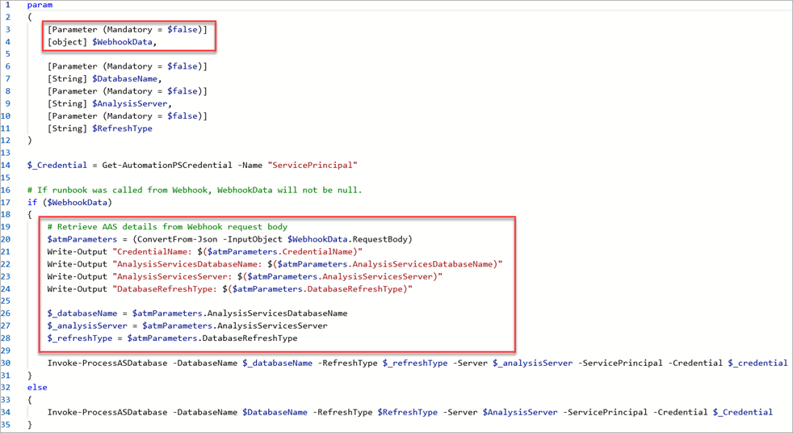

## Use a Hybrid Worker with Azure Analysis Services

An Azure Virtual Machine with a static public IP address can be used as an Azure Automation Hybrid Worker.  This public IP address can then be added to the Azure Analysis Services firewall.

> [!IMPORTANT]
> Ensure the Virtual Machine public IP address is configured as static.
>
>To learn more about configuring Azure Automation Hybrid Workers, see [Hybrid Runbook Worker installation](../automation/automation-hybrid-runbook-worker.md#hybrid-runbook-worker-installation).

Once a Hybrid Worker is configured, create a Webhook as described in the section [Consume with Data Factory](#consume-with-data-factory).  The only difference here is to select the **Run on** > **Hybrid Worker** option when configuring the Webhook.

Example webhook using Hybrid Worker:

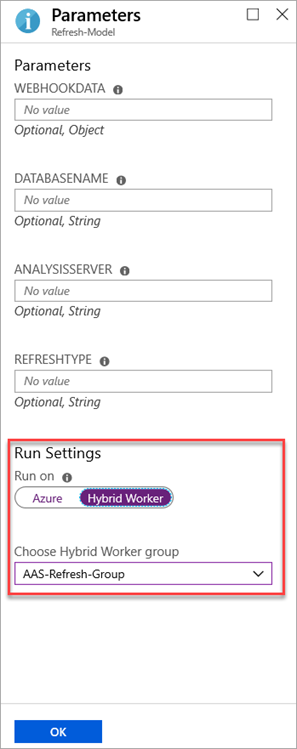

## Sample PowerShell Runbook

The following code snippet is an example of how to perform the Azure Analysis Services model refresh using a PowerShell Runbook.

```powershell
param
(
    [Parameter (Mandatory = $false)]
    [object] $WebhookData,

    [Parameter (Mandatory = $false)]
    [String] $DatabaseName,
    [Parameter (Mandatory = $false)]
    [String] $AnalysisServer,
    [Parameter (Mandatory = $false)]
    [String] $RefreshType
)

$_Credential = Get-AutomationPSCredential -Name "ServicePrincipal"

# If runbook was called from Webhook, WebhookData will not be null.
if ($WebhookData)
{ 
    # Retrieve AAS details from Webhook request body
    $atmParameters = (ConvertFrom-Json -InputObject $WebhookData.RequestBody)
    Write-Output "CredentialName: $($atmParameters.CredentialName)"
    Write-Output "AnalysisServicesDatabaseName: $($atmParameters.AnalysisServicesDatabaseName)"
    Write-Output "AnalysisServicesServer: $($atmParameters.AnalysisServicesServer)"
    Write-Output "DatabaseRefreshType: $($atmParameters.DatabaseRefreshType)"
    
    $_databaseName = $atmParameters.AnalysisServicesDatabaseName
    $_analysisServer = $atmParameters.AnalysisServicesServer
    $_refreshType = $atmParameters.DatabaseRefreshType
 
    Invoke-ProcessASDatabase -DatabaseName $_databaseName -RefreshType $_refreshType -Server $_analysisServer -ServicePrincipal -Credential $_credential
}
else 
{
    Invoke-ProcessASDatabase -DatabaseName $DatabaseName -RefreshType $RefreshType -Server $AnalysisServer -ServicePrincipal -Credential $_Credential
}
```


## Next steps

[Samples](analysis-services-samples.md)  
[REST API](https://docs.microsoft.com/rest/api/analysisservices/servers)
